<div align="center">

<a href="https://docs.agentfront.dev/frontmcp"><picture>

  <source media="(prefers-color-scheme: dark)" srcset="docs/assets/readme/hero.svg">
  
</picture></a>

[](https://www.npmjs.com/package/@frontmcp/sdk)
[](https://nodejs.org)
[](./LICENSE)
[](https://snyk.io/test/github/agentfront/frontmcp)
[](https://discord.gg/53AHnJnmwR)

**[Quickstart][docs-quickstart]** &nbsp;&middot;&nbsp; **[Docs][docs-home]** &nbsp;&middot;&nbsp; **[API Reference][docs-sdk-ref]** &nbsp;&middot;&nbsp; **[Website](https://frontmcp.dev)**

<picture>
  <source media="(prefers-color-scheme: dark)" srcset="docs/assets/readme/terminal.svg">
  
</picture>

</div>

<br>

## Write a tool. Ship a server.

Classes in, protocol out. FrontMCP handles transport, DI, sessions, auth and execution flow, and the same server runs locally and in production unchanged.

```ts
import 'reflect-metadata';

import { App, FrontMcp, Tool, ToolContext, z } from '@frontmcp/sdk';

@Tool({
  name: 'add',
  description: 'Adds two numbers together',
  inputSchema: { a: z.number(), b: z.number() },
})
class AddTool extends ToolContext {
  async execute(input: { a: number; b: number }) {
    return input.a + input.b;
  }
}

@App({ id: 'calc', name: 'Calculator', tools: [AddTool] })
class CalcApp {}

@FrontMcp({
  info: { name: 'Demo', version: '0.1.0' },
  apps: [CalcApp],
  http: { port: 3000 },
})
export default class Server {}
```

<div align="center">
<picture>
  <source media="(prefers-color-scheme: dark)" srcset="docs/assets/readme/features.svg">
  
</picture>
</div>

<br>

## Start

```bash
npx frontmcp create my-app        # new project (Node 24+)
npx frontmcp init                 # or add FrontMCP to an existing one
```

Then read the **[Quickstart][docs-quickstart]**, or browse [Tools][docs-tools], [Resources][docs-resources], [Prompts][docs-prompts], [Agents][docs-agents], [Auth][docs-auth], [Plugins][docs-plugins], [Tool UI][docs-ext-apps], [Testing][docs-testing] and [Deployment][docs-deploy].

## Packages

Install `frontmcp` (CLI) and `@frontmcp/sdk`. The rest is pulled in for you, or opt-in. Keep every `@frontmcp/*` package on the same version; a mismatch fails fast at boot ([why][docs-production]).

<details>
<summary><b>Core and extensions</b></summary>
<br>

| Package                                             | What it does                                                    |
| --------------------------------------------------- | --------------------------------------------------------------- |
| [`frontmcp`](libs/cli)                              | CLI: `create`, `init`, `dev`, `build`, `inspect`, `doctor`      |
| [`@frontmcp/sdk`](libs/sdk)                         | Core framework: decorators, DI, flows, transport, MCP protocol  |
| [`@frontmcp/auth`](libs/auth)                       | OAuth, JWKS, DCR/CIMD, sessions, credential vault               |
| [`@frontmcp/testing`](libs/testing)                 | E2E test framework with fixtures and matchers                   |
| [`@frontmcp/adapters`](libs/adapters)               | Generate tools from an OpenAPI spec                             |
| [`@frontmcp/skills`](libs/skills)                   | Curated `SKILL.md` catalog for scaffolding and `skills install` |
| [`@frontmcp/guard`](libs/guard)                     | Rate limits, concurrency and policy guards                      |
| [`@frontmcp/observability`](libs/observability)     | Structured logging, metrics and tracing                         |
| [`@frontmcp/react`](libs/react)                     | React hooks and client for a FrontMCP server                    |
| [`@frontmcp/ui`](libs/ui) / [`uipack`](libs/uipack) | Widgets, SSR renderers, MCP Bridge, themes                      |
| [`@frontmcp/edge`](libs/edge)                       | Run a server on Cloudflare Workers / V8 isolates                |
| [`@frontmcp/storage-sqlite`](libs/storage-sqlite)   | SQLite session, task and elicitation stores                     |
| [`@frontmcp/nx`](libs/nx-plugin)                    | Nx generators and executors                                     |

Internal, published so the above resolve: [`protocol`](libs/protocol), [`di`](libs/di), [`utils`](libs/utils), [`lazy-zod`](libs/lazy-zod).

</details>

<details>
<summary><b>Official plugins</b></summary>
<br>

| Package                                                              | What it does                                  |
| -------------------------------------------------------------------- | --------------------------------------------- |
| [`@frontmcp/plugin-cache`](plugins/plugin-cache)                     | Cache tool results with a TTL                 |
| [`@frontmcp/plugin-remember`](plugins/plugin-remember)               | Per-session memory (`this.remember`)          |
| [`@frontmcp/plugin-approval`](plugins/plugin-approval)               | Human approval gates before a tool runs       |
| [`@frontmcp/plugin-codecall`](plugins/plugin-codecall)               | Let the model compose tool calls as code      |
| [`@frontmcp/plugin-dashboard`](plugins/plugin-dashboard)             | Built-in web dashboard                        |
| [`@frontmcp/plugin-feature-flags`](plugins/plugin-feature-flags)     | Toggle tools and apps at runtime              |
| [`@frontmcp/plugin-skilled-openapi`](plugins/plugin-skilled-openapi) | OpenAPI to skills and meta-tools for big APIs |

</details>

<br>

<div align="center">

PRs welcome: see [CONTRIBUTING](./CONTRIBUTING.md). Released under the [Apache-2.0](./LICENSE) license.

</div>

<!-- docs links -->

[docs-home]: https://docs.agentfront.dev/frontmcp 'FrontMCP Docs'
[docs-quickstart]: https://docs.agentfront.dev/frontmcp/getting-started/quickstart 'Quickstart'
[docs-sdk-ref]: https://docs.agentfront.dev/frontmcp/sdk-reference/decorators/overview 'SDK Reference'
[docs-tools]: https://docs.agentfront.dev/frontmcp/servers/tools 'Tools'
[docs-resources]: https://docs.agentfront.dev/frontmcp/servers/resources 'Resources'
[docs-prompts]: https://docs.agentfront.dev/frontmcp/servers/prompts 'Prompts'
[docs-agents]: https://docs.agentfront.dev/frontmcp/servers/agents 'Agents'
[docs-auth]: https://docs.agentfront.dev/frontmcp/authentication/overview 'Authentication'
[docs-ext-apps]: https://docs.agentfront.dev/frontmcp/guides/building-tool-ui 'Tool UI / MCP Apps'
[docs-plugins]: https://docs.agentfront.dev/frontmcp/plugins/overview 'Plugins'
[docs-testing]: https://docs.agentfront.dev/frontmcp/testing/overview 'Testing'
[docs-deploy]: https://docs.agentfront.dev/frontmcp/deployment/local-dev-server 'Deployment'
[docs-production]: https://docs.agentfront.dev/frontmcp/deployment/production-build 'Production Build'
