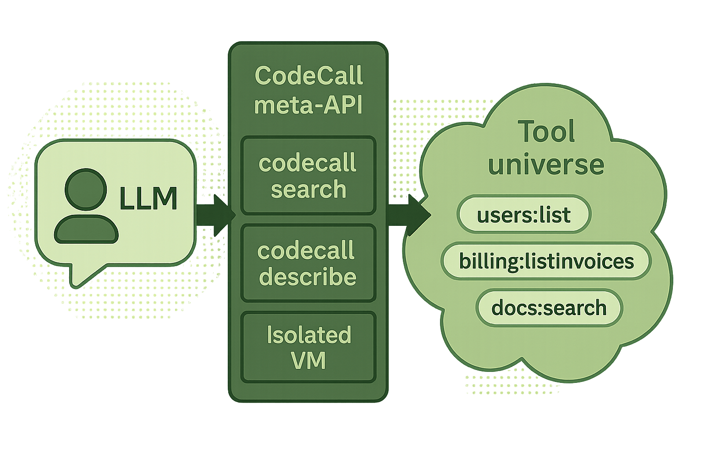

> ⏱️ Estimated reading time: **14 minutes**


If you’ve read Anthropic’s **“Code execution with MCP: Building more efficient agents”**, you’ve already seen the pattern: present MCP servers as **code APIs**, let the model **write code** that calls tools, and run that code in a secure execution environment to dramatically cut token usage and latency. ([Anthropic][1])

> **CodeCall** brings that same idea into **FrontMCP** as a plugin: instead of exposing every tool directly, you expose a tiny meta-API and let the model orchestrate tools in JavaScript.

## TL;DR

As your FrontMCP server grows, `list_tools` becomes a firehose: inline tools, OpenAPI adapters, multiple apps, multi-tenant variants. **CodeCall** collapses that chaos into **3–4 meta-tools**:

- `code-call:search`
- `code-call:describe`
- `code-call:execute`
- (optional) `code-call:invoke`

The LLM **searches** for tools, **describes** them to see schemas, then writes a **JavaScript plan** that runs in a sandbox and calls your real tools. You get:

- A small, stable API surface.
- A way to safely expose **dozens or hundreds of tools**.
- Cross-tool joins, filters, and workflow logic in code—not in your REST API.
- First-class support for **multi-app** FrontMCP servers.

---

## How tool lists quietly become unmanageable

The early days look like this:

1. You add a couple of tools to an app.
2. They show up in `list_tools`.
3. Your IDE, agent, or dashboard calls them directly.
4. Everyone’s happy.

Then real life happens:

- You add **another app** (`user`, `billing`, `ops`, `docs`…).
- You connect an **OpenAPI adapter** and inherit 50–100 endpoints as tools.
- You introduce **per-tenant tools**, or variants for different products.
- You start experimenting with **plugins** and cross-cutting helpers.

Suddenly:

- `list_tools` returns a **wall of JSON**.
- The context window starts filling up with schemas.
- Planners need to reason over **too many actions**.
- Most steps in a flow are:
  “Call one tool → lightly post-process → call another tool.”


None of this is wrong—it’s what MCP is designed to support—but the shape is rough:

> The more powerful your MCP server becomes, the harder it is for the model to see what’s actually relevant right now.

Anthropic’s post calls out the same failure mode on the client side: tool definitions overload the context window, and intermediate tool results bloat tokens as they bounce through the model. ([Anthropic][1])

---

## From direct tool calls to code execution (Anthropic’s pattern)

The Anthropic article suggests a different default:

- Treat MCP servers as **code APIs**, not just tool lists.
- Give the model a **code execution environment** (e.g. TypeScript runtime).
- Let it write programs that:
  - Import server-specific “tool files”.
  - Call those wrappers.
  - Filter and join data **inside the runtime**, not in the model context.

They even show a filesystem layout like:

```text
servers/
  google-drive/
    getDocument.ts
  salesforce/
    updateRecord.ts
```

The agent:

1. Discovers tools by exploring this “tool filesystem”.
2. Reads only the files it needs.
3. Writes TypeScript that calls those wrappers and manipulates data locally.

By loading only relevant tool definitions and keeping large intermediate results inside the execution environment, they report token savings on the order of **~98%** in one workflow. ([Anthropic][1])

Cloudflare and others have described similar approaches as “Code Mode” for agents: let the model think in code, not just prompts. ([KiaDev][2])

---

## What CodeCall flips in your mental model

CodeCall applies the same **code-execution** idea on the **server side** of FrontMCP.

Instead of:

> “The LLM calls each tool directly.”

You move to:

> “The LLM calls a **meta-API** that helps it **find**, **understand**, and **execute** tools in code.”

CodeCall does **three simple things**:

1. **Hides most tools from `list_tools`**
   So your MCP client sees a small, predictable interface.

2. **Exposes a tiny set of meta-tools**

- `code-call:search` — find relevant tools.
- `code-call:describe` — fetch schemas and examples.
- `code-call:execute` — run a JS plan that calls tools inside a sandbox.
- `code-call:invoke` — optional direct-call helper for single-tool actions.

3. **Runs the model's plan in Enclave**
   Using [ast-guard](/docs/guides/ast-guard) for AST validation and transformation, plus Node.js `vm` module for runtime isolation.

From the model’s perspective, a typical flow looks like:

1. **Search**: “What tools can help with X?” → `code-call:search`
2. **Describe**: “What are their schemas?” → `code-call:describe`
3. **Plan**: “Write JS that uses these tools.” → `code-call:execute`



Instead of juggling 80 tools, the model works against 3–4.

---

## When CodeCall is the right tool (and when it isn’t)

Use **CodeCall** if:

- You have **many tools** (inline + OpenAPI, multiple apps).
- You don’t want to blow up `list_tools` or your context window.
- You want the model to:

- Combine tools into workflows.
- Filter and post-process results.
- Build logic your API doesn’t support directly (joins, merges, diffing, etc.).
- You run **multiple apps** (e.g. `user`, `billing`) and want app-aware tool search.

You probably **don’t** need CodeCall if:

- You only have a handful of tools.
- Flows are mostly “one tool per task.”
- Your planner / agent runtime already does orchestration and you want simple, direct calls.

> Think of CodeCall as the “SQL of tools”: a small language surface for building rich queries/workflows over a big tool universe.

---

## From direct calls to a code-first meta-API

Here’s the mental shift.

### Before: one tool, one call

The model:

- Lists tools.
- Picks one.
- Calls it.
- Repeats.

```jsonc
{
  "tool": "users:list",
  "input": { "limit": 50 }
}
```

### After: CodeCall orchestrates tools in code

The model:

1. Searches for tools.
2. Describes them.
3. Writes a plan that calls them via `callTool()`.

Conceptually:

```jsonc
{
  "tool": "code-call:execute",
  "input": {
    "allowedTools": ["users:list", "billing:listInvoices"],
    "script": "/* JS plan that calls tools */"
  }
}
```

Inside that `script`:

```js
async function main() {
  const users = await callTool('users:list', { limit: 100 });
  const invoices = await callTool('billing:listInvoices', {
    status: 'unpaid',
  });

  // Join in JS
  const byUserId = new Map(invoices.items.map((i) => [i.userId, i]));
  return users.items.filter((u) => byUserId.has(u.id)).map((u) => ({ userId: u.id, invoice: byUserId.get(u.id) }));
}

return main();
```

The **orchestration lives in JS**, not in a new backend endpoint.

---

## Plugging CodeCall into a FrontMCP app

Adding CodeCall to an app looks like adding a plugin.

```ts title="src/example.app.ts"
import { App, Tool } from '@frontmcp/sdk';
import CodeCallPlugin from '@frontmcp/plugins/codecall';

@Tool({
  name: 'health:ping',
  description: 'Simple health check',
  codecall: {
    visibleInListTools: true, // stays visible in list_tools
    enabledInCodeCall: true, // also usable in CodeCall plans
  },
})
class HealthPingTool {
  async run() {
    return { status: 'ok' };
  }
}

@App({
  id: 'example',
  name: 'Example App',
  tools: [HealthPingTool],
  plugins: [
    CodeCallPlugin.init({
      mode: 'codecall_only', // recommended default
      topK: 8,
      maxDefinitions: 8,
      directCalls: {
        enabled: true,
        allowedTools: ['users:getById', 'billing:getInvoice'],
      },
      enclave: {
        timeoutMs: 5000, // 5 second timeout
        maxToolCalls: 100, // Max 100 tool calls
        maxIterations: 10000, // Max 10K loop iterations
        allowConsole: true, // Enable console logging
      },
      // Note: Enclave automatically blocks eval, Function, require, process
      // via ast-guard AST validation - no manual configuration needed
    }),
  ],
})
export default class ExampleApp {}
```

From the client’s point of view, `list_tools` now returns:

- `code-call:search`
- `code-call:describe`
- `code-call:execute`
- (optional) `code-call:invoke`
- plus any tools explicitly marked `codeCall:{visibleInListTools: true}`.

Everything else is reachable **only** through CodeCall.

---

## Three exposure modes (you pick the shape)

CodeCall controls **two things** per tool:

- Is it **visible** in `list_tools`?
- Is it **callable** via CodeCall?

Different deployments want different defaults, so the plugin gives you three modes.


<Columns cols={3}>
  <Card title="codecall_only" icon="compress">
    <b>Default.</b>
    <br />
    Many tools, expose them <i>all</i> via CodeCall, but keep <code>list_tools</code> small.
    <br />
    <br />
    - Hidden by default in <code>list_tools</code>
    <br />
    - Included by default in CodeCall index
  </Card>

{' '}

<Card title="codecall_opt_in" icon="toggle-on">
  Large toolbox where only a subset should be reachable from code.
  <br />
  <br />- Hidden by default in <code>list_tools</code>
  <br />- <b>Only</b> tools with <code>enabledInCodeCall: true</code> are indexed
</Card>

  <Card title="metadata_driven" icon="sliders">
    Small toolset (~10 tools). Mix classic tool calls + CodeCall with per-tool config.
    <br />
    <br />
    - Visibility + CodeCall enabled are both explicit
    <br />
    - No global assumptions
  </Card>
</Columns>

Per-tool metadata:

```ts
@Tool({
  name: 'users:list',
  description: 'List users with pagination',
  codecall: {
    enabledInCodeCall: true, // searchable + callable
    visibleInListTools: false, // hidden from classic list_tools
  },
})
class ListUsersTool {
  // ...
}
```

This lets you:

- Keep UX-friendly tools visible.
- Hide noisy/generated ones.
- Still orchestrate everything via CodeCall.

---

## Multi-app servers: app-aware search, shared plans

If you followed the **“One Server, Many Agents”** pattern, you probably have multiple apps:

- `user` app (users, sessions, orgs)
- `billing` app (invoices, payments)
- `ops` app (health, metrics)
- maybe OpenAPI-backed apps

CodeCall is **multi-app aware**:

- The tool index includes `appId` for each tool.
- `code-call:search` accepts a `filter` with `appIds`.

Conceptually:

```jsonc
// Search only in "user" app
{
  "tool": "code-call:search",
  "input": {
    "query": "get current user profile",
    "filter": { "appIds": ["user"] }
  }
}

// Search across "user" + "billing"
{
  "tool": "code-call:search",
  "input": {
    "query": "unpaid invoices for current user",
    "filter": { "appIds": ["user", "billing"] }
  }
}
```

The model can decide per task:

- “I just need `user` data.”
- “I need to join `user` + `billing`.”

And your server logic doesn’t change.

---

## Inside Enclave: safety, logging, and observability

CodeCall runs plans inside **Enclave** - FrontMCP's defense-in-depth execution environment.

### Security pipeline

1. **AST validation (ast-guard)**

- Parse the `script` into an AST.
- Apply the AgentScript preset which blocks:
  - `eval`, `Function`, `setTimeout`, `setInterval`
  - Global access via `process`, `require`, `window`, `globalThis`, `this`
  - Prototype chain manipulation
  - All identifiers not in the whitelist

2. **Code transformation**

- Wrap code in `async function __ag_main()` for top-level await support
- Transform `callTool` → `__safe_callTool` (proxied through Enclave)
- Transform loops (`for`, `while`, `do-while`) → safe versions with iteration limits

3. **Runtime sandboxing (Node.js vm)**

- Execute in isolated context with controlled globals
- Enforce timeout limits (default 30s)
- Track iteration count and tool calls
- Sanitize stack traces to prevent information leakage

4. **Execution + result model**

CodeCall normalizes the outcome into a small set of statuses:

- `ok`
- `syntax_error`
- `illegal_access`
- `runtime_error` (script-level)
- `tool_error` (specific tool call)
- `timeout`

This gives your orchestrator clear hooks for:

- Retrying with different inputs.
- Asking the model to fix its own JS.
- Distinguishing “tool is broken” from “plan is broken.”

### Logging & notifications from inside plans

Inside the VM, plans can use:

```js
await callTool('users:list', { limit: 50 });
const meta = getTool('users:list'); // name + schemas

codecallContext.tenantId; // read-only context

mcpLog('info', 'Loaded users', { count: 50 });
mcpNotify('step_started', { step: 'sync_billing' });
```

You can:

- Enable/disable `console`.
- Enable/disable `mcpLog` / `mcpNotify`.
- Still rely on your **existing logging + notification plumbing** in FrontMCP.

Every `callTool()` also emits **tool call start/end notifications** so UIs can show “calling X… done” in real time.

---

## Direct calls without a VM: `code-call:invoke`

Not every task needs a JS plan. Sometimes the model just needs:

> “Call one tool with this input and return the result.”

For that, CodeCall exposes an optional meta-tool:

- `code-call:invoke` (enabled via `directCalls.enabled`).

Conceptual call:

```json
{
  "tool": "codecall.invoke",
  "input": {
    "tool": "users:getById",
    "input": { "id": "123" }
  }
}
```

Behavior:

- No VM.
- No user-authored JS.
- Calls the tool via the **same pipeline** as a normal MCP call:

- PII plugin(s)
- auth
- rate limiting
- logging/audit

This is perfect for:

- Simple “one-and-done” actions.
- Reducing complexity and latency when orchestration isn’t needed.
- Still leveraging CodeCall’s **modes, allowlists, and filters**.

---

## PII & privacy: same guarantees as normal tools

CodeCall **does not bypass** your existing FrontMCP plugins.

When a plan calls:

```js
await callTool('users:list', { limit: 100 });
```

Under the hood, it uses the same **tool pipeline** as:

```jsonc
{ "tool": "users:list", "input": { "limit": 100 } }
```

So:

- Your **PII plugin** still sees inputs and outputs.
- Your **auth plugin** still enforces identities/scopes.
- Your **logging/rate-limit plugins** still run.

The VM only ever sees what a normal MCP tool call would see **after** plugins.

> In other words: CodeCall orchestrates tools; it doesn’t create a new backdoor around your policies.

This is aligned with Anthropic’s goal of keeping sensitive intermediate data in the execution environment instead of always pushing it through the model context. ([Anthropic][1])

---

## Example: “query-like” behavior over existing tools

Imagine you want:

> “Return IDs of users whose first name starts with `me` and who logged in today.”

Your REST API doesn’t have that exact query. With CodeCall, the model can assemble it in JS:

```js
// Script passed to `code-call:execute`

async function main() {
  // 1. Get a coarse page of users
  const page = await callTool('users:list', { limit: 500 });

  const today = new Date().toISOString().slice(0, 10);

  const matching = page.items.filter((user) => {
    const first = (user.firstName || '').toLowerCase();
    const lastLogin = (user.lastLogin || '').slice(0, 10);
    return first.startsWith('me') && lastLogin === today;
  });

  return matching.map((u) => u.id);
}

return main();
```

No new endpoint, no schema migrations—just code.

---

## CodeCall as a concrete implementation of “Code Execution with MCP”

To connect the dots explicitly:

- Anthropic’s **[“Code execution with MCP: Building more efficient agents”](https://www.anthropic.com/engineering/code-execution-with-mcp)** describes a **client-side** pattern:

- Represent MCP servers as code APIs.
- Let agents write code to orchestrate tools.
- Use execution environments to cut token costs and keep sensitive data out of the model. ([Anthropic][1])

- **CodeCall** is a **FrontMCP plugin** that:

- Exposes your tools as a small meta-API instead of a huge list.
- Lets the model describe & plan in **JavaScript**.
- Executes plans in a sandboxed runtime.
- Reuses your existing PII, auth, and lifecycle plugins by calling tools through the normal pipeline.

Different layers, same philosophy:

> Stop flooding the model with tool definitions and intermediate data; let it write code, and run that code safely.

---

## Where to go next

<Columns cols={2}>
  <Card
    title="Read Anthropic’s article"
    href="https://www.anthropic.com/engineering/code-execution-with-mcp"
    icon="arrow-up-right-from-square"
    arrow="true"
    cta="See the pattern"
  >
    Understand the original “code execution with MCP” pattern that inspired CodeCall’s meta-API design.
  </Card>

  <Card
    title="Read the CodeCall docs"
    href="/docs/plugins/codecall-plugin"
    icon="book-open"
    arrow="true"
    cta="Deep dive">
    Learn the full meta-tool contracts, result shapes, and configuration options in FrontMCP.
  </Card>
</Columns>

<Columns cols={2}>
  <Card
    title="Add CodeCall to an app"
    href="/docs/getting-started/quickstart"
    icon="rocket"
    arrow="true"
    cta="Try it in dev"
  >
    Start from an existing FrontMCP app and wrap it with CodeCall in a few lines of code.
  </Card>

  <Card
    title="Star the repo & contribute"
    href="[https://github.com/agentfront/frontmcp](https://github.com/agentfront/frontmcp)"
    icon="star"
    arrow="true"
    cta="Join the project">
CodeCall ships as part of the FrontMCP plugins package. Issues, PRs, and feedback are very welcome.
</Card>
</Columns>

[1]: https://www.anthropic.com/engineering/code-execution-with-mcp?utm_source=chatgpt.com 'Code execution with MCP: Building more efficient agents - Anthropic'
[2]: https://kiadev.net/news/2025-11-08-anthropic-mcp-code-execution/?utm_source=chatgpt.com 'Anthropic Turns MCP Servers Into Code APIs to Cut Token Costs'
