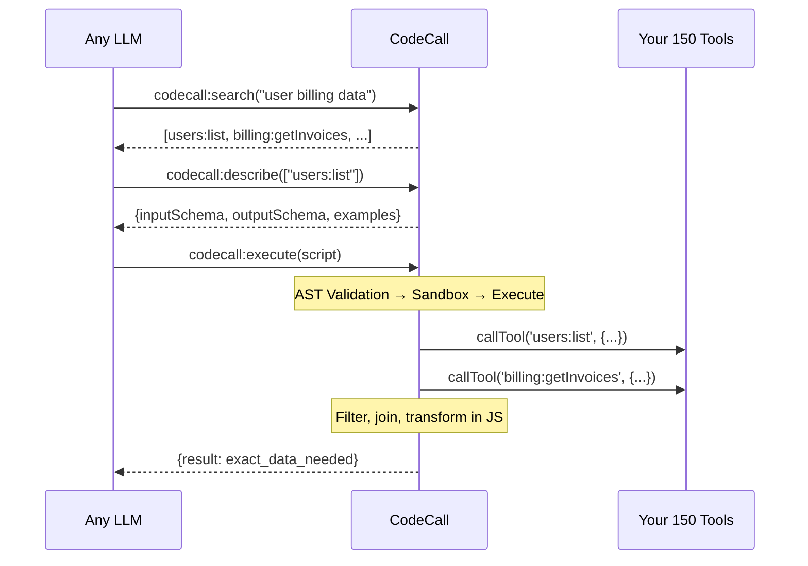

> ⏱️ Estimated reading time: **12 minutes**


**Here's a scenario you might recognize:**

You built an MCP server. It started with 10 tools. Clean. Simple. Your AI agent found the right tool instantly and everything worked.

Then you connected your REST API. 47 endpoints became 47 tools. You added billing, user management, and analytics. Now you're at 150+ tools.

And suddenly:
- Your context window fills with schemas before the first query
- Token costs explode—you're paying to list tools the agent won't use
- The model picks the wrong tool or misses the right one entirely
- Multi-step workflows require endless round-trips through the LLM

**You're not alone.** This is the dirty secret of scaling MCP servers—and it's why Anthropic published ["Code execution with MCP"](https://www.anthropic.com/engineering/code-execution-with-mcp) to solve it.

But here's what they didn't tell you: **their approach only works with Claude, requires their infrastructure, and isn't available yet.**

**CodeCall** gives you the same pattern—today, self-hosted, with any LLM.

---

## The Real Cost of Tool Explosion

Let's do the math on a real scenario.

You have 100 tools. Each tool definition averages 200 tokens (name, description, input schema). That's **20,000 tokens** just to list your tools—before the agent does anything.

Now the agent needs to:
1. Find users whose first name starts with "me"
2. Who logged in within the past 10 days
3. Return the top 10

Without filtering on the server, here's what happens:

| Step | Action | Tokens |
|------|--------|--------|
| 1 | List 100 tools | 20,000 |
| 2 | Call `users:list` (returns 1000 users) | 50,000+ |
| 3 | Model filters in context | 10,000 |
| 4 | Model returns top 10 | 500 |
| **Total** | | **~80,000 tokens** |

At \$0.015 per 1K input tokens (GPT-4 pricing), that's **\$1.20 for one query.**

But worse than cost: the model starts **losing context**. It drops earlier instructions. It forgets what it was doing. It hallucinates.

Sound familiar?

---

## "Just Build Better REST Endpoints"

The obvious solution: add filtering parameters to your API.

```
GET /users?firstName_startsWith=me&lastLogin_gt=10d&limit=10
```

But now you need:
- Query parameter validation
- Database query building
- Pagination handling
- Error handling for invalid filters
- Documentation updates
- Tests for every combination

**For every possible filter.**

You're not building an AI tool anymore. You're building a query language. And tomorrow the model will need a filter you didn't anticipate.

---

## The Code Execution Pattern

Anthropic's insight was simple: **let the model write code.**

Instead of exposing 100 tools, expose a meta-API:
- **Search** for relevant tools
- **Describe** their schemas
- **Execute** JavaScript that orchestrates them

The model writes:

```javascript
const users = await callTool('users:list', { limit: 1000 });
const tenDaysAgo = new Date();
tenDaysAgo.setDate(tenDaysAgo.getDate() - 10);

const filtered = users.filter(u =>
  u.firstName.toLowerCase().startsWith('me') &&
  new Date(u.lastLogin) > tenDaysAgo
);

return filtered.slice(0, 10);
```

The filtering happens **on your server**, not in the LLM context. The model only sees 10 results.

| Step | Action | Tokens |
|------|--------|--------|
| 1 | List 4 meta-tools | 2,000 |
| 2 | Search for "users" | 500 |
| 3 | Describe users:list | 500 |
| 4 | Execute script (returns 10 users) | 1,000 |
| **Total** | | **~4,000 tokens** |

That's **95% fewer tokens.** For the same result.

---

## Anthropic Gets It—Their Advanced Tool Use Proves the Pattern

Anthropic recently published ["Advanced Tool Use"](https://www.anthropic.com/engineering/advanced-tool-use) introducing three beta features that validate exactly what CodeCall does:

| Anthropic Feature | What It Does | CodeCall Equivalent |
|-------------------|--------------|---------------------|
| **Tool Search Tool** | Dynamic discovery instead of loading all tools | `codecall:search` with VectoriaDB |
| **Programmatic Tool Calling** | Execute code that orchestrates tools in a sandbox | `codecall:execute` with Enclave |
| **Tool Use Examples** | Provide concrete usage patterns | Schema + examples via `codecall:describe` |

Their results? **85% reduction in token usage** with Tool Search. **37% fewer tokens** with Programmatic Tool Calling. Accuracy improvements from 72% to 90%.

**CodeCall delivers the same patterns—but there's a catch with Anthropic's approach:**

<CardGroup cols={2}>
  <Card title="Claude Only" icon="xmark" color="#DC2626">
    Tied to Anthropic's infrastructure. Using GPT-4, Llama, or Gemini? You can't use it.
  </Card>
  <Card title="Not Self-Hosted" icon="xmark" color="#DC2626">
    Your code runs on their servers. Your data leaves your VPC.
  </Card>
  <Card title="Closed Source" icon="xmark" color="#DC2626">
    You can't audit the sandbox, customize security rules, or extend it.
  </Card>
  <Card title="Beta Only" icon="xmark" color="#DC2626">
    These features are in beta—availability and pricing may change.
  </Card>
</CardGroup>

**If you're building production systems, you need:**
- Self-hosted infrastructure
- Any LLM compatibility
- Auditable security
- Full control

That's CodeCall.

---

## CodeCall: Self-Hosted Code Execution for Any LLM

**CodeCall** is a FrontMCP plugin that brings code execution to your MCP server:

<CardGroup cols={2}>
  <Card title="Any LLM" icon="check" color="#16A34A">
    Works with Claude, GPT-4, Gemini, Llama, or any MCP-compatible client
  </Card>
  <Card title="Self-Hosted" icon="check" color="#16A34A">
    Runs entirely on your infrastructure. Data never leaves your VPC.
  </Card>
  <Card title="Open Source" icon="check" color="#16A34A">
    Audit the code. Customize the security. Extend the functionality.
  </Card>
  <Card title="Available Now" icon="check" color="#16A34A">
    npm install @frontmcp/plugins. Deploy today.
  </Card>
</CardGroup>

---

## How CodeCall Works

CodeCall collapses your entire toolset into **4 meta-tools**:

| Meta-Tool | Purpose |
|-----------|---------|
| `codecall:search` | Find tools by natural language query |
| `codecall:describe` | Get schemas for selected tools |
| `codecall:execute` | Run JavaScript that orchestrates tools |
| `codecall:invoke` | Direct single-tool calls (optional) |


A typical flow:



**One round-trip.** The LLM never sees raw tool lists. It never processes bulk data. It gets exactly what it asked for.

---

## Bank-Grade Security (Not an Afterthought)

"But running LLM-generated code sounds terrifying."

It should. That's why CodeCall implements **defense-in-depth** with battle-tested security libraries:

### Layer 0: Pre-Scanner

Before the JavaScript parser even runs, [AST Guard's Pre-Scanner](/docs/guides/ast-guard) catches attacks that could DoS the parser itself:

<AccordionGroup>
  <Accordion title="Blocked: ReDoS Attacks" icon="clock">
    - `/(a+)+$/` - Nested quantifiers ❌
    - `/(a|a)+$/` - Overlapping alternation ❌
    - Catastrophic backtracking patterns ❌
  </Accordion>
  <Accordion title="Blocked: Trojan Source (CVE-2021-42574)" icon="eye-slash">
    - Unicode BiDi override characters ❌
    - Right-to-Left text direction attacks ❌
    - Code that appears different than it executes ❌
  </Accordion>
  <Accordion title="Blocked: Parser DoS" icon="layer-group">
    - Deep nesting attacks `((((((x))))))` ❌
    - 100MB+ input payloads ❌
    - Null byte injection ❌
  </Accordion>
</AccordionGroup>

### Layer 1: AST Guard (Static Analysis)

After pre-scanning, [AST Guard](/docs/guides/ast-guard) parses the JavaScript into an Abstract Syntax Tree and validates every node:

<AccordionGroup>
  <Accordion title="Blocked: Code Injection" icon="syringe">
    - `eval('malicious code')` ❌
    - `new Function('return process')()` ❌
    - `setTimeout`, `setInterval` ❌
  </Accordion>
  <Accordion title="Blocked: System Access" icon="globe">
    - `process.env.SECRET` ❌
    - `require('fs')` ❌
    - `global`, `globalThis` ❌
  </Accordion>
  <Accordion title="Blocked: Prototype Pollution" icon="virus">
    - `obj.__proto__ = {}` ❌
    - `Object.prototype.hack = true` ❌
  </Accordion>
  <Accordion title="Blocked: Resource Exhaustion" icon="infinity">
    - `while (true) {}` ❌
    - Recursive functions ❌
    - Unbounded loops ❌
  </Accordion>
</AccordionGroup>

**80+ attack vectors blocked** before the code even runs.

### Layer 2: Code Transformation

Code is rewritten for safe execution:
- Wraps in `async function __ag_main()` for top-level await
- Transforms `callTool` → `__safe_callTool` for tracking
- Adds iteration limits to all loops
- Whitelists only safe globals

### Layer 3: AI Scoring Gate (NEW)

The **AI Scoring Gate** detects semantic attack patterns that syntactic validation can't catch:

<AccordionGroup>
  <Accordion title="Data Exfiltration Detection" icon="file-export">
    Detects **fetch→send patterns**: scripts that list sensitive data then send it externally
    ```javascript
    // ❌ BLOCKED - Exfiltration pattern detected
    const users = await callTool('users:list', { fields: ['password', 'apiKey'] });
    await callTool('webhooks:send', { data: users });
    // Score: 100 (SENSITIVE_FIELD + EXFIL_PATTERN)
    ```
  </Accordion>
  <Accordion title="Bulk Harvesting Prevention" icon="database">
    Flags **excessive limits** and bulk operation patterns
    - `limit: 100000` → +25 risk score
    - `bulkDelete`, `batchProcess` → +20 risk score
  </Accordion>
  <Accordion title="Fan-Out Attack Detection" icon="arrows-rotate">
    Detects tool calls inside loops that could multiply requests
    ```javascript
    // ⚠️ WARNING - Fan-out pattern
    for (const user of users) {
      await callTool('emails:send', { to: user.email });
    }
    ```
  </Accordion>
</AccordionGroup>

**8 detection rules** with configurable block/warn thresholds (default: block at 70, warn at 40).

### Layer 4: Runtime Sandbox

[Enclave](/docs/guides/enclave) executes validated code in an isolated Node.js `vm` context:

- Fresh context per execution (no state leakage)
- Whitelist-only globals (Math, JSON, Array—nothing dangerous)
- Configurable timeouts (default 3.5s)
- Iteration limits (default 5,000)
- Tool call caps (default 100)
- I/O flood protection (console rate limiting)

### Layer 5: Self-Reference Guard

Scripts **cannot** call CodeCall tools from within scripts. This prevents:
- Recursive execution attacks
- Sandbox escape via nested calls
- Resource multiplication

```javascript
// Inside codecall:execute script
await callTool('codecall:execute', { script: '...' }); // ❌ BLOCKED
```

### Layer 6: Output Sanitization

All results are cleaned before returning:
- Stack traces removed
- File paths scrubbed
- Circular references handled
- Oversized outputs truncated

**Six layers of security** ensure that even if one layer is bypassed, others catch the attack.

---

## Semantic Search with Local Embeddings

When you have 150 tools, keyword search isn't enough. "Get user billing" should find `invoices:listForUser` even though the words don't match.

CodeCall uses [VectoriaDB](/docs/guides/vectoriadb) for semantic tool search:

<CardGroup cols={2}>
  <Card title="Local Embeddings" icon="lock">
    No external API calls. No data leaves your server.
  </Card>
  <Card title="Fast" icon="bolt">
    Sub-millisecond queries. Works offline.
  </Card>
  <Card title="TF-IDF Fallback" icon="gauge-high">
    For simpler deployments, use TF-IDF with zero model loading.
  </Card>
  <Card title="HNSW for Scale" icon="database">
    Enable HNSW indexing for 1000+ tools.
  </Card>
</CardGroup>

```typescript
CodeCallPlugin.init({
  embedding: {
    strategy: 'tfidf',           // Fast, no model needed
    // Or: strategy: 'embedding', // Semantic search
    similarityThreshold: 0.3,
  },
});
```

---

## 5 Minutes to Production

```bash
npm install @frontmcp/plugins
```

```typescript
import { App, Tool, ToolContext } from '@frontmcp/sdk';
import { CodeCallPlugin } from '@frontmcp/plugins';

@Tool({
  name: 'users:list',
  description: 'List users with optional filtering',
})
class ListUsersTool extends ToolContext {
  async execute(input: { status?: string; limit?: number }) {
    // Your existing implementation
    return { users: await db.users.find(input) };
  }
}

@App({
  id: 'my-api',
  name: 'My API',
  tools: [ListUsersTool, /* ...47 more tools */],
  plugins: [
    CodeCallPlugin.init({
      mode: 'codecall_only',      // Hide tools from list_tools
      vm: { preset: 'secure' },   // Bank-grade security
      embedding: { strategy: 'tfidf' },
    }),
  ],
})
export default class MyApp {}
```

Your MCP client now sees **4 tools** instead of 50. Your agent uses code to orchestrate them. Your token costs drop by 90%.

---

## The Plugin Ecosystem Advantage

CodeCall is just one plugin. FrontMCP's plugin system lets you stack capabilities:

```typescript
@App({
  plugins: [
    CodeCallPlugin.init({ mode: 'codecall_only' }),
    RateLimitPlugin.init({
      rules: [{ tool: 'codecall:execute', limit: 10, window: '1m' }]
    }),
    CachePlugin.init({
      tools: { 'codecall:describe': { ttl: 300 } }
    }),
    LoggingPlugin.init({
      format: 'json',
      includeToolCalls: true
    }),
  ],
})
```

**Every plugin works with CodeCall.** Rate limiting applies to script execution. Caching speeds up tool discovery. Logging captures the full execution trace.

This composability is why FrontMCP exists: build production MCP servers without reinventing infrastructure.

---

## Real-World Impact

<CardGroup cols={3}>
  <Card title="88% Token Reduction" icon="coins">
    100 tools: 25K tokens → 3K tokens in context
  </Card>
  <Card title="90% Workflow Savings" icon="bolt">
    Multi-tool workflows: 50K tokens → 5K tokens
  </Card>
  <Card title="~15ms Overhead" icon="clock">
    AST validation + sandbox execution
  </Card>
</CardGroup>

**Before CodeCall:**
- Endless REST endpoint development
- Context window overflow
- Model confusion with large tool lists
- High token costs for simple operations

**After CodeCall:**
- Let the model write the query logic
- Minimal context usage
- Clean 4-tool interface
- Pay only for results, not intermediate data

---

## When to Use CodeCall

<CardGroup cols={2}>
  <Card title="Use CodeCall When" icon="check" color="#16A34A">
    - You have **20+ tools** (or anticipate growth)
    - OpenAPI adapters generate dozens of endpoints
    - Workflows require **multi-tool orchestration**
    - You need **in-tool filtering** without building REST queries
    - You want **any-LLM compatibility**
    - Security and compliance require **audit trails**
  </Card>
  <Card title="Skip CodeCall When" icon="xmark" color="#DC2626">
    - You have **< 10 simple tools**
    - Workflows are **single-tool operations**
    - You're building a **quick prototype**
    - Tools already have **comprehensive filtering APIs**
  </Card>
</CardGroup>

---

## The Future of MCP Is Code-First

Anthropic was right: the future isn't bigger context windows or smarter models picking from longer tool lists. It's **models that write code to orchestrate tools.**

But that future shouldn't be locked to one provider, one model, one cloud.

**CodeCall makes code execution for MCP:**
- Open source and auditable
- Self-hosted in your VPC
- Compatible with any LLM
- Production-ready today

Your MCP server has 100 tools. They don't have to break your agent anymore.

---

## Get Started

<CardGroup cols={2}>
  <Card
    title="Read the Documentation"
    href="/docs/plugins/codecall"
    icon="book-open"
    arrow={true}
  >
    Complete guide to CodeCall configuration, security model, and API reference
  </Card>
  <Card
    title="5-Minute Quickstart"
    href="/docs/getting-started/quickstart"
    icon="rocket"
    arrow={true}
  >
    Add CodeCall to an existing FrontMCP app in minutes
  </Card>
  <Card
    title="Security Deep Dive"
    href="/docs/plugins/codecall/security"
    icon="shield-check"
    arrow={true}
  >
    Understand the 4-layer defense-in-depth security model
  </Card>
  <Card
    title="GitHub Repository"
    href="https://github.com/agentfront/frontmcp"
    icon="github"
    arrow={true}
  >
    Star the repo, open issues, contribute
  </Card>
</CardGroup>

---

*CodeCall is part of FrontMCP, the open-source framework for building production MCP servers. [Star us on GitHub](https://github.com/agentfront/frontmcp) to follow development.*
