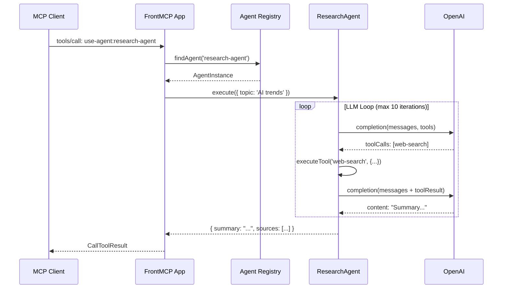

> Estimated reading time: **15 minutes**


**Here's a scenario you might recognize:**

You've built specialized AI agents. A research agent that gathers data. A writer agent that crafts content. An analyst agent that crunches numbers. Each one works brilliantly—in isolation.

Then someone asks: "Can the writer agent use the research agent's findings?"

Suddenly you're knee-deep in:

- Custom message passing between agents
- State synchronization nightmares
- LLM provider lock-in (your agents only work with OpenAI)
- Duplicate tool definitions across agents
- No visibility into what's happening inside the swarm

**You're not building AI features anymore. You're building orchestration infrastructure.**

What if your agents could just... talk to each other? Like regular MCP tools?

That's exactly what FrontMCP's **Agent as Tool** pattern does.

---

## The Multi-Agent Problem

Let's break down what makes multi-agent systems so painful to build:

| Challenge | Traditional Approach | Time Sink |
| --------- | -------------------- | --------- |
| **Communication** | Custom message bus, shared state, event systems | Days of infrastructure |
| **Provider Lock-in** | Rewrite agents for each LLM (OpenAI, Anthropic, etc.) | 2-3x development effort |
| **Tool Isolation** | Copy-paste tool definitions, maintain consistency | Ongoing maintenance |
| **Visibility** | Build custom logging, tracing, debugging | More infrastructure |
| **Security** | Implement auth, rate limits, sandboxing per agent | Security review cycles |

Most teams give up on multi-agent and fall back to single monolithic agents. Which works—until it doesn't.

---

## What is "Agent as Tool"?

FrontMCP flips the model: **every agent automatically becomes an MCP tool.**

When you define an agent:

```typescript
@Agent({
  name: 'research-agent',
  description: 'Researches topics and compiles summaries',
  // ...
})
class ResearchAgent extends AgentContext {}
```

FrontMCP automatically registers it as `use-agent:research-agent` in your tool registry. Any other agent—or any MCP client—can call it like a regular tool.

<CardGroup cols={2}>
  <Card title="Any LLM Provider" icon="plug" color="#16A34A">
    OpenAI, Anthropic, Google, Mistral, Groq—or bring your own adapter. Switch providers without rewriting agents.
  </Card>
  <Card title="Standard Tool Flow" icon="route" color="#16A34A">
    Agents go through the same `tools:call-tool` flow as regular tools. All your plugins (cache, rate-limit, auth) work automatically.
  </Card>
  <Card title="Private Scoping" icon="lock" color="#16A34A">
    Each agent gets its own isolated scope. Its tools, resources, and prompts are private—not exposed to the parent app.
  </Card>
  <Card title="Swarm-Ready" icon="users" color="#16A34A">
    Built-in visibility controls let you define which agents can see and invoke other agents. Orchestrator patterns work out of the box.
  </Card>
</CardGroup>

---

## Three Ways to Create Agents

FrontMCP offers three patterns depending on your needs:

### 1. Class-Based (Default)—No Execute Method Needed

The simplest approach: define your agent metadata and let FrontMCP handle the LLM loop.

```typescript
import { Agent, AgentContext, z } from '@frontmcp/sdk';
import { WebSearchTool, SummarizeTool } from './tools';

@Agent({
  name: 'research-agent',
  description: 'Researches topics and compiles summaries',
  systemInstructions: `You are a research assistant.
    Use web-search to find information, then summarize your findings.
    Be thorough but concise.`,
  inputSchema: {
    topic: z.string().describe('Topic to research'),
    depth: z.enum(['brief', 'detailed']).default('brief'),
  },
  outputSchema: {
    summary: z.string(),
    sources: z.array(z.string()),
  },
  llm: {
    provider: 'openai',
    model: 'gpt-4-turbo',
    apiKey: { env: 'OPENAI_API_KEY' },
  },
  tools: [WebSearchTool, SummarizeTool],
})
export default class ResearchAgent extends AgentContext {}
```

That's it. No `execute()` method needed. FrontMCP runs the LLM loop automatically:
1. Sends system instructions + user input to the LLM
2. If the LLM requests tool calls, executes them
3. Feeds results back to the LLM
4. Repeats until the LLM responds with final output
5. Validates output against `outputSchema`

### 2. Class-Based with Custom Execute

Need custom logic? Override the `execute()` method:

```typescript
@Agent({
  name: 'smart-research-agent',
  // ... same config as above
})
class SmartResearchAgent extends AgentContext {
  async execute(input: { topic: string; depth: string }) {
    // Custom pre-processing
    this.notify(`Starting research on: ${input.topic}`, 'info');

    // Call the default LLM loop
    const result = await super.execute(input);

    // Custom post-processing
    if (result.sources.length === 0) {
      this.notify('No sources found, retrying with broader search', 'warning');
      return super.execute({ ...input, topic: `${input.topic} overview` });
    }

    return result;
  }
}
```

### 3. Function Builder Pattern

For simpler agents or when you prefer functional style:

```typescript
import { agent, z } from '@frontmcp/sdk';

const EchoAgent = agent({
  name: 'echo-agent',
  description: 'Echoes back the input with analysis',
  inputSchema: {
    message: z.string()
  },
  llm: {
    provider: 'openai',
    model: 'gpt-3.5-turbo',
    apiKey: { env: 'OPENAI_API_KEY' }
  },
})(async ({ message }) => {
  // Direct return without LLM loop
  return { echoed: `You said: ${message}` };
});
```

<Tip>
Use the function builder for simple agents that don't need the full LLM loop. Use class-based for agents that need tool access, custom logic, or advanced configuration.
</Tip>

---

## Registering Agents in Your App

Agents are registered just like tools:

```typescript
import { App } from '@frontmcp/sdk';
import ResearchAgent from './agents/research.agent';
import WriterAgent from './agents/writer.agent';
import AnalystAgent from './agents/analyst.agent';
import { DataFetchTool, ChartTool } from './tools';

@App({
  id: 'content-platform',
  name: 'Content Creation Platform',
  agents: [ResearchAgent, WriterAgent, AnalystAgent],
  tools: [DataFetchTool, ChartTool],
})
export default class ContentPlatformApp {}
```

Your MCP client now sees:
- `use-agent:research-agent`
- `use-agent:writer-agent`
- `use-agent:analyst-agent`
- `data-fetch`
- `chart`




---

## Agent Configuration Deep Dive

### LLM Configuration

FrontMCP supports multiple LLM providers out of the box:

<Tabs>
  <Tab title="OpenAI">
    ```typescript
    llm: {
      provider: 'openai',
      model: 'gpt-4-turbo',
      apiKey: { env: 'OPENAI_API_KEY' },
      temperature: 0.7,
      maxTokens: 4000,
    }
    ```
  </Tab>
  <Tab title="Anthropic">
    ```typescript
    llm: {
      provider: 'anthropic',
      model: 'claude-3-opus-20240229',
      apiKey: { env: 'ANTHROPIC_API_KEY' },
      temperature: 0.5,
    }
    ```
  </Tab>
  <Tab title="Google">
    ```typescript
    llm: {
      provider: 'google',
      model: 'gemini-pro',
      apiKey: { env: 'GOOGLE_API_KEY' },
    }
    ```
  </Tab>
  <Tab title="Custom Adapter">
    ```typescript
    llm: {
      adapter: MyCustomLlmAdapter, // implements AgentLlmAdapter
    }
    // Or use DI injection:
    llm: LLM_ADAPTER_TOKEN,
    ```
  </Tab>
</Tabs>

### Agent-Scoped Components

Each agent can have its own private tools, resources, prompts, and even nested agents:

```typescript
@Agent({
  name: 'content-creator',
  // Private tools only this agent can use
  tools: [DraftTool, EditTool, PublishTool],
  // Private resources
  resources: [StyleGuideResource],
  // Private prompts
  prompts: [ToneAnalysisPrompt],
  // Nested agents
  agents: [SpellCheckAgent, SEOAgent],
  // Private providers
  providers: [ContentDatabaseProvider],
  // ...
})
```

<Warning>
Agent-scoped components are **not exposed** to the parent app or other agents. This is intentional—it prevents tool conflicts and maintains isolation.
</Warning>

### Execution Configuration

Fine-tune how agents run:

```typescript
@Agent({
  name: 'fast-agent',
  execution: {
    timeout: 30000,           // 30 second timeout (default: 120000)
    maxIterations: 5,          // Max LLM loop iterations (default: 10)
    enableStreaming: true,     // Stream responses
    enableNotifications: true, // Send progress notifications
    notificationInterval: 500, // Notify every 500ms
    inheritParentTools: true,  // Access parent app's tools
    useToolFlow: true,         // Go through plugin/hook layer
    inheritPlugins: true,      // Use parent's plugins
  },
  // ...
})
```

### Plugin Metadata

Agents support the same plugin metadata as tools:

```typescript
@Agent({
  name: 'cached-research',
  // Cache agent results
  cache: { ttl: 3600 },
  // Show in CodeCall discovery
  codecall: { visibleInListTools: true },
  // Require authentication
  auth: { required: true, scopes: ['research:read'] },
  // Rate limit calls
  rateLimit: { limit: 10, window: '1m' },
  // Retry on failure
  retry: { attempts: 3, backoff: 'exponential' },
  // ...
})
```

---

## Multi-Agent Swarm Patterns

### The Orchestrator Pattern

One agent coordinates multiple worker agents:

```typescript
// Worker agents (hidden from each other)
@Agent({
  name: 'research-worker',
  swarm: {
    isVisible: true,           // Visible to other agents
    canSeeOtherAgents: false,  // Cannot invoke other agents
  },
  tools: [WebSearchTool],
  // ...
})
class ResearchWorker extends AgentContext {}

@Agent({
  name: 'writer-worker',
  swarm: {
    isVisible: true,
    canSeeOtherAgents: false
  },
  tools: [DraftTool],
  // ...
})
class WriterWorker extends AgentContext {}

// Orchestrator (can see and invoke workers)
@Agent({
  name: 'content-orchestrator',
  systemInstructions: `You coordinate content creation.
    1. Use research-worker to gather information
    2. Use writer-worker to draft content
    3. Review and refine the final output`,
  swarm: {
    canSeeOtherAgents: true,
    visibleAgents: ['research-worker', 'writer-worker'],
    maxCallDepth: 3,  // Prevent infinite recursion
  },
  // ...
})
class ContentOrchestrator extends AgentContext {}
```

When `ContentOrchestrator` runs, it can invoke `use-agent:research-worker` and `use-agent:writer-worker` as tools. The workers only see their own private tools.

### Nested Agents

For tighter coupling, embed agents directly:

```typescript
@Agent({
  name: 'article-generator',
  agents: [ResearchWorker, WriterWorker, EditorAgent],
  tools: [PublishTool],
  systemInstructions: `Generate articles by:
    1. Research the topic (use-agent:research-worker)
    2. Write the draft (use-agent:writer-worker)
    3. Edit for quality (use-agent:editor-agent)
    4. Publish the final version (publish tool)`,
  // ...
})
class ArticleGenerator extends AgentContext {}
```

Nested agents are scoped to the parent agent and not visible to the broader app.

<Accordion title="Swarm Configuration Reference">
```typescript
swarm: {
  // Can this agent invoke other agents?
  canSeeOtherAgents?: boolean;  // default: false

  // If true, which specific agents can it see?
  visibleAgents?: string[];     // whitelist of agent IDs

  // Is this agent visible to other agents?
  isVisible?: boolean;          // default: true

  // Maximum nested agent call depth
  maxCallDepth?: number;        // default: 3
}
```
</Accordion>

---

## Real-World Example: Weather Summary Agent

Here's the complete weather agent from the FrontMCP demo:

```typescript
import { Agent, AgentContext, z } from '@frontmcp/sdk';
import GetWeatherTool from '../tools/get-weather.tool';

@Agent({
  name: 'summary-agent',
  description: 'Provides weather summaries for any location',
  systemInstructions: `You are a weather assistant.
    Use the get-weather tool to fetch current conditions,
    then provide a friendly, conversational summary.
    Include temperature, conditions, and any notable weather patterns.`,
  inputSchema: {
    location: z.string().describe('City name or location'),
    units: z.enum(['celsius', 'fahrenheit']).optional().default('celsius'),
  },
  outputSchema: {
    summary: z.string().describe('Friendly weather summary'),
    temperature: z.number().describe('Current temperature'),
    conditions: z.string().describe('Weather conditions'),
  },
  llm: {
    provider: 'openai',
    model: 'gpt-4-turbo',
    apiKey: { env: 'OPENAI_API_KEY' },
  },
  tools: [GetWeatherTool],
  codecall: { visibleInListTools: true },
})
export default class SummaryAgent extends AgentContext {}
```

Registered in the app:

```typescript
@App({
  id: 'weather',
  name: 'Weather MCP App',
  agents: [SummaryAgent],
  tools: [GetWeatherTool],
})
export default class WeatherMcpApp {}
```

Now any MCP client can call:

```json
{
  "method": "tools/call",
  "params": {
    "name": "use-agent:summary-agent",
    "arguments": {
      "location": "San Francisco",
      "units": "fahrenheit"
    }
  }
}
```

And get back:

```json
{
  "content": [
    {
      "type": "text",
      "text": "{\"summary\":\"It's a beautiful day in San Francisco! Currently 68°F with clear skies and a light breeze. Perfect weather for a walk.\",\"temperature\":68,\"conditions\":\"sunny\"}"
    }
  ]
}
```

---

## When to Use Agents vs Tools

<CardGroup cols={2}>
  <Card title="Use Agents When" icon="check" color="#16A34A">
    - Task requires **multi-step reasoning**
    - You need **LLM decision-making** between steps
    - Orchestrating **multiple tools** with context
    - Building **autonomous workflows**
    - Need **different LLM providers** for different tasks
  </Card>
  <Card title="Use Tools When" icon="wrench" color="#6B7280">
    - Task is **deterministic** (no LLM needed)
    - Single **API call or data fetch**
    - **Performance-critical** operations
    - **Simple CRUD** operations
    - No decision-making required
  </Card>
</CardGroup>

| Scenario | Recommendation |
| -------- | -------------- |
| Fetch weather data | Tool |
| Summarize weather for trip planning | Agent |
| Create a database record | Tool |
| Research and write a report | Agent |
| Send an email | Tool |
| Draft, review, and send personalized outreach | Agent |

---

## Performance Considerations

Agents add overhead compared to raw tools:

| Operation | Latency | Notes |
| --------- | ------- | ----- |
| Tool execution | ~50-200ms | Direct function call |
| Agent (1 iteration) | ~1-3s | LLM round-trip |
| Agent (5 iterations) | ~5-15s | Multiple LLM calls |
| Nested agents | Multiplied | Each agent adds its own latency |

<Tip>
Use `execution.useToolFlow: false` to bypass the plugin layer for agent-internal tool calls. This reduces latency but loses plugin features like caching and rate limiting.
</Tip>

---

## Get Started

<CardGroup cols={2}>
  <Card
    title="Agents Documentation"
    href="/docs/servers/agents"
    icon="book-open"
  >
    Complete API reference for agent configuration, swarm patterns, and LLM adapters
  </Card>
  <Card
    title="Weather Demo App"
    href="https://github.com/agentfront/frontmcp/tree/main/apps/demo/src/apps/weather"
    icon="github"
  >
    Working example with agent, tools, and UI rendering
  </Card>
  <Card
    title="5-Minute Quickstart"
    href="/docs/getting-started/quickstart"
    icon="rocket"
  >
    Get your first FrontMCP server running with agents
  </Card>
  <Card
    title="Multi-Agent Patterns"
    href="/docs/servers/agents#swarm-configuration"
    icon="users"
  >
    Deep dive into orchestrator patterns and visibility controls
  </Card>
</CardGroup>

---

_Agents are just one piece of FrontMCP's production-ready MCP framework. Combine them with [CodeCall](/docs/plugins/codecall) for code execution, [Tool UI](/docs/ui/overview) for rich widgets, and deploy to [Vercel](/docs/deployment/serverless) or any Node.js environment._

_[Star us on GitHub](https://github.com/agentfront/frontmcp) to follow development._
