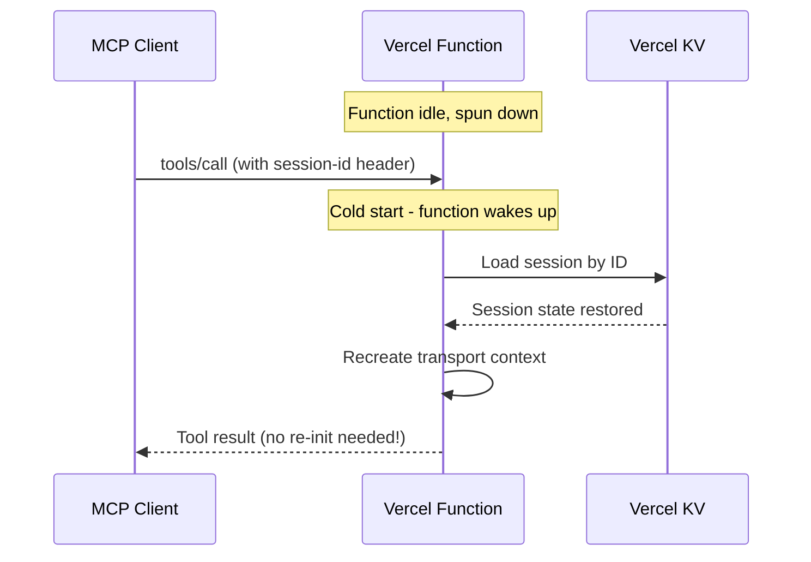

> Estimated reading time: **8 minutes**


**Here's the deployment story you're probably living:**

Your MCP server works locally. It handles tools, resources, prompts—maybe even agents. Now you need it in production.

Traditional deployment means:
- Provisioning servers
- Setting up load balancers
- Configuring Redis for sessions
- Managing SSL certificates
- Worrying about scaling
- Paying for idle capacity

**What if deployment was just... `vercel deploy`?**

FrontMCP has first-class Vercel support. One command generates the right build artifacts. Your server runs on Vercel's edge network, scales automatically, and costs nothing when idle.

Let's ship it.

---

## What You'll Deploy

By the end of this guide, you'll have:

<CardGroup cols={2}>
  <Card title="Global Edge Deployment" icon="globe" color="#16A34A">
    Your MCP server running on Vercel's worldwide network—low latency everywhere.
  </Card>
  <Card title="Automatic Scaling" icon="chart-line" color="#16A34A">
    Zero to thousands of requests with no configuration. Pay only for what you use.
  </Card>
  <Card title="Vercel KV Sessions" icon="database" color="#16A34A">
    Edge-compatible session storage that works with serverless architecture.
  </Card>
  <Card title="One-Command Deploys" icon="terminal" color="#16A34A">
    Push to git, deployment happens automatically. Or run `vercel deploy`.
  </Card>
</CardGroup>

---

## Prerequisites

Before you start:

<Steps>
  <Step title="FrontMCP Project">
    You need a working FrontMCP server. If you don't have one yet:
    ```bash
    npx frontmcp create my-mcp-server
    cd my-mcp-server
    ```
  </Step>
  <Step title="Vercel Account">
    Sign up at [vercel.com](https://vercel.com) if you haven't already. The Hobby tier is free.
  </Step>
  <Step title="Vercel CLI">
    Install the Vercel CLI:
    ```bash
    npm i -g vercel
    vercel login
    ```
  </Step>
</Steps>

---

## One-Command Build

FrontMCP's CLI handles all the Vercel-specific configuration:

```bash
frontmcp build --adapter vercel
```

That's it. This command:

1. **Compiles** your TypeScript to ESM
2. **Bundles** everything into a single `handler.cjs` file
3. **Generates** Vercel's Build Output API structure
4. **Detects** your package manager (npm/yarn/pnpm/bun)
5. **Creates** `vercel.json` with correct configuration

<Accordion title="What Gets Generated">
After running `frontmcp build --adapter vercel`, your project contains:

```
.vercel/
└── output/
    ├── config.json          # Routing configuration
    └── functions/
        └── index.func/
            ├── .vc-config.json  # Runtime config
            └── handler.cjs      # Your bundled server

vercel.json                   # Build commands
```

The `.vc-config.json` configures:
- **Runtime:** Node.js 22.x
- **Handler:** `handler.cjs`
- **Launcher:** Nodejs type

Routes in `config.json` point all traffic to your function.
</Accordion>

---


## Deployment Steps

<Steps>
  <Step title="Build for Vercel">
    Run the build command:
    ```bash
    frontmcp build --adapter vercel
    ```

    <Check>
    You should see `.vercel/output/` directory created.
    </Check>
  </Step>

  <Step title="Add Environment Variables">
    Your MCP server likely needs API keys. Add them to `.env.local`:
    ```bash
    OPENAI_API_KEY=sk-...
    DATABASE_URL=postgresql://...
    ```

    For production, set them in Vercel Dashboard or via CLI:
    ```bash
    vercel env add OPENAI_API_KEY production
    ```
  </Step>

  <Step title="Deploy">
    Run the deploy command:
    ```bash
    vercel deploy
    ```

    For production:
    ```bash
    vercel deploy --prod
    ```

    <Check>
    Vercel returns a URL like `https://my-mcp-server.vercel.app`
    </Check>
  </Step>

  <Step title="Verify">
    Test your deployment:
    ```bash
    curl https://my-mcp-server.vercel.app/health
    # Expected: {"status":"ok","serverless":true}
    ```

    Or test the MCP endpoint:
    ```bash
    curl -X POST https://my-mcp-server.vercel.app/mcp \
      -H "Content-Type: application/json" \
      -d '{"jsonrpc":"2.0","id":1,"method":"initialize","params":{"protocolVersion":"2024-11-05","capabilities":{},"clientInfo":{"name":"test","version":"1.0"}}}'
    ```
  </Step>
</Steps>

---

## Adding Vercel KV for Sessions

Standard Redis requires a persistent TCP connection—which serverless doesn't have. Vercel KV is a REST-based key-value store that works perfectly with serverless.

### Enable Vercel KV

<Steps>
  <Step title="Add KV to Your Project">
    In Vercel Dashboard:
    1. Go to your project → Storage
    2. Click "Create Database"
    3. Select "KV"
    4. Name it (e.g., `my-mcp-sessions`)

    Vercel automatically adds `KV_REST_API_URL` and `KV_REST_API_TOKEN` to your environment.
  </Step>

  <Step title="Configure FrontMCP">
    Update your server configuration:
    ```typescript
    @FrontMcp({
      info: { name: 'My MCP Server', version: '1.0.0' },
      redis: {
        provider: 'vercel-kv',
        // Environment variables are auto-detected
        // url: process.env.KV_REST_API_URL,
        // token: process.env.KV_REST_API_TOKEN,
        keyPrefix: 'mcp:',
        defaultTtlMs: 7200000, // 2 hours
      },
    })
    export default class MyServer {}
    ```
  </Step>

  <Step title="Redeploy">
    ```bash
    frontmcp build --adapter vercel
    vercel deploy --prod
    ```
  </Step>
</Steps>

### Vercel KV vs Standard Redis

| Feature | Vercel KV | Standard Redis |
| ------- | --------- | -------------- |
| **Transport** | REST (edge-compatible) | TCP (requires connection) |
| **Latency** | ~5-15ms | ~1-5ms |
| **Pub/Sub** | Not supported | Supported |
| **Resource Subscriptions** | Requires hybrid setup | Fully supported |
| **Setup** | One-click in dashboard | Provision + configure |
| **Cost** | Pay-per-request | Fixed instance cost |

<Tip>
For most MCP servers, Vercel KV is the right choice. It handles sessions, caching, and state—which is 90% of what you need. Only use standard Redis if you need real-time resource subscriptions.
</Tip>

---

## Serverless Considerations

### Function Timeout

Vercel serverless functions have timeout limits:

| Tier | Max Duration |
| ---- | ------------ |
| Hobby | 60 seconds |
| Pro | 300 seconds |
| Enterprise | 900 seconds |

<Warning>
If your MCP operations take longer than 60 seconds on Hobby tier, they'll fail. For long-running agent tasks, consider Pro tier or chunking the work.
</Warning>

FrontMCP uses Vercel's Build Output API, so max duration is configured in the function's `.vc-config.json`. You can customize this via the CLI:

```bash
frontmcp build --adapter vercel --max-duration 300
```

This generates `.vercel/output/functions/index.func/.vc-config.json`:

```json
{
  "runtime": "nodejs22.x",
  "handler": "handler.cjs",
  "launcherType": "Nodejs",
  "maxDuration": 300
}
```

<Note>
The `maxDuration` value must not exceed your Vercel tier limit. Hobby tier caps at 60 seconds.
</Note>

### Cold Starts

The first request after idle may take 1-3 seconds while Vercel spins up your function. Subsequent requests (warm starts) are much faster.

FrontMCP tracks this for you:

```typescript
// Available in your tools/resources
const info = ctx.scope.serverlessInfo;
console.log(info.isColdStart);      // true on first request
console.log(info.invocationCount);  // number of requests since cold start
```

### Session Persistence Across Cold Starts

Here's where FrontMCP shines: **clients don't need to re-initialize MCP when functions wake up from idle.**

Traditional MCP servers lose all state when they restart. Clients must detect the disconnect, re-send `initialize`, and rebuild their session. This creates a terrible user experience in serverless environments where functions spin down after ~15 minutes of inactivity.

FrontMCP handles this automatically:



<Tip>
As long as the client sends its `session-id` header (or uses the same SSE connection URL with session token), FrontMCP reconstructs the full session context from Vercel KV. The client continues as if nothing happened—no `initialize` call required.
</Tip>

This means:
- **No client-side reconnection logic** needed for cold starts
- **Session state persists** across function invocations
- **Seamless experience** even with aggressive function recycling

### Resource Subscriptions (Hybrid Setup)

Vercel KV doesn't support Pub/Sub, which means real-time resource subscriptions won't work out of the box. If you need subscriptions:

```typescript
@FrontMcp({
  info: { name: 'My Server', version: '1.0.0' },
  // Sessions via Vercel KV (edge-compatible)
  redis: {
    provider: 'vercel-kv',
  },
  // Pub/Sub via external Redis (for subscriptions)
  pubsub: {
    host: process.env.REDIS_HOST,
    port: 6379,
    password: process.env.REDIS_PASSWORD,
  },
})
```

<Accordion title="Recommended Redis Services for Pub/Sub">
- **Upstash** - Serverless Redis, pay-per-request, integrates with Vercel
- **Redis Cloud** - Managed Redis with free tier
- **AWS ElastiCache** - If you're already on AWS
</Accordion>

---

## Project Structure

A typical Vercel-ready FrontMCP project:

```
my-mcp-server/
├── src/
│   ├── main.ts           # Server entry point
│   ├── apps/
│   │   └── my-app/
│   │       ├── index.ts  # App definition
│   │       └── tools/    # Tool implementations
│   └── providers/        # Shared providers
├── .env.local            # Local environment
├── package.json
├── tsconfig.json
└── vercel.json           # Generated by build
```

Your `vercel.json` (auto-generated):

```json
{
  "version": 2,
  "buildCommand": "npm run build",
  "installCommand": "npm install"
}
```

<Note>
FrontMCP auto-detects your package manager. If you use yarn or pnpm, the generated `vercel.json` will have the correct commands.
</Note>

---

## Monitoring & Debugging

### Vercel Dashboard

The Vercel dashboard shows:
- Function invocations and duration
- Error rates and logs
- Request/response details

Navigate to **Project → Functions** to see real-time data.

### Logging

FrontMCP logs are captured by Vercel:

```typescript
@Tool({ name: 'my-tool' })
class MyTool extends ToolContext {
  async execute(input: any) {
    console.log('Processing:', input); // Visible in Vercel logs
    this.notify('Starting processing...', 'info');
    // ...
  }
}
```

View logs with:
```bash
vercel logs https://my-mcp-server.vercel.app
```

### Error Tracking

For production, connect Vercel to your error tracking service:

```typescript
// In your server configuration
@FrontMcp({
  // ...
  logging: {
    level: 'info',
    format: 'json', // Structured logs for parsing
  },
})
```

---

## CI/CD Setup

Connect your git repository for automatic deployments:

<Steps>
  <Step title="Connect Repository">
    In Vercel Dashboard:
    1. Import your GitHub/GitLab/Bitbucket repo
    2. Vercel auto-detects the build settings
  </Step>

  <Step title="Configure Build">
    Set the build command in project settings:
    - **Build Command:** `frontmcp build --adapter vercel`
    - **Output Directory:** `.vercel/output`
    - **Install Command:** `npm install` (or yarn/pnpm)
  </Step>

  <Step title="Push to Deploy">
    Every push to `main` triggers a production deployment.
    Pull requests get preview deployments.
  </Step>
</Steps>

---

## Cost Optimization

Vercel's serverless pricing is usage-based:

| Resource | Hobby (Free) | Pro ($20/mo) |
| -------- | ------------ | ------------ |
| Function Invocations | 100K/mo | 1M/mo |
| Function Duration | 100 GB-hrs | 1000 GB-hrs |
| Bandwidth | 100 GB | 1 TB |
| KV Operations | 30K/day | 150K/day |

<Tip>
For MCP servers, the main cost drivers are function duration (LLM calls take time) and KV operations (session storage). Most projects stay well within free tier limits.
</Tip>

---

## Troubleshooting

<AccordionGroup>
  <Accordion title="Function Timeout Error">
    **Symptom:** 504 Gateway Timeout

    **Solution:**
    - Increase max duration in `vercel.json`
    - Upgrade to Pro tier for longer limits
    - Break long operations into smaller chunks
  </Accordion>

  <Accordion title="Missing Environment Variables">
    **Symptom:** `OPENAI_API_KEY is not defined`

    **Solution:**
    ```bash
    vercel env add OPENAI_API_KEY production
    vercel deploy --prod
    ```
  </Accordion>

  <Accordion title="Cold Start Latency">
    **Symptom:** First request takes 2-3 seconds

    **Solution:** This is expected for serverless. For lower latency:
    - Keep functions small (faster cold starts)
    - Use edge functions for ultra-low latency
    - Consider Pro tier with more resources
  </Accordion>

  <Accordion title="KV Connection Errors">
    **Symptom:** `Could not connect to Vercel KV`

    **Solution:**
    - Ensure KV database is linked to project
    - Check that `KV_REST_API_URL` and `KV_REST_API_TOKEN` are set
    - Redeploy after linking KV
  </Accordion>
</AccordionGroup>

---

## What's Next

<CardGroup cols={2}>
  <Card
    title="Serverless Documentation"
    href="/docs/deployment/serverless"
    icon="book-open"
  >
    Deep dive into serverless patterns, hybrid configurations, and edge optimization
  </Card>
  <Card
    title="Vercel KV Guide"
    href="/docs/deployment/vercel-kv"
    icon="database"
  >
    Complete guide to session storage, caching, and KV best practices
  </Card>
  <Card
    title="Production Checklist"
    href="/docs/deployment/production-build"
    icon="list-check"
  >
    Security hardening, monitoring, and production readiness
  </Card>
  <Card
    title="AWS Lambda Deployment"
    href="/docs/deployment/serverless#aws-lambda"
    icon="aws"
  >
    Alternative: Deploy to AWS Lambda with SAM or Serverless Framework
  </Card>
</CardGroup>

---

_FrontMCP supports multiple deployment targets: Vercel, AWS Lambda, Cloudflare Workers, and traditional Node.js servers. Choose what fits your infrastructure._

_[Star us on GitHub](https://github.com/agentfront/frontmcp) to follow development._
