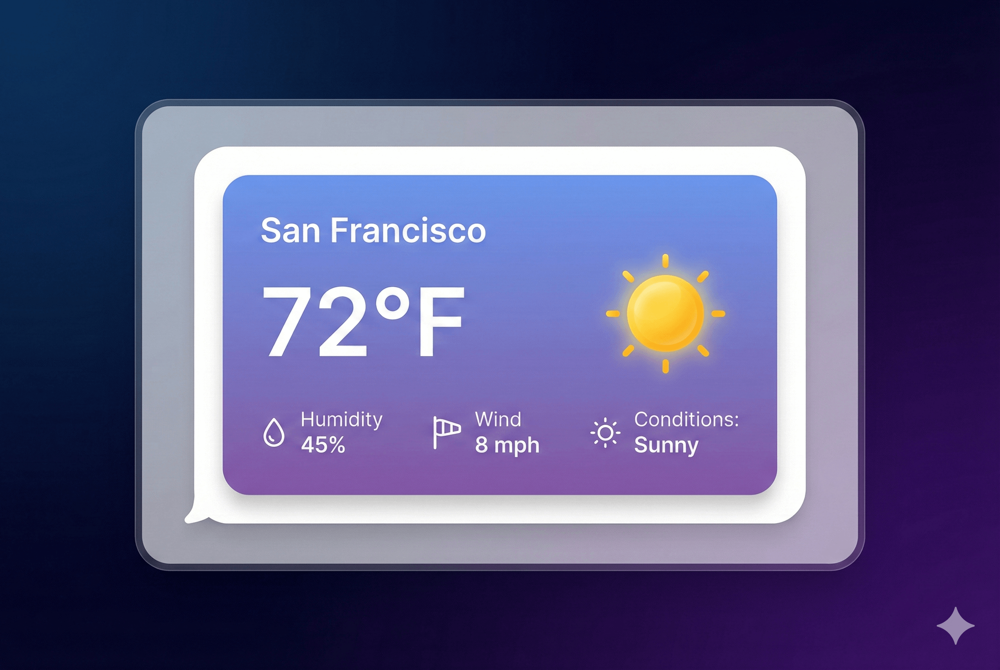
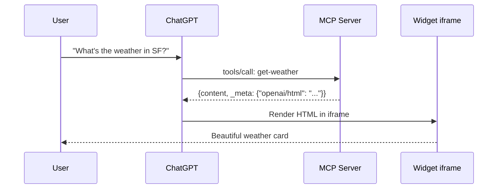

> Estimated reading time: **12 minutes**


**Here's what happens when your AI tool returns data:**

```json
{
  "location": "San Francisco",
  "temperature": 68,
  "humidity": 45,
  "conditions": "sunny",
  "windSpeed": 8
}
```

The user sees... JSON. Or maybe the LLM summarizes it into text. Either way, it's functional but not beautiful. Not interactive. Not what users expect from modern AI apps.

**What if your tool could return this instead?**



A beautiful card with the temperature displayed prominently, a weather icon, a gradient background—rendered right inside ChatGPT.

That's exactly what FrontMCP's **Tool UI** does.

---

## The Platform Fragmentation Problem

Rich UI in AI responses sounds simple until you realize:

- **ChatGPT** renders widgets in iframes with specific security rules
- **Claude** has limited UI support
- **OpenAI Apps SDK** expects specific metadata formats
- Each platform has different CSP (Content Security Policy) requirements
- You can't use external scripts or stylesheets

Building widgets for each platform means:

| Platform       | Widget Format                | Security Model              |
| -------------- | ---------------------------- | --------------------------- |
| ChatGPT        | iframe + `window.openai` API | Strict CSP, isolated origin |
| Claude         | Limited HTML                 | Markdown + basic HTML       |
| Custom clients | Varies wildly                | Custom implementation       |

Most developers give up and return plain text.

**FrontMCP handles all of this automatically.** You write one template, and Tool UI adapts it to each platform.

---

## What is Tool UI?

Tool UI is a rendering system built into FrontMCP that:

<CardGroup cols={2}>
  <Card title="Type-Safe Templates" icon="code" color="#16A34A">
    Template functions receive typed `input` and `output` based on your Zod schemas. TypeScript catches errors before runtime.
  </Card>
  <Card title="Platform Aware" icon="window" color="#16A34A">
    Automatically detects ChatGPT, Claude, ext-apps, and custom clients. Renders appropriately for each.
  </Card>
  <Card title="Security Built-In" icon="shield-check" color="#16A34A">
    XSS prevention, safe JSON embedding, Content Security Policy—all handled automatically.
  </Card>
  <Card title="Graceful Degradation" icon="arrow-down" color="#16A34A">
    If a platform doesn't support UI, your tool still returns structured data. Never fails silently.
  </Card>
</CardGroup>

---

## Your First Widget

Let's add a UI widget to a weather tool. Start with a basic tool:

```typescript
import { Tool, ToolContext, z } from '@frontmcp/sdk';

const inputSchema = {
  location: z.string().describe('City name'),
  units: z.enum(['celsius', 'fahrenheit']).default('celsius'),
};

const outputSchema = z.object({
  location: z.string(),
  temperature: z.number(),
  humidity: z.number(),
  windSpeed: z.number(),
  conditions: z.string(),
  units: z.enum(['celsius', 'fahrenheit']),
});

@Tool({
  name: 'get-weather',
  description: 'Get current weather for a location',
  inputSchema,
  outputSchema,
})
class GetWeatherTool extends ToolContext<typeof inputSchema, typeof outputSchema> {
  async execute(input: { location: string; units: string }) {
    // Fetch weather data...
    return {
      location: input.location,
      temperature: 68,
      humidity: 45,
      windSpeed: 8,
      conditions: 'sunny',
      units: input.units as 'celsius' | 'fahrenheit',
    };
  }
}
```

Now add the `ui` property:

```typescript
@Tool({
  name: 'get-weather',
  description: 'Get current weather for a location',
  inputSchema,
  outputSchema,
  ui: {
    widgetDescription: 'Displays current weather with temperature and conditions',
    displayMode: 'inline',
    servingMode: 'auto',
    template: (ctx) => {
      const tempSymbol = ctx.output.units === 'celsius' ? '°C' : '°F';
      const icon = ctx.output.conditions === 'sunny' ? '☀️' : '🌤️';

      return `
        <div style="
          background: linear-gradient(135deg, #667eea 0%, #764ba2 100%);
          border-radius: 16px;
          padding: 24px;
          color: white;
          font-family: system-ui, sans-serif;
          max-width: 320px;
        ">
          <div style="font-size: 14px; opacity: 0.9; margin-bottom: 8px;">
            ${ctx.helpers.escapeHtml(ctx.output.location)}
          </div>
          <div style="font-size: 48px; font-weight: 700; margin-bottom: 16px;">
            ${icon} ${ctx.output.temperature}${tempSymbol}
          </div>
          <div style="display: grid; grid-template-columns: 1fr 1fr; gap: 12px; font-size: 14px;">
            <div>
              <div style="opacity: 0.7;">Humidity</div>
              <div style="font-weight: 600;">${ctx.output.humidity}%</div>
            </div>
            <div>
              <div style="opacity: 0.7;">Wind</div>
              <div style="font-weight: 600;">${ctx.output.windSpeed} km/h</div>
            </div>
          </div>
          <div style="margin-top: 16px; font-size: 14px; text-transform: capitalize;">
            ${ctx.helpers.escapeHtml(ctx.output.conditions)}
          </div>
        </div>
      `;
    },
  },
})
class GetWeatherTool extends ToolContext<typeof inputSchema, typeof outputSchema> {
  // ... execute method
}
```

When ChatGPT calls this tool, users see a beautiful weather card—not raw JSON.

---

## Template Context API

The `template` function receives a context object with everything you need:

```typescript
template: (ctx) => {
  // Typed input from your inputSchema
  ctx.input.location;    // string
  ctx.input.units;       // 'celsius' | 'fahrenheit'

  // Typed output from your outputSchema
  ctx.output.temperature; // number
  ctx.output.conditions;  // string

  // Helper functions
  ctx.helpers.escapeHtml(str);     // XSS-safe escaping
  ctx.helpers.formatDate(date);    // Date formatting
  ctx.helpers.formatCurrency(n);   // Currency formatting
  ctx.helpers.uniqueId('prefix');  // Generate unique IDs
  ctx.helpers.jsonEmbed(obj);      // Safe JSON embedding

  return '<div>...</div>';
}
```

### Type Safety

Because `inputSchema` and `outputSchema` are Zod schemas, TypeScript knows exactly what's available:

```typescript
template: (ctx) => {
  ctx.output.foo; // TypeScript Error: 'foo' does not exist
  ctx.output.temperature.toUpperCase(); // Error: toUpperCase doesn't exist on number
}
```

<Tip>
Always use `ctx.helpers.escapeHtml()` for user-provided data. It prevents XSS attacks by escaping `<`, `>`, `&`, `"`, and `'`.
</Tip>

---

## Serving Modes

Tool UI supports four serving modes, each with different trade-offs:


<Tabs>
  <Tab title="Inline (Default)">
    **Renders HTML on every request, embeds in response metadata.**

    ```typescript
    ui: {
      servingMode: 'inline',
      template: (ctx) => `<div>${ctx.output.value}</div>`,
    }
    ```

    **Pros:**
    - Fresh content every time
    - Simple to implement
    - Works with all platforms

    **Cons:**
    - Larger response payload
    - Rendering overhead per request

    **Best for:** Dynamic content that changes per request

  </Tab>

  <Tab title="Static">
    **Pre-compiles widget at server startup, client fetches via resource.**

    ```typescript
    ui: {
      servingMode: 'static',
      template: (ctx) => `<div id="weather-widget"></div>
        <script>
          const data = window.openai?.toolOutput;
          // Render with data
        </script>`,
    }
    ```

    **Pros:**
    - Smaller response payload
    - Widget cached on client
    - Better for complex UIs

    **Cons:**
    - Widget must read data from platform context
    - More complex template

    **Best for:** Large, complex widgets with stable structure

  </Tab>

  <Tab title="Hybrid">
    **Static shell with dynamic data payload.**

    ```typescript
    ui: {
      servingMode: 'hybrid',
      template: (ctx) => `<div>...</div>`,
    }
    ```

    Combines static widget structure with per-request data. The widget shell is pre-compiled, and `ui/component` metadata contains the dynamic payload.

    **Best for:** Performance-critical widgets with dynamic data

  </Tab>

  <Tab title="Auto (Recommended)">
    **Let FrontMCP choose the best mode for the platform.**

    ```typescript
    ui: {
      servingMode: 'auto',
      template: (ctx) => `<div>...</div>`,
    }
    ```

    FrontMCP detects the client platform and selects the optimal serving mode:
    - ChatGPT → Inline or Static based on widget complexity
    - Claude → Graceful degradation to text
    - Unknown → Conservative approach

    **Best for:** Cross-platform compatibility

  </Tab>
</Tabs>

---

## Using @frontmcp/ui Components

Writing raw HTML gets tedious. FrontMCP provides two approaches: **HTML string functions** for simple templates and **React components** for interactive widgets.

### HTML String Components

Import from `@frontmcp/ui/components`—these functions return HTML strings:

```typescript
import { card, badge, descriptionList, button } from '@frontmcp/ui/components';

@Tool({
  name: 'get-weather',
  // ...
  ui: {
    template: (ctx) => {
      const weatherDetails = descriptionList([
        { term: 'Humidity', description: `${ctx.output.humidity}%` },
        { term: 'Wind', description: `${ctx.output.windSpeed} km/h` },
      ], { layout: 'grid' });

      const conditionBadge = badge(ctx.output.conditions, {
        variant: ctx.output.conditions === 'sunny' ? 'success' : 'info',
      });

      const header = `${ctx.output.temperature}°${ctx.output.units === 'celsius' ? 'C' : 'F'}`;

      return card(
        `${header}${conditionBadge}${weatherDetails}`,
        {
          title: ctx.helpers.escapeHtml(ctx.output.location),
          subtitle: 'Current Weather',
          variant: 'elevated',
        }
      );
    },
  },
})
```

### React Widgets (Static Mode)

For complex, interactive widgets, create a separate React component file. FrontMCP bundles these at server startup and serves them as static widgets:

**1. Create the widget file** (`widgets/weather-widget.tsx`):

```tsx
import { Card, Badge, Button } from '@frontmcp/ui/react';
import { McpBridgeProvider, useToolOutput, useCallTool } from '@frontmcp/ui/react/hooks';

interface WeatherOutput {
  location: string;
  temperature: number;
  conditions: string;
  units: 'celsius' | 'fahrenheit';
}

function WeatherWidget() {
  const output = useToolOutput<WeatherOutput>();
  const [refresh, { loading }] = useCallTool('get-weather');

  if (!output) return <div>Loading...</div>;

  const tempSymbol = output.units === 'celsius' ? '°C' : '°F';

  return (
    <Card title={output.location} subtitle="Current Weather" variant="elevated">
      <div className="text-5xl font-bold mb-4">
        {output.temperature}{tempSymbol}
      </div>
      <Badge variant={output.conditions === 'sunny' ? 'success' : 'info'}>
        {output.conditions}
      </Badge>
      <Button
        onClick={() => refresh({ location: output.location })}
        loading={loading}
        className="mt-4"
      >
        Refresh
      </Button>
    </Card>
  );
}

// Export wrapped with provider
export default function Widget() {
  return (
    <McpBridgeProvider>
      <WeatherWidget />
    </McpBridgeProvider>
  );
}
```

**2. Reference the widget in your tool**:

```typescript
import { Tool, ToolContext, z } from '@frontmcp/sdk';

@Tool({
  name: 'get-weather',
  description: 'Get current weather for a location',
  inputSchema: {
    location: z.string(),
    units: z.enum(['celsius', 'fahrenheit']).default('celsius'),
  },
  outputSchema: z.object({
    location: z.string(),
    temperature: z.number(),
    conditions: z.string(),
    units: z.enum(['celsius', 'fahrenheit']),
  }),
  ui: {
    servingMode: 'static',
    widgetAccessible: true, // Enable MCP Bridge for tool callbacks
    widget: './widgets/weather-widget.tsx', // Path to React widget
  },
})
export default class GetWeatherTool extends ToolContext {
  async execute(input: { location: string; units: string }) {
    // Fetch weather data...
    return {
      location: input.location,
      temperature: 68,
      conditions: 'sunny',
      units: input.units as 'celsius' | 'fahrenheit',
    };
  }
}
```

<Tip>
React widgets are **transpiled once at server startup**, not on every request. The bundled widget reads tool output from the platform context (`window.openai.toolOutput` on ChatGPT) and can call back to tools via the MCP Bridge.
</Tip>

### Choosing Your Approach

| Approach          | When to Use                                     | Serving Mode       |
| ----------------- | ----------------------------------------------- | ------------------ |
| **HTML Strings**  | Simple data display, dynamic templates          | `inline` or `auto` |
| **React Widgets** | Interactive UI, complex layouts, tool callbacks | `static`           |

### Available Components

<CardGroup cols={3}>
  <Card title="card()" icon="square">
    Container with title, subtitle, and actions
  </Card>
  <Card title="badge()" icon="tag">
    Status indicators and labels
  </Card>
  <Card title="button()" icon="mouse-pointer">
    Interactive buttons (for MCP Bridge)
  </Card>
  <Card title="descriptionList()" icon="list">
    Key-value data display
  </Card>
  <Card title="table()" icon="table">
    Tabular data rendering
  </Card>
  <Card title="alert()" icon="triangle-exclamation">
    Status messages and notifications
  </Card>
</CardGroup>

<Accordion title="Full Component API Reference">
**HTML String Components** (`@frontmcp/ui/components`):
- `card(content, options)` - Card container
- `badge(text, options)` - Status badge
- `button(text, options)` - Clickable button
- `descriptionList(items, options)` - Key-value pairs
- `table(columns, data, options)` - Data table
- `alert(content, options)` - Alert message
- `form(content, options)` - Form container
- `input(options)` - Text input
- `select(options)` - Dropdown select
- `modal(content, options)` - Modal dialog

**React Components** (`@frontmcp/ui/react`) - for static widgets:

- `<Card>` - Card container with title, subtitle, actions
- `<Badge>` - Status indicators and labels
- `<Button>` - Clickable buttons with loading state
- `<Alert>` - Info, success, warning, danger alerts

**React Hooks** (`@frontmcp/ui/react/hooks`) - for interactive widgets:

- `useToolInput<T>()` - Get typed tool input
- `useToolOutput<T>()` - Get typed tool output
- `useCallTool(name)` - Call another tool from widget
- `useTheme()` - Access theme context
- `useMcpBridge()` - Low-level bridge access

</Accordion>

---

## Security Features

Tool UI has security built in at multiple layers:

### XSS Prevention

The `escapeHtml()` helper escapes dangerous characters:

```typescript
// User input: "<script>alert('xss')</script>"
ctx.helpers.escapeHtml(userInput);
// Output: "&lt;script&gt;alert('xss')&lt;/script&gt;"
```

**Always escape user-provided data:**

```typescript
// ✅ Safe
template: (ctx) => `<div>${ctx.helpers.escapeHtml(ctx.output.name)}</div>`

// ❌ Dangerous - XSS vulnerability
template: (ctx) => `<div>${ctx.output.name}</div>`
```

### Safe JSON Embedding

Need to pass data to JavaScript in your widget?

```typescript
template: (ctx) => `
  <script>
    const data = ${ctx.helpers.jsonEmbed(ctx.output)};
    // Safe! Escapes </script> and other dangerous patterns
  </script>
`
```

### Content Security Policy

FrontMCP generates appropriate CSP headers for each platform:

```typescript
ui: {
  csp: {
    'script-src': ["'self'"],
    'style-src': ["'self'", "'unsafe-inline'"],
    'img-src': ["'self'", 'https:'],
  },
}
```

<Warning>
Never use `eval()`, `new Function()`, or inline event handlers like `onclick`. These are blocked by CSP and create security vulnerabilities.
</Warning>

---

## Platform Behavior

### ChatGPT (OpenAI Apps SDK)

ChatGPT renders Tool UI widgets in an iframe:



The widget can access tool output via `window.openai.toolOutput` for static serving mode.

### Claude

Claude has limited UI support. Tool UI gracefully degrades:

- Widgets are not rendered
- Tool returns structured JSON as usual
- Claude summarizes the data in natural language

This is automatic—no code changes needed.

### Custom Clients

For custom MCP clients, Tool UI metadata is available in `_meta`:

```json
{
  "content": [{"type": "text", "text": "..."}],
  "_meta": {
    "ui/html": "<div>...</div>",
    "frontmcp/html": "<div>...</div>"
  }
}
```

Your client can render the HTML or ignore it.

---

## Advanced: MCP Bridge

For truly interactive widgets, use the MCP Bridge to call tools from within the widget:

```typescript
@Tool({
  name: 'interactive-form',
  ui: {
    widgetAccessible: true, // Enable MCP Bridge
    template: (ctx) => `
      <form id="feedback-form">
        <input name="rating" type="number" min="1" max="5" />
        <button type="submit">Submit</button>
      </form>
      <script>
        const form = document.getElementById('feedback-form');
        form.addEventListener('submit', async (e) => {
          e.preventDefault();
          const rating = form.elements.rating.value;

          // Call another tool from the widget!
          const result = await window.frontmcp.callTool('submit-rating', {
            rating: parseInt(rating)
          });

          alert('Rating submitted!');
        });
      </script>
    `,
  },
})
```

<Note>
MCP Bridge is only available in platforms that support it (currently ChatGPT with OpenAI Apps SDK). Use feature detection before calling `window.frontmcp`.
</Note>

---

## Real-World Example: Complete Weather Widget

Here's a production-ready weather widget with all best practices:

```typescript
import { Tool, ToolContext, z } from '@frontmcp/sdk';
import { card, descriptionList, badge } from '@frontmcp/ui/components';

const weatherIcons: Record<string, string> = {
  sunny: '☀️',
  cloudy: '☁️',
  rainy: '🌧️',
  snowy: '❄️',
  stormy: '⛈️',
};

@Tool({
  name: 'get-weather',
  description: 'Get current weather for any location',
  inputSchema: {
    location: z.string().describe('City name or coordinates'),
    units: z.enum(['celsius', 'fahrenheit']).default('celsius'),
  },
  outputSchema: z.object({
    location: z.string(),
    temperature: z.number(),
    feelsLike: z.number(),
    humidity: z.number(),
    windSpeed: z.number(),
    conditions: z.string(),
    units: z.enum(['celsius', 'fahrenheit']),
    updatedAt: z.string(),
  }),
  ui: {
    widgetDescription: 'Interactive weather card with current conditions',
    displayMode: 'inline',
    servingMode: 'auto',
    template: (ctx) => {
      const { output, helpers } = ctx;
      const icon = weatherIcons[output.conditions] || '🌤️';
      const tempSymbol = output.units === 'celsius' ? '°C' : '°F';

      const details = descriptionList([
        { term: 'Feels Like', description: `${output.feelsLike}${tempSymbol}` },
        { term: 'Humidity', description: `${output.humidity}%` },
        { term: 'Wind', description: `${output.windSpeed} km/h` },
      ], { layout: 'grid', className: 'mt-4' });

      const conditionBadge = badge(
        helpers.escapeHtml(output.conditions),
        {
          variant: output.conditions === 'sunny' ? 'success' :
                   output.conditions === 'stormy' ? 'danger' : 'info',
          size: 'md',
        }
      );

      const header = `
        <div style="display: flex; align-items: center; gap: 16px;">
          <span style="font-size: 64px;">${icon}</span>
          <div>
            <div style="font-size: 48px; font-weight: 700;">
              ${output.temperature}${tempSymbol}
            </div>
            ${conditionBadge}
          </div>
        </div>
      `;

      const footer = `
        <div style="font-size: 12px; color: #666; margin-top: 16px;">
          Updated: ${helpers.formatDate(output.updatedAt, 'datetime')}
        </div>
      `;

      return card(`${header}${details}${footer}`, {
        title: helpers.escapeHtml(output.location),
        subtitle: 'Current Weather',
        variant: 'elevated',
        size: 'md',
        className: 'weather-widget',
      });
    },
  },
})
export default class GetWeatherTool extends ToolContext {
  async execute(input: { location: string; units: string }) {
    // Fetch from weather API...
    return {
      location: input.location,
      temperature: 68,
      feelsLike: 65,
      humidity: 45,
      windSpeed: 8,
      conditions: 'sunny',
      units: input.units as 'celsius' | 'fahrenheit',
      updatedAt: new Date().toISOString(),
    };
  }
}
```

---

## Get Started

<CardGroup cols={2}>
  <Card
    title="Tool UI Documentation"
    href="/docs/ui/overview"
    icon="book-open"
  >
    Complete API reference for templates, components, and configuration
  </Card>
  <Card
    title="Component Library"
    href="/docs/ui/components/overview"
    icon="grid-2"
  >
    Browse all available UI components with examples
  </Card>
  <Card
    title="Platform Integration"
    href="/docs/ui/advanced/platforms"
    icon="window"
  >
    Deep dive into ChatGPT, Claude, and custom client support
  </Card>
  <Card
    title="MCP Bridge Guide"
    href="/docs/ui/advanced/mcp-bridge"
    icon="arrows-left-right"
  >
    Build interactive widgets that call back to your tools
  </Card>
</CardGroup>

---

_Tool UI is part of FrontMCP's mission to make AI tools feel native and beautiful. Combine it with [Agents](/docs/servers/agents) for autonomous workflows and [deploy to Vercel](/docs/deployment/serverless) for global edge performance._

_[Star us on GitHub](https://github.com/agentfront/frontmcp) to follow development._
