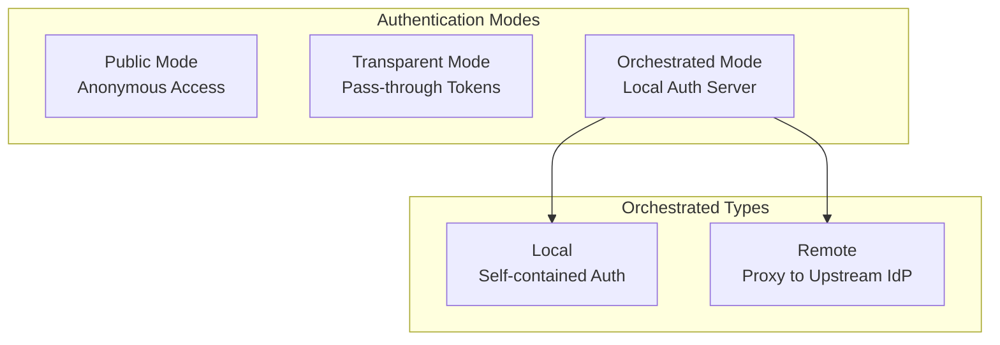
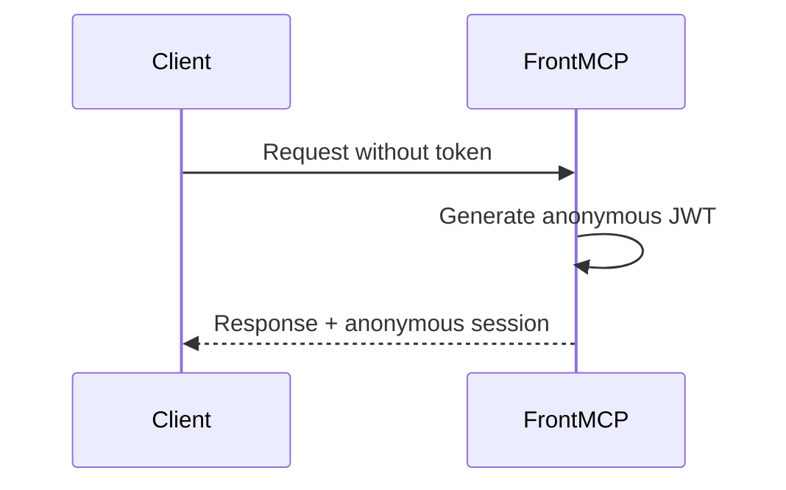
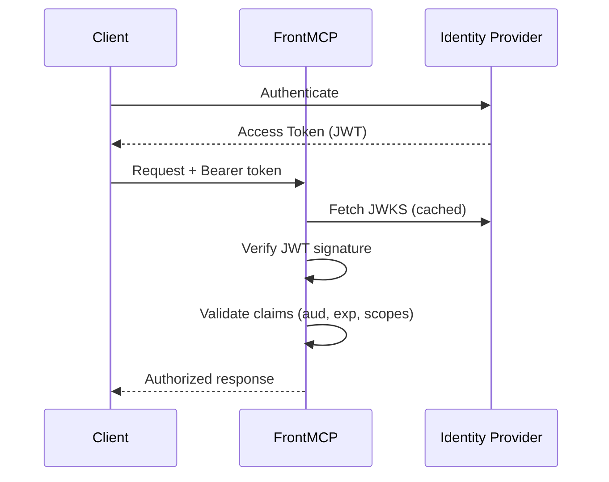
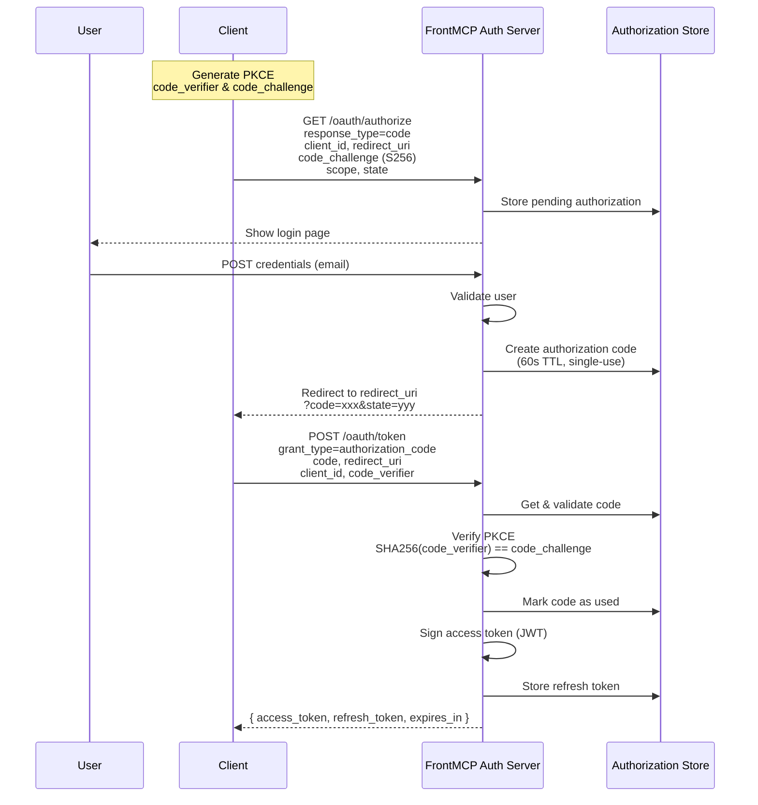
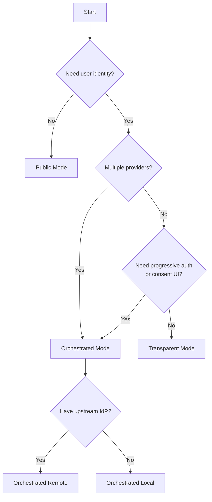
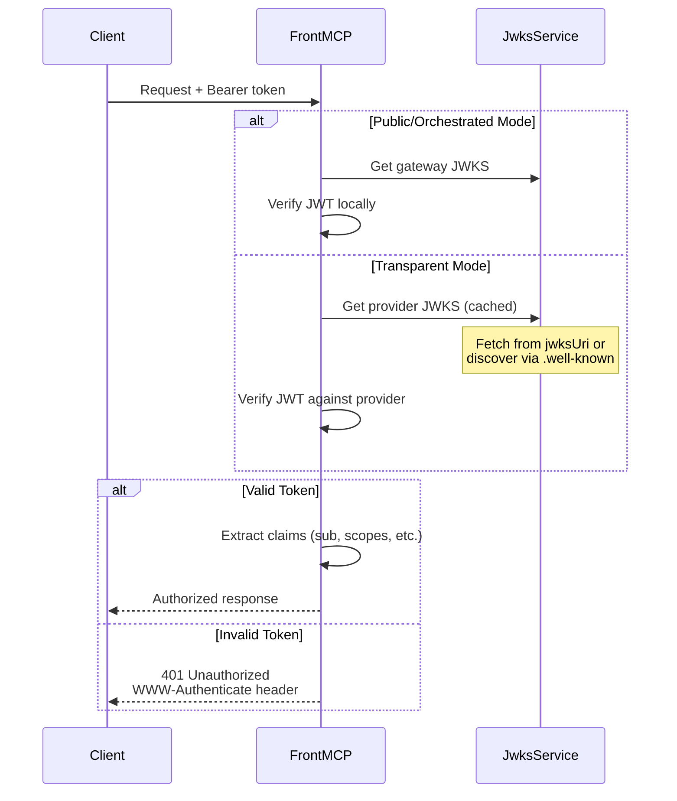

FrontMCP's three authentication modes address different deployment scenarios. Understanding when to use each mode is critical for both security and developer experience.

## Mode Overview



## Mode Comparison

| Feature            | Public         | Transparent       | Orchestrated           |
| ------------------ | -------------- | ----------------- | ---------------------- |
| Token Required     | No             | Yes (external)    | Yes (FrontMCP-issued)  |
| User Identity      | Anonymous      | From upstream IdP | From login or upstream |
| JWKS Source        | Self-generated | Upstream IdP      | Self-generated         |
| Session Management | Minimal        | Pass-through      | Full control           |
| Multi-provider     | No             | Single provider   | Multiple providers     |
| Progressive Auth   | No             | No                | Yes                    |
| Consent UI         | No             | No                | Optional               |

---

## Public Mode

No authentication required. All requests receive an anonymous session.

```typescript
const auth: AuthOptionsInput = {
  mode: 'public',
  sessionTtl: 3600, // 1 hour
  anonymousScopes: ['anonymous'],
};
```

### How It Works



### Configuration Options

| Option                   | Type                | Default         | Description                           |
| ------------------------ | ------------------- | --------------- | ------------------------------------- |
| `sessionTtl`             | `number`            | `3600`          | Session lifetime in seconds           |
| `anonymousScopes`        | `string[]`          | `['anonymous']` | Scopes assigned to anonymous sessions |
| `publicAccess.tools`     | `string[] \| 'all'` | `'all'`         | Tools accessible without auth         |
| `publicAccess.prompts`   | `string[] \| 'all'` | `'all'`         | Prompts accessible without auth       |
| `publicAccess.rateLimit` | `number`            | `60`            | Rate limit per IP per minute          |

### Use Cases

<CardGroup cols={2}>
  <Card title="Development" icon="code">
    Rapid prototyping without auth setup overhead
  </Card>
  <Card title="Public APIs" icon="globe">
    Endpoints that don't require user identity
  </Card>
</CardGroup>

<Warning>
  **Do NOT use public mode when you need:**
  - User identity tracking
  - Audit trails
  - Access control per user
  - Compliance requirements
</Warning>

---

## Transparent Mode

Pass-through tokens from an external identity provider. FrontMCP validates tokens but doesn't issue them.

```typescript
const auth: AuthOptionsInput = {
  mode: 'transparent',
  remote: {
    provider: 'https://auth.example.com',
    jwksUri: 'https://auth.example.com/.well-known/jwks.json',
  },
  expectedAudience: 'https://api.myservice.com',
  requiredScopes: ['openid'],
  allowAnonymous: false,
};
```

### How It Works



### Configuration Options

| Option             | Type                 | Default         | Description                          |
| ------------------ | -------------------- | --------------- | ------------------------------------ |
| `remote.provider`  | `string`             | Required        | Base URL of the IdP                  |
| `remote.jwksUri`   | `string`             | Auto-discovered | Custom JWKS endpoint                 |
| `remote.jwks`      | `JSONWebKeySet`      | -               | Inline JWKS for offline verification |
| `expectedAudience` | `string \| string[]` | Issuer URL      | Required audience claim value(s)     |
| `requiredScopes`   | `string[]`           | `[]`            | Scopes that must be present          |
| `allowAnonymous`   | `boolean`            | `false`         | Allow requests without tokens        |

### Provider Examples

<Tabs>
  <Tab title="Auth0">
    ```typescript
    auth: {
      mode: 'transparent',
      remote: {
        provider: 'https://your-tenant.auth0.com',
        // JWKS discovered automatically from /.well-known/jwks.json
      },
      expectedAudience: 'https://api.yourservice.com',
    }
    ```
  </Tab>
  <Tab title="Okta">
    ```typescript
    auth: {
      mode: 'transparent',
      remote: {
        provider: 'https://your-org.okta.com/oauth2/default',
      },
      expectedAudience: 'api://default',
    }
    ```
  </Tab>
  <Tab title="Azure AD">
    ```typescript
    auth: {
      mode: 'transparent',
      remote: {
        provider: 'https://login.microsoftonline.com/{tenant}/v2.0',
        jwksUri: 'https://login.microsoftonline.com/{tenant}/discovery/v2.0/keys',
      },
      expectedAudience: 'api://{client-id}',
    }
    ```
  </Tab>
</Tabs>

### Use Cases

<CardGroup cols={2}>
  <Card title="Existing IdP Integration" icon="plug">
    Your organization already uses Auth0, Okta, or similar
  </Card>
  <Card title="Single Provider" icon="1">
    All users authenticate through one identity provider
  </Card>
</CardGroup>

<Warning>
  **Do NOT use transparent mode when you need:**
  - Multiple identity providers
  - Progressive authorization (add apps over time)
  - Server-side token storage with silent refresh
  - Custom token claims
</Warning>

---

## Orchestrated Mode

FrontMCP acts as a full OAuth 2.1 authorization server. This mode has two types: **local** and **remote**.

### Local Type

Self-contained auth server with built-in user management.

```typescript
const auth: AuthOptionsInput = {
  mode: 'orchestrated',
  type: 'local',
  consent: { enabled: true },
  sessionMode: 'stateful',
  tokenStorage: { type: 'memory' }, // Use 'redis' in production
};
```

<Warning>
  The built-in login page accepts any email format without validation. Replace with a real identity provider for production use.
</Warning>

### Remote Type

Local auth server that proxies user authentication to an upstream IdP.

```typescript
const auth: AuthOptionsInput = {
  mode: 'orchestrated',
  type: 'remote',
  remote: {
    provider: 'https://auth.example.com',
    clientId: 'your-client-id',
    clientSecret: 'your-client-secret',
    scopes: ['openid', 'profile', 'email'],
  },
  consent: { enabled: true },
  sessionMode: 'stateful',
};
```

### How It Works



### Configuration Options

| Option               | Type                        | Default              | Description                      |
| -------------------- | --------------------------- | -------------------- | -------------------------------- |
| `type`               | `'local' \| 'remote'`       | Required             | Self-contained or upstream proxy |
| `consent`            | `ConsentConfig`             | `{ enabled: false }` | Consent UI configuration         |
| `sessionMode`        | `'stateful' \| 'stateless'` | `'stateful'`         | Token storage strategy           |
| `tokenStorage.type`  | `'memory' \| 'redis'`       | `'memory'`           | Storage backend                  |
| `allowDefaultPublic` | `boolean`                   | `false`              | Allow unauthenticated requests   |
| `federatedAuth`      | `FederatedAuthConfig`       | -                    | Federated auth state validation  |
| `incrementalAuth`    | `IncrementalAuthConfig`     | `{ enabled: true }`  | Progressive authorization        |

### Consent Configuration

```typescript
consent: {
  enabled: true,
  groupByApp: true,           // Group tools by app in UI
  showDescriptions: true,     // Show tool descriptions
  allowSelectAll: true,       // Allow selecting all tools
  requireSelection: true,     // Require at least one tool
  rememberConsent: true,      // Remember for future sessions
  excludedTools: ['health'],  // Always available tools
}
```

### Incremental Authorization

```typescript
incrementalAuth: {
  enabled: true,
  allowSkip: true,                    // Allow skipping app auth
  showAllAppsAtOnce: true,            // Show all apps in one page
  skippedAppBehavior: 'require-auth', // 'anonymous' or 'require-auth'
}
```

### Federated Authentication Configuration

Configure how state parameters are validated during federated (multi-provider) authentication flows.

```typescript
federatedAuth: {
  stateValidation: 'strict',  // 'strict' (recommended) or 'format'
}
```

| Option            | Values               | Description                                          |
| ----------------- | -------------------- | ---------------------------------------------------- |
| `stateValidation` | `'strict' \| 'format'` | `'strict'`: Full state match (recommended). `'format'`: Only validates state format |

### OAuth Endpoints

Orchestrated mode exposes standard OAuth endpoints:

| Endpoint                                  | Method | Description                 |
| ----------------------------------------- | ------ | --------------------------- |
| `/oauth/authorize`                        | GET    | Start authorization flow    |
| `/oauth/token`                            | POST   | Exchange code for tokens    |
| `/oauth/register`                         | POST   | Dynamic Client Registration |
| `/oauth/userinfo`                         | GET    | User profile information    |
| `/.well-known/oauth-authorization-server` | GET    | Server metadata             |
| `/.well-known/jwks.json`                  | GET    | Public signing keys         |

### Use Cases

<CardGroup cols={2}>
  <Card title="Multi-Provider Federation" icon="object-group">
    Combine multiple IdPs under one session (Slack + GitHub + custom)
  </Card>
  <Card title="Progressive Authorization" icon="chart-line">
    Users authorize apps incrementally as needed
  </Card>
  <Card title="Full Token Control" icon="sliders">
    Custom token lifetimes, scopes, and refresh behavior
  </Card>
  <Card title="Built-in Consent UI" icon="list-check">
    Let users choose which tools/resources to grant
  </Card>
</CardGroup>

<Warning>
  **Do NOT use orchestrated mode when:**
  - You only have one IdP and don't need federation
  - You want to minimize auth complexity
  - Running multiple instances without Redis
</Warning>

---

## Mode Selection Flowchart



---

## Security Comparison

| Security Aspect        | Public         | Transparent           | Orchestrated       |
| ---------------------- | -------------- | --------------------- | ------------------ |
| Token Verification     | None           | Against upstream JWKS | Against local JWKS |
| PKCE Support           | N/A            | Depends on IdP        | Always S256        |
| Refresh Token Rotation | N/A            | Depends on IdP        | Always rotated     |
| Key Management         | Auto-generated | Upstream-managed      | Self-managed       |
| Consent UI             | No             | No                    | Optional           |
| Session Revocation     | N/A            | N/A                   | Supported          |

---

## Token Verification Flow



---

## Next Steps

<CardGroup cols={2}>
  <Card title="Remote OAuth" icon="cloud" href="/docs/authentication/remote">
    Configure upstream IdP integration
  </Card>
  <Card title="Local OAuth" icon="server" href="/docs/authentication/local">
    Set up self-contained authentication
  </Card>
  <Card title="Progressive Authorization" icon="forward" href="/docs/authentication/progressive">
    Implement incremental app authorization
  </Card>
  <Card title="Production Deployment" icon="rocket" href="/docs/authentication/production">
    Security checklist for production
  </Card>
</CardGroup>
