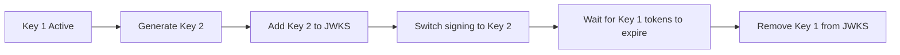

Before deploying FrontMCP authentication to production, review this comprehensive checklist covering security, configuration, and operational requirements.

## Pre-Deployment Checklist

<Steps>
  <Step title="Configure Persistent Token Storage">
    Replace in-memory storage with Redis or another persistent store.

    ```typescript
    auth: {
      mode: 'orchestrated',
      type: 'local',
      tokenStorage: {
        type: 'redis',
        config: {
          host: process.env.REDIS_HOST!,
          port: parseInt(process.env.REDIS_PORT || '6379'),
          password: process.env.REDIS_PASSWORD,
          tls: true,
        },
      },
    }
    ```

  </Step>

  <Step title="Provide Persistent Signing Keys">
    Auto-generated keys are lost on restart. Provide stable keys.

    ```typescript
    auth: {
      local: {
        signKey: JSON.parse(process.env.JWT_SIGNING_KEY),
      },
    }
    ```

  </Step>

  <Step title="Configure Token Lifetimes">
    Set appropriate token expiration based on security requirements.

    ```typescript
    auth: {
      refresh: {
        accessTokenTtl: 900,      // 15 minutes
        refreshTokenTtl: 604800,  // 7 days
        rotateRefreshToken: true,
      },
    }
    ```

  </Step>

  <Step title="Enable HTTPS">
    All production traffic must use TLS. Configure your reverse proxy or load balancer.
  </Step>

  <Step title="Set Expected Audience">
    For transparent mode, always validate the audience claim.

    ```typescript
    auth: {
      mode: 'transparent',
      expectedAudience: 'https://api.yourservice.com',
    }
    ```

  </Step>
</Steps>

---

## Security Requirements

### Required

<Check>**HTTPS only** - Never expose auth endpoints over HTTP in production</Check>
<Check>**Persistent token storage** - Redis with TLS for multi-instance deployments</Check>
<Check>**Stable signing keys** - Provide keys via environment or secrets manager</Check>
<Check>**PKCE enforcement** - OAuth 2.1 requires PKCE (S256 only)</Check>
<Check>**Refresh token rotation** - Always rotate refresh tokens on use</Check>
<Check>**Audience validation** - Validate `aud` claim in transparent mode</Check>

### Recommended

<Check>**Rate limiting** - Protect token endpoints from brute force</Check>
<Check>**Monitoring** - Alert on auth failures, unusual patterns</Check>
<Check>**Key rotation** - Rotate signing keys periodically (30-90 days)</Check>
<Check>**Scope minimization** - Request only necessary scopes</Check>
<Check>**Consent UI** - Let users see what they're authorizing</Check>

---

## Configuration Reference

### Minimum Production Configuration

```typescript
import { FrontMcp } from '@frontmcp/sdk';

@FrontMcp({
  info: { name: 'ProductionServer', version: '1.0.0' },
  auth: {
    mode: 'orchestrated',
    type: 'local',
    sessionMode: 'stateful',

    // Persistent storage
    tokenStorage: {
      type: 'redis',
      config: {
        host: process.env.REDIS_HOST!,
        port: parseInt(process.env.REDIS_PORT || '6379'),
        password: process.env.REDIS_PASSWORD,
        tls: true,
        keyPrefix: 'auth:',
      },
    },

    // Stable keys
    local: {
      signKey: JSON.parse(process.env.JWT_SIGNING_KEY!),
    },

    // Token refresh settings
    refresh: {
      enabled: true,
      skewSeconds: 60,
    },

    // Security
    consent: { enabled: true },
  },
})
export class Server {}
```

### Environment Variables

```bash
# Required for Redis
REDIS_HOST=redis.example.com
REDIS_PORT=6379
REDIS_PASSWORD=your-redis-password

# Required for token signing
JWT_SIGNING_KEY='{"kty":"RSA","kid":"prod-key-1",...}'

# For remote/transparent mode
IDP_PROVIDER_URL=https://auth.example.com
IDP_CLIENT_ID=your-client-id
IDP_CLIENT_SECRET=your-client-secret
IDP_EXPECTED_AUDIENCE=https://api.yourservice.com
```

---

## Token Lifetime Guidelines

| Environment   | Access Token | Refresh Token | Rationale                |
| ------------- | ------------ | ------------- | ------------------------ |
| Development   | 1 hour       | 7 days        | Developer convenience    |
| Staging       | 30 min       | 7 days        | Balance testing/security |
| Production    | 15 min       | 7-30 days     | Security with usability  |
| High Security | 5 min        | 1 day         | Minimize exposure window |

<Tip>
  Shorter access tokens improve security but increase refresh frequency. Monitor your refresh token endpoint load.
</Tip>

---

## Key Management

### Generating Production Keys

```bash
# Generate RS256 key pair
openssl genrsa -out private.pem 2048
openssl rsa -in private.pem -pubout -out public.pem

# Convert to JWK format (use a tool like step-cli)
step crypto jwk create --kty RSA --use sig --alg RS256 \
  public.jwk private.jwk
```

### Key Rotation Strategy



### Configuration for Key Rotation

```typescript
auth: {
  local: {
    signKey: currentKey,
    keyRotationDays: 30,
    maxKeys: 3, // Keep old keys for validation during rotation
  },
}
```

---

## Redis Configuration

### Secure Redis Connection

```typescript
tokenStorage: {
  type: 'redis',
  config: {
    host: 'redis.example.com',
    port: 6379,
    password: process.env.REDIS_PASSWORD,
    tls: true,
    keyPrefix: 'frontmcp:auth:',
  },
}
```

### Redis Data Stored

| Key Pattern               | Data                  | TTL          |
| ------------------------- | --------------------- | ------------ |
| `{prefix}pending:{id}`    | Pending authorization | 10 min       |
| `{prefix}code:{code}`     | Authorization code    | 60 sec       |
| `{prefix}refresh:{token}` | Refresh token         | 7-30 days    |
| `{prefix}session:{id}`    | Session data          | Configurable |
| `{prefix}vault:{session}` | Token vault           | Session TTL  |

---

## Monitoring & Alerting

### Key Metrics to Monitor

| Metric                  | Alert Threshold | Description             |
| ----------------------- | --------------- | ----------------------- |
| Auth failures/min       | > 100           | Possible brute force    |
| Token refresh rate      | > 10x normal    | Possible token theft    |
| JWKS fetch errors       | Any             | IdP connectivity issue  |
| Redis connection errors | Any             | Storage unavailable     |
| Token issuance latency  | > 500ms         | Performance degradation |

### Logging Configuration

```typescript
import { FrontMcp, LogLevel } from '@frontmcp/sdk';

@FrontMcp({
  info: { name: 'Server', version: '1.0.0' },
  logging: {
    level: LogLevel.INFO,
    // Don't log tokens or secrets
    redact: ['access_token', 'refresh_token', 'client_secret'],
  },
})
export class Server {}
```

---

## Common Production Issues

<AccordionGroup>
  <Accordion title="Tokens invalid after deployment">
    **Cause:** Auto-generated keys changed after restart.

    **Solution:** Provide persistent signing keys via environment variable:
    ```typescript
    local: {
      signKey: JSON.parse(process.env.JWT_SIGNING_KEY!),
    }
    ```

  </Accordion>

  <Accordion title="Session not found errors across instances">
    **Cause:** Using in-memory storage with multiple instances.

    **Solution:** Configure shared Redis storage:
    ```typescript
    tokenStorage: {
      type: 'redis',
      config: {
        host: process.env.REDIS_HOST!,
        port: parseInt(process.env.REDIS_PORT || '6379'),
        password: process.env.REDIS_PASSWORD,
      },
    }
    ```

  </Accordion>

  <Accordion title="JWKS fetch fails intermittently">
    **Cause:** Network issues or IdP rate limiting.

    **Solution:**
    - Increase JWKS cache TTL
    - Consider inline JWKS for critical IdPs
    - Add retry logic with exponential backoff

  </Accordion>

  <Accordion title="High latency on token endpoint">
    **Cause:** Redis connection issues or key generation overhead.

    **Solution:**
    - Use Redis connection pooling
    - Pre-generate signing keys (don't generate on-demand)
    - Monitor Redis latency

  </Accordion>
</AccordionGroup>

---

## Security Hardening

### Disable Insecure Options

```typescript
auth: {
  mode: 'orchestrated',
  type: 'local',

  // Production settings
  allowDefaultPublic: false,   // No anonymous access
  dcrEnabled: false,           // Disable DCR in production

  // Use orchestrated mode login page or remote IdP
  // Never use the demo login page in production
}
```

### HTTP Security Headers

Configure your reverse proxy to add security headers:

```nginx
# Example nginx configuration
add_header Strict-Transport-Security "max-age=31536000; includeSubDomains" always;
add_header X-Content-Type-Options "nosniff" always;
add_header X-Frame-Options "DENY" always;
add_header Content-Security-Policy "default-src 'self'" always;
```

### Rate Limiting

```nginx
# Rate limit token endpoint
location /oauth/token {
    limit_req zone=token_limit burst=10 nodelay;
    proxy_pass http://backend;
}
```

---

## Deployment Patterns

<Tabs>
  <Tab title="Single Instance">
    ```typescript
    // Simple deployment - in-memory works but not recommended
    auth: {
      tokenStorage: { type: 'memory' }, // Data lost on restart
    }
    ```

    <Warning>
      In-memory storage loses all sessions on restart. Users must re-authenticate.
    </Warning>

  </Tab>

  <Tab title="Multi-Instance">
    ```typescript
    // Required for horizontal scaling
    auth: {
      sessionMode: 'stateful',
      tokenStorage: {
        type: 'redis',
        config: {
          host: process.env.REDIS_HOST!,
          port: parseInt(process.env.REDIS_PORT || '6379'),
          password: process.env.REDIS_PASSWORD,
        },
      },
    }
    ```

    All instances must share the same Redis and signing keys.

  </Tab>

  <Tab title="Stateless">
    ```typescript
    // No shared state needed - tokens contain all info
    auth: {
      sessionMode: 'stateless',
      local: {
        signKey: JSON.parse(process.env.JWT_SIGNING_KEY!),
      },
    }
    ```

    Simpler architecture but larger tokens, no silent refresh.

  </Tab>
</Tabs>

---

## Quick Reference

### OAuth 2.1 Compliance Checklist

<Check>PKCE required for all clients (S256 only)</Check>
<Check>Refresh token rotation enabled</Check>
<Check>No implicit grant flow</Check>
<Check>Authorization codes single-use</Check>
<Check>Redirect URI exact match</Check>
<Check>State parameter required</Check>

### Pre-Production Verification

```bash
# Test token endpoint
curl -X POST https://your-server/oauth/token \
  -d "grant_type=authorization_code" \
  -d "code=test-code" \
  -d "client_id=your-client" \
  -d "code_verifier=verifier"

# Verify JWKS endpoint
curl https://your-server/.well-known/jwks.json

# Check server metadata
curl https://your-server/.well-known/oauth-authorization-server
```

---

## Next Steps

<CardGroup cols={2}>
  <Card title="Authorization Modes" icon="layer-group" href="/docs/authentication/modes">
    Choose the right mode for your deployment
  </Card>
  <Card title="Tokens & Sessions" icon="key" href="/docs/authentication/token">
    Configure token lifetimes and storage
  </Card>
  <Card title="Local OAuth" icon="server" href="/docs/authentication/local">
    Built-in OAuth server setup
  </Card>
  <Card title="Remote OAuth" icon="cloud" href="/docs/authentication/remote">
    External IdP integration
  </Card>
</CardGroup>
