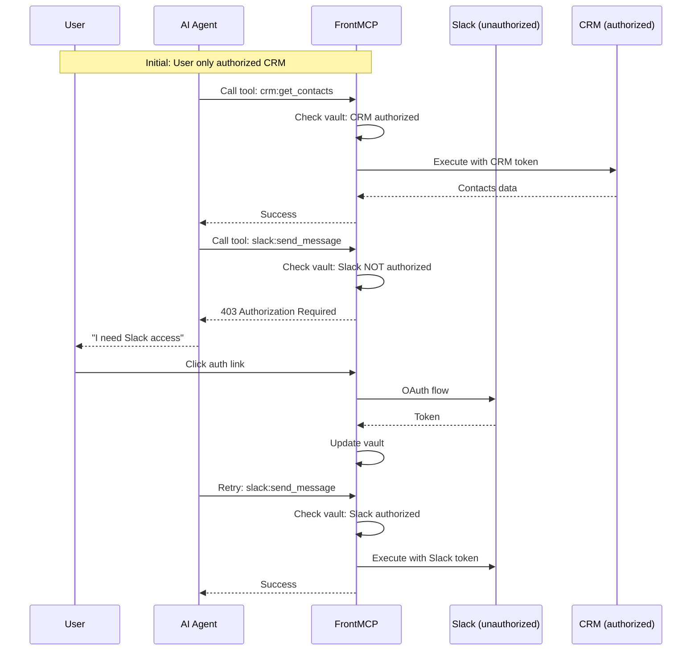
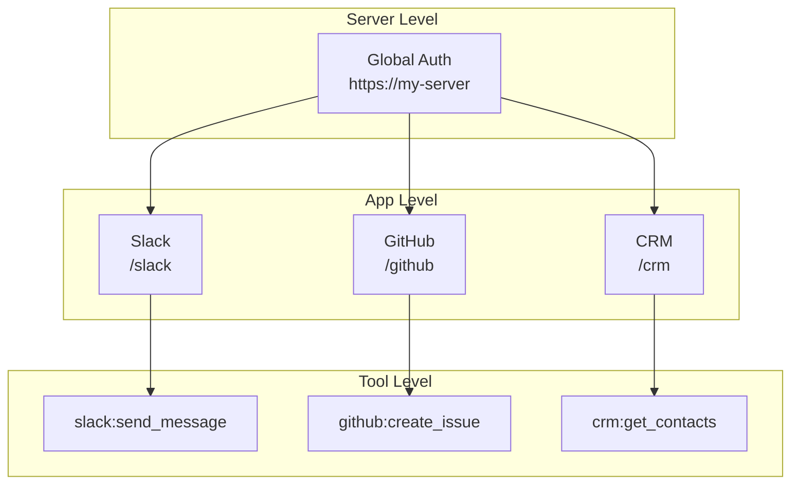

Progressive authorization allows users to authorize apps incrementally, rather than all at once. This improves UX by only requesting access when tools actually need it.

## How It Works



---

## Configuration

Enable progressive auth with orchestrated mode:

```typescript
@FrontMcp({
  info: { name: 'MyServer', version: '1.0.0' },
  auth: {
    mode: 'orchestrated',
    type: 'local',
    consent: { enabled: true }, // Enable consent UI
    sessionMode: 'stateful', // Required for token vault
  },
  apps: [SlackApp, GitHubApp, CrmApp],
})
export class Server {}
```

---

## Authorization Hierarchy

Progressive auth operates at three levels:



---

## Token Vault

The token vault stores per-app credentials and expands as users authorize more apps:

<CardGroup cols={3}>
  <Card title="Initial State" icon="1">
    Session Token: `user-123`

    **Vault:**
    - CRM: Authorized

  </Card>
  <Card title="After Slack Auth" icon="2">
    Session Token: `user-123` (same)

    **Vault:**
    - CRM: Authorized
    - Slack: Authorized

  </Card>
  <Card title="After GitHub Auth" icon="3">
    Session Token: `user-123` (same)

    **Vault:**
    - CRM: Authorized
    - Slack: Authorized
    - GitHub: Authorized

  </Card>
</CardGroup>

<Info>
  The session token remains the same. Only the token vault expands with new app credentials.
</Info>

---

## Authorization Response

When a tool requires unauthorized access, FrontMCP returns:

```json
{
  "error": "authorization_required",
  "code": "AUTH_REQUIRED",
  "app": "slack",
  "tool": "slack:send_message",
  "required_scopes": ["chat:write"],
  "auth_url": "https://my-server/oauth/authorize?app=slack&scope=chat:write",
  "message": "Slack authorization required",
  "hint": "Click the authorization link to grant access to Slack"
}
```

### Handling in Clients

```typescript
try {
  const result = await mcpClient.callTool('slack:send_message', { message: 'Hello' });
} catch (error) {
  if (error.code === 'AUTH_REQUIRED') {
    // Show auth link to user
    console.log(`Please authorize: ${error.auth_url}`);
  }
}
```

---

## Consent UI

The built-in consent UI lets users choose which apps to authorize:

```
+----------------------------------------------------------+
|                    Authorize Access                        |
|                                                            |
|  MyApp requests access to the following services:          |
|                                                            |
|  +------------------------------------------------------+  |
|  |  CRM (Auth0)                           [Authorized]  |  |
|  |  Tools: get_contacts, update_contact                 |  |
|  +------------------------------------------------------+  |
|                                                            |
|  +------------------------------------------------------+  |
|  |  Slack                                    [Skipped]  |  |
|  |  Tools: send_message, list_channels                  |  |
|  |                                                      |  |
|  |  [ Authorize Later ]                                 |  |
|  +------------------------------------------------------+  |
|                                                            |
|  +------------------------------------------------------+  |
|  |  GitHub                                   [Pending]  |  |
|  |  Tools: create_issue, list_repos                     |  |
|  |                                                      |  |
|  |  [ Authorize ]  [ Skip ]                             |  |
|  +------------------------------------------------------+  |
|                                                            |
|            [ Continue with authorized apps ]               |
+----------------------------------------------------------+
```

---

## Multi-Provider Setup

### App Configuration

```typescript
@App({
  name: 'Slack',
  auth: {
    mode: 'transparent',
    remote: {
      provider: 'https://slack.com/oauth',
      scopes: ['chat:write', 'channels:read'],
    },
  },
})
export class SlackApp {
  @Tool({ name: 'send_message' })
  async sendMessage(ctx: ToolContext, input: { message: string }) {
    // Uses Slack token from vault
  }
}

@App({
  name: 'GitHub',
  auth: {
    mode: 'transparent',
    remote: {
      provider: 'https://github.com/login/oauth',
      scopes: ['repo', 'user'],
    },
  },
})
export class GitHubApp {
  @Tool({ name: 'create_issue' })
  async createIssue(ctx: ToolContext, input: { title: string }) {
    // Uses GitHub token from vault
  }
}
```

### Server Configuration

```typescript
@FrontMcp({
  info: { name: 'AgentSuite', version: '1.0.0' },
  auth: {
    mode: 'orchestrated',
    type: 'local',
    consent: { enabled: true },
    sessionMode: 'stateful',
    tokenStorage: {
      type: 'redis',
      config: {
        host: process.env.REDIS_HOST!,
        port: parseInt(process.env.REDIS_PORT || '6379'),
      },
    },
  },
  apps: [SlackApp, GitHubApp],
})
export class Server {}
```

---

## Standalone vs Nested Apps

Apps can be configured as standalone (direct access) or nested (under parent):

| Configuration                 | Direct Access            | Federated Auth         |
| ----------------------------- | ------------------------ | ---------------------- |
| `standalone: true`            | `/slack/oauth/authorize` | Also in parent consent |
| `standalone: false` (default) | N/A                      | Only via parent        |

```typescript
@App({
  name: 'Slack',
  standalone: true, // Direct access at /slack
  auth: { /* ... */ },
})
export class SlackApp {}
```

---

## Skip and Authorize Later

Users can skip apps during initial consent and authorize later:

### Skipping

```typescript
// User skips Slack during initial auth
// Session created with: authorized_apps: ['crm'], skipped_apps: ['slack']
```

### Later Authorization

```
GET /oauth/authorize?app=slack&prompt=consent
```

This triggers a targeted authorization flow for just the skipped app.

---

## Session Token Structure

```json
{
  "sub": "user-123",
  "iss": "https://my-server",
  "iat": 1234567890,
  "exp": 1234571490,
  "session_id": "sess_abc123",
  "authorized_apps": ["crm", "billing"],
  "pending_apps": ["slack", "github"],
  "scopes": ["crm:read", "crm:write", "billing:read"]
}
```

<Warning>
  Child tokens are stored in the Token Vault (server-side), not embedded in the JWT.
</Warning>

---

## OpenAPI Adapter Integration

When using OpenAPI adapters, tools are automatically grouped by auth provider:

```typescript
@FrontMcp({
  info: { name: 'APIGateway', version: '1.0.0' },
  auth: {
    mode: 'orchestrated',
    type: 'local',
    consent: { enabled: true },
  },
  adapters: [
    {
      type: 'openapi',
      spec: 'https://api.github.com/openapi.json',
      auth: {
        mode: 'transparent',
        remote: {
          provider: 'https://github.com',
          clientId: 'github-client-id',
        },
      },
    },
    {
      type: 'openapi',
      spec: 'https://api.stripe.com/openapi.json',
      auth: {
        mode: 'transparent',
        remote: {
          provider: 'https://connect.stripe.com',
          clientId: 'stripe-client-id',
        },
      },
    },
  ],
})
export class Server {}
```

Tools from each adapter are grouped by their auth configuration and appear in the consent UI accordingly.

---

## Best Practices

<Check>**Request minimal scopes** - Only ask for what each tool needs</Check>
<Check>**Provide clear descriptions** - Users should understand why each app is needed</Check>
<Check>**Handle auth errors gracefully** - Show friendly messages with auth links</Check>
<Check>**Use stateful sessions** - Required for token vault to work</Check>
<Check>**Test the skip flow** - Ensure skipped apps can be authorized later</Check>

---

## Troubleshooting

<AccordionGroup>
  <Accordion title="Token vault not updating">
    - Ensure `sessionMode: 'stateful'` is configured
    - Check Redis connectivity if using Redis storage
    - Verify the session ID matches across requests
  </Accordion>
  <Accordion title="Auth link not working">
    - Check the `auth_url` includes correct app and scope parameters
    - Verify the app is registered with the server
    - Ensure redirect URIs are configured correctly
  </Accordion>
  <Accordion title="Skipped apps won't authorize">
    - Use `prompt=consent` to force the consent screen
    - Check that the app wasn't excluded via `excludeFromParent`
  </Accordion>
</AccordionGroup>

---

## Next Steps

<CardGroup cols={2}>
  <Card title="Remote OAuth" icon="cloud" href="/docs/authentication/remote">
    Configure external identity providers
  </Card>
  <Card title="Tokens & Sessions" icon="key" href="/docs/authentication/token">
    Token lifecycle and session management
  </Card>
  <Card title="Production Checklist" icon="clipboard-check" href="/docs/authentication/production">
    Security requirements for deployment
  </Card>
  <Card title="Authorization Modes" icon="layer-group" href="/docs/authentication/modes">
    Choose the right auth mode
  </Card>
</CardGroup>
