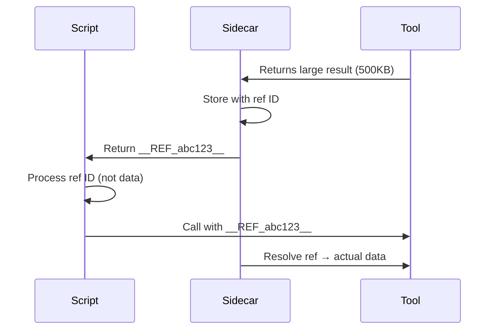

This page covers all configuration options for the CodeCall plugin, from quick presets to fine-grained control.

---

## Plugin Initialization

```ts
import { CodeCallPlugin } from '@frontmcp/plugins';

CodeCallPlugin.init({
  // Tool visibility mode
  mode: 'codecall_only' | 'codecall_opt_in' | 'metadata_driven',

  // VM/sandbox configuration
  vm: { /* ... */ },

  // Embedding/search configuration
  embedding: { /* ... */ },

  // Tool filtering
  includeTools: (tool) => boolean,

  // Direct invoke configuration
  directCalls: { /* ... */ },
});
```

---

## Tool Visibility Modes

Control which tools appear in `list_tools` vs. CodeCall.

### `codecall_only` (Recommended)

**Default mode.** Hides all tools from `list_tools`, exposes via CodeCall.

```ts
CodeCallPlugin.init({
  mode: 'codecall_only',
});
```

| Tool Location | Behavior |
|---------------|----------|
| `list_tools` | Only CodeCall meta-tools visible |
| CodeCall | All tools searchable and callable |
| Override | Set `visibleInListTools: true` per tool |

**Best for:** Large toolsets (20+), OpenAPI adapters, clean client experience.

### `codecall_opt_in`

Tools must explicitly opt into CodeCall. All tools visible in `list_tools` by default.

```ts
CodeCallPlugin.init({
  mode: 'codecall_opt_in',
});
```

| Tool Location | Behavior |
|---------------|----------|
| `list_tools` | All tools visible (default MCP behavior) |
| CodeCall | Only tools with `enabledInCodeCall: true` |

**Best for:** Gradual migration, mixed direct/CodeCall access.

### `metadata_driven`

Full control via per-tool metadata. No global assumptions.

```ts
CodeCallPlugin.init({
  mode: 'metadata_driven',
});
```

| Tool Location | Behavior |
|---------------|----------|
| `list_tools` | Based on `visibleInListTools` (default: true) |
| CodeCall | Based on `enabledInCodeCall` (default: false) |

**Best for:** Small toolsets, fine-grained control.

---

## Per-Tool Metadata

Control individual tool behavior with the `codecall` metadata field:

```ts
@Tool({
  name: 'users:list',
  description: 'List all users',
  codecall: {
    // Is this tool searchable and callable via CodeCall?
    enabledInCodeCall: true,  // default depends on mode

    // Is this tool visible in standard list_tools?
    visibleInListTools: false,  // default depends on mode

    // App ID for multi-app filtering (auto-detected if not set)
    appId: 'user-service',
  },
})
```

### Metadata by Mode

| Mode | `enabledInCodeCall` default | `visibleInListTools` default |
|------|----------------------------|------------------------------|
| `codecall_only` | `true` | `false` |
| `codecall_opt_in` | `false` | `true` |
| `metadata_driven` | `false` | `true` |

### Common Patterns

<AccordionGroup>
  <Accordion title="Hide from list_tools, available in CodeCall">
    ```ts
    codecall: {
      enabledInCodeCall: true,
      visibleInListTools: false,
    }
    ```
    Use for: Most tools in `codecall_only` mode.
  </Accordion>

  <Accordion title="Visible everywhere">
    ```ts
    codecall: {
      enabledInCodeCall: true,
      visibleInListTools: true,
    }
    ```
    Use for: Core tools that should be directly accessible AND in CodeCall.
  </Accordion>

  <Accordion title="Direct access only, no CodeCall">
    ```ts
    codecall: {
      enabledInCodeCall: false,
      visibleInListTools: true,
    }
    ```
    Use for: Admin tools, destructive operations, tools requiring human review.
  </Accordion>

  <Accordion title="CodeCall meta-tools only">
    ```ts
    codecall: {
      enabledInCodeCall: false,
      visibleInListTools: true,
    }
    ```
    Applied automatically to `codecall:search`, `codecall:describe`, etc.
  </Accordion>
</AccordionGroup>

---

## Global Tool Filtering

Filter tools globally with `includeTools`:

```ts
CodeCallPlugin.init({
  mode: 'codecall_only',

  // Only include tools matching this filter
  includeTools: (tool) => {
    // Exclude admin tools
    if (tool.name.startsWith('admin:')) return false;

    // Exclude destructive tools
    if (tool.metadata?.annotations?.destructiveHint) return false;

    // Include everything else
    return true;
  },
});
```

The filter receives a `ToolEntry` with:

```ts
interface ToolEntry {
  name: string;
  fullName: string;
  metadata?: {
    description?: string;
    annotations?: {
      destructiveHint?: boolean;
      idempotentHint?: boolean;
      readOnlyHint?: boolean;
    };
    codecall?: {
      enabledInCodeCall?: boolean;
      visibleInListTools?: boolean;
      appId?: string;
    };
  };
  owner?: { id: string };
}
```

---

## VM Configuration

Configure the JavaScript sandbox:

```ts
CodeCallPlugin.init({
  vm: {
    // Use a preset (recommended)
    preset: 'secure',

    // Or override individual settings
    timeoutMs: 5000,
    maxIterations: 10000,
    allowConsole: true,

    // Blocked identifiers (in addition to preset)
    disabledBuiltins: ['eval', 'Function'],
    disabledGlobals: ['process', 'require'],
  },
});
```

### VM Presets

| Preset | Timeout | Max Iterations | Console | Use Case |
|--------|---------|----------------|---------|----------|
| `locked_down` | 2s | 2,000 | No | Ultra-sensitive environments |
| `secure` | 3.5s | 5,000 | Yes | **Production default** |
| `balanced` | 5s | 10,000 | Yes | Complex workflows |
| `experimental` | 10s | 20,000 | Yes | Development only |

### Preset Details

<Tabs>
  <Tab title="locked_down">
    ```ts
    {
      preset: 'locked_down',
      timeoutMs: 2000,
      maxIterations: 2000,
      allowConsole: false,
      allowLoops: false,  // Only for-of allowed
      disabledBuiltins: ['eval', 'Function', 'AsyncFunction'],
      disabledGlobals: [
        'require', 'process', 'fetch',
        'setTimeout', 'setInterval', 'setImmediate',
        'global', 'globalThis'
      ],
    }
    ```
    **When to use:** Healthcare, finance, PII processing, compliance-heavy environments.
  </Tab>

  <Tab title="secure">
    ```ts
    {
      preset: 'secure',
      timeoutMs: 3500,
      maxIterations: 5000,
      allowConsole: true,
      allowLoops: false,  // Only for-of allowed
      disabledBuiltins: ['eval', 'Function', 'AsyncFunction'],
      disabledGlobals: [
        'require', 'process', 'fetch',
        'setTimeout', 'setInterval', 'setImmediate',
        'global', 'globalThis'
      ],
    }
    ```
    **When to use:** Most production deployments.
  </Tab>

  <Tab title="balanced">
    ```ts
    {
      preset: 'balanced',
      timeoutMs: 5000,
      maxIterations: 10000,
      allowConsole: true,
      allowLoops: true,  // for, for-of, while allowed
      disabledBuiltins: ['eval', 'Function', 'AsyncFunction'],
      disabledGlobals: ['require', 'process', 'fetch'],
    }
    ```
    **When to use:** Complex data processing, trusted model access.
  </Tab>

  <Tab title="experimental">
    ```ts
    {
      preset: 'experimental',
      timeoutMs: 10000,
      maxIterations: 20000,
      allowConsole: true,
      allowLoops: true,
      disabledBuiltins: ['eval', 'Function', 'AsyncFunction'],
      disabledGlobals: ['require', 'process'],
    }
    ```
    **When to use:** Development, testing, trusted internal tools.
  </Tab>
</Tabs>

### Worker Pool Configuration (Advanced)

For OS-level memory isolation, configure the Worker Pool adapter:

```ts
CodeCallPlugin.init({
  vm: {
    preset: 'secure',
    adapter: 'worker_threads',  // Enable Worker Pool

    workerPool: {
      minWorkers: 2,              // Minimum warm workers
      maxWorkers: 8,              // Maximum concurrent workers
      memoryLimitPerWorker: 128 * 1024 * 1024,  // 128MB per worker
      maxExecutionsPerWorker: 500,  // Recycle after N executions
      maxMessagesPerSecond: 500,    // Rate limit per worker
      maxPendingToolCalls: 50,      // Max concurrent tool calls
      idleTimeoutMs: 30000,         // Release idle workers after 30s
      queueTimeoutMs: 20000,        // Max queue wait time
      maxQueueSize: 50,             // Max pending executions
    },
  },
});
```

#### Worker Pool Presets by Security Level

| Config | STRICT | SECURE | STANDARD | PERMISSIVE |
|--------|--------|--------|----------|------------|
| minWorkers | 2 | 2 | 2 | 4 |
| maxWorkers | 4 | 8 | 16 | 32 |
| memoryLimitPerWorker | 64MB | 128MB | 256MB | 512MB |
| maxExecutionsPerWorker | 100 | 500 | 1,000 | 5,000 |
| maxMessagesPerSecond | 100 | 500 | 1,000 | 5,000 |
| maxPendingToolCalls | 10 | 50 | 100 | 1,000 |
| maxQueueSize | 20 | 50 | 100 | 500 |
| maxMessageSizeBytes | 1MB | 4MB | 16MB | 64MB |

### Reference Sidecar Configuration (Pass-by-Reference)

The Reference Sidecar handles large data transfer between scripts and tools. Instead of passing full data through the VM, large values are stored externally with reference IDs.

```ts
CodeCallPlugin.init({
  vm: {
    preset: 'secure',

    sidecar: {
      maxTotalSize: 64 * 1024 * 1024,     // 64MB total storage
      maxReferenceSize: 16 * 1024 * 1024,  // 16MB per reference
      extractionThreshold: 256 * 1024,     // Extract strings > 256KB
      maxResolvedSize: 32 * 1024 * 1024,   // 32MB max when resolving
      maxReferenceCount: 100,              // Max 100 references
      maxResolutionDepth: 10,              // Max nesting depth
      allowComposites: false,              // Block reference concatenation
    },
  },
});
```

#### Sidecar Presets by Security Level

| Config | STRICT | SECURE | STANDARD | PERMISSIVE |
|--------|--------|--------|----------|------------|
| maxTotalSize | 16MB | 64MB | 256MB | 1GB |
| maxReferenceSize | 4MB | 16MB | 64MB | 256MB |
| extractionThreshold | 64KB | 256KB | 1MB | 4MB |
| maxResolvedSize | 8MB | 32MB | 128MB | 512MB |
| maxReferenceCount | 50 | 100 | 500 | 1,000 |
| maxResolutionDepth | 5 | 10 | 20 | 50 |
| allowComposites | No | No | Yes | Yes |

#### How Pass-by-Reference Works



**Benefits:**
- Scripts don't need to handle large data in memory
- VM stays lightweight and secure
- Tool results can exceed VM memory limits
- Reference IDs are opaque strings (no data leakage)

---

## Embedding Configuration

Configure how tools are indexed for search:

```ts
CodeCallPlugin.init({
  embedding: {
    // Search strategy
    strategy: 'tfidf' | 'embedding',

    // TF-IDF specific
    similarityThreshold: 0.3,

    // Embedding specific (requires VectoriaDB)
    modelName: 'Xenova/all-MiniLM-L6-v2',
    cacheDir: './.cache/transformers',
  },
});
```

### Strategy Comparison

| Strategy | Speed | Relevance | Setup | Best For |
|----------|-------|-----------|-------|----------|
| `tfidf` | ⚡ Fast | Good | None | Most use cases, offline |
| `embedding` | Slower | Better | Model download | Large toolsets (100+) |

### TF-IDF Configuration

```ts
embedding: {
  strategy: 'tfidf',
  similarityThreshold: 0.3,  // Minimum score to include in results
}
```

TF-IDF extracts searchable text from:
- Tool name (tokenized: `users:list` → `users`, `list`)
- Description (weighted 3x)
- Key terms from description (4+ characters, no stop words)

### Embedding Configuration

```ts
embedding: {
  strategy: 'embedding',
  modelName: 'Xenova/all-MiniLM-L6-v2',  // Default
  cacheDir: './.cache/transformers',
  useHNSW: true,  // For large toolsets (1000+)
}
```

<Note>
  Embedding strategy uses [VectoriaDB](/docs/guides/vectoriadb) internally. The model (~22MB) is downloaded on first use and cached locally.
</Note>

### Tool Search Tuning

Fine-tune how `codecall:search` finds and ranks tools:

```ts
CodeCallPlugin.init({
  embedding: {
    strategy: 'tfidf',

    search: {
      // Term weighting (higher = more important)
      weights: {
        name: 2.0,         // Tool name matches
        description: 3.0,  // Description matches (most important)
        tags: 2.0,         // Tag matches
      },

      // Stop words to ignore during tokenization
      stopWords: ['the', 'a', 'an', 'is', 'are', 'to', 'for'],

      // Minimum score to include in results
      minScore: 0.25,

      // Maximum results to return
      maxResults: 10,
    },
  },
});
```

#### Scoring Mechanics

When a user searches for "list users", the scoring works:

```
Tool: users:list
- Name match "users" + "list": 2.0 × 2 = 4.0
- Description "List all users in the system": 3.0 × 3 = 9.0
- Tags ["users", "list", "admin"]: 2.0 × 2 = 4.0
- Total: 17.0 (normalized)
```

#### Optimizing for Large Toolsets (100+)

For large toolsets, consider these optimizations:

```ts
CodeCallPlugin.init({
  embedding: {
    strategy: 'embedding',  // Better semantic matching

    search: {
      // Pre-filter by namespace before semantic search
      prefixFilter: true,

      // Use approximate nearest neighbor for speed
      useHNSW: true,
      hnswEfConstruction: 200,  // Index quality
      hnswEfSearch: 100,        // Search quality vs speed

      // Batch indexing for startup performance
      batchSize: 100,
    },
  },
});
```

---

## Direct Invocation

Configure the `codecall:invoke` meta-tool for direct tool calls without VM overhead:

```ts
CodeCallPlugin.init({
  directCalls: {
    // Enable/disable codecall:invoke
    enabled: true,

    // Optional: restrict to specific tools
    allowedTools: ['users:getById', 'billing:getInvoice'],

    // Optional: timeout for direct calls (default: 30s)
    timeoutMs: 30000,
  },
});
```

### When to Use Direct Invoke

| Use `codecall:invoke` | Use `codecall:execute` |
|-----------------------|------------------------|
| Single tool, no transformation | Multi-tool orchestration |
| Latency-critical paths | Data filtering/joining |
| Simple CRUD operations | Conditional logic |
| Known tool name | Dynamic tool selection |

### Performance Comparison

```
codecall:invoke (direct)
├─ Parse input: ~0.1ms
├─ Tool lookup: ~0.1ms
├─ Tool execution: ~varies
└─ Total overhead: ~0.2ms

codecall:execute (VM)
├─ Pre-scan: ~0.5ms
├─ AST validation: ~1-2ms
├─ Code transformation: ~0.5ms
├─ AI scoring: ~1ms (if enabled)
├─ VM execution: ~1-2ms
├─ Tool execution: ~varies
└─ Total overhead: ~4-6ms
```

### Error Response Format

```json
{
  "status": "error",
  "error": {
    "code": "TOOL_NOT_FOUND",
    "message": "Tool 'users:delete' is not in the allowed list",
    "tool": "users:delete",
    "allowedTools": ["users:getById", "billing:getInvoice"]
  }
}
```

### Security Considerations

<Warning>
  Direct invocation bypasses the AI Scoring Gate. Only enable for tools you trust completely.
</Warning>

- **allowedTools**: Always specify an explicit allowlist in production
- **No script execution**: Direct calls cannot run arbitrary code
- **Same tool access rules**: Tool Access Control (whitelist/blacklist) still applies
- **Audit logging**: Direct calls are logged the same as scripted calls

---

## Complete Configuration Example

```ts
import { App } from '@frontmcp/sdk';
import { CodeCallPlugin } from '@frontmcp/plugins';

@App({
  id: 'my-app',
  plugins: [
    CodeCallPlugin.init({
      // Hide all tools, expose via CodeCall
      mode: 'codecall_only',

      // Filter out admin and destructive tools
      includeTools: (tool) => {
        if (tool.name.startsWith('admin:')) return false;
        if (tool.metadata?.annotations?.destructiveHint) return false;
        return true;
      },

      // Secure sandbox with custom timeout
      vm: {
        preset: 'secure',
        timeoutMs: 5000,  // 5 second timeout
        allowConsole: true,
      },

      // Fast TF-IDF search
      embedding: {
        strategy: 'tfidf',
        similarityThreshold: 0.25,
      },

      // Enable direct invocation for simple calls
      directCalls: {
        enabled: true,
        allowedTools: ['users:getById', 'health:ping'],
      },
    }),
  ],
})
export default class MyApp {}
```

---

## Environment Variables

Override configuration via environment variables:

| Variable | Overrides | Example |
|----------|-----------|---------|
| `CODECALL_VM_TIMEOUT` | `vm.timeoutMs` | `5000` |
| `CODECALL_VM_PRESET` | `vm.preset` | `secure` |
| `CODECALL_EMBEDDING_STRATEGY` | `embedding.strategy` | `tfidf` |
| `CODECALL_MODE` | `mode` | `codecall_only` |

```bash
CODECALL_VM_TIMEOUT=10000 CODECALL_MODE=codecall_opt_in npm start
```

---

## Migration Guide

### From Direct Tools to CodeCall

<Steps>
  <Step title="Add CodeCallPlugin">
    ```ts
    plugins: [
      CodeCallPlugin.init({ mode: 'metadata_driven' }),
    ]
    ```
  </Step>

  <Step title="Mark Tools for CodeCall">
    ```ts
    @Tool({
      codecall: { enabledInCodeCall: true, visibleInListTools: true },
    })
    ```
  </Step>

  <Step title="Test Both Access Methods">
    Verify tools work via both direct calls and CodeCall.
  </Step>

  <Step title="Switch to codecall_only">
    ```ts
    CodeCallPlugin.init({ mode: 'codecall_only' })
    ```
  </Step>

  <Step title="Remove Direct Visibility">
    ```ts
    codecall: { enabledInCodeCall: true, visibleInListTools: false }
    ```
  </Step>
</Steps>

---

## Related

<CardGroup cols={2}>
  <Card title="Security Model" icon="shield" href="/docs/plugins/codecall/security">
    Security implications of configuration choices
  </Card>
  <Card title="Production Scaling" icon="server" href="/docs/plugins/codecall/scaling">
    Performance tuning and monitoring
  </Card>
</CardGroup>
