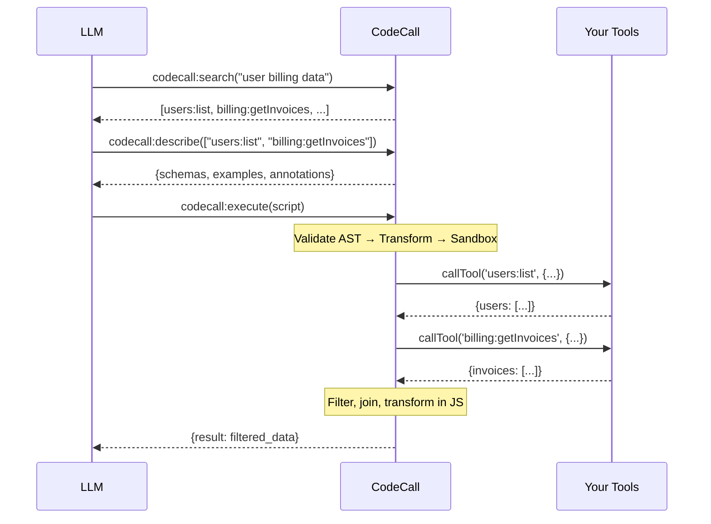

**CodeCall** transforms how LLMs interact with large toolsets. Instead of exposing hundreds of tool definitions that overwhelm the context window, CodeCall provides a small meta-API where the model discovers, describes, and orchestrates tools by writing JavaScript.


<CardGroup cols={2}>
  <Card title="Scalable Discovery" icon="magnifying-glass">
    Search across hundreds of tools using natural language with [VectoriaDB](/docs/guides/vectoriadb) embeddings
  </Card>
  <Card title="Code Orchestration" icon="code">
    LLMs write JavaScript to combine tools, filter data, and build workflows in a single execution
  </Card>
  <Card title="Bank-Grade Security" icon="shield-check">
    Defense-in-depth with [AST Guard](/docs/guides/ast-guard) validation and [Enclave](/docs/guides/enclave) sandboxing
  </Card>
  <Card title="Any LLM, Any Cloud" icon="server">
    Open source, self-hosted, works with any MCP-compatible client - not just Claude
  </Card>
</CardGroup>

---

## The Problem: Tool Explosion

As MCP servers grow, `list_tools` becomes unmanageable:

<Steps>
  <Step title="Early Days" icon="seedling">
    5-10 tools, clean schemas, instant model understanding
  </Step>
  <Step title="Growth Phase" icon="chart-line">
    Add OpenAPI adapters, multiple apps, per-tenant tools → 50-200+ tools
  </Step>
  <Step title="Pain Point" icon="triangle-exclamation">
    Context window fills with schemas, models struggle to find relevant tools, token costs explode
  </Step>
</Steps>

**The cost is real:**

- **Token waste**: Listing 100 tools with schemas can consume 20,000+ tokens before the first query
- **Discovery failure**: Models pick wrong tools or miss relevant ones buried in the list
- **No filtering**: Standard MCP can't filter results in-tool - you fetch everything, pay for all tokens, then filter
- **Round-trip latency**: Multi-tool workflows require model round-trips between each tool call

---

## The Solution: Code-First Meta-API

CodeCall collapses your entire toolset into **4 meta-tools**:

| Meta-Tool           | Purpose                                             |
| ------------------- | --------------------------------------------------- |
| `codecall:search`   | Find relevant tools by natural language query       |
| `codecall:describe` | Get detailed schemas for selected tools             |
| `codecall:execute`  | Run JavaScript that orchestrates multiple tools     |
| `codecall:invoke`   | Direct single-tool calls (optional, no VM overhead) |

### How It Works



**One round-trip** executes a complex workflow that would otherwise require multiple model invocations.

---

## Quick Start

<CodeGroup>
```bash npm
npm install @frontmcp/plugins
```
```bash pnpm
pnpm add @frontmcp/plugins
```
```bash yarn
yarn add @frontmcp/plugins
```
</CodeGroup>

```ts title="src/app.ts"
import { App, Tool, ToolContext } from '@frontmcp/sdk';
import { CodeCallPlugin } from '@frontmcp/plugins';

@Tool({
  name: 'users:list',
  description: 'List users with optional filtering',
  codecall: {
    enabledInCodeCall: true,     // Available in CodeCall scripts
    visibleInListTools: false,   // Hidden from standard list_tools
  },
})
class ListUsersTool extends ToolContext {
  async execute(input: { status?: string; limit?: number }) {
    // Your implementation
    return { users: [/* ... */] };
  }
}

@App({
  id: 'my-app',
  name: 'My Application',
  tools: [ListUsersTool],
  plugins: [
    CodeCallPlugin.init({
      mode: 'codecall_only',  // Recommended for large toolsets
      vm: {
        preset: 'secure',     // Bank-grade security defaults
      },
      embedding: {
        strategy: 'tfidf',    // Fast, no external API needed
      },
    }),
  ],
})
export default class MyApp {}
```

Now your MCP client sees only 4 tools instead of potentially hundreds:

```json
{
  "tools": [
    { "name": "codecall:search", "description": "Search for tools..." },
    { "name": "codecall:describe", "description": "Get tool schemas..." },
    { "name": "codecall:execute", "description": "Execute JavaScript plan..." },
    { "name": "codecall:invoke", "description": "Direct tool invocation..." }
  ]
}
```

---

## Why CodeCall Over Direct Tool Calls?

<AccordionGroup>
  <Accordion title="Token Efficiency" icon="coins">
    **Before:** List 100 tools → ~20,000 tokens in context
    **After:** 4 meta-tools → ~2,000 tokens, load schemas on-demand

    For a workflow fetching users and invoices:
    - **Direct calls**: 3+ model round-trips, each with full tool list
    - **CodeCall**: 1 round-trip, script handles orchestration

  </Accordion>

  <Accordion title="In-Tool Filtering" icon="filter">
    **The killer feature**: Filter, join, and transform data *inside the MCP server* instead of in the LLM context.

    ```js
    // This runs in CodeCall, not in the LLM
    const users = await callTool('users:list', { limit: 1000 });
    const active = users.filter(u =>
      u.status === 'active' &&
      u.firstName.startsWith('me') &&
      new Date(u.lastLogin) > tenDaysAgo
    );
    return active.slice(0, 10);
    ```

    Without CodeCall, you'd either:
    1. Build complex REST endpoints for every filter combination
    2. Fetch all 1000 users into LLM context (~50K tokens) and filter there
    3. Make multiple paginated calls with model round-trips

  </Accordion>

  <Accordion title="Any LLM Support" icon="globe">
    Unlike Anthropic's code execution which requires Claude, CodeCall runs on **any MCP-compatible client**:
    - Claude Desktop
    - OpenAI with MCP adapters
    - Open source models via LangChain/LlamaIndex
    - Custom agents

    Your infrastructure, your choice.

  </Accordion>

  <Accordion title="Self-Hosted Security" icon="lock">
    - **No data leaves your VPC**: Embeddings run locally via [VectoriaDB](/docs/guides/vectoriadb)
    - **Bank-grade sandboxing**: [AST Guard](/docs/guides/ast-guard) + [Enclave](/docs/guides/enclave)
    - **Audit everything**: Full logging of script execution and tool calls
    - **You control the limits**: Timeouts, iteration caps, tool allowlists
  </Accordion>
</AccordionGroup>

---

## When to Use CodeCall

<CardGroup cols={2}>
  <Card title="Use CodeCall When" icon="check" color="#16A34A">
    - You have **20+ tools** or anticipate growth
    - Tools come from **OpenAPI adapters** (often 50-200+ endpoints)
    - Workflows require **multi-tool orchestration**
    - You need **in-tool filtering** without building custom endpoints
    - You want **any-LLM compatibility** (not locked to Claude)
    - **Security and compliance** require audit trails
  </Card>
  <Card title="Skip CodeCall When" icon="xmark" color="#DC2626">
    - You have **< 10 simple tools**
    - Workflows are **single-tool operations**
    - You're building a **quick prototype**
    - Tools already have **comprehensive filtering APIs**
  </Card>
</CardGroup>

---

## Architecture Deep Dive

CodeCall is built on three battle-tested FrontMCP libraries:

<CardGroup cols={3}>
  <Card title="AST Guard" icon="shield-check" href="/docs/guides/ast-guard">
    **Static analysis** validates JavaScript AST before execution. Blocks eval, dangerous globals, prototype pollution, and unbounded loops.
  </Card>
  <Card title="Enclave" icon="lock" href="/docs/guides/enclave">
    **Runtime sandbox** executes validated code in isolated Node.js vm context with timeouts, iteration limits, and sanitized outputs.
  </Card>
  <Card title="VectoriaDB" icon="magnifying-glass" href="/docs/guides/vectoriadb">
    **Semantic search** indexes tools with local embeddings. No external API calls, works offline, sub-millisecond queries.
  </Card>
</CardGroup>

Every script goes through this 6-layer pipeline:


---

## Next Steps

<CardGroup cols={2}>
  <Card title="Security Model" icon="shield" href="/docs/plugins/codecall/security">
    Deep dive into defense-in-depth security, AST validation rules, and sandbox configuration
  </Card>
  <Card title="API Reference" icon="book" href="/docs/plugins/codecall/api-reference">
    Complete reference for all 4 meta-tools with examples and response schemas
  </Card>
  <Card title="Configuration" icon="gear" href="/docs/plugins/codecall/configuration">
    Tool visibility modes, VM presets, embedding strategies, and per-tool metadata
  </Card>
  <Card title="Production Scaling" icon="server" href="/docs/plugins/codecall/scaling">
    Performance tuning, monitoring, and deployment best practices
  </Card>
</CardGroup>

---

## Resources

<CardGroup cols={2}>
  <Card title="Source Code" icon="github" href="https://github.com/agentfront/frontmcp/tree/main/libs/plugins/src/codecall">
    View the CodeCall plugin implementation
  </Card>
  <Card title="Code Execution with MCP" icon="arrow-up-right-from-square" href="https://www.anthropic.com/engineering/code-execution-with-mcp">
    Anthropic's original article on the code execution pattern
  </Card>
  <Card title="Advanced Tool Use" icon="arrow-up-right-from-square" href="https://www.anthropic.com/engineering/advanced-tool-use">
    Anthropic's beta features: Tool Search, Programmatic Calling, and Tool Examples
  </Card>
  <Card title="Blog: Why 100 Tools Breaks Your Agent" icon="newspaper" href="/blog/11-2025/codecall-plugin">
    Deep dive into the tool explosion problem and how CodeCall solves it
  </Card>
</CardGroup>
