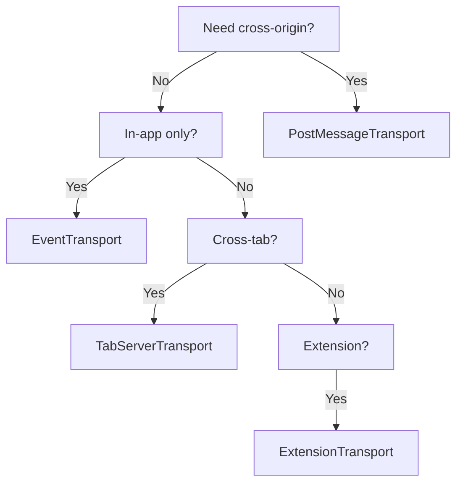

# Transport Adapters

Transports handle the communication layer between your browser MCP server and AI clients. FrontMCP Web provides several transport adapters for different use cases.

## Available Transports

| Transport | Use Case | Communication |
|-----------|----------|---------------|
| `EventTransportAdapter` | In-app communication | Event emitter |
| `PostMessageTransportAdapter` | iframes, cross-origin | window.postMessage |
| `ExtensionServerTransport` | Browser extensions | Extension messaging |
| `TabServerTransport` | Cross-tab communication | BroadcastChannel |

## EventTransportAdapter

The simplest transport for in-app communication:

```typescript
import {
  EventTransportAdapter,
  createSimpleEmitter,
} from '@frontmcp/browser';

// Create an event emitter
const emitter = createSimpleEmitter();

// Create the transport
const transport = new EventTransportAdapter(emitter, {
  sendEvent: 'mcp:response',    // Event name for outgoing messages
  receiveEvent: 'mcp:request',  // Event name for incoming messages
});

// Use with server
const server = new BrowserMcpServer({
  name: 'my-app',
  transport,
});
```

### Custom Emitter

You can use any EventEmitter-compatible object:

```typescript
import { EventEmitter } from 'events';

const emitter = new EventEmitter();
const transport = new EventTransportAdapter(emitter);
```

### Connecting Two Ends

```typescript
// Server side
const serverEmitter = createSimpleEmitter();
const serverTransport = new EventTransportAdapter(serverEmitter);

// Client side (in the same app)
serverEmitter.on('mcp:response', (message) => {
  // Handle response from server
  console.log('Server response:', message);
});

// Send request to server
serverEmitter.emit('mcp:request', {
  jsonrpc: '2.0',
  method: 'tools/list',
  id: 1,
});
```

## PostMessageTransportAdapter

For cross-origin communication between windows or iframes:

```typescript
import { PostMessageTransportAdapter } from '@frontmcp/browser';

// In the main window (host)
const transport = new PostMessageTransportAdapter(
  window,           // Source window
  childIframe.contentWindow,  // Target window
  {
    targetOrigin: 'https://child.example.com',
    allowedOrigins: ['https://child.example.com'],
    messageType: 'mcp:message',
  }
);

// In the iframe (child)
const childTransport = new PostMessageTransportAdapter(
  window,
  window.parent,
  {
    targetOrigin: 'https://parent.example.com',
    allowedOrigins: ['https://parent.example.com'],
  }
);
```

### Configuration Options

```typescript
interface PostMessageTransportOptions {
  /** Allowed origins for incoming messages */
  allowedOrigins?: (string | RegExp)[];

  /** Target origin for outgoing messages (default: '*') */
  targetOrigin?: string;

  /** Custom message type for filtering (default: 'mcp:message') */
  messageType?: string;
}
```

### Security

<Warning>
  Always specify `allowedOrigins` in production to prevent cross-origin attacks. Never use `'*'` for `targetOrigin` with sensitive data.
</Warning>

```typescript
// Secure configuration
const transport = new PostMessageTransportAdapter(window, targetWindow, {
  targetOrigin: 'https://trusted-domain.com',
  allowedOrigins: [
    'https://trusted-domain.com',
    /^https:\/\/.*\.trusted-domain\.com$/,  // Subdomains
  ],
});
```

## ExtensionServerTransport

For browser extension communication:

```typescript
import { ExtensionServerTransport } from '@frontmcp/browser';

// In the content script or extension page
const transport = new ExtensionServerTransport({
  extensionId: chrome.runtime.id,
});

const server = new BrowserMcpServer({
  name: 'extension-server',
  transport,
});
```

### Extension Bridge

For page-to-extension communication:

```typescript
import { ExtensionBridge } from '@frontmcp/browser';

// Create a bridge between the page and extension
const bridge = new ExtensionBridge({
  extensionId: 'your-extension-id',
  onMessage: (message) => {
    console.log('Received from extension:', message);
  },
});

// Send message to extension
bridge.send({ type: 'ping' });
```

## TabServerTransport

For cross-tab communication within the same origin:

```typescript
import { TabServerTransport } from '@frontmcp/browser';

// Each tab creates its own transport
const transport = new TabServerTransport({
  channelName: 'my-app-mcp',
});

// Server in Tab 1
const server = new BrowserMcpServer({
  name: 'tab-server',
  transport,
});

// Client in Tab 2 can communicate with Tab 1's server
```

<Info>
  TabServerTransport uses BroadcastChannel API, which only works between tabs of the same origin.
</Info>

## Transport Lifecycle

All transports implement the same interface:

```typescript
interface BrowserTransport {
  /** Current connection state */
  readonly connectionState: 'disconnected' | 'connecting' | 'connected' | 'error';

  /** Connect the transport */
  connect(): Promise<void>;

  /** Send a JSON-RPC message */
  send(message: JSONRPCMessage): Promise<void>;

  /** Destroy the transport */
  destroy(reason?: string): void;

  /** Register a message handler */
  onMessage(handler: BrowserMessageHandler): () => void;

  /** Register an error handler */
  onError(handler: (error: Error) => void): () => void;

  /** Register a close handler */
  onClose(handler: (reason?: string) => void): () => void;
}
```

### Example: Custom Transport

```typescript
import { BrowserTransportBase } from '@frontmcp/browser';

class WebSocketTransport extends BrowserTransportBase {
  private ws: WebSocket | null = null;

  constructor(private url: string) {
    super();
  }

  async connect(): Promise<void> {
    this.ws = new WebSocket(this.url);

    return new Promise((resolve, reject) => {
      this.ws!.onopen = () => {
        this.setConnectionState('connected');
        resolve();
      };
      this.ws!.onerror = (error) => {
        this.setConnectionState('error');
        reject(error);
      };
      this.ws!.onmessage = (event) => {
        const message = JSON.parse(event.data);
        this.handleMessage(message);
      };
    });
  }

  async send(message: JSONRPCMessage): Promise<void> {
    this.ws?.send(JSON.stringify(message));
  }

  destroy(): void {
    this.ws?.close();
    this.ws = null;
  }
}
```

## Choosing a Transport



## Related

<CardGroup cols={2}>
  <Card title="Server" icon="server" href="/docs/web/core/server">
    Use transports with BrowserMcpServer
  </Card>
  <Card title="App Bridge" icon="bridge" href="/docs/web/advanced/app-bridge">
    Embed MCP apps in iframes
  </Card>
  <Card title="Scope" icon="circle" href="/docs/web/core/scope">
    Use transports with BrowserScope
  </Card>
</CardGroup>
