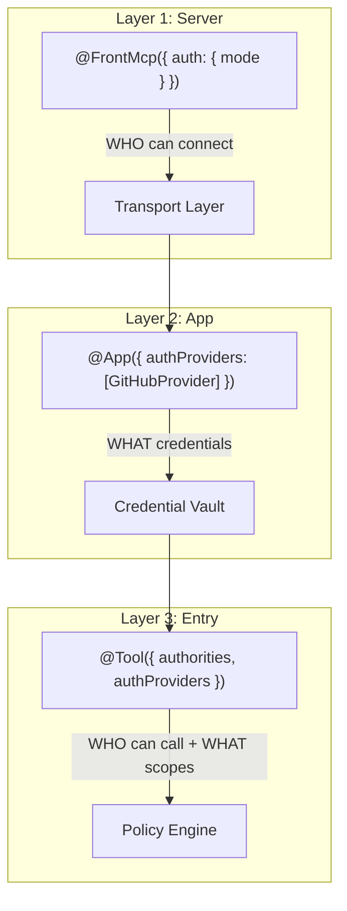
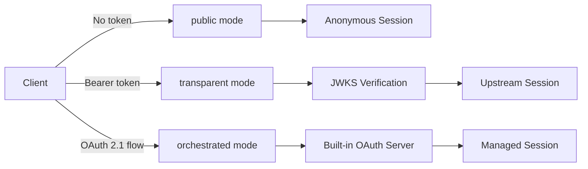
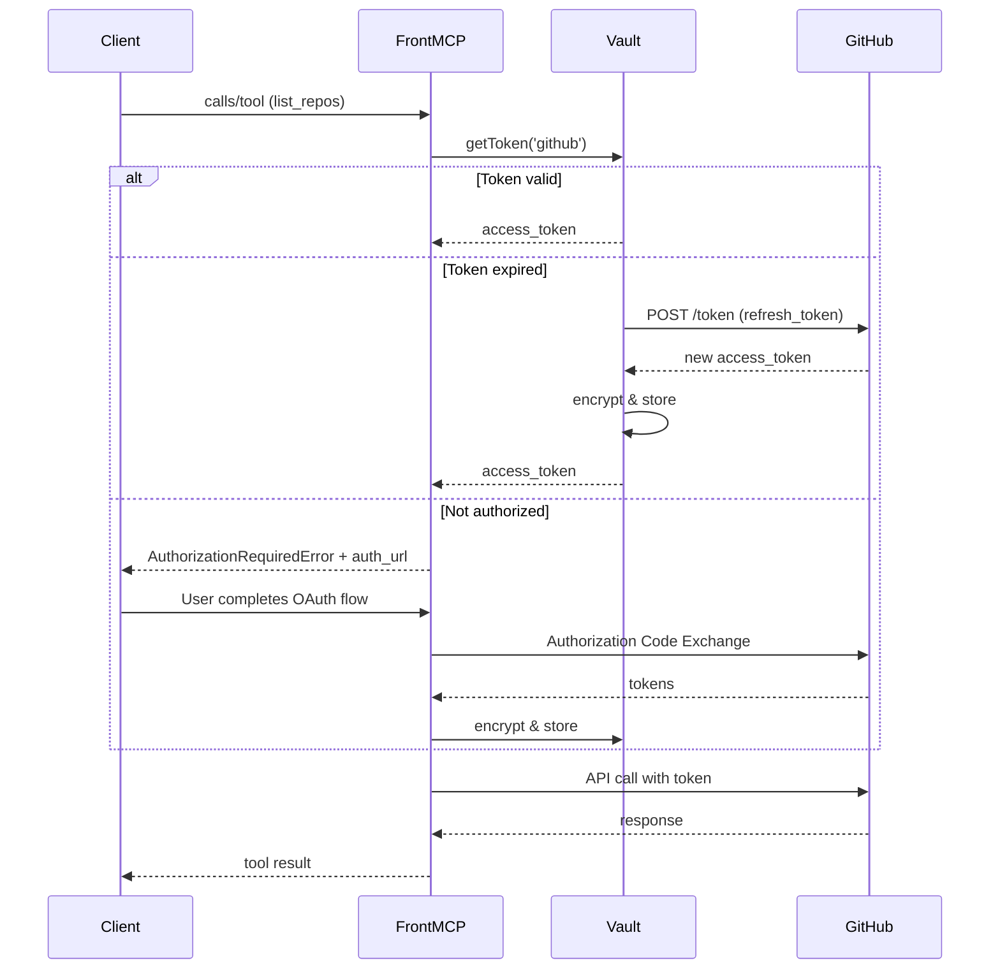
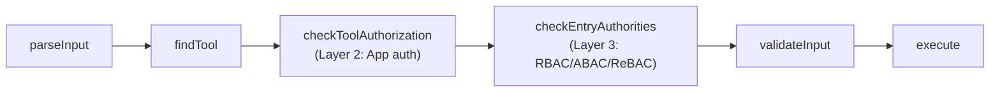
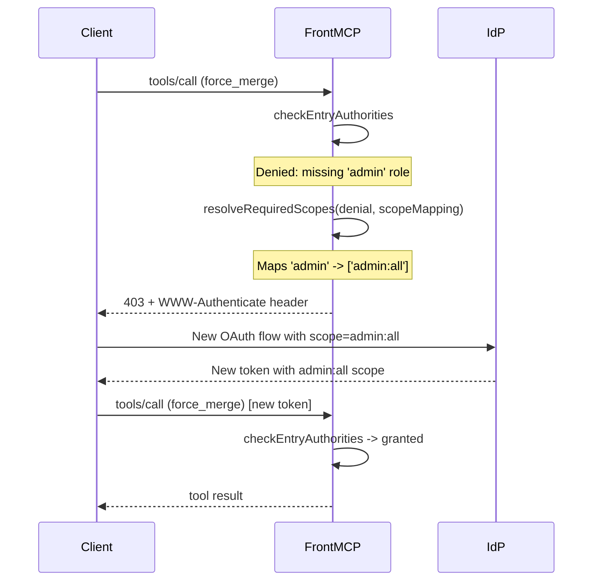
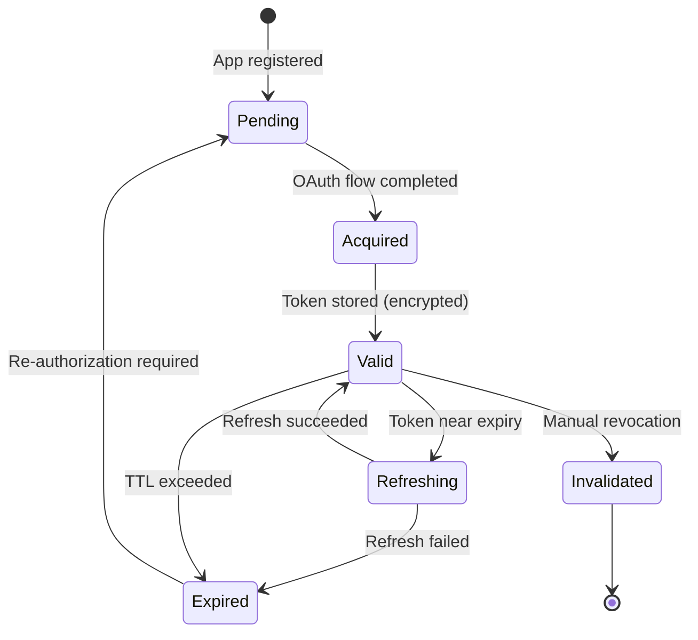

> This page explains the full authentication and authorization architecture.
> For individual topics, see [Authorities](/frontmcp/authentication/authorities),
> [Progressive Auth](/frontmcp/authentication/progressive), and [Auth Modes](/frontmcp/authentication/modes).

## 1. Three-Layer Model

FrontMCP enforces security through three distinct layers, each answering a different question:



| Layer | What | Mechanism | Enforcement |
| ----- | ---- | --------- | ----------- |
| **Server** | WHO can connect | `auth: { mode }` -- public / transparent / orchestrated | Transport layer (401/403) |
| **App** | WHAT credentials | `authProviders: [GitHubProvider]` | `checkToolAuthorization` stage -- progressive OAuth |
| **Entry** | WHO can call + WHAT scopes | `authorities` + `authProviders: [{ scopes }]` | `checkEntryAuthorities` stage |

### Full Three-Layer Example

```typescript
import { FrontMcp, App, Tool, ToolContext } from '@frontmcp/sdk';
import { z } from 'zod';

// Layer 1: Server -- WHO can connect
@FrontMcp({
  info: { name: 'MyServer', version: '1.0.0' },
  auth: {
    mode: 'remote',
    provider: 'https://auth.example.com',
  },
  authorities: {
    claimsMapping: { roles: 'realm_access.roles', permissions: 'scope' },
    profiles: {
      admin: { roles: { any: ['admin', 'superadmin'] } },
      authenticated: {
        attributes: {
          conditions: [{ path: 'user.sub', op: 'exists', value: true }],
        },
      },
    },
    scopeMapping: {
      roles: { admin: ['admin:all'] },
    },
  },
  apps: [GitHubApp],
})
class MyServer {}

// Layer 2: App -- WHAT credentials
@App({
  name: 'github',
  authProviders: [GitHubAuthProvider],
  tools: [ListReposTool],
})
class GitHubApp {}

// Layer 3: Entry -- WHO can call + WHAT scopes
@Tool({
  name: 'list_repos',
  description: 'List GitHub repositories',
  inputSchema: { org: z.string() },
  authProviders: [{ name: 'github', scopes: ['repo'] }],
  authorities: 'authenticated',
})
class ListReposTool extends ToolContext {
  async execute(input: { org: string }) {
    // Explicitly request credentials for the 'github' provider
    // this.fetch() resolves the token from the vault and injects the Authorization header
    const res = await this.fetch(`https://api.github.com/orgs/${input.org}/repos`, {
      credentials: { provider: 'github' },
    });
    return { repos: await res.json() };
  }
}
```

## 2. Authentication (Layer 1)

Layer 1 determines **how users prove their identity** at the transport level. FrontMCP supports three modes:

| Mode | Description | Session | Token Source |
| ---- | ----------- | ------- | ------------ |
| `public` | No auth required | Anonymous auto-generated | None |
| `transparent` | External IdP verifies tokens via JWKS | Derived from upstream JWT | Client sends Bearer token |
| `orchestrated` | FrontMCP runs its own OAuth server | Server-managed (stateful) | FrontMCP issues tokens |



### Decision Table

| Scenario | Mode | Why |
| -------- | ---- | --- |
| Local development / testing | `public` | No setup required |
| Existing Auth0 / Okta / Azure AD | `transparent` | Direct token pass-through |
| Multi-provider federation | `remote` (orchestrated) | Unified session across IdPs |
| Self-contained auth | `local` (orchestrated) | Full control, built-in OAuth server |

### Public Mode

```typescript
@FrontMcp({
  info: { name: 'DevServer', version: '1.0.0' },
  auth: { mode: 'public' },
  apps: [MyApp],
})
class DevServer {}
```

Anonymous sessions are auto-generated. Optional `anonymousScopes` and `publicAccess` restrict which tools/prompts are accessible.

### Transparent Mode

```typescript
@FrontMcp({
  info: { name: 'ProdServer', version: '1.0.0' },
  auth: {
    mode: 'transparent',
    provider: 'https://auth.example.com',
    expectedAudience: 'https://api.example.com',
    requiredScopes: ['openid', 'profile'],
  },
  apps: [MyApp],
})
class ProdServer {}
```

Tokens are validated against the upstream provider's JWKS endpoint. No token storage on the server -- claims are read directly from the verified JWT.

### Orchestrated Mode (local)

```typescript
@FrontMcp({
  info: { name: 'AuthServer', version: '1.0.0' },
  auth: {
    mode: 'local',
    tokenStorage: { redis: { provider: 'redis', host: 'localhost' } },
    consent: { enabled: true },
    incrementalAuth: { enabled: true, skippedAppBehavior: 'require-auth' },
  },
  apps: [GitHubApp, SlackApp],
})
class AuthServer {}
```

### Orchestrated Mode (remote)

```typescript
@FrontMcp({
  info: { name: 'FederatedServer', version: '1.0.0' },
  auth: {
    mode: 'remote',
    provider: 'https://auth.example.com',
    clientId: 'mcp-server',
    clientSecret: process.env.CLIENT_SECRET,
    tokenStorage: { redis: { provider: 'redis', host: 'localhost' } },
    incrementalAuth: { enabled: true },
  },
  apps: [GitHubApp, JiraApp],
})
class FederatedServer {}
```

## 3. Auth Providers (Layer 2)

Auth providers represent **OAuth connections to external services** (GitHub, Jira, Slack, etc.). They are declared at the app level and optionally refined at the tool level with specific scopes.

### Provider Lifecycle



### Declaration

Auth providers are declared on `@App()` and optionally scoped on `@Tool()`:

```typescript
// App level -- register the provider
@App({
  name: 'github',
  authProviders: [GitHubAuthProvider],
  tools: [ListReposTool, CreateIssueTool],
})
class GitHubApp {}

// Tool level -- request specific scopes
@Tool({
  name: 'create_issue',
  inputSchema: z.object({ repo: z.string(), title: z.string() }),
  authProviders: [{ name: 'github', scopes: ['repo'] }],
})
class CreateIssueTool extends ToolContext { /* ... */ }

// Tool level -- just reference the provider name
@Tool({
  name: 'list_repos',
  inputSchema: z.object({ org: z.string() }),
  authProviders: ['github'],
})
class ListReposTool extends ToolContext { /* ... */ }
```

### Token Access in Tools

Tools use `this.fetch()` with explicit `credentials: { provider }` to make authenticated requests to upstream APIs. The fetch middleware resolves the provider's token from the vault and injects the `Authorization` header — no manual token handling needed.

```typescript
@Tool({ name: 'github_repos', authProviders: ['github'] })
class GitHubReposTool extends ToolContext {
  async execute(input: Input) {
    // Explicitly request credentials for 'github' — token injected from vault
    const response = await this.fetch('https://api.github.com/user/repos', {
      credentials: { provider: 'github' },
    });
    return { repos: await response.json() };
  }
}
```

The `credentials.provider` field is **required** when accessing upstream APIs — tokens are never injected implicitly. This prevents accidental credential leaks to unintended URLs.

```typescript
// Fetch without credentials — no token injected (safe default)
const publicData = await this.fetch('https://public-api.example.com/data');

// Fetch with credentials — token injected for the named provider
const privateData = await this.fetch('https://api.github.com/user', {
  credentials: { provider: 'github' },
});

// Multiple providers in one tool
const jiraData = await this.fetch('https://jira.example.com/rest/api/2/issue', {
  credentials: { provider: 'jira' },
});
```

### Progressive Authorization

If an app is not yet authorized, the server returns an `AuthorizationRequiredError` with an auth URL:

```typescript
// Thrown automatically by checkToolAuthorization stage
throw new AuthorizationRequiredError({
  appId: 'slack',
  toolId: 'slack:send_message',
  authUrl: '/oauth/authorize?app=slack&tool=slack:send_message',
  sessionMode: 'stateful',
  message: 'Please authorize Slack to use this tool.',
  requiredScopes: ['chat:write'],
});
```

The AI agent receives the auth URL in `_meta.auth_url` and can present it to the user.

### Supported Credential Types

The vault supports 10 credential types:

| Type | Description | Use Case |
| ---- | ----------- | -------- |
| `oauth` | OAuth 2.0 tokens (access + refresh) | GitHub, Google, Slack |
| `oauth_pkce` | OAuth 2.0 with PKCE for public clients | SPAs, CLI tools |
| `api_key` | API key (header or query param) | OpenAI, Stripe |
| `bearer` | Static bearer token | Internal services |
| `basic` | Username + password | Legacy APIs |
| `private_key` | PEM/JWK for JWT signing | GCP service accounts |
| `mtls` | Mutual TLS client certificate | Enterprise APIs |
| `ssh_key` | SSH key (RSA, Ed25519, ECDSA) | Git operations |
| `service_account` | Cloud provider service accounts | AWS, GCP, Azure |
| `custom` | Extensible data bag + headers | App-specific auth |

## 4. Authorities (Layer 3)

Authorities provide **declarative RBAC/ABAC/ReBAC enforcement** on individual entries. Instead of writing imperative access-control checks, you declare policies in decorator metadata.

> Full reference: [Authorities](/frontmcp/authentication/authorities)

### Policy Forms

```typescript
// 1. Profile reference (string)
@Tool({ authorities: 'admin' })

// 2. Multiple profiles (AND semantics)
@Tool({ authorities: ['authenticated', 'matchTenant'] })

// 3. Inline policy object
@Tool({
  authorities: {
    roles: { any: ['admin'] },
    permissions: { all: ['users:delete'] },
    operator: 'AND',
  },
})
```

### Configuration

```typescript
@FrontMcp({
  authorities: {
    // Map IdP JWT claims to standard fields
    claimsMapping: {
      roles: 'realm_access.roles',
      permissions: 'scope',
      tenantId: 'org_id',
    },
    // Pre-registered named profiles
    profiles: {
      admin: { roles: { any: ['admin', 'superadmin'] } },
      authenticated: {
        attributes: {
          conditions: [{ path: 'user.sub', op: 'exists', value: true }],
        },
      },
      matchTenant: {
        attributes: {
          conditions: [
            { path: 'claims.org_id', op: 'eq', value: { fromInput: 'tenantId' } },
          ],
        },
      },
    },
    // Map authority denials to OAuth scope challenges
    scopeMapping: {
      roles: { admin: ['admin:all'] },
      permissions: { 'repo:write': ['repo'] },
      profiles: { admin: ['admin:all'] },
    },
  },
})
```

### Flow Stages

Authorities are enforced at two stages in the request lifecycle:

| Stage | Flow | Purpose |
| ----- | ---- | ------- |
| `checkEntryAuthorities` | `tools:call-tool`, `prompts:get-prompt`, `resources:read-resource` | Block calls to unauthorized entries |
| `filterByAuthorities` | `tools:tools-list`, `prompts:prompts-list`, `resources:resources-list` | Hide unauthorized entries from listings |

Both stages are hookable with `Will` / `Did` / `Around` decorators:

```typescript
@Around('tools:call-tool', 'checkEntryAuthorities')
async aroundAuthCheck(next: () => Promise<void>) {
  console.log('Before authority check');
  await next();
  console.log('After authority check');
}
```

### Async Guards: DB/Redis Lookups

Custom evaluators are **fully async** — use them for database queries, Redis checks, feature flags, or any I/O-bound authorization logic. Register evaluators in the `authorities.evaluators` config, then reference them via the `custom` field on entries.

**Example: Tenant allowlist in Redis**

```typescript
import type { AuthoritiesEvaluator } from '@frontmcp/auth';

const tenantAllowlistGuard: AuthoritiesEvaluator = {
  name: 'tenantAllowlist',
  evaluate: async (policy, ctx) => {
    const { redisKey } = policy as { redisKey: string };
    const tenantId = ctx.input['tenantId'] as string;

    // Async Redis lookup
    const isAllowed = await redis.sismember(redisKey, tenantId);

    return {
      granted: isAllowed,
      deniedBy: isAllowed ? undefined : `tenant '${tenantId}' not in allowlist`,
      denial: isAllowed ? undefined : { kind: 'custom', path: 'custom.tenantAllowlist' },
      evaluatedPolicies: ['custom.tenantAllowlist'],
    };
  },
};

const activeSubscriptionGuard: AuthoritiesEvaluator = {
  name: 'activeSubscription',
  evaluate: async (_policy, ctx) => {
    // Async database query
    const row = await db.query(
      'SELECT active FROM subscriptions WHERE user_id = $1',
      [ctx.user.sub],
    );
    const active = row?.active === true;

    return {
      granted: active,
      deniedBy: active ? undefined : 'no active subscription',
      denial: active ? undefined : { kind: 'custom', path: 'custom.activeSubscription' },
      evaluatedPolicies: ['custom.activeSubscription'],
    };
  },
};
```

**Register in server config:**

```typescript
@FrontMcp({
  authorities: {
    claimsMapping: { roles: 'roles', tenantId: 'tenantId' },
    profiles: { admin: { roles: { any: ['admin'] } } },
    evaluators: {
      tenantAllowlist: tenantAllowlistGuard,
      activeSubscription: activeSubscriptionGuard,
    },
  },
})
```

**Use on entries:**

```typescript
@Tool({
  name: 'sync_data',
  inputSchema: { tenantId: z.string() },
  authorities: {
    // Static RBAC + async DB check, combined with AND
    roles: { any: ['user', 'admin'] },
    custom: {
      tenantAllowlist: { redisKey: 'allowed-tenants' },
      activeSubscription: {},
    },
  },
})
```

All checks — static RBAC, async Redis, async DB — run in sequence. If any fails, the tool is denied before the handler executes.

**Alternative: Use a `Will` hook for one-off checks**

For checks that don't need to be reusable across tools, use a `Will` hook on the `checkEntryAuthorities` stage:

```typescript
import { DynamicPlugin, Plugin, FlowHooksOf } from '@frontmcp/sdk';

const ToolCallHook = FlowHooksOf('tools:call-tool');

@Plugin({ name: 'subscription-guard' })
export class SubscriptionGuardPlugin extends DynamicPlugin<{}> {
  @ToolCallHook.Will('checkEntryAuthorities', { priority: 100 })
  async checkSubscription(flowCtx: Record<string, unknown>) {
    const state = flowCtx['state'] as Record<string, unknown>;
    const authInfo = state?.['authInfo'] as Record<string, unknown> | undefined;
    const userSub = (authInfo?.['user'] as Record<string, unknown> | undefined)?.['sub'] as string;

    const active = await db.query('SELECT active FROM subscriptions WHERE user_id = $1', [userSub]);
    if (!active?.rows?.[0]?.active) {
      const { AuthorityDeniedError } = await import('@frontmcp/auth');
      throw new AuthorityDeniedError({
        entryType: 'Tool',
        entryName: 'unknown',
        deniedBy: 'no active subscription',
      });
    }
  }
}
```

| Approach | When to Use |
| -------- | ----------- |
| **Custom evaluator** | Reusable check shared across multiple tools — register once, use via `custom` field |
| **`Will` hook** | One-off check for a specific plugin or all tools in an app |
| **Inline `authorities` policy** | Static checks (roles, permissions, attributes) that don't need I/O |

## 5. How They Compose

The three layers execute in order: authentication first, then app authorization, then entry authorities. Here are the five common composition patterns:

### Pattern 1: Public Tool, No External Access

```typescript
@Tool({ name: 'calculator' })
class CalculatorTool extends ToolContext {
  async execute(input: { expression: string }) {
    return { result: parseFloat(input.expression) };
  }
}
```

No auth required, no external tokens, no authority checks.

### Pattern 2: Anyone Can Use, Needs GitHub Token

```typescript
@Tool({
  name: 'list_repos',
  authProviders: ['github'],
})
class ListReposTool extends ToolContext { /* ... */ }
```

Any authenticated user can call this tool, but `checkToolAuthorization` ensures the user has authorized the GitHub app. If not, `AuthorizationRequiredError` is thrown with an auth URL.

### Pattern 3: Admin-Only, No External Access

```typescript
@Tool({
  name: 'delete_user',
  authorities: 'admin',
})
class DeleteUserTool extends ToolContext { /* ... */ }
```

`checkEntryAuthorities` evaluates the `admin` profile against JWT claims. Denied users receive `AuthorityDeniedError` with code `-32003`.

### Pattern 4: Admin-Only + Needs GitHub

```typescript
@Tool({
  name: 'force_merge',
  authProviders: [{ name: 'github', scopes: ['repo'] }],
  authorities: 'admin',
})
class ForceMergeTool extends ToolContext { /* ... */ }
```

Both checks run in sequence: `checkToolAuthorization` (is GitHub authorized?) then `checkEntryAuthorities` (is user an admin?).

### Pattern 5: Tenant-Scoped + External Service

```typescript
@Tool({
  name: 'create_jira_issue',
  authProviders: ['jira'],
  authorities: ['authenticated', 'matchTenant'],
})
class CreateJiraIssueTool extends ToolContext { /* ... */ }
```

User must be authenticated AND belong to the same tenant (matched via ABAC condition on `claims.org_id`), AND have the Jira app authorized.

### Execution Order



### Failure Mode Table

| Scenario | Error | Code |
| -------- | ----- | ---- |
| Not authenticated (no token or invalid token) | `401` + `WWW-Authenticate` header with `resource_metadata` | HTTP 401 |
| Authenticated, app not authorized | `AuthorizationRequiredError` + `auth_url` in `_meta` | 403 |
| Authenticated, wrong role/permission | `AuthorityDeniedError` | 403 (`-32003`) |
| Authenticated, missing scopes | `AuthorityDeniedError` + `requiredScopes` | 403 (`-32003`) + `insufficient_scope` |
| Token expired, refresh available | Auto-refreshed from vault | Transparent |

## 6. Scope Challenge and Step-Up Auth

When an authority check fails and the denial maps to OAuth scopes via `scopeMapping`, FrontMCP returns a `403 insufficient_scope` response per RFC 6750 Section 3.1.

### How It Works



### Configuration

```typescript
@FrontMcp({
  authorities: {
    claimsMapping: { roles: 'roles', permissions: 'permissions' },
    profiles: {
      admin: { roles: { any: ['admin'] } },
    },
    scopeMapping: {
      // When a role denial occurs, map the missing role to OAuth scopes
      roles: { admin: ['admin:all'], editor: ['content:write'] },
      // When a permission denial occurs, map to OAuth scopes
      permissions: { 'repo:write': ['repo'], 'repo:admin': ['repo', 'admin:org'] },
      // When a profile denial occurs, map the profile name to OAuth scopes
      profiles: { admin: ['admin:all'] },
    },
  },
})
```

### WWW-Authenticate Header Format

When scopes are resolved from a denial, the response includes:

```
WWW-Authenticate: Bearer error="insufficient_scope",
  scope="admin:all",
  resource_metadata="https://api.example.com/.well-known/oauth-protected-resource",
  error_description="The request requires higher privileges"
```

The client reads the `scope` parameter, initiates a new OAuth flow requesting those scopes, and retries with the upgraded token.

## 7. Vault and Token Lifecycle

The credential vault provides encrypted, scoped storage for all credential types.

### Storage Hierarchy

| Scope | Key | Persistence | Use Case |
| ----- | --- | ----------- | -------- |
| `global` | `providerId` | Shared across all sessions | Service accounts, shared API keys |
| `user` | `providerId` + `userId` | Persists across sessions for same user | User-specific OAuth tokens |
| `session` | `providerId` + `sessionId` | Lost when session ends | Temporary access tokens |

### Token Lifecycle



### Storage Backends

| Backend | Provider | Best For |
| ------- | -------- | -------- |
| Memory | `'memory'` | Development, testing |
| Redis | `{ redis: { provider: 'redis', host, port } }` | Production, multi-instance |
| SQLite | `sqlite: { path: './data.db' }` | Single-instance local deployments |

### Auto-Refresh

Tokens are automatically refreshed before expiry. The `refresh.skewSeconds` config (default: 60) determines how early to refresh:

```typescript
@FrontMcp({
  auth: {
    mode: 'local',
    refresh: { enabled: true, skewSeconds: 60 },
    tokenStorage: { redis: { provider: 'redis', host: 'localhost' } },
  },
})
```

### Embed Modes

Provider tokens are stored using one of four embed modes:

| Mode | Storage | Security | Use Case |
| ---- | ------- | -------- | -------- |
| `store-only` | Server-side encrypted store | Highest | Default for stateful sessions |
| `encrypted` | AES-256-GCM in JWT | High | Stateless deployments |
| `plain` | In-memory only | Development | Local dev only |
| `ref` | External vault by reference | Highest | Enterprise key management |

## 8. Protected Resource Metadata (RFC 9728)

FrontMCP exposes a `/.well-known/oauth-protected-resource` endpoint per RFC 9728. This allows OAuth clients to discover the authorization server and required scopes automatically.

### Endpoint

```
GET /.well-known/oauth-protected-resource
```

### Response

```json
{
  "resource": "https://api.example.com/mcp",
  "authorization_servers": ["https://auth.example.com"],
  "scopes_supported": ["openid", "profile", "email", "repo", "admin:all"],
  "bearer_methods_supported": ["header"]
}
```

### Key Fields

| Field | Description |
| ----- | ----------- |
| `resource` | The resource identifier (derived from server URL and scope path) |
| `authorization_servers` | In orchestrated mode: the FrontMCP server itself. In transparent mode: the upstream IdP issuer |
| `scopes_supported` | Dynamically collected from all tool `authProviders` scope declarations and anonymous scopes |
| `bearer_methods_supported` | Always `["header"]` -- tokens are sent in the `Authorization` header |

## 9. MCP Spec Alignment

FrontMCP implements the full MCP authentication specification:

| Requirement | RFC | Status |
| ----------- | --- | ------ |
| Protected Resource Metadata endpoint | RFC 9728 | Implemented -- `/.well-known/oauth-protected-resource` |
| Bearer token in Authorization header | OAuth 2.1 Section 5.1.1 | Implemented -- transport layer extraction |
| 401 with `WWW-Authenticate` + `resource_metadata` + `scope` | RFC 6750 | Implemented -- `buildUnauthorizedHeader()` |
| 403 `insufficient_scope` challenge | RFC 6750 Section 3.1 | Implemented -- `buildInsufficientScopeHeader()` |
| Resource parameter validation | RFC 8707 | Implemented -- `computeResource()` in PRM flow |
| PKCE (S256 only) | OAuth 2.1 | Implemented -- `generatePkcePair()` from `@frontmcp/utils` |
| Token audience binding | RFC 8707 | Implemented -- `expectedAudience` config |
| No token passthrough to third parties | MCP Spec | By design -- vault stores tokens, `this.fetch()` injects provider tokens automatically |

### WWW-Authenticate Header Builders

FrontMCP provides purpose-built header builders for each error scenario:

```typescript
import {
  buildUnauthorizedHeader,
  buildInvalidTokenHeader,
  buildInsufficientScopeHeader,
  buildInvalidRequestHeader,
} from '@frontmcp/auth';

// 401 -- no token provided
// => Bearer resource_metadata="https://.../.well-known/oauth-protected-resource"
buildUnauthorizedHeader(prmUrl);

// 401 -- token expired or invalid
// => Bearer resource_metadata="...", error="invalid_token", error_description="..."
buildInvalidTokenHeader(prmUrl, 'The access token is expired');

// 403 -- missing required scopes
// => Bearer resource_metadata="...", error="insufficient_scope", scope="repo admin:all"
buildInsufficientScopeHeader(prmUrl, ['repo', 'admin:all']);

// 400 -- malformed request
// => Bearer resource_metadata="...", error="invalid_request", error_description="..."
buildInvalidRequestHeader(prmUrl, 'Missing Authorization header');
```

## 10. Comparison with Other Frameworks

| Feature | MCP Spec | TS SDK (official) | FastMCP | FrontMCP |
| ------- | -------- | ----------------- | ------- | -------- |
| **Server auth** | OAuth 2.1 | Manual setup | Provider-based | 3 modes (`public` / `transparent` / `orchestrated`) + full OAuth 2.1 |
| **Per-app auth** | N/A | N/A | N/A | `@App({ authProviders })` with progressive auth |
| **Per-tool scopes** | Scope challenge | N/A | N/A | `authProviders: [{ name, scopes }]` on `@Tool()` |
| **Per-tool RBAC** | N/A | N/A | N/A | `authorities: { roles, permissions }` |
| **Per-tool ABAC** | N/A | N/A | N/A | `authorities: { attributes: { conditions } }` |
| **Per-tool ReBAC** | N/A | N/A | N/A | `authorities: { relationships }` with resolver |
| **Credential vault** | N/A | N/A | N/A | 10 types, encrypted, auto-refresh, rotation |
| **Step-up auth** | RFC 6750 | N/A | N/A | `scopeMapping` + `403 insufficient_scope` |
| **Hookable auth stages** | N/A | N/A | N/A | `Will` / `Did` / `Around` on `checkEntryAuthorities` and `checkToolAuthorization` |
| **PRM endpoint** | RFC 9728 | N/A | N/A | Dynamic `scopes_supported` from tool declarations |
| **Token isolation** | No passthrough | N/A | N/A | By design -- vault provides tokens via `this.fetch()` middleware |

## 11. Credential Loading Strategies

When tools require upstream provider credentials, the vault loads them using one of two strategies:

| Strategy | When Loaded | Best For |
| -------- | ----------- | -------- |
| **Eager** | Parallel load at session initialization | Low-latency first tool call, few providers |
| **Lazy** | On-demand when first requested | Fast startup, many providers |

### Eager Loading

All configured credentials are loaded in parallel when the session starts. Failed loads are collected and reported. Credentials marked `required: true` that fail to load cause an error.

```typescript
// Eager loading result
interface EagerLoadResult {
  loaded: Map<string, ResolvedCredential>;  // Successfully loaded
  failed: Map<string, Error>;               // Failed providers
  duration: number;                          // Total load time (ms)
}
```

### Lazy Loading

Credentials are loaded on first access with automatic deduplication — concurrent requests for the same provider share a single in-flight promise.

Lazy loading also supports credential refresh: if a provider defines a `refresh()` function, it is used; otherwise the factory is called again.

### Resolved Credentials

Both strategies produce a `ResolvedCredential` with metadata:

| Field | Description |
| ----- | ----------- |
| `acquiredAt` | Timestamp when credential was loaded |
| `expiresAt` | Computed expiration time |
| `isValid` | Whether credential is still valid |
| `scope` | Credential scope (session, user, global) |

## 12. Token Leak Detection

FrontMCP includes built-in token leak detection to prevent credentials from being accidentally exposed to LLM context.

The `validateNoTokenLeakage()` method on `AuthorizationBase` scans data for:

- **JWT patterns**: Three-segment base64url strings with a valid JWT header (contains `"alg"` claim)
- **Sensitive field names**: `access_token`, `refresh_token`, `id_token`, `tokenEnc`, `secretRefId`

If a token is detected in data that would be returned to the LLM, a `TokenLeakDetectedError` is thrown, preventing the leak.

<Warning>
  Token leak detection runs automatically when building LLM-safe auth context. If you're constructing custom tool responses that include auth-related data, ensure sensitive fields are stripped before returning.
</Warning>

## 13. Encrypted Vault (Zero-Knowledge)

For deployments requiring the highest credential security, FrontMCP provides a zero-knowledge encrypted vault backed by Redis.

### How It Works

- Credentials are encrypted with **AES-256-GCM**
- The encryption key is **derived from the client's JWT** — the server cannot decrypt credentials without the client's token
- Each vault instance has a unique encryption key derived from the JWT + a server-side pepper
- Concurrent requests are safely isolated via `AsyncLocalStorage` encryption contexts

### Configuration

```typescript
import { createEncryptedVault } from '@frontmcp/auth';

const vault = createEncryptedVault({
  pepper: process.env.VAULT_PEPPER,   // Server-side pepper for key derivation
  namespace: 'myapp',                  // Namespace for Redis key isolation
  redis: { provider: 'redis', host: 'localhost' },
});
```

### Security Properties

| Property | Description |
| -------- | ----------- |
| Zero-knowledge | Server stores encrypted blobs; cannot decrypt without client JWT |
| Per-vault keys | Each user/session gets a unique derived encryption key |
| Concurrent safety | `AsyncLocalStorage` ensures encryption context isolation |
| Metadata access | Authorized app IDs and skipped app IDs are stored unencrypted for quick auth checks |

## 14. Machine ID

FrontMCP uses a per-node machine identifier for session encryption key derivation and distributed session affinity.

### Resolution Priority

1. `MACHINE_ID` environment variable (highest priority)
2. File persistence at `.frontmcp/machine-id` (development mode)
3. Random UUID (ephemeral — sessions become non-portable across restarts)

### Production Configuration

For distributed deployments with Redis session storage, set `MACHINE_ID` to ensure session portability:

```bash
# Each instance should use the same MACHINE_ID for shared sessions
export MACHINE_ID="prod-cluster-shared-key"
```

<Warning>
  Without a stable `MACHINE_ID`, sessions encrypted on one instance cannot be decrypted on another. Always set `MACHINE_ID` in multi-instance deployments.
</Warning>

### Override

For testing or dynamic environments, use the programmatic override:

```typescript
import { setMachineIdOverride } from '@frontmcp/auth';

setMachineIdOverride('test-machine-id');
```

## 15. Auth Provider Detection

When configuring multi-app servers with mixed auth modes, FrontMCP automatically validates provider configurations at startup.

The detection system:

- Scans all apps and their auth providers
- Validates mode compatibility (e.g., transparent mode is incompatible with multiple providers)
- Detects whether orchestration is required
- Reports warnings (e.g., public parent with auth-configured children)

Detection results are available via `scope.authProviders.detection`:

```typescript
const detection = scope.authProviders.detection;
// {
//   hasAuth: true,
//   modes: ['public', 'orchestrated'],
//   providers: ['github', 'jira'],
//   requiresOrchestration: true,
//   warnings: [],
//   errors: [],
// }
```
