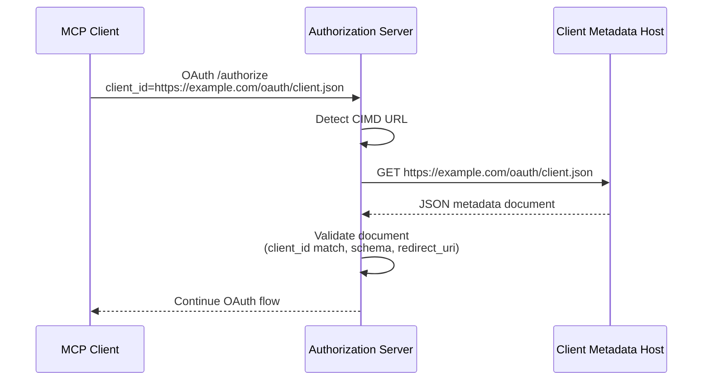
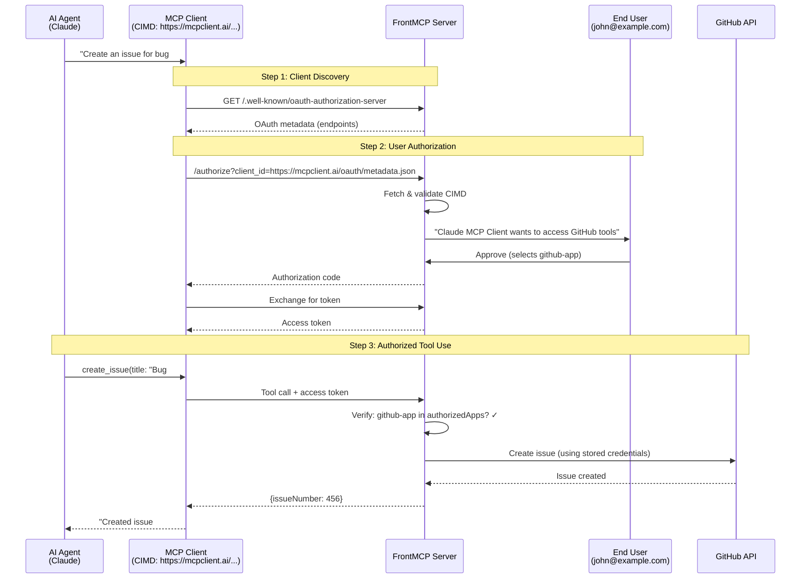
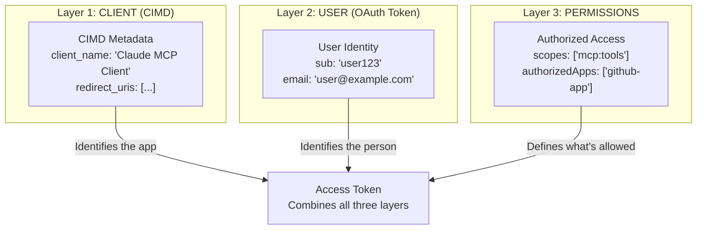

## Introduction

CIMD (Client ID Metadata Documents) enables MCP clients to use **HTTPS URLs as client identifiers**. Instead of pre-registering clients with the authorization server, clients can host their metadata at a URL, and that URL becomes their `client_id`. This implements the [draft-ietf-oauth-client-id-metadata-document-00](https://datatracker.ietf.org/doc/html/draft-ietf-oauth-client-id-metadata-document-00) specification.

This approach enables **self-service client registration** where clients can publish their own metadata without coordinating with the authorization server, **verifiable client identity** where the server can fetch and validate metadata from the URL, and **decentralized trust** where metadata is hosted by the client rather than stored centrally.

## How It Works



**Flow:**
1. Client sends OAuth request with `client_id` set to an HTTPS URL (e.g., `https://example.com/oauth/client-metadata.json`)
2. Authorization server detects this is a CIMD URL and fetches the document
3. Client's server returns a JSON metadata document
4. Authorization server validates the document (schema, client_id match, redirect_uri)
5. OAuth flow continues with the verified client metadata

<Info>
**Key Insight**: CIMD identifies the **client application**, not the user. The user's identity still comes from the OAuth token. The access token is bound to both: issued for a specific user via a specific client.
</Info>

## Real-World Example: AI Agent Authorization

This example shows the complete flow when an AI Agent wants to use protected MCP tools.

### The Scenario

- **AI Agent**: Claude wants to create a GitHub issue
- **MCP Client**: "Claude MCP Client" publishes metadata at `https://mcpclient.ai/oauth/metadata.json`
- **User**: John (`john@example.com`) must approve the access
- **Protected Tool**: `create_issue` in the `github-app`

### Complete Authorization Flow



### Three-Layer Identity Model

FrontMCP uses a three-layer identity model to separate concerns:

| Layer | What It Identifies | How It's Represented | Purpose |
|-------|-------------------|---------------------|---------|
| **CLIENT** | The MCP client application | CIMD URL (e.g., `https://mcpclient.ai/oauth/metadata.json`) | Verifies which app is requesting access |
| **USER** | The person authorizing | OAuth token claims (`sub`, `name`, `email`) | Identifies who is granting permissions |
| **PERMISSIONS** | What can be accessed | OAuth scopes + authorized apps/tools | Controls what actions are allowed |



## CIMD vs Standard OAuth

CIMD changes **how clients are registered**, not the OAuth flow itself. You still get an access token with user identity.

| Aspect | Standard OAuth | CIMD |
|--------|---------------|------|
| **Client Registration** | Pre-register with server, get `client_id` | Self-host metadata at a URL |
| **Client ID Format** | Opaque string (`client_abc123`) | HTTPS URL (`https://mcpclient.ai/oauth/metadata.json`) |
| **Metadata Storage** | On authorization server's database | Hosted by the client |
| **Adding New Clients** | Requires server admin action | Client just publishes JSON file |
| **Token Contains** | User identity + scopes | Same! User identity + scopes |
| **Who Approves** | End user via consent screen | Same! End user via consent screen |

### What Stays the Same

The core OAuth flow is identical:
1. User authenticates
2. User consents to permissions
3. Token is issued with user identity and scopes
4. Token is used to call protected tools

### What Changes

Only the **client identification** step:
- **Standard**: Server looks up `client_id` in its database
- **CIMD**: Server fetches metadata from the `client_id` URL

## Configuration

CIMD is configured through the `auth.cimd` option when creating a FrontMCP server. The CIMD service is automatically created and registered by the framework when orchestrated mode is enabled.

### Basic Configuration

<Tabs>
  <Tab title="Decorator Pattern">
```typescript
import { FrontMcp, App } from '@frontmcp/sdk';

@FrontMcp({
  name: 'my-mcp-server',
  auth: {
    mode: 'orchestrated',
    type: 'local',
    cimd: {
      enabled: true,
      security: {
        blockPrivateIPs: true,
        allowedDomains: ['*.verified-clients.mcp']
      }
    }
  }
})
class MyServer {}

@App({ name: 'my-app' })
class MyApp {}
```
  </Tab>
  <Tab title="Functional Pattern">
```typescript
import { createFrontMcpServer } from '@frontmcp/sdk';

const server = createFrontMcpServer({
  name: 'my-mcp-server',
  auth: {
    mode: 'orchestrated',
    type: 'local',
    cimd: {
      enabled: true,
      security: {
        blockPrivateIPs: true,
        allowedDomains: ['*.verified-clients.mcp']
      }
    }
  }
});
```
  </Tab>
</Tabs>

### Full Configuration Options

<Tabs>
  <Tab title="Complete Example">
```typescript
import { FrontMcp } from '@frontmcp/sdk';

@FrontMcp({
  name: 'my-mcp-server',
  auth: {
    mode: 'orchestrated',
    type: 'local',
    cimd: {
      // Enable/disable CIMD support
      enabled: true,

      // Cache settings
      cache: {
        defaultTtlMs: 3600_000,   // 1 hour default
        maxTtlMs: 86400_000,      // 24 hours max
        minTtlMs: 60_000,         // 1 minute min
      },

      // Security settings
      security: {
        blockPrivateIPs: true,
        allowedDomains: ['trusted.com'],
        blockedDomains: ['blocked.com'],
        warnOnLocalhostRedirects: true,
      },

      // Network settings
      network: {
        timeoutMs: 5000,
        maxResponseSizeBytes: 65536,
      },
    }
  }
})
class MyServer {}
```
  </Tab>
  <Tab title="Minimal Example">
```typescript
import { FrontMcp } from '@frontmcp/sdk';

@FrontMcp({
  name: 'my-mcp-server',
  auth: {
    mode: 'orchestrated',
    type: 'local',
    // CIMD is enabled by default with secure settings
    cimd: {
      enabled: true
    }
  }
})
class MyServer {}
```
  </Tab>
</Tabs>

<Info>
CIMD is **enabled by default** when using orchestrated auth mode. The framework automatically creates and registers the `CimdService` internally, so you don't need to instantiate it yourself.
</Info>

### Security Settings

| Option | Default | Description |
|--------|---------|-------------|
| `blockPrivateIPs` | `true` | Block private/internal IP addresses (SSRF protection) |
| `allowedDomains` | `undefined` | If set, only these domains can host CIMD documents |
| `blockedDomains` | `undefined` | These domains cannot host CIMD documents |
| `warnOnLocalhostRedirects` | `true` | Log warning for localhost-only redirect URIs |

### Cache Settings

| Option | Default | Description |
|--------|---------|-------------|
| `defaultTtlMs` | `3600000` (1 hour) | Default cache TTL when no headers present |
| `maxTtlMs` | `86400000` (24 hours) | Maximum TTL even if server suggests longer |
| `minTtlMs` | `60000` (1 minute) | Minimum TTL even if server suggests shorter |

### Network Settings

| Option | Default | Description |
|--------|---------|-------------|
| `timeoutMs` | `5000` (5s) | Request timeout |
| `maxResponseSizeBytes` | `65536` (64KB) | Maximum response body size |

## Client Metadata Document Format

The metadata document is a JSON file hosted at the client's URL:

```json
{
  "client_id": "https://example.com/oauth/client-metadata.json",
  "client_name": "My MCP Client",
  "redirect_uris": [
    "https://example.com/callback",
    "http://localhost:8080/callback"
  ],
  "token_endpoint_auth_method": "none",
  "grant_types": ["authorization_code"],
  "response_types": ["code"],
  "client_uri": "https://example.com",
  "logo_uri": "https://example.com/logo.png",
  "tos_uri": "https://example.com/terms",
  "policy_uri": "https://example.com/privacy",
  "scope": "read write",
  "contacts": ["admin@example.com"]
}
```

### Required Fields

| Field | Type | Description |
|-------|------|-------------|
| `client_id` | `string` | **MUST** match the URL from which this document was fetched |
| `client_name` | `string` | Human-readable name of the client |
| `redirect_uris` | `string[]` | Array of allowed redirect URIs (at least one required) |

### Optional Fields

| Field | Type | Default | Description |
|-------|------|---------|-------------|
| `token_endpoint_auth_method` | `string` | `"none"` | Auth method: `none`, `client_secret_basic`, `client_secret_post`, `private_key_jwt` |
| `grant_types` | `string[]` | `["authorization_code"]` | OAuth grant types |
| `response_types` | `string[]` | `["code"]` | OAuth response types |
| `client_uri` | `string` | - | URL of the client's home page |
| `logo_uri` | `string` | - | URL of the client's logo image |
| `jwks_uri` | `string` | - | URL of the client's JWKS (for `private_key_jwt`) |
| `jwks` | `object` | - | Inline JWKS `{ keys: [...] }` |
| `tos_uri` | `string` | - | URL of the terms of service |
| `policy_uri` | `string` | - | URL of the privacy policy |
| `scope` | `string` | - | Requested OAuth scopes |
| `contacts` | `string[]` | - | Array of contact email addresses |
| `software_id` | `string` | - | Unique identifier for the client software |
| `software_version` | `string` | - | Version of the client software |

## Security Features

### SSRF Protection

When `security.blockPrivateIPs` is enabled (default), the following addresses are blocked:

**IPv4 Blocked Ranges:**

| Range | Description |
|-------|-------------|
| `127.0.0.0/8` | Loopback addresses |
| `10.0.0.0/8` | Private Class A |
| `172.16.0.0/12` | Private Class B (172.16.x.x - 172.31.x.x) |
| `192.168.0.0/16` | Private Class C |
| `169.254.0.0/16` | Link-local addresses |
| `0.0.0.0/8` | Current network |
| `224.0.0.0/4` | Multicast (224.x.x.x - 239.x.x.x) |
| `255.255.255.255` | Broadcast |

**IPv6 Blocked Ranges:**

| Range | Description |
|-------|-------------|
| `::1` | Loopback |
| `::` | Unspecified |
| `fe80::/10` | Link-local |
| `fc00::/7` | Unique local (ULA) |
| `::ffff:x.x.x.x` | IPv4-mapped (checked against IPv4 rules) |

**Hostname Blocking:**
- `localhost`
- `localhost.localdomain`
- `*.localhost`

### Domain Allow/Block Lists

```typescript
// Only allow specific trusted domains
security: {
  allowedDomains: ['trusted.example.com', '*.mycompany.com'],
}

// Block specific domains
security: {
  blockedDomains: ['malicious.com', '*.untrusted.org'],
}
```

Domain matching supports:
- **Exact match**: `example.com` matches only `example.com`
- **Subdomain match**: `example.com` also matches `sub.example.com`
- **Wildcard**: `*.example.com` matches `sub.example.com` and `example.com`

<Warning>
**Production Security**: Always enable `blockPrivateIPs` in production. Consider using `allowedDomains` to restrict CIMD sources to known trusted domains for maximum security.
</Warning>

## HTTP Caching

The CIMD service respects HTTP caching headers to minimize network requests.

### Cache-Control Support

```
Cache-Control: max-age=3600        → Cache for 1 hour
Cache-Control: s-maxage=7200       → Cache for 2 hours (shared cache)
Cache-Control: no-cache            → Use minimum TTL
Cache-Control: no-store            → Use minimum TTL
```

The `Age` header is subtracted from `max-age` if present.

### Conditional Requests

When a cached entry has an `ETag` or `Last-Modified` header, the service sends conditional requests:

```
If-None-Match: "abc123"            → Server returns 304 if unchanged
If-Modified-Since: Wed, 01 Jan...  → Server returns 304 if unchanged
```

A `304 Not Modified` response refreshes the cache TTL without re-downloading the document.

### TTL Bounds

The computed TTL is always clamped to the configured bounds:

```typescript
finalTtl = Math.max(minTtlMs, Math.min(maxTtlMs, serverSuggestedTtl))
```

## Error Handling

### Error Classes

| Error | HTTP Status | Description |
|-------|-------------|-------------|
| `InvalidClientIdUrlError` | 400 | Invalid CIMD URL format (HTTP, missing path, etc.) |
| `CimdFetchError` | 502 | Failed to fetch document (network error, HTTP error) |
| `CimdValidationError` | 400 | Document failed schema validation |
| `CimdClientIdMismatchError` | 400 | `client_id` in document doesn't match URL |
| `CimdSecurityError` | 403 | URL blocked by security policy |
| `RedirectUriMismatchError` | 400 | `redirect_uri` not registered for client |
| `CimdResponseTooLargeError` | 502 | Response exceeds size limit |
| `CimdDisabledError` | 400 | CIMD disabled but CIMD client_id used |

### Understanding Error Responses

When CIMD validation fails during the OAuth flow, the authorization endpoint returns an error response. Here's how to interpret and handle these errors on the client side:

```typescript
// MCP client handling authorization errors
async function handleAuthorization(authUrl: string) {
  const response = await fetch(authUrl);

  if (!response.ok) {
    const error = await response.json();

    switch (error.error) {
      case 'invalid_request':
        // Invalid client_id URL format
        console.error('Invalid client_id:', error.error_description);
        break;
      case 'access_denied':
        // URL blocked by security policy
        console.error('Client blocked:', error.error_description);
        break;
      case 'server_error':
        // Failed to fetch metadata document
        console.error('Metadata fetch failed:', error.error_description);
        break;
      default:
        console.error('Authorization error:', error.error_description);
    }
  }
}
```

For server-side error handling in custom flows or hooks, you can catch CIMD-specific error classes:

```typescript
import {
  CimdError,
  InvalidClientIdUrlError,
  CimdSecurityError,
  CimdFetchError,
} from '@frontmcp/auth';

// In a custom hook or flow
function handleCimdError(error: unknown) {
  if (error instanceof InvalidClientIdUrlError) {
    // Invalid URL format - check error.reason for details
    return { code: 400, message: `Invalid client_id: ${error.reason}` };
  } else if (error instanceof CimdSecurityError) {
    // Blocked by security policy
    return { code: 403, message: 'Client URL blocked by security policy' };
  } else if (error instanceof CimdFetchError) {
    // Network/HTTP error - check error.httpStatus
    return { code: 502, message: `Failed to fetch metadata: ${error.httpStatus}` };
  } else if (error instanceof CimdError) {
    // Other CIMD error
    return { code: 400, message: error.message };
  }
  throw error; // Re-throw unknown errors
}
```

## Troubleshooting

<AccordionGroup>
  <Accordion title="CIMD client_id rejected">
    **Symptoms**: Authorization fails with "Invalid client_id URL" error.

    **Common causes**:
    - Using HTTP instead of HTTPS (CIMD requires HTTPS)
    - URL missing a path component
    - URL blocked by security policy (private IP, blocked domain)

    **Solutions**:
    1. Ensure your client_id URL uses HTTPS
    2. Verify the URL has a path (e.g., `/oauth/client.json`)
    3. Check if your domain is blocked or not in the allow list
    4. Verify the URL is publicly accessible
  </Accordion>
  <Accordion title="Document fetch failed">
    **Symptoms**: Server cannot retrieve the client metadata document.

    **Common causes**:
    - Network timeout (document host too slow)
    - HTTP error (404, 500, etc.)
    - Response too large (exceeds 64KB default)
    - SSL/TLS certificate issues

    **Solutions**:
    1. Verify the metadata URL is accessible via `curl`
    2. Check that the document is valid JSON
    3. Ensure the document is under 64KB
    4. Verify SSL certificate is valid and trusted
  </Accordion>
  <Accordion title="Redirect URI mismatch">
    **Symptoms**: Authorization fails with "redirect_uri not registered" error.

    **Common causes**:
    - The `redirect_uri` parameter doesn't exactly match any URI in the metadata document
    - Trailing slash differences
    - Port number differences

    **Solutions**:
    1. Ensure the exact `redirect_uri` is listed in the `redirect_uris` array
    2. Check for trailing slash consistency
    3. Include both development (localhost) and production URIs in the document
  </Accordion>
</AccordionGroup>

<Tip>
**Development Tip**: Include `http://localhost:8080/callback` (or your local port) in `redirect_uris` during development. The `warnOnLocalhostRedirects` option will log a warning if only localhost URIs are configured, reminding you to add production URIs before deployment.
</Tip>

## Next Steps

<CardGroup cols={2}>
  <Card title="Local OAuth" icon="key" href="/docs/frontmcp/authentication/local">
    Learn about local OAuth authentication for standalone MCP servers
  </Card>
  <Card title="Remote OAuth" icon="cloud" href="/docs/frontmcp/authentication/remote">
    Configure remote OAuth providers for enterprise authentication
  </Card>
  <Card title="Progressive Authorization" icon="layer-group" href="/docs/frontmcp/authentication/progressive">
    Enable incremental authorization for tool-by-tool access control
  </Card>
  <Card title="Production Checklist" icon="shield-check" href="/docs/frontmcp/authentication/production">
    Security best practices for deploying CIMD in production
  </Card>
</CardGroup>
