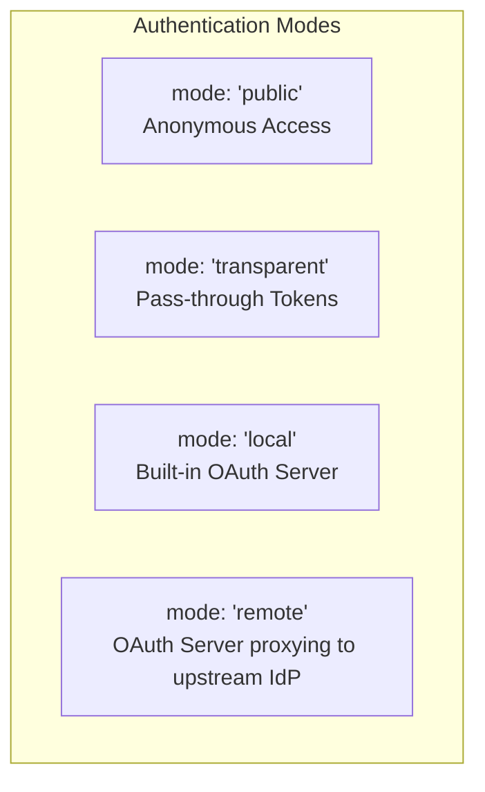
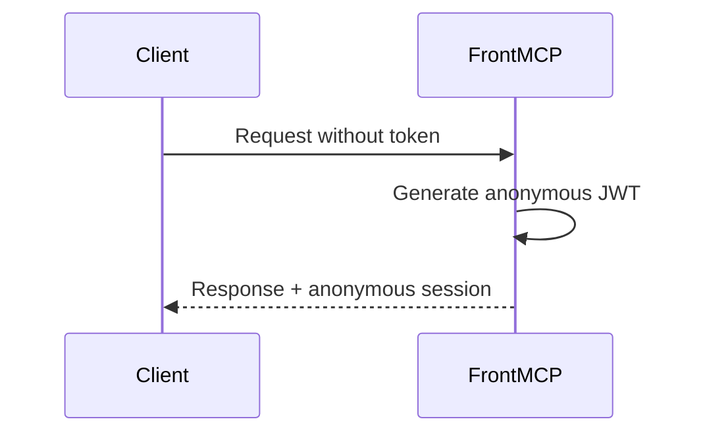
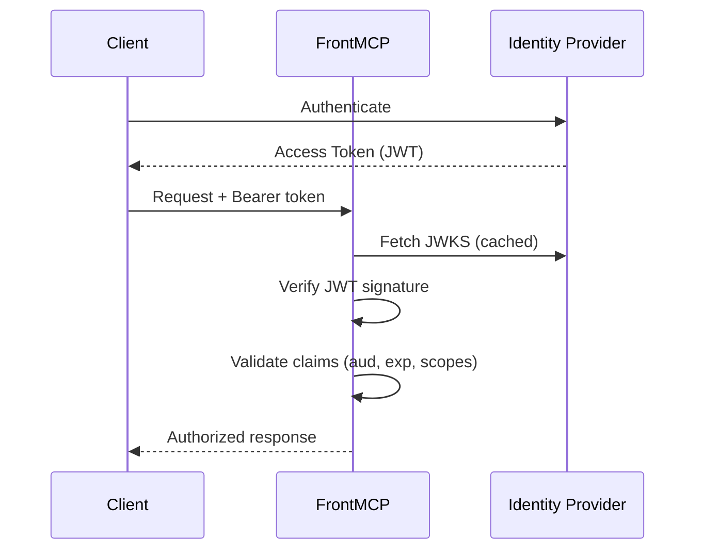
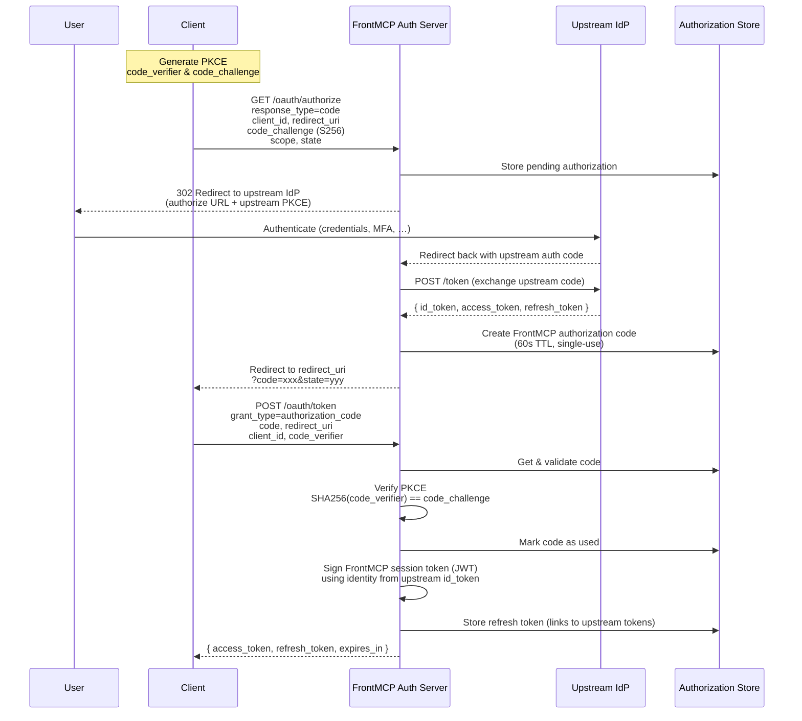
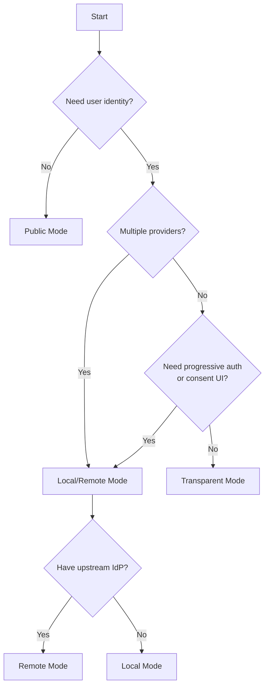
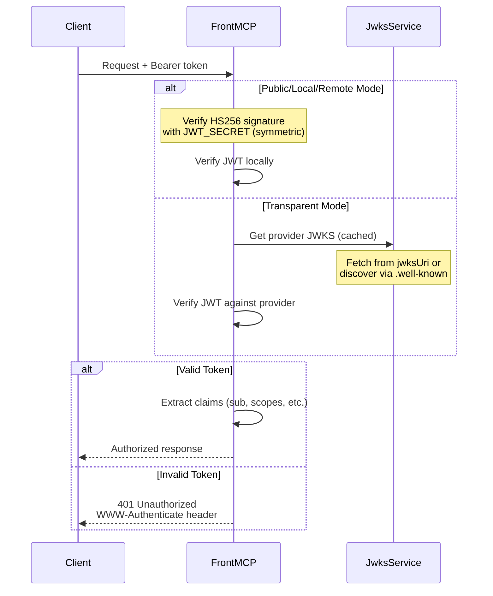

FrontMCP's four authentication modes address different deployment scenarios. Understanding when to use each mode is critical for both security and developer experience.

## Mode Overview

The `auth.mode` literal accepts one of four values: `'public'`, `'transparent'`, `'local'`, `'remote'`.



## Mode Comparison

| Feature              | Public         | Transparent       | Local                       | Remote                 |
| -------------------- | -------------- | ----------------- | --------------------------- | ---------------------- |
| Token Required       | No             | Yes (external)    | Yes (FrontMCP-issued)       | Yes (FrontMCP-issued)  |
| User Identity        | Anonymous      | From upstream IdP | From login form             | From upstream IdP      |
| Token Signing        | HS256 (symmetric) | Upstream IdP   | HS256 (symmetric, `JWT_SECRET`) | HS256 (symmetric, `JWT_SECRET`) |
| Session Management   | Minimal        | Pass-through      | Full control                | Full control           |
| Multi-provider       | No             | Single provider   | Multiple via apps           | Multiple via apps      |
| Progressive Auth     | No             | No                | Yes                         | Yes                    |
| Tool-authz enforcement | No           | No                | Optional (no picker UI)     | Optional (no picker UI) |

---

## Public Mode

No authentication required. All requests receive an anonymous session.

```typescript
const auth: AuthOptionsInput = {
  mode: 'public',
  sessionTtl: 3600, // 1 hour
  anonymousScopes: ['anonymous'],
};
```

### How It Works



### Configuration Options

| Option                   | Type                | Default         | Description                           |
| ------------------------ | ------------------- | --------------- | ------------------------------------- |
| `sessionTtl`             | `number`            | `3600`          | Session lifetime in seconds           |
| `anonymousScopes`        | `string[]`          | `['anonymous']` | Scopes assigned to anonymous sessions |
| `publicAccess.tools`     | `string[] \| 'all'` | `'all'`         | Tools accessible without auth         |
| `publicAccess.prompts`   | `string[] \| 'all'` | `'all'`         | Prompts accessible without auth       |
| `publicAccess.rateLimit` | `number`            | `60`            | Rate limit per IP per minute          |

### Use Cases

<CardGroup cols={2}>
  <Card title="Development" icon="code">
    Rapid prototyping without auth setup overhead
  </Card>
  <Card title="Public APIs" icon="globe">
    Endpoints that don't require user identity
  </Card>
</CardGroup>

<Warning>
  **Do NOT use public mode when you need:**
  - User identity tracking
  - Audit trails
  - Access control per user
  - Compliance requirements
</Warning>

---

## Transparent Mode

Pass-through tokens from an external identity provider. FrontMCP validates tokens but doesn't issue them.

```typescript
const auth: AuthOptionsInput = {
  mode: 'transparent',
  provider: 'https://auth.example.com',
  providerConfig: {
    jwksUri: 'https://auth.example.com/.well-known/jwks.json',
  },
  expectedAudience: 'https://api.myservice.com',
  requiredScopes: ['openid'],
  allowAnonymous: false,
};
```

### How It Works



### Configuration Options

| Option                   | Type                 | Default         | Description                          |
| ------------------------ | -------------------- | --------------- | ------------------------------------ |
| `provider`               | `string`             | Required        | Base URL of the IdP                  |
| `providerConfig.jwksUri` | `string`             | Auto-discovered | Custom JWKS endpoint                 |
| `providerConfig.jwks`    | `JSONWebKeySet`      | -               | Inline JWKS for offline verification |
| `expectedAudience`       | `string \| string[]` | Required        | Required audience claim value(s) — typically the protected resource URL |
| `requiredScopes`         | `string[]`           | `[]`            | Scopes that must be present          |
| `allowAnonymous`         | `boolean`            | `false`         | Allow requests without tokens        |

### Provider Examples

<Tabs>
  <Tab title="Auth0">
    ```typescript
    auth: {
      mode: 'transparent',
      provider: 'https://your-tenant.auth0.com',
      // JWKS discovered automatically from /.well-known/jwks.json
      expectedAudience: 'https://api.yourservice.com',
    }
    ```
  </Tab>
  <Tab title="Okta">
    ```typescript
    auth: {
      mode: 'transparent',
      provider: 'https://your-org.okta.com/oauth2/default',
      expectedAudience: 'api://default',
    }
    ```
  </Tab>
  <Tab title="Azure AD">
    ```typescript
    auth: {
      mode: 'transparent',
      provider: 'https://login.microsoftonline.com/{tenant}/v2.0',
      providerConfig: {
        jwksUri: 'https://login.microsoftonline.com/{tenant}/discovery/v2.0/keys',
      },
      expectedAudience: 'api://{client-id}',
    }
    ```
  </Tab>
</Tabs>

### Use Cases

<CardGroup cols={2}>
  <Card title="Existing IdP Integration" icon="plug">
    Your organization already uses Auth0, Okta, or similar
  </Card>
  <Card title="Single Provider" icon="1">
    All users authenticate through one identity provider
  </Card>
</CardGroup>

<Warning>
  **Do NOT use transparent mode when you need:**
  - Multiple identity providers
  - Progressive authorization (add apps over time)
  - Server-side token storage with silent refresh
  - Custom token claims
</Warning>

---

## Local Mode

FrontMCP acts as a full OAuth 2.1 authorization server with a built-in login form. Self-contained auth server with built-in user management.

```typescript
const auth: AuthOptionsInput = {
  mode: 'local',
  // 'memory' (default) is lost on restart. Use { sqlite: { path } } for
  // single-node persistence or { redis: ... } for multi-instance.
  tokenStorage: 'memory',
};
```

Local mode signs the tokens it issues with **HS256** using the `JWT_SECRET` environment variable (no RSA/EC key pair). See [Local OAuth](/frontmcp/authentication/local) for token signing, persistent `tokenStorage` (memory / sqlite / redis), the `requireEmail` / `anonymousSubject` single-operator options, and tunnel/issuer configuration.

<Warning>
  The built-in login page accepts any email format without validation and is intended for development. Replace with a real identity provider for production use.
</Warning>

## Remote Mode

FrontMCP acts as an OAuth 2.1 authorization server that **proxies user authentication to an upstream IdP**. End users never submit credentials to FrontMCP directly — they're redirected to the upstream IdP, and FrontMCP exchanges the resulting upstream code/tokens before issuing its own session token to the MCP client.

```typescript
const auth: AuthOptionsInput = {
  mode: 'remote',
  provider: 'https://auth.example.com',
  clientId: 'your-client-id',
  clientSecret: 'your-client-secret',
  scopes: ['openid', 'profile', 'email'],
  consent: { enabled: true },
};
```

### How It Works



### Configuration Options

| Option               | Type                                                              | Default              | Description                     |
| -------------------- | ----------------------------------------------------------------- | -------------------- | ------------------------------- |
| `consent`            | `ConsentConfig`                                                   | `{ enabled: false }` | Tool-authorization config (no picker UI — see Local docs) |
| `tokenStorage`       | `'memory' \| { redis: RedisConfig } \| { sqlite: SqliteConfig }` | `'memory'`           | Storage backend (memory / sqlite / redis) |
| `allowDefaultPublic` | `boolean`                                                         | `false`              | Allow unauthenticated requests  |
| `federatedAuth`      | `FederatedAuthConfig`                                            | -                    | Federated auth state validation |
| `incrementalAuth`    | `IncrementalAuthConfig`                                          | `{ enabled: true }`  | Progressive authorization       |

### Consent Configuration

```typescript
consent: {
  enabled: true,
  excludedTools: ['health'],  // always available, never gated
}
```

<Warning>
  `consent.enabled` drives **tool-authorization enforcement** (the authorized tools are carried as a token claim and checked at call time). There is **no interactive tool-selection page** today — the UI-shaped fields (`groupByApp`, `showDescriptions`, `allowSelectAll`, `requireSelection`, `rememberConsent`, `customMessage`) are not yet rendered and have no runtime effect. See [Local OAuth → Consent](/frontmcp/authentication/local#consent-and-tool-authorization).
</Warning>

### Incremental Authorization

```typescript
incrementalAuth: {
  enabled: true,
  allowSkip: true,                    // Allow skipping app auth
  showAllAppsAtOnce: true,            // Show all apps in one page
  skippedAppBehavior: 'require-auth', // 'anonymous' or 'require-auth'
}
```

### Federated Authentication Configuration

Configure how state parameters are validated during federated (multi-provider) authentication flows.

```typescript
federatedAuth: {
  stateValidation: 'strict',  // 'strict' (recommended) or 'format'
}
```

| Option            | Values                 | Description                                                                         |
| ----------------- | ---------------------- | ----------------------------------------------------------------------------------- |
| `stateValidation` | `'strict' \| 'format'` | `'strict'`: Full state match (recommended). `'format'`: Only validates state format |

### OAuth Endpoints

Local and remote modes expose standard OAuth endpoints:

| Endpoint                                  | Method | Description                 |
| ----------------------------------------- | ------ | --------------------------- |
| `/oauth/authorize`                        | GET    | Start authorization flow    |
| `/oauth/token`                            | POST   | Exchange code for tokens    |
| `/oauth/register`                         | POST   | Dynamic Client Registration |
| `/oauth/userinfo`                         | GET    | User profile information    |
| `/.well-known/oauth-authorization-server` | GET    | Server metadata             |
| `/.well-known/jwks.json`                  | GET    | Public signing keys         |

### Use Cases

<CardGroup cols={2}>
  <Card title="Multi-Provider Federation" icon="object-group">
    Combine multiple IdPs under one session (Slack + GitHub + custom)
  </Card>
  <Card title="Progressive Authorization" icon="chart-line">
    Users authorize apps incrementally as needed
  </Card>
  <Card title="Full Token Control" icon="sliders">
    Custom token lifetimes, scopes, and refresh behavior
  </Card>
  <Card title="Tool-Authorization Enforcement" icon="list-check">
    Gate tools by an authorized-tools token claim (no picker UI yet)
  </Card>
</CardGroup>

<Warning>
  **Do NOT use `local` or `remote` mode when:**
  - You only have one IdP and don't need federation (use `transparent` instead)
  - You want to minimize auth complexity
  - Running multiple instances without Redis
</Warning>

---

## Mode Selection Flowchart



---

## Security Comparison

| Security Aspect        | Public         | Transparent           | Local                         | Remote                                         |
| ---------------------- | -------------- | --------------------- | ----------------------------- | ---------------------------------------------- |
| Token Verification     | None           | Against upstream JWKS | HS256 symmetric secret        | HS256 symmetric secret (FrontMCP-issued session) |
| PKCE Support           | N/A            | Depends on IdP        | Always S256                   | Always S256 (downstream); upstream depends on IdP |
| Refresh Token Rotation | N/A            | Depends on IdP        | Always rotated                | Depends on upstream IdP                        |
| Signing Key            | `JWT_SECRET` (symmetric) | Upstream-managed | `JWT_SECRET` (symmetric)  | `JWT_SECRET` (symmetric) + upstream JWKS       |
| Tool-authz enforcement | No             | No                    | Optional (no picker UI)       | Optional (no picker UI)                        |
| Session Revocation     | N/A            | N/A                   | Supported                     | Supported                                      |

---

## Token Verification Flow



---

## Next Steps

<CardGroup cols={2}>
  <Card title="Remote OAuth" icon="cloud" href="/frontmcp/authentication/remote">
    Configure upstream IdP integration
  </Card>
  <Card title="Local OAuth" icon="server" href="/frontmcp/authentication/local">
    Set up self-contained authentication
  </Card>
  <Card title="Progressive Authorization" icon="forward" href="/frontmcp/authentication/progressive">
    Implement incremental app authorization
  </Card>
  <Card title="Production Deployment" icon="rocket" href="/frontmcp/authentication/production">
    Security checklist for production
  </Card>
</CardGroup>
