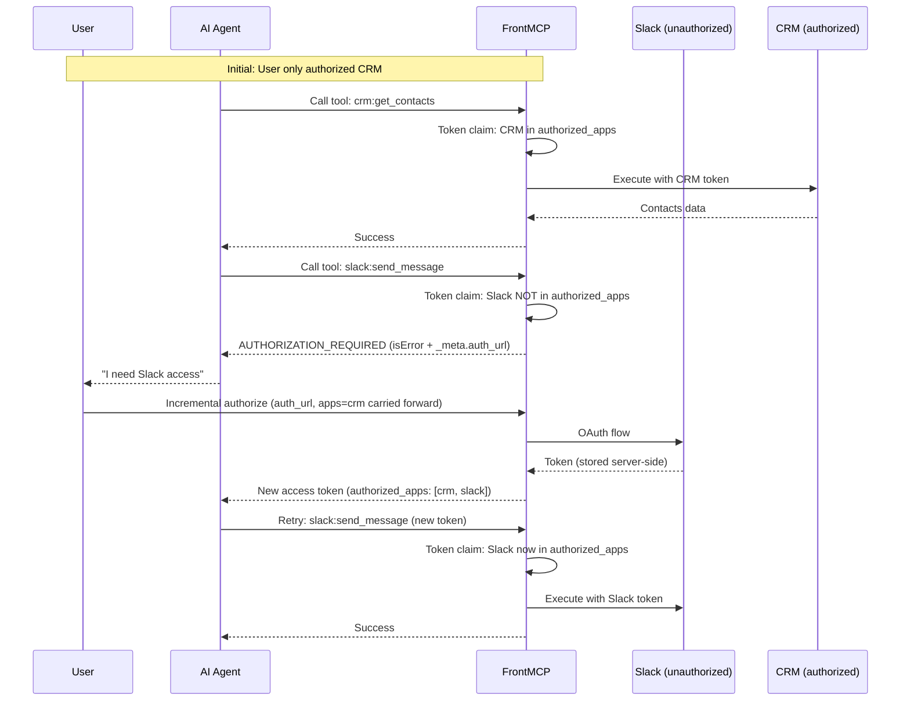
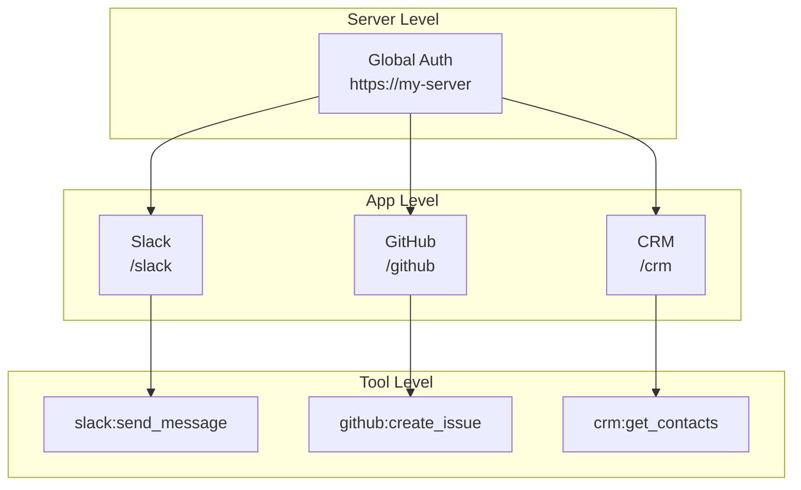

Progressive authorization allows users to authorize apps incrementally, rather than all at once. This improves UX by only requesting access when tools actually need it.

## How It Works



---

## Configuration

Progressive (incremental) authorization is **opt-in** under `auth` in `local`/`remote`
(orchestrated) mode. Setting an `incrementalAuth` block turns on **app-level gating**:
the minted access token carries an `authorized_apps` claim, and a `tools/call` for an
app NOT in that claim is rejected with `AUTHORIZATION_REQUIRED`. A server with **no**
`incrementalAuth` block mints no such claim and performs no app-level gating (the
historical allow‑all behavior is preserved).

```typescript
@FrontMcp({
  info: { name: 'MyServer', version: '1.0.0' },
  auth: {
    mode: 'local',
    incrementalAuth: {
      enabled: true, // turn on app-level gating + incremental expansion
      skippedAppBehavior: 'require-auth', // 'anonymous' (default) | 'require-auth'
      allowSkip: true, // allow skipping apps during initial auth (default true)
      showAllAppsAtOnce: true, // single page vs step-by-step (default true)
    },
    consent: { enabled: true }, // optional: per-tool consent UI (orthogonal)
  },
  apps: [SlackApp, GitHubApp, CrmApp],
})
export class Server {}
```

<Note>
  `incrementalAuth` and `consent` are **independent** features. `consent` gates which
  **tools** a token may call (the `consent` claim); `incrementalAuth` gates which **apps**
  a token may call (the `authorized_apps` claim). You can enable either or both.
</Note>

---

## Authorization Hierarchy

Progressive auth operates at three levels:



---

## Authorized-app set (`authorized_apps` claim)

The granted app set is carried in the minted access token's **`authorized_apps` claim**
and expands as the user authorizes more apps. Each incremental authorize mints a **new**
access token whose claim is the **union** of the apps already granted plus the newly
authorized one:

<CardGroup cols={3}>
  <Card title="Initial State" icon="1">
    Token claim:

    `authorized_apps: ["crm"]`

  </Card>
  <Card title="After Slack Auth" icon="2">
    New token claim:

    `authorized_apps: ["crm", "slack"]`

  </Card>
  <Card title="After GitHub Auth" icon="3">
    New token claim:

    `authorized_apps: ["crm", "slack", "github"]`

  </Card>
</CardGroup>

<Info>
  An incremental authorize mints a **fresh** access token (via the standard OAuth code
  exchange) whose `authorized_apps` claim is expanded — the client swaps in the new token.
  The user's identity (`sub`) is preserved, and apps already granted are **not**
  re-authorized. Upstream provider tokens themselves stay server-side and encrypted at rest
  (orchestrated mode); they are never embedded in the JWT.
</Info>

---

## Authorization Response

When a tool's parent app is not in the token's `authorized_apps` claim, the
`tools/call` resolves to a **`CallToolResult` with `isError: true`** carrying the
authorization metadata under `_meta` (so MCP clients/agents can react structurally and
surface the authorize link). The error class is
[`AuthorizationRequiredError`](/frontmcp/authentication/progressive)
(code `AUTHORIZATION_REQUIRED`, HTTP 403):

```json
{
  "isError": true,
  "content": [
    {
      "type": "text",
      "text": "Authorization required for slack. Please authorize to use slack:send_message.\n\nTo authorize, click: https://my-server/oauth/authorize?app=slack"
    }
  ],
  "_meta": {
    "code": "AUTHORIZATION_REQUIRED",
    "errorId": "…",
    "timestamp": "2026-01-01T00:00:00.000Z",
    "authorization_required": true,
    "app": "slack",
    "tool": "slack:send_message",
    "auth_url": "https://my-server/oauth/authorize?app=slack",
    "required_scopes": ["chat:write"],
    "session_mode": "stateful",
    "supports_incremental": true
  }
}
```

<Note>
  In **stateless** session mode there is no `auth_url` and `supports_incremental` is
  `false` (the grant lives entirely in the JWT and cannot be extended in place — the user
  must re-authenticate). In **stateful** mode the `auth_url` drives the incremental
  authorize below.
</Note>

### Handling in Clients

```typescript
const result = await mcpClient.callTool('slack:send_message', { message: 'Hello' });
if (result.isError && result._meta?.authorization_required) {
  // Show the authorize link to the user, then retry after they authorize.
  console.log(`Please authorize: ${result._meta.auth_url}`);
}
```

---

## Consent UI

<Note>
  The interactive **tool-selection consent screen is rendered** when `consent.enabled` is `true`: after login (or, for federated flows, after the last provider links), `/oauth/callback` shows a tool picker, and the chosen tools are embedded in the token's `consent` claim and enforced on every `tools/call` (an unselected tool is rejected with `TOOL_NOT_CONSENTED`). The mock below illustrates a multi-app authorization variant; the shipped screen is the single tool-selection page. See [Local OAuth → Consent](/frontmcp/authentication/local#consent-and-tool-authorization).
</Note>

The intended consent experience lets users choose which apps to authorize:

```
+----------------------------------------------------------+
|                    Authorize Access                        |
|                                                            |
|  MyApp requests access to the following services:          |
|                                                            |
|  +------------------------------------------------------+  |
|  |  CRM (Auth0)                           [Authorized]  |  |
|  |  Tools: get_contacts, update_contact                 |  |
|  +------------------------------------------------------+  |
|                                                            |
|  +------------------------------------------------------+  |
|  |  Slack                                    [Skipped]  |  |
|  |  Tools: send_message, list_channels                  |  |
|  |                                                      |  |
|  |  [ Authorize Later ]                                 |  |
|  +------------------------------------------------------+  |
|                                                            |
|  +------------------------------------------------------+  |
|  |  GitHub                                   [Pending]  |  |
|  |  Tools: create_issue, list_repos                     |  |
|  |                                                      |  |
|  |  [ Authorize ]  [ Skip ]                             |  |
|  +------------------------------------------------------+  |
|                                                            |
|            [ Continue with authorized apps ]               |
+----------------------------------------------------------+
```

---

## Multi-Provider Setup

### App Configuration

```typescript
@App({
  name: 'Slack',
  auth: {
    mode: 'transparent',
    provider: 'https://slack.com/oauth',
    requiredScopes: ['chat:write', 'channels:read'],
  },
})
export class SlackApp {
  @Tool({ name: 'send_message' })
  async sendMessage(ctx: ToolContext, input: { message: string }) {
    // Uses Slack token from vault
  }
}

@App({
  name: 'GitHub',
  auth: {
    mode: 'transparent',
    provider: 'https://github.com/login/oauth',
    requiredScopes: ['repo', 'user'],
  },
})
export class GitHubApp {
  @Tool({ name: 'create_issue' })
  async createIssue(ctx: ToolContext, input: { title: string }) {
    // Uses GitHub token from vault
  }
}
```

### Server Configuration

```typescript
@FrontMcp({
  info: { name: 'AgentSuite', version: '1.0.0' },
  auth: {
    mode: 'local',
    consent: { enabled: true },
    tokenStorage: {
      redis: {
        host: process.env.REDIS_HOST!,
        port: parseInt(process.env.REDIS_PORT || '6379'),
      },
    },
  },
  apps: [SlackApp, GitHubApp],
})
export class Server {}
```

---

## Standalone vs Nested Apps

Apps can be configured as standalone (direct access) or nested (under parent):

| Configuration                 | Direct Access            | Federated Auth         |
| ----------------------------- | ------------------------ | ---------------------- |
| `standalone: true`            | `/slack/oauth/authorize` | Also in parent consent |
| `standalone: false` (default) | N/A                      | Only via parent        |

```typescript
@App({
  name: 'Slack',
  standalone: true, // Direct access at /slack
  auth: { /* ... */ },
})
export class SlackApp {}
```

---

## Skip and Authorize Later

Users grant a subset of apps initially and authorize more later.

### Initial grant

The client declares the apps to grant on the first authorize via the `apps` query
parameter (comma-separated). If omitted, **all** registered apps are granted (a plain
login keeps working everywhere):

```
GET /oauth/authorize?response_type=code&client_id=…&redirect_uri=…
    &code_challenge=…&code_challenge_method=S256
    &apps=crm
```

The minted token carries `authorized_apps: ["crm"]`; calling a `slack:*` tool then
returns `AUTHORIZATION_REQUIRED` with an `auth_url`.

### Incremental authorization (expand the grant)

To add a skipped app, start an **incremental** authorize. The client carries its current
grant forward via `apps=` so the new token is the **union** of the prior apps plus the
target app:

```
GET /oauth/authorize?response_type=code&client_id=…&redirect_uri=…
    &code_challenge=…&code_challenge_method=S256
    &mode=incremental&app=slack&apps=crm
```

This renders a single-app authorization page; on submit, `/oauth/callback` mints a fresh
code → the client exchanges it for a token with `authorized_apps: ["crm", "slack"]`. The
`auth_url` returned in the 403 `_meta` points the agent straight at this flow.

<Note>
  Unknown app ids passed via `apps=`/`app=` are dropped — a client can never forge a grant
  to a non-existent app. Gating is per real app, so a bogus id is harmless.
</Note>

---

## Session Token Structure

A token minted with incremental auth enabled carries the granted set in `authorized_apps`:

```json
{
  "sub": "user-123",
  "iss": "https://my-server",
  "iat": 1234567890,
  "exp": 1234571490,
  "scope": "crm:read crm:write",
  "authorized_apps": ["crm", "billing"]
}
```

<Warning>
  Upstream provider access/refresh tokens are stored server-side and encrypted at rest
  (orchestrated mode), **never** embedded in the JWT. Only the non-sensitive
  `authorized_apps` id list is carried as a claim.
</Warning>

---

## OpenAPI Adapter Integration

When using OpenAPI adapters, tools are automatically grouped by auth provider:

```typescript
import { OpenapiAdapter } from '@frontmcp/adapters';

@FrontMcp({
  info: { name: 'APIGateway', version: '1.0.0' },
  auth: {
    mode: 'local',
    consent: { enabled: true },
  },
  adapters: [
    OpenapiAdapter.init({
      name: 'github',
      spec: 'https://api.github.com/openapi.json',
      auth: {
        mode: 'transparent',
        provider: 'https://github.com',
        clientId: 'github-client-id',
      },
    }),
    OpenapiAdapter.init({
      name: 'stripe',
      spec: 'https://api.stripe.com/openapi.json',
      auth: {
        mode: 'transparent',
        provider: 'https://connect.stripe.com',
        clientId: 'stripe-client-id',
      },
    }),
  ],
})
export class Server {}
```

Tools from each adapter are grouped by their auth configuration and appear in the consent UI accordingly.

---

## Tool Consent Types

When consent is enabled, FrontMCP tracks granular tool-level authorization using these types:

### ConsentToolItem

Represents a tool in the consent UI:

| Field | Type | Description |
| ----- | ---- | ----------- |
| `id` | `string` | Tool identifier |
| `name` | `string` | Display name |
| `description` | `string` | Tool description |
| `appId` | `string` | Parent app ID |
| `requiredScopes` | `string[]` | OAuth scopes needed |
| `category` | `string` | Grouping category |

### ConsentSelection

Captures the user's tool selection:

| Field | Type | Description |
| ----- | ---- | ----------- |
| `selectedTools` | `string[]` | Tool IDs the user authorized |
| `allSelected` | `boolean` | Whether all tools were selected |
| `consentedAt` | `number` | Timestamp of consent |
| `consentVersion` | `string` | Schema version for migration |

### ConsentState

Full consent flow state passed to the consent UI:

| Field | Type | Description |
| ----- | ---- | ----------- |
| `availableTools` | `ConsentToolItem[]` | All tools requiring consent |
| `preSelected` | `string[]` | Tools pre-selected by default |
| `groupBy` | `string` | Grouping field (e.g., `appId`, `category`) |

### FederatedLoginState

For multi-provider consent where users select which IdPs to authenticate with:

| Field | Type | Description |
| ----- | ---- | ----------- |
| `providers` | `FederatedProviderItem[]` | Available identity providers |
| `required` | `string[]` | Providers that cannot be skipped |
| `optional` | `string[]` | Providers the user can skip |

---

## Best Practices

<Check>**Request minimal apps** - Pass `apps=` to grant only what the agent needs up front</Check>
<Check>**Provide clear descriptions** - Users should understand why each app is needed</Check>
<Check>**Handle the 403 structurally** - Read `result._meta.auth_url` and surface it to the user</Check>
<Check>**Use stateful sessions** - Required for the incremental `auth_url` (stateless omits it)</Check>
<Check>**Carry `apps=` forward** - On an incremental authorize, include the prior grant so it isn't lost</Check>

---

## Troubleshooting

<AccordionGroup>
  <Accordion title="Every tool call returns AUTHORIZATION_REQUIRED">
    - Confirm the client sent `apps=` on the initial authorize (or omit it to grant all apps).
    - The `authorized_apps` claim only appears when `incrementalAuth` is enabled — verify the
      `auth` block has an `incrementalAuth` object (an empty `{}` enables it with defaults).
    - App ids in `apps=`/`app=` must match the app's id (`metadata.id`, else the slug of
      `name`); unknown ids are dropped.
  </Accordion>
  <Accordion title="Incremental authorize didn't expand the grant">
    - The client must carry its current grant forward via `apps=` on the incremental
      authorize; otherwise only the target app (plus nothing) is granted.
    - The new token from the code exchange replaces the old one — make sure the client swaps
      it in before retrying the call.
    - Confirm `incrementalAuth.enabled` is not `false`.
  </Accordion>
  <Accordion title="Auth link (auth_url) not working">
    - The `auth_url` is in the failed call's `result._meta.auth_url` (only in **stateful**
      session mode; stateless mode omits it).
    - Verify the target app is registered with the server and redirect URIs are configured.
  </Accordion>
</AccordionGroup>

---

## Next Steps

<CardGroup cols={2}>
  <Card title="Remote OAuth" icon="cloud" href="/frontmcp/authentication/remote">
    Configure external identity providers
  </Card>
  <Card title="Tokens & Sessions" icon="key" href="/frontmcp/authentication/token">
    Token lifecycle and session management
  </Card>
  <Card title="Production Checklist" icon="clipboard-check" href="/frontmcp/authentication/production">
    Security requirements for deployment
  </Card>
  <Card title="Authorization Modes" icon="layer-group" href="/frontmcp/authentication/modes">
    Choose the right auth mode
  </Card>
</CardGroup>
