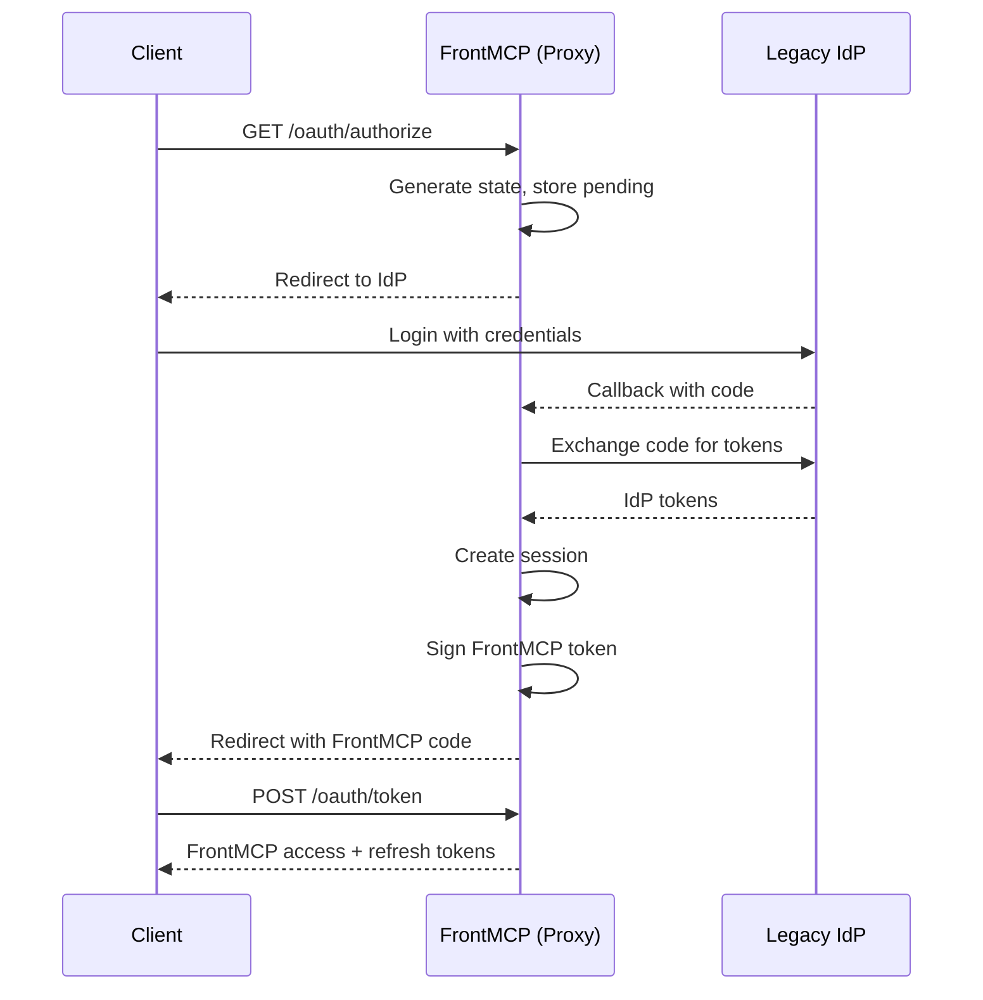

Some identity providers don't support Dynamic Client Registration (DCR). FrontMCP's OAuth proxy bridges this gap by acting as a local OAuth server while delegating user authentication to the upstream IdP.

## When to Use OAuth Proxy

<CardGroup cols={2}>
  <Card title="Use Proxy When" icon="check">
    - IdP doesn't support DCR
    - Need custom token claims
    - Want unified auth endpoints
    - Require consent UI layer
  </Card>
  <Card title="Use Direct When" icon="xmark">
    - IdP supports DCR (Auth0, Okta)
    - Simple pass-through needed
    - No custom claims required
    - Direct transparent mode works
  </Card>
</CardGroup>

---

## How It Works



The proxy maintains:

- **Client registration** with pre-provisioned credentials
- **JWKS** for signing FrontMCP tokens
- **Session state** linking upstream tokens to local sessions
- **Token vault** storing upstream tokens for API calls

---

## Configuration

### Basic Setup

```typescript
@FrontMcp({
  info: { name: 'MyServer', version: '1.0.0' },
  auth: {
    mode: 'orchestrated',
    type: 'remote',
    remote: {
      provider: 'https://legacy-idp.example.com',
      clientId: 'pre-provisioned-client-id',
      clientSecret: process.env.IDP_CLIENT_SECRET,
      scopes: ['openid', 'profile', 'email'],
    },
    consent: { enabled: true },
    sessionMode: 'stateful',
  },
})
export class Server {}
```

### Configuration Options

| Option                | Type                        | Default              | Description                          |
| --------------------- | --------------------------- | -------------------- | ------------------------------------ |
| `remote.provider`     | `string`                    | Required             | Upstream IdP base URL                |
| `remote.clientId`     | `string`                    | Required             | Pre-registered client ID             |
| `remote.clientSecret` | `string`                    | -                    | Client secret (confidential clients) |
| `remote.scopes`       | `string[]`                  | `['openid']`         | Scopes to request from IdP           |
| `consent`             | `ConsentConfig`             | `{ enabled: false }` | Consent UI configuration             |
| `sessionMode`         | `'stateful' \| 'stateless'` | `'stateful'`         | Session strategy                     |

---

## Endpoint Overrides

For non-standard IdPs, override auto-discovered endpoints:

```typescript
auth: {
  mode: 'orchestrated',
  type: 'remote',
  remote: {
    provider: 'https://legacy-idp.example.com',
    clientId: 'my-client',
    clientSecret: process.env.SECRET,

    // Override endpoints
    authEndpoint: 'https://legacy-idp.example.com/authorize',
    tokenEndpoint: 'https://legacy-idp.example.com/token',
    userInfoEndpoint: 'https://legacy-idp.example.com/userinfo',
    jwksUri: 'https://legacy-idp.example.com/keys',
  },
}
```

### Inline JWKS

For IdPs without a JWKS endpoint:

```typescript
remote: {
  provider: 'https://legacy-idp.example.com',
  jwks: {
    keys: [
      {
        kty: 'RSA',
        kid: 'key-1',
        alg: 'RS256',
        n: '...',
        e: 'AQAB',
      },
    ],
  },
}
```

---

## Token Management

### Upstream Token Storage

The proxy stores upstream IdP tokens in the token vault:

```typescript
// Token vault structure (server-side)
{
  session_id: 'sess_abc123',
  frontmcp_tokens: {
    access_token: 'eyJ...',  // FrontMCP-issued
    refresh_token: 'frt_...',
  },
  upstream_tokens: {
    access_token: 'idp_...',  // From legacy IdP
    refresh_token: 'idp_rt_...',
    expires_at: 1234567890,
  },
}
```

### Automatic Refresh

When upstream tokens expire, the proxy handles refresh:

```typescript
auth: {
  mode: 'orchestrated',
  type: 'remote',
  remote: {
    provider: 'https://legacy-idp.example.com',
    clientId: 'my-client',
    refreshUpstream: true, // Auto-refresh upstream tokens
  },
  refresh: {
    accessTokenTtl: 3600,
    refreshTokenTtl: 604800,
  },
}
```

---

## Custom Claims

Add claims from upstream user info to FrontMCP tokens:

```typescript
auth: {
  mode: 'orchestrated',
  type: 'remote',
  remote: {
    provider: 'https://legacy-idp.example.com',
    clientId: 'my-client',
  },
  tokenClaims: async (upstreamUser) => ({
    // Map upstream claims to FrontMCP token
    department: upstreamUser.department,
    employee_id: upstreamUser.employee_number,
    roles: upstreamUser.groups?.map(g => g.name) ?? [],
  }),
}
```

---

## Multi-Provider Proxy

Proxy multiple IdPs under one FrontMCP instance:

```typescript
@App({
  name: 'CRM',
  auth: {
    mode: 'orchestrated',
    type: 'remote',
    remote: {
      provider: 'https://crm-idp.example.com',
      clientId: process.env.CRM_CLIENT_ID,
      clientSecret: process.env.CRM_CLIENT_SECRET,
    },
  },
})
export class CrmApp {}

@App({
  name: 'ERP',
  auth: {
    mode: 'orchestrated',
    type: 'remote',
    remote: {
      provider: 'https://erp-idp.example.com',
      clientId: process.env.ERP_CLIENT_ID,
      clientSecret: process.env.ERP_CLIENT_SECRET,
    },
  },
})
export class ErpApp {}

@FrontMcp({
  info: { name: 'EnterpriseSuite', version: '1.0.0' },
  apps: [CrmApp, ErpApp],
  auth: {
    mode: 'orchestrated',
    type: 'local',
    consent: { enabled: true },
    sessionMode: 'stateful',
  },
})
export class Server {}
```

<Info>
  Each app maintains its own upstream token in the vault. Users authenticate once per app via progressive authorization.
</Info>

---

## Proxy vs Direct Comparison

| Aspect          | OAuth Proxy      | Direct (Transparent)    |
| --------------- | ---------------- | ----------------------- |
| Token Issuer    | FrontMCP         | Upstream IdP            |
| JWKS            | FrontMCP-managed | IdP-managed             |
| Session Control | Full             | Pass-through            |
| Custom Claims   | Yes              | No                      |
| Consent UI      | Optional         | No                      |
| DCR Required    | No               | Yes (or pre-registered) |
| Complexity      | Higher           | Lower                   |

---

## Security Considerations

<Warning>
  **Store client secrets securely**. Never commit secrets to version control. Use environment variables or a secrets manager.
</Warning>

<Check>**Validate redirect URIs** - Ensure callback URLs are registered with the upstream IdP</Check>
<Check>**Use HTTPS** - All communication with upstream IdP must be encrypted</Check>
<Check>**Rotate secrets** - Periodically rotate client secrets</Check>
<Check>**Monitor token usage** - Log and alert on unusual token patterns</Check>

---

## Troubleshooting

<AccordionGroup>
  <Accordion title="Callback fails with state mismatch">
    - Ensure session storage is configured (Redis for multi-instance)
    - Check that pending authorization TTL hasn't expired
    - Verify the state parameter is being preserved
  </Accordion>
  <Accordion title="Upstream token exchange fails">
    - Verify client credentials are correct
    - Check that redirect URI matches exactly (including trailing slash)
    - Ensure scopes requested are allowed by IdP configuration
  </Accordion>
  <Accordion title="User info not available">
    - Confirm `openid` and `profile` scopes are requested
    - Check userinfo endpoint is accessible
    - Verify IdP returns expected claims
  </Accordion>
  <Accordion title="Refresh token not working">
    - Some IdPs require `offline_access` scope for refresh tokens
    - Check if IdP rotates refresh tokens (handle rotation)
    - Verify refresh token hasn't been revoked
  </Accordion>
</AccordionGroup>

---

## Next Steps

<CardGroup cols={2}>
  <Card title="Remote OAuth" icon="cloud" href="/frontmcp/authentication/remote">
    Direct IdP integration without proxy
  </Card>
  <Card title="Progressive Authorization" icon="forward" href="/frontmcp/authentication/progressive">
    Incremental app authorization
  </Card>
  <Card title="Production Checklist" icon="clipboard-check" href="/frontmcp/authentication/production">
    Security requirements for deployment
  </Card>
  <Card title="Tokens & Sessions" icon="key" href="/frontmcp/authentication/token">
    Token lifecycle management
  </Card>
</CardGroup>
