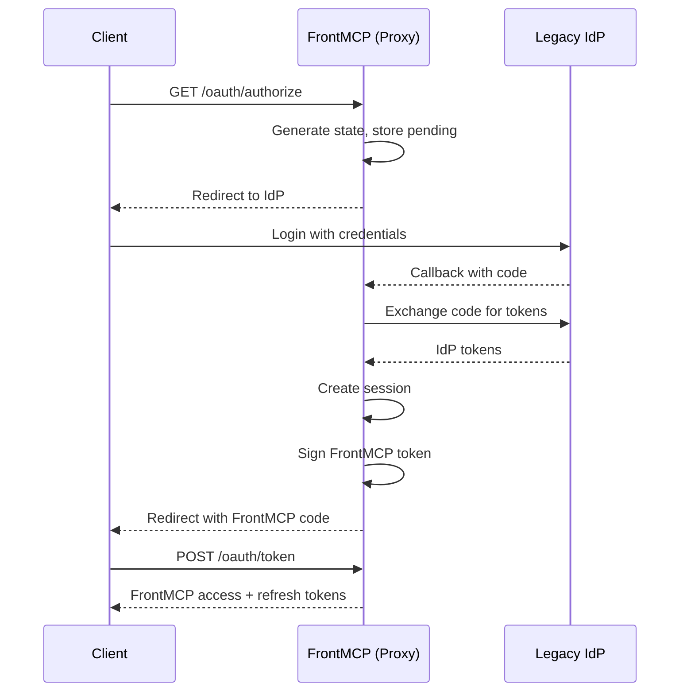

Some identity providers don't support Dynamic Client Registration (DCR). FrontMCP's OAuth proxy bridges this gap by acting as a local OAuth server while delegating user authentication to the upstream IdP.

<Info>
  `mode: 'remote'` proxies to **one mandatory** upstream IdP. `GET /oauth/authorize`
  redirects straight to that IdP (no FrontMCP login page, no provider-selection
  page). FrontMCP exchanges the returned code, stores the upstream tokens
  (encrypted), derives the session identity from the **upstream** user, mints its
  own HS256 session token, and exposes the upstream token to tools via
  `this.orchestration.getToken('<provider-id>')`. A **pre-registered** `clientId`
  is required today (DCR is not yet wired — see below).
</Info>

## When to Use OAuth Proxy

<CardGroup cols={2}>
  <Card title="Use Proxy When" icon="check">
    - IdP doesn't support DCR
    - Need custom token claims
    - Want unified auth endpoints
    - Require consent UI layer
  </Card>
  <Card title="Use Direct When" icon="xmark">
    - IdP supports DCR (Auth0, Okta)
    - Simple pass-through needed
    - No custom claims required
    - Direct transparent mode works
  </Card>
</CardGroup>

---

## How It Works


```mermaid
sequenceDiagram
    participant Client
    participant FrontMCP as FrontMCP (Proxy)
    participant IdP as Legacy IdP

    Client->>FrontMCP: GET /oauth/authorize
    FrontMCP->>FrontMCP: Generate state, store pending
    FrontMCP-->>Client: Redirect to IdP

    Client->>IdP: Login with credentials
    IdP-->>FrontMCP: Callback with code

    FrontMCP->>IdP: Exchange code for tokens
    IdP-->>FrontMCP: IdP tokens

    FrontMCP->>FrontMCP: Create session
    FrontMCP->>FrontMCP: Sign FrontMCP token
    FrontMCP-->>Client: Redirect with FrontMCP code

    Client->>FrontMCP: POST /oauth/token
    FrontMCP-->>Client: FrontMCP access + refresh tokens
```

The proxy maintains:

- **Client registration** with pre-provisioned credentials
- **JWKS** for signing FrontMCP tokens
- **Session state** linking upstream tokens to local sessions
- **Token vault** storing upstream tokens for API calls

---

## Configuration

### Basic Setup

```typescript
@FrontMcp({
  info: { name: 'MyServer', version: '1.0.0' },
  auth: {
    mode: 'remote',
    provider: 'https://legacy-idp.example.com',
    clientId: 'pre-provisioned-client-id',
    clientSecret: process.env.IDP_CLIENT_SECRET,
    scopes: ['openid', 'profile', 'email'],
    consent: { enabled: true },
  },
})
export class Server {}
```

### Configuration Options

| Option           | Type             | Default              | Description                                  |
| ---------------- | ---------------- | -------------------- | -------------------------------------------- |
| `provider`       | `string`         | Required             | Upstream IdP base URL                        |
| `clientId`       | `string`         | Required             | Pre-registered client ID                     |
| `clientSecret`   | `string`         | -                    | Client secret (confidential clients)         |
| `scopes`         | `string[]`       | `['openid']`         | Scopes to request from IdP                   |
| `providerConfig` | `ProviderConfig` | -                    | Endpoint overrides and IdP-specific settings |
| `consent`        | `ConsentConfig`  | `{ enabled: false }` | Consent UI configuration                     |

---

## Endpoint Overrides

For non-standard IdPs, override auto-discovered endpoints:

```typescript
auth: {
  mode: 'remote',
  provider: 'https://legacy-idp.example.com',
  clientId: 'my-client',
  clientSecret: process.env.SECRET,
  providerConfig: {
    // Override endpoints
    authEndpoint: 'https://legacy-idp.example.com/authorize',
    tokenEndpoint: 'https://legacy-idp.example.com/token',
    userInfoEndpoint: 'https://legacy-idp.example.com/userinfo',
    jwksUri: 'https://legacy-idp.example.com/keys',
  },
}
```

### Inline JWKS

For IdPs without a JWKS endpoint:

```typescript
auth: {
  mode: 'remote',
  provider: 'https://legacy-idp.example.com',
  clientId: 'my-client',
  providerConfig: {
    jwks: {
      keys: [
        {
          kty: 'RSA',
          kid: 'key-1',
          alg: 'RS256',
          n: '...',
          e: 'AQAB',
        },
      ],
    },
  },
}
```

---

## Token Management

### Upstream Token Storage

The proxy stores upstream IdP tokens in the token vault:

```typescript
// Token vault structure (server-side)
{
  session_id: 'sess_abc123',
  frontmcp_tokens: {
    access_token: 'eyJ...',  // FrontMCP-issued
    refresh_token: 'frt_...',
  },
  upstream_tokens: {
    access_token: 'idp_...',  // From legacy IdP
    refresh_token: 'idp_rt_...',
    expires_at: 1234567890,
  },
}
```

### Automatic Refresh

<Warning>
  **Not yet wired.** On-demand refresh of the **upstream** token is not currently
  performed. The encrypted token store evicts a provider record (including its
  refresh token) as soon as the upstream access token expires, so once the
  upstream token lapses `this.orchestration.getToken()` returns `null`/throws and
  the user must re-authenticate (revisit `/oauth/authorize`). The `refresh`
  option below is accepted by the schema but does not yet drive upstream refresh.
  (FrontMCP's **own** session token still refreshes normally via the standard
  `refresh_token` grant at `/oauth/token`.)
</Warning>

```typescript
auth: {
  mode: 'remote',
  provider: 'https://legacy-idp.example.com',
  clientId: 'my-client',
  // Accepted but does not yet refresh the UPSTREAM token (see warning above).
  refresh: {
    enabled: true,
    skewSeconds: 60,
  },
}
```

---

## Reading the Upstream Token

The upstream IdP token is stored server-side (encrypted) and read by tools via
the orchestration accessor — it is never exposed to the LLM:

```typescript
@Tool({ name: 'whoami' })
class Whoami extends ToolContext {
  async execute() {
    // 'upstream' is providerConfig.id (or the derived provider-host id).
    const token = await this.orchestration.tryGetToken('upstream');
    if (!token) return { error: 'Upstream token not available — re-authenticate' };
    const res = await this.fetch('https://legacy-idp.example.com/api/me', {
      headers: { Authorization: `Bearer ${token}` },
    });
    return await res.json();
  }
}
```

## Custom Claims

Custom claims are sourced from the upstream identity provider. Configure your IdP to include the claims you need on the upstream JWT (department, employee_id, roles, etc.); FrontMCP forwards them through `this.context.authInfo` (or, for typed access, `this.auth.claims`).

---

## Multi-Provider Proxy

Proxy multiple IdPs under one FrontMCP instance:

```typescript
@App({
  name: 'CRM',
  auth: {
    mode: 'remote',
    provider: 'https://crm-idp.example.com',
    clientId: process.env.CRM_CLIENT_ID,
    clientSecret: process.env.CRM_CLIENT_SECRET,
  },
})
export class CrmApp {}

@App({
  name: 'ERP',
  auth: {
    mode: 'remote',
    provider: 'https://erp-idp.example.com',
    clientId: process.env.ERP_CLIENT_ID,
    clientSecret: process.env.ERP_CLIENT_SECRET,
  },
})
export class ErpApp {}

@FrontMcp({
  info: { name: 'EnterpriseSuite', version: '1.0.0' },
  apps: [CrmApp, ErpApp],
  auth: {
    mode: 'local',
    consent: { enabled: true },
  },
})
export class Server {}
```

<Info>
  Each app's upstream token is stored server-side (encrypted). With
  [progressive authorization](/frontmcp/authentication/progressive) enabled
  (`auth.incrementalAuth`), users authorize apps one at a time: the minted token's
  `authorized_apps` claim gates which apps a call may reach, and an incremental authorize
  expands that claim (a fresh token with the union of granted apps) without re-authorizing
  the apps already granted.
</Info>

---

## Proxy vs Direct Comparison

| Aspect          | OAuth Proxy      | Direct (Transparent)    |
| --------------- | ---------------- | ----------------------- |
| Token Issuer    | FrontMCP         | Upstream IdP            |
| JWKS            | FrontMCP-managed | IdP-managed             |
| Session Control | Full             | Pass-through            |
| Custom Claims   | Yes              | No                      |
| Consent UI      | Optional         | No                      |
| DCR Required    | No               | Yes (or pre-registered) |
| Complexity      | Higher           | Lower                   |

---

## Security Considerations

<Warning>
  **Store client secrets securely**. Never commit secrets to version control. Use environment variables or a secrets manager.
</Warning>

<Check>**Validate redirect URIs** - Ensure callback URLs are registered with the upstream IdP</Check>
<Check>**Use HTTPS** - All communication with upstream IdP must be encrypted</Check>
<Check>**Rotate secrets** - Periodically rotate client secrets</Check>
<Check>**Monitor token usage** - Log and alert on unusual token patterns</Check>

---

## Troubleshooting

<AccordionGroup>
  <Accordion title="Callback fails with state mismatch">
    - Ensure session storage is configured (Redis for multi-instance)
    - Check that pending authorization TTL hasn't expired
    - Verify the state parameter is being preserved
  </Accordion>
  <Accordion title="Upstream token exchange fails">
    - Verify client credentials are correct
    - Check that redirect URI matches exactly (including trailing slash)
    - Ensure scopes requested are allowed by IdP configuration
  </Accordion>
  <Accordion title="User info not available">
    - Confirm `openid` and `profile` scopes are requested
    - Check userinfo endpoint is accessible
    - Verify IdP returns expected claims
  </Accordion>
  <Accordion title="Refresh token not working">
    - Some IdPs require `offline_access` scope for refresh tokens
    - Check if IdP rotates refresh tokens (handle rotation)
    - Verify refresh token hasn't been revoked
  </Accordion>
</AccordionGroup>

---

## Next Steps

<CardGroup cols={2}>
  <Card title="Remote OAuth" icon="cloud" href="/frontmcp/authentication/remote">
    Direct IdP integration without proxy
  </Card>
  <Card title="Progressive Authorization" icon="forward" href="/frontmcp/authentication/progressive">
    Incremental app authorization
  </Card>
  <Card title="Production Checklist" icon="clipboard-check" href="/frontmcp/authentication/production">
    Security requirements for deployment
  </Card>
  <Card title="Tokens & Sessions" icon="key" href="/frontmcp/authentication/token">
    Token lifecycle management
  </Card>
</CardGroup>
