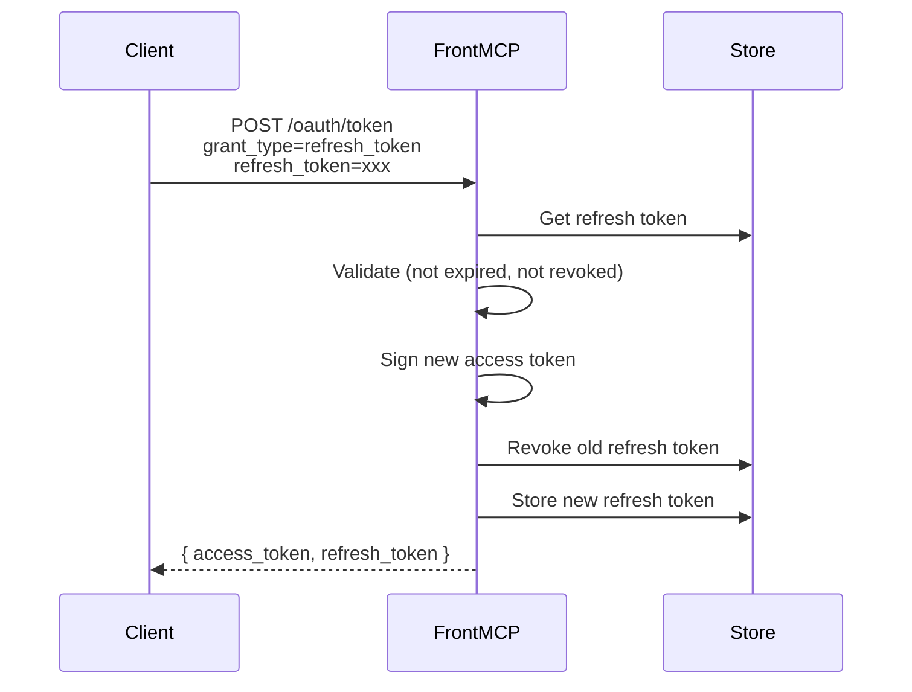
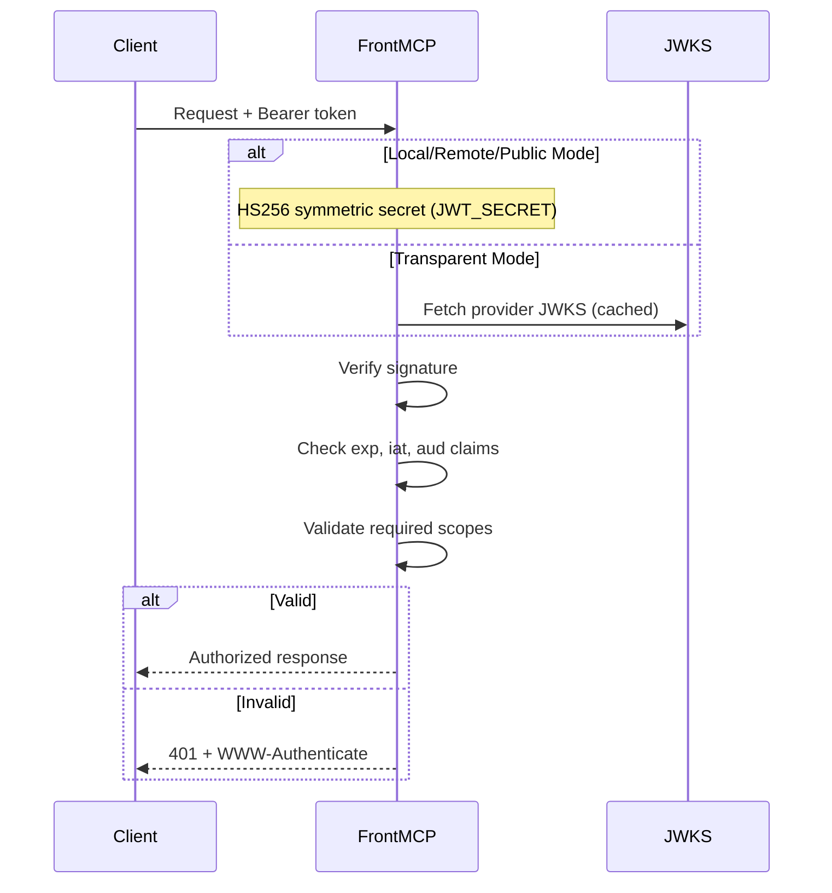

FrontMCP provides flexible token and session management with support for both stateful and stateless patterns.

## Token Types

| Token                  | Purpose                  | Lifetime           | Storage                 |
| ---------------------- | ------------------------ | ------------------ | ----------------------- |
| **Access Token**       | API authorization        | 1 hour (default)   | Client-side (JWT)       |
| **Refresh Token**      | Obtain new access tokens | 30 days (default)  | Server-side             |
| **Authorization Code** | OAuth flow exchange      | 60 seconds         | Server-side, single-use |
| **Session Token**      | Track user session       | Configurable       | Depends on mode         |

---

## Session Modes

FrontMCP supports two session management strategies:

<CardGroup cols={2}>
  <Card title="Stateful Sessions" icon="database">
    Tokens stored server-side. Clients hold lightweight references.

    **Pros:**
    - Silent token refresh
    - Revocation without client update
    - Secure token storage

    **Cons:**
    - Requires shared storage (Redis)
    - State management complexity

  </Card>
  <Card title="Stateless Sessions" icon="file-code">
    All data embedded in JWT. No server-side storage.

    **Pros:**
    - Horizontally scalable
    - No shared state
    - Simple architecture

    **Cons:**
    - No silent refresh
    - Larger token size
    - Can't revoke without expiry

  </Card>
</CardGroup>

### Stateful Session Configuration

```typescript
@FrontMcp({
  info: { name: 'MyServer', version: '1.0.0' },
  auth: {
    mode: 'local',
    tokenStorage: {
      redis: {
        host: 'localhost',
        port: 6379,
        keyPrefix: 'myapp:auth:',
      },
    },
  },
})
export class Server {}
```

### Stateless Session Configuration

```typescript
@FrontMcp({
  info: { name: 'MyServer', version: '1.0.0' },
  auth: {
    mode: 'local',
  },
})
export class Server {}
```

<Warning>
  **Stateful sessions require shared storage** when running multiple server instances. Without Redis, each instance maintains its own session state.
</Warning>

---

## Token Storage

`tokenStorage` (on `local`/`remote` auth) persists authorization codes, refresh tokens, and federated-auth sessions. Three backends are supported.

### In-Memory (Development)

```typescript
tokenStorage: 'memory' // default
```

<Info>
  In-memory storage loses all data on restart. Use only for development.
</Info>

### SQLite (Single-Node Persistence)

```typescript
tokenStorage: {
  sqlite: {
    path: './data/auth.sqlite',          // required
    encryption: { secret: process.env.AUTH_DB_SECRET! }, // optional at-rest encryption
    walMode: true,                       // default true
    ttlCleanupIntervalMs: 60000,         // default 60000
  },
}
```

Requires `@frontmcp/storage-sqlite` (lazy-loaded).

### Redis (Multi-Instance Persistence)

```typescript
tokenStorage: {
  redis: {
    host: 'redis.example.com',
    port: 6379,
    password: process.env.REDIS_PASSWORD,
    keyPrefix: 'auth:',
    tls: true,
  },
}
```

### Storage Contents

| Key Pattern               | Data                  | TTL          |
| ------------------------- | --------------------- | ------------ |
| `{prefix}pending:{id}`    | Pending authorization | 10 minutes   |
| `{prefix}code:{code}`     | Authorization code    | 60 seconds   |
| `{prefix}refresh:{token}` | Refresh token         | 30 days      |
| `{prefix}session:{id}`    | Session data          | Configurable |

---

## OrchestratedTokenStore Interface

When using local or remote mode with federated authentication, FrontMCP stores provider tokens using the `OrchestratedTokenStore` interface.

### Interface Methods

| Method                                             | Description                              |
| -------------------------------------------------- | ---------------------------------------- |
| `storeTokens(authorizationId, providerId, tokens)` | Store tokens for a provider              |
| `getTokens(authorizationId, providerId)`           | Retrieve tokens for a provider           |
| `deleteTokens(authorizationId, providerId)`        | Delete tokens for a provider             |
| `getProviderIds(authorizationId)`                  | Get all provider IDs with stored tokens  |
| `migrateTokens(fromAuthId, toAuthId)`              | Migrate tokens between authorization IDs |

### Token Migration

The `migrateTokens()` method is used internally during federated auth completion to transfer tokens from a pending authorization ID to the final authorization ID:

```typescript
import { InMemoryOrchestratedTokenStore } from '@frontmcp/auth';

const tokenStore = new InMemoryOrchestratedTokenStore();

// During federated auth, tokens are stored with pending ID
await tokenStore.storeTokens('pending:abc123', 'github', {
  accessToken: 'gho_xxx',
  refreshToken: 'ghr_xxx',
});

// After JWT issuance, tokens are migrated to real auth ID
await tokenStore.migrateTokens('pending:abc123', 'user:real-auth-id');

// Query which providers have tokens
const providerIds = await tokenStore.getProviderIds('user:real-auth-id');
// => ['github']
```

<Info>
  `migrateTokens()` is called automatically during the OAuth token exchange flow when completing federated authentication.
</Info>

---

## Token Lifetimes

FrontMCP uses default token lifetimes:

| Token Type         | Default Lifetime |
| ------------------ | ---------------- |
| Access Token       | 1 hour           |
| Refresh Token      | 30 days          |
| Authorization Code | 60 seconds       |

### Token Refresh Configuration

```typescript
auth: {
  mode: 'local',
  refresh: {
    enabled: true,      // Proactively refresh upstream/downstream provider creds
    skewSeconds: 60,    // …this many seconds before THOSE provider tokens expire
  },
}
```

<Info>
  The `refresh` block governs proactive refresh of **upstream/downstream provider credentials** (the tokens read via `this.authProviders` / `this.orchestration.getToken`), not the server's own session token. There is no background refresher for FrontMCP's own access token: the **client** refreshes its session token explicitly by calling `POST /oauth/token` with `grant_type=refresh_token` (see [Token Refresh Flow](#token-refresh-flow)). Server-issued token lifetimes are fixed at the server level, and refresh tokens are rotated on each use per OAuth 2.1 best practices.
</Info>

---

## Token Refresh Flow

Refresh tokens are rotated on each use (OAuth 2.1 best practice):



---

## JWT Structure

Access tokens issued by `local`/`remote` mode are JWTs signed with **HS256** (symmetric, `JWT_SECRET`). There is no `kid` because there is no key set to select from:

```json
{
  "header": {
    "alg": "HS256",
    "typ": "JWT"
  },
  "payload": {
    "sub": "user-uuid",
    "iss": "http://localhost:3001",
    "aud": "https://api.myservice.com",
    "exp": 1234567890,
    "iat": 1234567800,
    "jti": "unique-token-id",
    "scope": "read write",
    "email": "user@example.com"
  }
}
```

### Custom Claims

In transparent/remote modes, custom claims are sourced from the upstream identity provider — configure your IdP to include the claims you need (roles, tenant ID, etc.).

In `local` mode, your `authenticate()` handler can return and customize the claims FrontMCP embeds in the issued token: resolve a `{ ok: true, sub?, claims? }` result and the `claims` object is merged into the minted access-token payload (namespaced to avoid clobbering reserved claims like `sub`/`exp`/`iss`).

Either way, read the claims via `this.context.authInfo?.user` (raw) or `this.auth.claims` (typed) inside tools, resources, prompts, and agents.

---

## Consent & Tool Authorization

Enable `consent` to enforce a per-token authorized-tools claim:

```typescript
auth: {
  mode: 'local',
  consent: { enabled: true },
}
```

### How Consent Works Today

1. User authenticates via the built-in login page.
2. `/oauth/callback` renders an **interactive tool-selection screen** listing the available tools (honoring `groupByApp`, `showDescriptions`, `allowSelectAll`, `requireSelection`, `customMessage`, `excludedTools`, `defaultSelectedTools`).
3. The user's checked tools are GET-submitted back to `/oauth/callback`, embedded in the token's `consent.selectedTools` claim, and **enforced on every `tools/call`** — an unselected tool is rejected with `TOOL_NOT_CONSENTED` (JSON-RPC `-32003`).

<Note>
  Tokens minted without consent (consent disabled, or created via the test/programmatic factory) carry no `consent` claim and stay all-tools-allowed. `excludedTools` are always available. `rememberConsent` (default `true`) persists each user's per-client selection and reuses it on the next login, re-prompting only when a NEW tool appears; set it `false` to always re-show the screen.
</Note>

### Tool-Level Scopes

```typescript
@Tool({
  name: 'send_message',
  description: 'Send a message',
  scopes: ['messages:write'], // Required scope
})
export class SendMessageTool {
  async execute(ctx: ToolContext) {
    // Only callable if token has messages:write scope
  }
}
```

---

## Signing Secret (HS256)

`local` and `remote` modes sign the tokens they issue with **HS256** — a single symmetric secret read from the `JWT_SECRET` environment variable. The same secret signs and verifies tokens; there is no RSA/EC key pair and no private key to manage.

```bash
# Generate a strong secret once and keep it stable.
JWT_SECRET=$(openssl rand -hex 32)
```

<Warning>
  If `JWT_SECRET` is unset, FrontMCP logs a warning and uses a **random per-process secret**, so every restart invalidates previously issued tokens. Set a stable `JWT_SECRET` for any deployment where tokens must survive a restart.
</Warning>

### Rotating the secret

Rotating `JWT_SECRET` immediately invalidates every token signed with the old value — connected clients must re-authenticate. There is no built-in dual-secret overlap window; schedule rotations during a maintenance window or rely on short access-token lifetimes plus refresh.

<Info>
  `transparent` mode is the asymmetric path: tokens are verified against the **upstream IdP's** JWKS (`providerConfig.jwksUri` / `jwks`), not a local key. In `local`/`remote` mode, `/.well-known/jwks.json` **does** publish an auto-generated asymmetric (RS256 by default) public key for OAuth-discovery compatibility — but that key is **not** used to verify the FrontMCP-issued access tokens, which are HS256 and always verified with `JWT_SECRET`.
</Info>

---

## Token Verification

### Verification Flow



### Verification Options

```typescript
auth: {
  mode: 'transparent',
  provider: 'https://auth.example.com',
  expectedAudience: 'https://api.myservice.com',
  requiredScopes: ['openid', 'profile'],
}
```

---

## Error Responses

Token-related errors follow OAuth 2.0 error format:

| Error                | HTTP Status | Description                                    |
| -------------------- | ----------- | ---------------------------------------------- |
| `invalid_token`      | 401         | Token expired, malformed, or invalid signature |
| `insufficient_scope` | 403         | Token missing required scopes                  |
| `invalid_request`    | 400         | Malformed token request                        |
| `invalid_grant`      | 400         | Invalid authorization code or refresh token    |

### Example Error Response

```json
{
  "error": "invalid_token",
  "error_description": "Token has expired",
  "error_uri": "https://tools.ietf.org/html/rfc6750#section-3.1"
}
```

---

## Next Steps

<CardGroup cols={2}>
  <Card title="Authorization Modes" icon="layer-group" href="/frontmcp/authentication/modes">
    Choose the right auth mode for your use case
  </Card>
  <Card title="Progressive Authorization" icon="forward" href="/frontmcp/authentication/progressive">
    Implement incremental app authorization
  </Card>
  <Card title="Production Checklist" icon="clipboard-check" href="/frontmcp/authentication/production">
    Security requirements for deployment
  </Card>
  <Card title="Remote OAuth" icon="cloud" href="/frontmcp/authentication/remote">
    Connect to external identity providers
  </Card>
</CardGroup>
