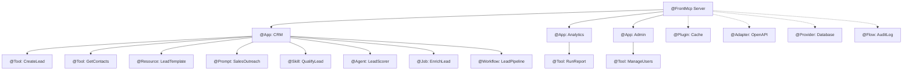

FrontMCP is a TypeScript-first framework for building production-ready MCP servers. This section gives you a quick tour of every major capability, with code examples and links to detailed documentation.

## Feature Map

<CardGroup cols={3}>
  <Card title="Decorator-Driven Development" icon="at" href="/frontmcp/features/decorator-driven-development">
    Build servers with decorators — @FrontMcp, @Tool, @Resource, @Prompt, and more
  </Card>
  <Card title="Dependency Injection" icon="syringe" href="/frontmcp/features/dependency-injection">
    @Provider with scopes, this.get(), and hierarchical DI containers
  </Card>
  <Card title="Multi-App Composition" icon="grid-2" href="/frontmcp/features/multi-app-composition">
    Compose multiple @App modules into a single server with isolated auth
  </Card>
  <Card title="Authentication & Authorization" icon="shield-check" href="/frontmcp/features/authentication-and-authorization">
    Three-tier auth: public, transparent, and orchestrated OAuth 2.1
  </Card>
  <Card title="Deployment Targets" icon="cloud-arrow-up" href="/frontmcp/features/deployment-targets">
    Deploy to Node.js/Docker, Vercel, AWS Lambda, or Cloudflare Workers
  </Card>
  <Card title="Plugin System" icon="puzzle-piece" href="/frontmcp/features/plugin-system">
    Extend your server with plugins, adapters, and context extensions
  </Card>
  <Card title="Testing Framework" icon="flask-vial" href="/frontmcp/features/testing-framework">
    E2E fixtures, custom matchers, interceptors, and HTTP mocking
  </Card>
  <Card title="Skill-Based Workflows" icon="graduation-cap" href="/frontmcp/features/skill-based-workflows">
    Teach AI multi-step workflows with @Skill and Agent Skills spec support
  </Card>
  <Card title="Jobs" icon="briefcase" href="/frontmcp/servers/jobs">
    Define typed jobs with retries, timeouts, and background execution
  </Card>
  <Card title="Workflows" icon="diagram-project" href="/frontmcp/servers/workflows">
    Compose jobs into DAG-based multi-step pipelines
  </Card>
</CardGroup>

---

## Architecture at a Glance

---

## At-a-Glance Comparison

| Feature       | What It Does                         | Key Decorator | Docs                                           |
| ------------- | ------------------------------------ | ------------- | ---------------------------------------------- |
| **Tools**     | AI-callable functions with typed I/O | `@Tool`       | [Tools](/frontmcp/servers/tools)               |
| **Resources** | Read-only data endpoints             | `@Resource`   | [Resources](/frontmcp/servers/resources)       |
| **Prompts**   | Reusable message templates           | `@Prompt`     | [Prompts](/frontmcp/servers/prompts)           |
| **Skills**    | Multi-step workflow guides           | `@Skill`      | [Skills](/frontmcp/servers/skills)             |
| **Agents**    | LLM-powered autonomous actors        | `@Agent`      | [Agents](/frontmcp/servers/agents)             |
| **Providers** | Dependency injection services        | `@Provider`   | [Providers](/frontmcp/extensibility/providers) |
| **Plugins**   | Cross-cutting extensions             | `@Plugin`     | [Plugins](/frontmcp/plugins/overview)          |
| **Adapters**  | Dynamic capability generation        | `@Adapter`    | [Adapters](/frontmcp/adapters/overview)        |
| **Jobs**      | Reliable executable units of work    | `@Job`        | [Jobs](/frontmcp/servers/jobs)                 |
| **Workflows** | DAG-based multi-step pipelines       | `@Workflow`   | [Workflows](/frontmcp/servers/workflows)       |
| **Flows**     | Request lifecycle pipelines          | `@Flow`       | [Flows](/frontmcp/servers/flows)               |
| **Apps**      | Modular capability containers        | `@App`        | [Apps](/frontmcp/servers/apps)                 |
