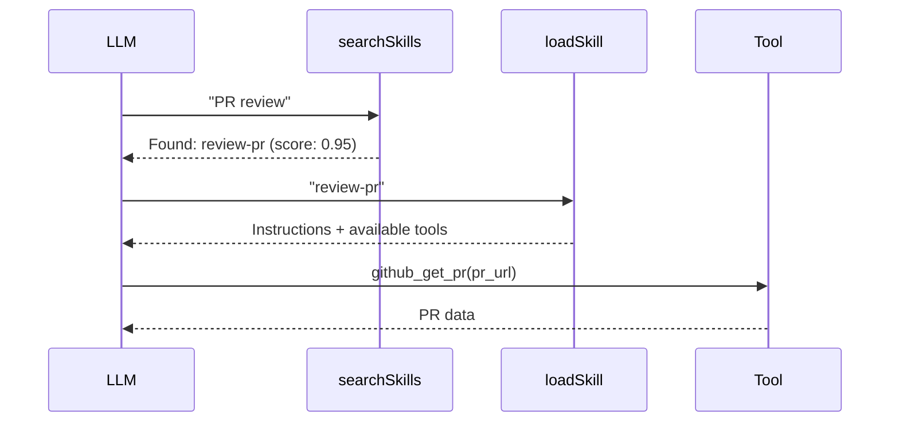

Skills are **modular knowledge packages** that teach AI how to perform multi-step tasks using tools. Unlike tools (individual actions), skills are recipes that combine tools into coherent workflows.

## Skills vs Tools vs Prompts

| Aspect | Skill | Tool | Prompt |
| --- | --- | --- | --- |
| **Purpose** | Multi-step workflow | Single action | Message template |
| **Contains** | Instructions + tool refs | Execution logic | Message array |
| **Side effects** | No (guidance only) | Yes | No |
| **Discovery** | `searchSkills` / `loadSkill` | `tools/list` | `prompts/list` |

## Creating a Skill

```ts
@Skill({
  name: 'review-pr',
  description: 'Review a GitHub pull request',
  instructions: `
    ## Steps
    1. Fetch PR details with github_get_pr
    2. Review changed files with github_get_pr_files
    3. Add inline comments with github_add_review_comment
    4. Submit review with github_submit_review
  `,
  tools: [
    { name: 'github_get_pr', purpose: 'Fetch PR metadata', required: true },
    { name: 'github_get_pr_files', purpose: 'Get changed files' },
    { name: 'github_add_review_comment', purpose: 'Add inline comments' },
    { name: 'github_submit_review', purpose: 'Submit review', required: true },
  ],
  tags: ['github', 'code-review'],
})
class ReviewPRSkill extends SkillContext {}
```

## Instruction Sources

Skills support three instruction sources:

```ts
// Inline (recommended)
instructions: '## Steps\n1. Do this\n2. Then that'

// File path
instructions: { file: './skills/review-pr.md' }

// Remote URL
instructions: { url: 'https://docs.example.com/skills/deploy.md' }
```

## Discovery Flow

Skills are discovered via `searchSkills` and loaded via `loadSkill` — two tools FrontMCP registers automatically:



## Agent Skills Spec Alignment

FrontMCP skills align with the [Anthropic Agent Skills specification](https://agentskills.io/specification). You can use standard SKILL.md files:

```markdown
---
name: review-pr
description: Review a GitHub pull request
license: MIT
tags:
  - github
  - code-review
allowed-tools: Read Edit Bash(git diff)
---
# PR Review Instructions
1. Fetch the PR details
2. Review each changed file
```

## Learn More

<CardGroup cols={2}>
  <Card title="Skills" icon="graduation-cap" href="/frontmcp/servers/skills">
    Full skills guide with search, parameters, and examples
  </Card>
  <Card title="@Skill Reference" icon="code" href="/frontmcp/sdk-reference/decorators/skill">
    Complete decorator API reference
  </Card>
</CardGroup>
