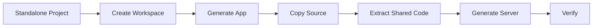

This guide walks you through migrating an existing standalone FrontMCP project into an Nx monorepo.

## Overview



---

<Steps>
  <Step title="Create the workspace">
    Create a new Nx workspace alongside your existing project:

    ```bash
    npx frontmcp create my-platform --nx
    cd my-platform
    ```

  </Step>

  <Step title="Generate an app for your existing code">
    ```bash
    nx g @frontmcp/nx:app my-app
    ```

    This creates `apps/my-app/` with the standard structure.

  </Step>

  <Step title="Copy your source files">
    Copy your existing tools, resources, prompts, and app files into the generated app:

    ```bash
    # Copy your source files (adjust paths as needed)
    cp -r ../my-standalone/src/tools/* apps/my-app/src/tools/
    cp -r ../my-standalone/src/resources/* apps/my-app/src/resources/
    cp -r ../my-standalone/src/prompts/* apps/my-app/src/prompts/
    ```

    Update `apps/my-app/src/my-app.app.ts` to import all your components:

    ```ts
    @App({
      id: 'my-app',
      name: 'MyApp',
      tools: [/* your existing tools */],
      resources: [/* your existing resources */],
      prompts: [/* your existing prompts */],
    })
    export class MyAppApp {}
    ```

  </Step>

  <Step title="Extract shared code into libraries">
    Identify code that could be shared across future apps:

    ```bash
    # Create libraries for shared code
    nx g @frontmcp/nx:lib shared-utils
    nx g @frontmcp/nx:lib data-models
    ```

    Move shared utilities into `libs/` and update imports using your workspace's path mappings in `tsconfig.base.json`.

  </Step>

  <Step title="Update imports">
    Update imports to use workspace path aliases:

    ```ts
    // Before (relative)
    import { formatDate } from '../../utils/format';

    // After (workspace alias)
    import { formatDate } from '@my-platform/shared-utils';
    ```

    Path aliases are defined in `tsconfig.base.json`:

    ```json
    {
      "compilerOptions": {
        "paths": {
          "@my-platform/shared-utils": ["libs/shared-utils/src/index.ts"]
        }
      }
    }
    ```

  </Step>

  <Step title="Generate a server">
    Create a deployment shell that composes your app:

    ```bash
    nx g @frontmcp/nx:server production --apps my-app --deploymentTarget node
    ```

  </Step>

  <Step title="Verify everything works">
    ```bash
    # Development mode
    nx dev my-app

    # Build
    nx build production

    # Test
    nx test my-app

    # Visualize dependencies
    nx graph
    ```

  </Step>
</Steps>

---

## Checklist

- [ ] Workspace created with `--nx` flag
- [ ] App generated and source files copied
- [ ] Shared code extracted into `libs/`
- [ ] Imports updated to use workspace path aliases
- [ ] Server generated with correct deployment target
- [ ] `nx dev` starts successfully
- [ ] `nx build` compiles without errors
- [ ] `nx test` passes all tests
- [ ] Old standalone project can be archived
