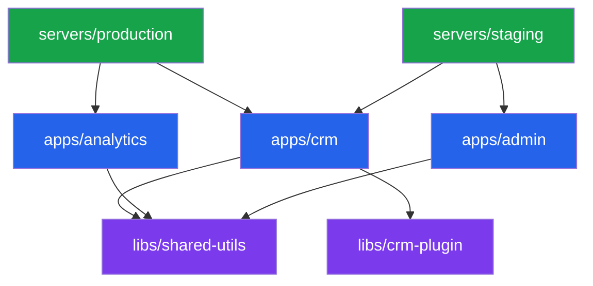

`@frontmcp/nx` is the official Nx plugin for FrontMCP. It provides **14 generators** for scaffolding projects and components, and **7 executors** for building, testing, and deploying your servers — all integrated with the Nx build system.

<Info>
Use the Nx plugin when you want monorepo-scale development: shared libraries, multi-app composition, per-environment servers, and Nx's dependency graph + affected commands.
</Info>

## When to Use the Nx Plugin

| Scenario                    | Recommendation                         |
| --------------------------- | -------------------------------------- |
| Single MCP server           | Use `npx frontmcp create` (standalone) |
| Multiple apps sharing code  | Use `@frontmcp/nx` (monorepo)          |
| Team with shared libraries  | Use `@frontmcp/nx` (monorepo)          |
| Multiple deployment targets | Use `@frontmcp/nx` (monorepo)          |
| Existing Nx workspace       | Add `@frontmcp/nx`                     |

## Architecture

The Nx plugin organizes your code into three layers:

| Layer       | Directory  | Purpose                                                    |
| ----------- | ---------- | ---------------------------------------------------------- |
| **Apps**    | `apps/`    | FrontMCP applications with tools, resources, prompts       |
| **Libs**    | `libs/`    | Shared libraries (generic, plugin, adapter, tool-register) |
| **Servers** | `servers/` | Deployment shells that compose apps for a target platform  |

## Feature Summary

### Generators (14)

| Category       | Generators                                                                                               |
| -------------- | -------------------------------------------------------------------------------------------------------- |
| **Structural** | `workspace`, `app`, `lib`, `server`                                                                      |
| **Component**  | `tool`, `resource`, `prompt`, `skill`, `agent`, `provider`, `plugin`, `adapter`, `auth-provider`, `flow` |

### Executors (7)

| Executor     | Wraps                   | Cacheable         |
| ------------ | ----------------------- | ----------------- |
| `build`      | `frontmcp build`        | Yes               |
| `build-exec` | `frontmcp build --exec` | Yes               |
| `dev`        | `frontmcp dev`          | No (long-running) |
| `serve`      | `frontmcp start`        | No (long-running) |
| `test`       | `frontmcp test`         | Yes               |
| `inspector`  | `frontmcp inspector`    | No (long-running) |
| `deploy`     | Platform-specific       | No                |

## Next Steps

<CardGroup cols={2}>
  <Card title="Installation" icon="arrow-down-to-line" href="/frontmcp/nx-plugin/installation">
    Install @frontmcp/nx in new or existing workspaces
  </Card>
  <Card title="Quickstart" icon="rocket-launch" href="/frontmcp/nx-plugin/quickstart">
    Build your first monorepo in 5 minutes
  </Card>
  <Card title="Generators" icon="wand-magic-sparkles" href="/frontmcp/nx-plugin/generators/overview">
    Scaffold apps, libs, servers, and components
  </Card>
  <Card title="Executors" icon="play" href="/frontmcp/nx-plugin/executors/overview">
    Build, test, and deploy with Nx
  </Card>
</CardGroup>
