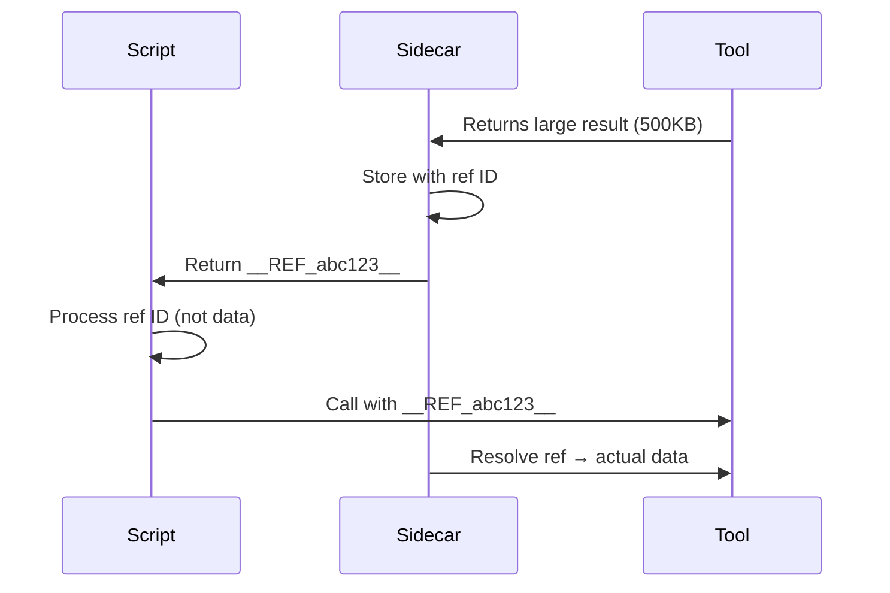

This page covers all configuration options for the CodeCall plugin, from quick presets to fine-grained control.

---

## Plugin Initialization

```ts
import { CodeCallPlugin } from '@frontmcp/plugin-codecall';

CodeCallPlugin.init({
  // Tool visibility mode
  mode: 'codecall_only' | 'codecall_opt_in' | 'metadata_driven',

  // VM/sandbox configuration
  vm: { /* ... */ },

  // Embedding/search configuration
  embedding: { /* ... */ },

  // Search results per query when a codecall:search call names no topK (default 8)
  topK: 8,

  // Most tools one codecall:describe call describes (default 8); a call that would describe more is refused
  maxDefinitions: 8,

  // Tool filtering
  includeTools: (tool) => boolean,

  // Direct invoke configuration
  directCalls: { /* ... */ },
});
```

`plugins: [CodeCallPlugin]`, the class without `init()`, is the same as `CodeCallPlugin.init()`: the defaults below, with the six `codecall:*` meta-tools and `CodeCallConfig`. Up to 1.9.3 the class form installed no tools (1.9.2: the tools without `CodeCallConfig`), while `codecall_only` still hid the app's own tools, so `tools/list` was empty.

---

## Tool Visibility Modes

Control which tools appear in `list_tools` vs. CodeCall.

### `codecall_only` (Recommended)

**Default mode.** Hides all tools from `list_tools`, exposes via CodeCall.

```ts
CodeCallPlugin.init({
  mode: 'codecall_only',
});
```

| Tool Location       | Behavior                                          |
| ------------------- | ------------------------------------------------- |
| `list_tools`        | Only CodeCall meta-tools visible                  |
| CodeCall            | All tools searchable and callable                 |
| Direct `tools/call` | Refused for a hidden tool, as for an unknown tool |
| Override            | Set `visibleInListTools: true` per tool           |

**Best for:** Large toolsets (20+), OpenAPI adapters, clean client experience.

<Note>
  A tool CodeCall hides from `list_tools` is reachable only through CodeCall, in every mode: a client's direct
  `tools/call` of it is answered exactly like a call of an unknown tool (`Tool "<name>" not found`), before its input
  is validated, so the refusal reveals nothing about it. CodeCall's own calls (`codecall:execute`, `codecall:invoke`)
  and server-side composition (a tool, agent or job calling it with `this.callTool()`) still reach it, and the
  server's own system tools (such as `sendElicitationResult`) are never refused. A `visibility: 'hidden'` tool, which
  the SDK keeps out of `list_tools`, is refused the same way in every mode unless it sets `visibleInListTools: true`
  (up to 1.9.1 a client could call it directly in `codecall_opt_in` and `metadata_driven`, and in `codecall_opt_in`
  `visibleInListTools: false` hid nothing). Releases up to 1.8.7 hid the tool from
  the listing only, so a client that knew its name called it directly, past `includeTools`, `enabledInCodeCall`,
  the blocked namespaces and `directCalls`. A tool that clients or widgets must call directly sets
  `visibleInListTools: true`.
</Note>

<Note>
  Installed on an app, `CodeCallPlugin` judges that app's tools and those of apps without a CodeCall plugin of their
  own; installed on the server, it judges every tool. A tool is hidden from `list_tools` and refused on a direct
  `tools/call` by the same plugins, so with a CodeCall plugin on each of two apps, each app's tools are listed and
  called by its own plugin's mode. Releases up to 1.8.7 let one app's `codecall_only` plugin hide the other app's tools
  from `list_tools` while the other app's plugin still let clients call them directly.
</Note>

### `codecall_opt_in`

Tools must explicitly opt into CodeCall. All tools visible in `list_tools` by default.

```ts
CodeCallPlugin.init({
  mode: 'codecall_opt_in',
});
```

| Tool Location       | Behavior                                                         |
| ------------------- | ---------------------------------------------------------------- |
| `list_tools`        | All tools visible, except those with `visibleInListTools: false` |
| CodeCall            | Only tools with `enabledInCodeCall: true`                        |
| Direct `tools/call` | Refused for a tool with `visibleInListTools: false`, as unknown  |

**Best for:** Gradual migration, mixed direct/CodeCall access.

### `metadata_driven`

Full control via per-tool metadata. No global assumptions.

```ts
CodeCallPlugin.init({
  mode: 'metadata_driven',
});
```

| Tool Location       | Behavior                                                        |
| ------------------- | --------------------------------------------------------------- |
| `list_tools`        | Based on `visibleInListTools` (default: true)                   |
| CodeCall            | Based on `enabledInCodeCall` (default: false)                   |
| Direct `tools/call` | Refused for a tool with `visibleInListTools: false`, as unknown |

**Best for:** Small toolsets, fine-grained control.

---

## Per-Tool Metadata

Control individual tool behavior with the `codecall` metadata field:

```ts
@Tool({
  name: 'users:list',
  description: 'List all users',
  codecall: {
    // Is this tool searchable and callable via CodeCall?
    enabledInCodeCall: true,  // default depends on mode

    // Is this tool visible in standard list_tools, and callable directly with tools/call?
    visibleInListTools: false,  // default depends on mode

    // App ID for multi-app filtering (auto-detected if not set)
    appId: 'user-service',
  },
})
```

### Metadata by Mode

| Mode              | `enabledInCodeCall` default | `visibleInListTools` default |
| ----------------- | --------------------------- | ---------------------------- |
| `codecall_only`   | `true`                      | `false`                      |
| `codecall_opt_in` | `false`                     | `true`                       |
| `metadata_driven` | `false`                     | `true`                       |

### Common Patterns

<AccordionGroup>
  <Accordion title="Hide from list_tools, available in CodeCall">
    ```ts
    codecall: {
      enabledInCodeCall: true,
      visibleInListTools: false,
    }
    ```
    Use for: Most tools in `codecall_only` mode. A client's direct `tools/call` of the tool is refused as for an
    unknown tool; it is reached through CodeCall.
  </Accordion>

  <Accordion title="Visible everywhere">
    ```ts
    codecall: {
      enabledInCodeCall: true,
      visibleInListTools: true,
    }
    ```
    Use for: Core tools that should be directly accessible AND in CodeCall.
  </Accordion>

  <Accordion title="Direct access only, no CodeCall">
    ```ts
    codecall: {
      enabledInCodeCall: false,
      visibleInListTools: true,
    }
    ```
    Use for: Admin tools, destructive operations, tools requiring human review.
  </Accordion>

  <Accordion title="CodeCall meta-tools only">
    ```ts
    codecall: {
      enabledInCodeCall: false,
      visibleInListTools: true,
    }
    ```
    Applied automatically to `codecall:search`, `codecall:describe`, etc.
  </Accordion>
</AccordionGroup>

---

## Global Tool Filtering

Filter tools globally with `includeTools`:

```ts
CodeCallPlugin.init({
  mode: 'codecall_only',

  // Only include tools matching this filter
  includeTools: (tool) => {
    // Exclude admin tools
    if (tool.name.startsWith('admin:')) return false;

    // Exclude tools tagged as destructive
    if (tool.tags?.includes('destructive')) return false;

    // Include everything else
    return true;
  },
});
```

The filter receives an `IncludeToolsFilterToolInfo`:

```ts
interface IncludeToolsFilterToolInfo {
  name: string;          // the tool's own name, e.g. 'admin:deleteUser' — never prefixed with the app id
  fullName?: string;     // the qualified name, e.g. 'crm:admin:deleteUser'
  appId?: string;        // the owning app's id, also for tools the app's adapters and plugins provide
  source?: string;       // codecall.source
  description?: string;
  tags?: string[];       // codecall.tags, falling back to the tool's tags
  annotations?: Readonly<{ readOnlyHint?: boolean; destructiveHint?: boolean; /* ... */ }>;
  metadata?: Readonly<Record<string, unknown>>; // the tool's declared metadata (annotations, tags, codecall, ...)
}
```

So a filter can decide from the tool's annotations, e.g. `includeTools: (tool) => !tool.annotations?.destructiveHint`
(`tool.metadata?.annotations` is the same object). `directCalls.filter` receives the same object.

`name` is the name the tool was declared with. A tool `admin:deleteUser` in app `crm` is also reachable
as `crm:admin:deleteUser`, but the filter always sees `admin:deleteUser`; use `appId` to filter by app.

The filter is an access control, not only a search setting. CodeCall runs the same decision, with the
same `tool` object, for `codecall:search`, `codecall:describe`, `callTool` and `getTool` in
`codecall:execute`, the namespace bindings a script receives, and `codecall:invoke`. A tool the filter
excludes is absent from search, reported as not found by describe, and refused at execution.

---

## VM Configuration

Configure the JavaScript sandbox:

```ts
CodeCallPlugin.init({
  vm: {
    // Use a preset (recommended)
    preset: 'secure',

    // Or override individual settings
    timeoutMs: 5000,
    maxSteps: 10000,
    allowLoops: true, // for and for-of; false allows for-of only

    // Names a script may not use, refused before it runs
    disabledBuiltins: ['eval', 'Function', 'parseInt'],
    disabledGlobals: ['process', 'require', 'JSON'],
  },
});
```

### VM Presets

| Preset         | Timeout | Max Steps | Loops           | Use Case                     |
| -------------- | ------- | --------- | --------------- | ---------------------------- |
| `locked_down`  | 2s      | 2,000     | `for-of`        | Ultra-sensitive environments |
| `secure`       | 3.5s    | 5,000     | `for-of`        | **Production default**       |
| `balanced`     | 5s      | 10,000    | `for`, `for-of` | Complex workflows            |
| `experimental` | 10s     | 20,000    | `for`, `for-of` | Development only             |

`allowLoops: false` refuses every loop but `for-of` before the script runs; `allowLoops: true` adds `for`. The
sandbox refuses `while`, `do-while` and `for-in` whatever `allowLoops` says. Scripts have no `console` in any
preset, so `allowConsole` has no effect: a script that refers to the global `console` is refused before it runs (a
field named `console`, as in `result.platform.console`, is fine), and `mcpLog(level, message)` is the way to log. The
`codecall:execute` description is written from the effective `vm` options: the loops `allowLoops` permits, the names
`disabledBuiltins` and `disabledGlobals` list, `timeoutMs` and the tool-call cap (`maxSteps`), so a model's scripts run
on every preset. `codecall:search`'s description gives the server's `topK` and the `minRelevanceScore` default, `0.1`.
Up to 1.9.1 `allowLoops: false` let a `for` loop run, and up to 1.9.2 the descriptions named fixed limits (a 30 s
timeout, 100 tool calls, a 0.3 threshold) whatever the configuration said.

`disabledBuiltins` and `disabledGlobals` name globals a script may not use: a script that refers to one is refused
before it runs, with `illegal_access` and `JSON is disabled by vm.disabledGlobals` (a field or key with that name, as in
`formats.JSON`, is fine). They add to what the sandbox already refuses: AgentScript never gets `eval`, `require`,
`process` or `fetch`, so leaving one out of the list doesn't allow it. Up to 1.9.2 both lists were accepted and ignored.

A loop that runs more than 10,000 times ends the script with `runtime_error`, `Maximum iteration limit exceeded (10000).
This limit prevents infinite loops.`, whatever the loop; up to 1.9.2 a `for` loop gave a different message, without the
count, and the error name `DoubleVMExecutionError`.

<Note>
  `allowConsole` stays deprecated: the sandbox (`@enclave-vm/core`) writes a script's `console` output to the server's
  own stdout, which would corrupt a stdio transport, and offers no way to capture it.
</Note>

### Preset Details

<Tabs>
  <Tab title="locked_down">
    ```ts
    {
      preset: 'locked_down',
      timeoutMs: 2000,
      maxSteps: 2000,
      allowLoops: false,  // Only for-of allowed
      disabledBuiltins: ['eval', 'Function', 'AsyncFunction'],
      disabledGlobals: [
        'require', 'process', 'fetch',
        'setTimeout', 'setInterval', 'setImmediate',
        'global', 'globalThis'
      ],
    }
    ```
    **When to use:** Healthcare, finance, PII processing, compliance-heavy environments.
  </Tab>

  <Tab title="secure">
    ```ts
    {
      preset: 'secure',
      timeoutMs: 3500,
      maxSteps: 5000,
      allowLoops: false,  // Only for-of allowed
      disabledBuiltins: ['eval', 'Function', 'AsyncFunction'],
      disabledGlobals: [
        'require', 'process', 'fetch',
        'setTimeout', 'setInterval', 'setImmediate',
        'global', 'globalThis'
      ],
    }
    ```
    **When to use:** Most production deployments.
  </Tab>

  <Tab title="balanced">
    ```ts
    {
      preset: 'balanced',
      timeoutMs: 5000,
      maxSteps: 10000,
      allowLoops: true,  // for and for-of allowed
      disabledBuiltins: ['eval', 'Function', 'AsyncFunction'],
      disabledGlobals: ['require', 'process', 'fetch'],
    }
    ```
    **When to use:** Complex data processing, trusted model access.
  </Tab>

  <Tab title="experimental">
    ```ts
    {
      preset: 'experimental',
      timeoutMs: 10000,
      maxSteps: 20000,
      allowLoops: true,
      disabledBuiltins: ['eval', 'Function', 'AsyncFunction'],
      disabledGlobals: ['require', 'process'],
    }
    ```
    **When to use:** Development, testing, trusted internal tools.
  </Tab>
</Tabs>

### Reference Sidecar Configuration (Pass-by-Reference)

The Reference Sidecar handles large data transfer between scripts and tools. Instead of passing full data through the VM, large values are stored externally with reference IDs.

```ts
CodeCallPlugin.init({
  vm: {
    preset: 'secure',
  },

  sidecar: {
    enabled: true,                       // opt-in (default: false)
    maxTotalSize: 64 * 1024 * 1024,      // 64MB total storage
    maxReferenceSize: 16 * 1024 * 1024,  // 16MB per reference
    extractionThreshold: 256 * 1024,     // Extract strings > 256KB
    maxResolvedSize: 32 * 1024 * 1024,   // 32MB max when resolving
    allowComposites: false,              // Block reference concatenation
  },
});
```

#### Sidecar Presets by Security Level

| Config              | STRICT | SECURE | STANDARD | PERMISSIVE |
| ------------------- | ------ | ------ | -------- | ---------- |
| maxTotalSize        | 16MB   | 64MB   | 256MB    | 1GB        |
| maxReferenceSize    | 4MB    | 16MB   | 64MB     | 256MB      |
| extractionThreshold | 64KB   | 256KB  | 1MB      | 4MB        |
| maxResolvedSize     | 8MB    | 32MB   | 128MB    | 512MB      |
| allowComposites     | No     | No     | Yes      | Yes        |

#### How Pass-by-Reference Works



**Benefits:**

- Scripts don't need to handle large data in memory
- VM stays lightweight and secure
- Tool results can exceed VM memory limits
- Reference IDs are opaque strings (no data leakage)

---

## Embedding Configuration

Configure how tools are indexed for search:

```ts
CodeCallPlugin.init({
  embedding: {
    // Search strategy
    strategy: 'tfidf' | 'ml',

    // ML specific (requires VectoriaDB)
    modelName: 'Xenova/all-MiniLM-L6-v2',
    cacheDir: './.cache/transformers',

    // TF-IDF only: expand queries with synonyms ("add issue" finds create_ticket); false turns it off
    synonymExpansion: { enabled: true },
  },
});
```

### Strategy Comparison

| Strategy | Speed   | Relevance | Setup          | Best For                |
| -------- | ------- | --------- | -------------- | ----------------------- |
| `tfidf`  | ⚡ Fast | Good      | None           | Most use cases, offline |
| `ml`     | Slower  | Better    | Model download | Large toolsets (100+)   |

### TF-IDF Configuration

```ts
embedding: {
  strategy: 'tfidf',
}
```

TF-IDF extracts searchable text from:

- Tool name (tokenized: `users:list` → `users`, `list`)
- Description (weighted 3x)
- Key terms from description (4+ characters, no stop words)

### ML Configuration

```ts
embedding: {
  strategy: 'ml',
  modelName: 'Xenova/all-MiniLM-L6-v2',  // Default
  cacheDir: './.cache/transformers',
  useHNSW: true,  // For large toolsets (1000+)
}
```

<Note>
  ML strategy uses [VectoriaDB](https://github.com/agentfront/vectoriadb) internally. The model (~22MB) is downloaded on first use and cached locally.
</Note>

---

## Direct Invocation

Configure the `codecall:invoke` meta-tool for direct tool calls without VM overhead:

```ts
CodeCallPlugin.init({
  directCalls: {
    // Enable/disable codecall:invoke
    enabled: true,

    // Optional: restrict to specific tools
    allowedTools: ['users:getById', 'billing:getInvoice'],
  },
});
```

Each `allowedTools` entry matches a tool's own name (`users:getById`) or its qualified
`<appId>:<name>` (`my-app:users:getById`). List the qualified name to allow the tool from one app
only; a bare name allows that tool in every app that declares it. Anything not listed is refused.
`allowedTools` and `filter` only narrow what the base policy (`enabledInCodeCall`, `includeTools`,
the blocked namespaces) already allows; listing a tool the base policy withholds does not make it
callable. `filter` receives the same object as `includeTools`.

### When to Use Direct Invoke

| Use `codecall:invoke`          | Use `codecall:execute`   |
| ------------------------------ | ------------------------ |
| Single tool, no transformation | Multi-tool orchestration |
| Latency-critical paths         | Data filtering/joining   |
| Simple CRUD operations         | Conditional logic        |
| Known tool name                | Dynamic tool selection   |

### Performance Comparison

```
codecall:invoke (direct)
├─ Parse input: ~0.1ms
├─ Tool lookup: ~0.1ms
├─ Tool execution: ~varies
└─ Total overhead: ~0.2ms

codecall:execute (VM)
├─ Pre-scan: ~0.5ms
├─ AST validation: ~1-2ms
├─ Code transformation: ~0.5ms
├─ VM execution: ~1-2ms
├─ Tool execution: ~varies
└─ Total overhead: ~3-5ms
```

### Error Response Format

A refused call returns a standard `CallToolResult`. The message is the same whether the tool is
withheld or does not exist, so `codecall:invoke` does not reveal which tools the policy hides:

```json
{
  "content": [
    { "type": "text", "text": "Tool \"users:delete\" is not available. Use codecall:search to discover available tools." }
  ],
  "isError": true
}
```

### Security Considerations

<Warning>
  Direct invocation bypasses VM security validation. Only enable for tools you trust completely.
</Warning>

- **allowedTools**: Always specify an explicit allowlist in production
- **No script execution**: Direct calls cannot run arbitrary code
- **Same tool access rules**: `codecall:invoke` first applies the policy `codecall:execute` uses (`enabledInCodeCall`, `includeTools`, blocked namespaces); `directCalls` only narrows it
- **Audit logging**: Direct calls are logged the same as scripted calls

---

## Complete Configuration Example

```ts
import { App } from '@frontmcp/sdk';
import { CodeCallPlugin } from '@frontmcp/plugin-codecall';

@App({
  id: 'my-app',
  plugins: [
    CodeCallPlugin.init({
      // Hide all tools, expose via CodeCall
      mode: 'codecall_only',

      // Filter out admin and destructive tools
      includeTools: (tool) => {
        if (tool.name.startsWith('admin:')) return false;
        if (tool.tags?.includes('destructive')) return false;
        return true;
      },

      // Secure sandbox with custom timeout
      vm: {
        preset: 'secure',
        timeoutMs: 5000,  // 5 second timeout
      },

      // Fast TF-IDF search
      embedding: {
        strategy: 'tfidf',
      },

      // Enable direct invocation for simple calls
      directCalls: {
        enabled: true,
        allowedTools: ['users:getById', 'health:ping'],
      },
    }),
  ],
})
export default class MyApp {}
```

---

## Migration Guide

### From Direct Tools to CodeCall

<Steps>
  <Step title="Add CodeCallPlugin">
    ```ts
    plugins: [
      CodeCallPlugin.init({ mode: 'metadata_driven' }),
    ]
    ```
  </Step>

  <Step title="Mark Tools for CodeCall">
    ```ts
    @Tool({
      codecall: { enabledInCodeCall: true, visibleInListTools: true },
    })
    ```
  </Step>

  <Step title="Test Both Access Methods">
    Verify tools work via both direct calls and CodeCall.
  </Step>

  <Step title="Switch to codecall_only">
    ```ts
    CodeCallPlugin.init({ mode: 'codecall_only' })
    ```
    From here a client's direct `tools/call` of a hidden tool is refused. Keep `visibleInListTools: true` on any tool
    a client or widget still calls directly.
  </Step>

  <Step title="Remove Direct Visibility">
    ```ts
    codecall: { enabledInCodeCall: true, visibleInListTools: false }
    ```
  </Step>
</Steps>

---

## Related

<CardGroup cols={2}>
  <Card title="Security Model" icon="shield" href="/frontmcp/plugins/codecall/security">
    Security implications of configuration choices
  </Card>
  <Card title="Production &amp; Scaling" icon="server" href="/frontmcp/plugins/codecall/production">
    Performance tuning and monitoring
  </Card>
  <Card title="AgentScript Guide" icon="scroll" href="/frontmcp/plugins/codecall/agentscript">
    Scripting language reference and best practices
  </Card>
  <Card title="API Reference" icon="book" href="/frontmcp/plugins/codecall/api-reference">
    Complete meta-tool schemas and examples
  </Card>
</CardGroup>
