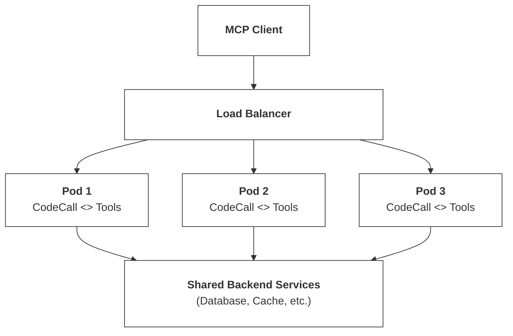

This guide covers everything you need to deploy CodeCall in production: performance optimization, monitoring, multi-instance deployment, and operational best practices.

## Production Checklist

Before deploying CodeCall to production, complete these steps:

<Steps>
  <Step title="Choose the right VM preset">
    Use `secure` for most production workloads, `locked_down` for sensitive data.
    Never use `experimental` in production.
  </Step>
  <Step title="Configure tool access control">
    Set up `includeTools` filtering and per-tool `codecall` metadata to limit which tools are accessible.
  </Step>
  <Step title="Enable audit logging">
    Configure audit sinks to track script execution, tool calls, and security events.
  </Step>
  <Step title="Set up rate limiting">
    Add rate limits on `codecall:execute` to prevent abuse.
  </Step>
  <Step title="Configure monitoring and alerting">
    Track execution latency, error rates, and security blocks with your observability stack.
  </Step>
  <Step title="Test security boundaries">
    Run the attack vector tests from AST Guard's security audit suite.
  </Step>
  <Step title="Plan gradual rollout">
    Start with `metadata_driven` mode, then migrate to `codecall_only` once validated.
  </Step>
</Steps>

---

## Performance Characteristics

### Latency Breakdown

| Stage               | Typical Time | Notes                        |
| ------------------- | ------------ | ---------------------------- |
| AST Parsing         | 1-5ms        | Scales with code size        |
| AST Validation      | 2-10ms       | Depends on rule count        |
| Code Transformation | 1-3ms        | One-time per script          |
| VM Execution        | Variable     | Depends on script complexity |
| Tool Calls          | Variable     | Network/database bound       |
| Output Sanitization | 1-5ms        | Scales with output size      |

**Total overhead** (excluding tool calls): ~8-25ms for typical scripts.

### Throughput

| Configuration           | Requests/sec | Notes                       |
| ----------------------- | ------------ | --------------------------- |
| Single instance, TF-IDF | ~500         | Bottleneck: VM isolation    |
| Single instance, ML     | ~200         | Bottleneck: Model inference |
| Multi-instance (4 pods) | ~1,500+      | Near-linear scaling         |

<Note>
  Throughput depends heavily on script complexity and tool call latency. These numbers assume simple scripts with 1-3 tool calls.
</Note>

---

## Performance Optimization

### 1. Use TF-IDF for Most Cases

Unless you have 100+ tools with similar descriptions, TF-IDF provides excellent relevance with minimal overhead:

```ts
CodeCallPlugin.init({
  embedding: {
    strategy: 'tfidf',  // 10x faster than ml
  },
});
```

### 2. Enable ML for Large Toolsets

For 100+ tools with similar descriptions, the ML strategy provides better semantic matching:

```ts
CodeCallPlugin.init({
  embedding: {
    strategy: 'ml',
    useHNSW: true,  // For 1000+ tools
  },
});
```

### 3. Use Direct Invoke for Simple Calls

Bypass VM overhead for single-tool operations:

```ts
// Instead of
{
  "tool": "codecall:execute",
  "input": {
    "script": "return await callTool('users:getById', { id: '123' });"
  }
}

// Use
{
  "tool": "codecall:invoke",
  "input": {
    "tool": "users:getById",
    "input": { "id": "123" }
  }
}
```

**Savings:** ~15-20ms per call.

### 4. Cache Describe Results

Tool schemas rarely change. CodeCall internally caches describe and search results to reduce overhead on repeated calls.

---

## Multi-Instance Deployment

CodeCall is stateless and scales horizontally.

### Architecture



### Kubernetes Deployment

```yaml
apiVersion: apps/v1
kind: Deployment
metadata:
  name: mcp-server
spec:
  replicas: 3
  template:
    spec:
      containers:
        - name: mcp-server
          image: your-mcp-server:latest
          resources:
            requests:
              memory: "512Mi"
              cpu: "500m"
            limits:
              memory: "1Gi"
              cpu: "1000m"
          readinessProbe:
            httpGet:
              path: /health
              port: 3000
            initialDelaySeconds: 10
          livenessProbe:
            httpGet:
              path: /health
              port: 3000
            initialDelaySeconds: 30
```

### Resource Recommendations

| Workload                 | CPU      | Memory | Instances |
| ------------------------ | -------- | ------ | --------- |
| Light (&lt;100 req/min)  | 0.5 core | 512MB  | 1-2       |
| Medium (100-500 req/min) | 1 core   | 1GB    | 2-4       |
| Heavy (500+ req/min)     | 2 cores  | 2GB    | 4+        |

<Warning>
  Embedding strategy requires additional memory (~200MB) for the transformer model. Account for this in resource limits.
</Warning>

---

## Monitoring

### Metrics to Track

<CardGroup cols={2}>
  <Card title="Execution Latency" icon="clock">
    Track p50, p95, p99 of `codecall:execute` duration
  </Card>
  <Card title="Error Rate" icon="triangle-exclamation">
    Monitor validation errors, timeouts, and tool failures
  </Card>
  <Card title="Tool Call Count" icon="wrench">
    Average tool calls per script execution
  </Card>
  <Card title="Search Latency" icon="magnifying-glass">
    Track search response times for index health
  </Card>
</CardGroup>

### Logging

CodeCall's internal `AuditLoggerService` emits structured log events for observability. These events can be consumed by your logging infrastructure:

**Log events:**

```json
// Script execution start
{ "event": "codecall:execute:start", "executionId": "abc123", "scriptSize": 245 }

// Tool call
{ "event": "codecall:tool:call", "executionId": "abc123", "tool": "users:list", "duration": 45 }

// Script execution complete
{ "event": "codecall:execute:complete", "executionId": "abc123", "status": "ok", "duration": 234, "toolCalls": 3 }

// Security event
{ "event": "codecall:security:blocked", "reason": "self_reference", "tool": "codecall:execute" }
```

### Alerting Recommendations

| Metric              | Warning | Critical    |
| ------------------- | ------- | ----------- |
| Execute p99 latency | > 2s    | > 5s        |
| Error rate          | > 5%    | > 15%       |
| Timeout rate        | > 1%    | > 5%        |
| Security blocks     | Any     | High volume |

---

## Cost Optimization

### Token Savings

CodeCall dramatically reduces token usage:

| Scenario                      | Without CodeCall | With CodeCall | Savings |
| ----------------------------- | ---------------- | ------------- | ------- |
| 100 tools in context          | ~25,000 tokens   | ~3,000 tokens | **88%** |
| Multi-tool workflow (5 calls) | ~50,000 tokens   | ~5,000 tokens | **90%** |
| Complex filtering             | ~100,000 tokens  | ~8,000 tokens | **92%** |

### Compute Costs

| Factor              | Impact         | Optimization                           |
| ------------------- | -------------- | -------------------------------------- |
| VM isolation        | ~10ms overhead | Use `codecall:invoke` for simple calls |
| Embedding inference | ~50ms/query    | Use TF-IDF for fewer than 100 tools    |
| Tool calls          | Dominant cost  | Optimize underlying tools              |

### Cost vs. Performance Tradeoffs

<AccordionGroup>
  <Accordion title="Minimize Latency">
    - Use TF-IDF search
    - Enable caching for describe/search
    - Use direct invoke for simple calls
    - Increase VM timeout for complex scripts
  </Accordion>

  <Accordion title="Minimize Compute">
    - Use locked_down preset (shorter timeouts)
    - Limit maxToolCalls aggressively
    - Cache aggressively
    - Use fewer instances with more resources
  </Accordion>

  <Accordion title="Minimize Tokens">
    - Use codecall_only mode
    - Hide all tools from list_tools
    - Return minimal data from tools
    - Let scripts filter server-side
  </Accordion>
</AccordionGroup>

---

## Security in Production

### Checklist

<Steps>
  <Step title="Use secure or locked_down preset">
    Never use `experimental` in production.
  </Step>

  <Step title="Enable audit logging">
    Log all script executions and security events.
  </Step>

  <Step title="Configure rate limiting">
    Prevent abuse via aggressive rate limits.
  </Step>

  <Step title="Monitor security events">
    Alert on validation failures and self-reference attempts.
  </Step>

  <Step title="Regular security reviews">
    Review tool allowlists and filter rules quarterly.
  </Step>
</Steps>

### Rate Limiting

Rate limiting should be handled at the infrastructure level (reverse proxy, API gateway) or with middleware. Configure limits on `codecall:execute` to prevent abuse.

---

## Multi-Tenancy Patterns

CodeCall supports multiple isolation strategies for multi-tenant deployments.

### Tenant Context

Pass tenant information via `codecallContext`:

```json
{
  "tool": "codecall:execute",
  "input": {
    "script": "...",
    "context": {
      "tenantId": "acme-corp",
      "userId": "user-123",
      "permissions": ["read", "write"]
    }
  }
}
```

### Per-Tenant Tool Filtering

Restrict tools based on tenant using the `includeTools` filter:

```ts
CodeCallPlugin.init({
  includeTools: (tool) => {
    // Block admin tools from CodeCall
    if (tool.name.startsWith('admin:')) return false;

    // Filter by app ownership
    if (tool.metadata?.codecall?.appId) {
      return ['user-service', 'billing'].includes(tool.metadata.codecall.appId);
    }

    return true;
  },
});
```

### Isolation Strategies

| Strategy               | Isolation Level | Cost | Use Case         |
| ---------------------- | --------------- | ---- | ---------------- |
| Shared instance        | Low             | $    | Dev/staging      |
| Tenant-specific limits | Medium          | $$   | SaaS standard    |
| Dedicated instances    | Maximum         | $$$$ | Compliance-heavy |

---

## Troubleshooting

### Common Issues

<AccordionGroup>
  <Accordion title="Scripts timing out">
    **Symptoms:** Frequent `TIMEOUT` errors

    **Causes:**
    - Script too complex
    - Tool calls too slow
    - Timeout too aggressive

    **Solutions:**
    1. Profile tool call latency
    2. Increase `vm.timeoutMs` if tools are slow
    3. Break complex scripts into smaller pieces
    4. Use `Promise.all()` for independent tool calls

  </Accordion>

  <Accordion title="Search returning irrelevant results">
    **Symptoms:** Low relevance scores, wrong tools returned

    **Causes:**
    - Poor tool descriptions
    - Threshold too low
    - TF-IDF limitations

    **Solutions:**
    1. Improve tool descriptions
    2. Switch to `ml` strategy for semantic matching
    3. Add more specific keywords to descriptions

  </Accordion>

  <Accordion title="High memory usage">
    **Symptoms:** OOM errors, pod restarts

    **Causes:**
    - Embedding model loaded
    - Large tool index
    - Scripts returning large data

    **Solutions:**
    1. Use TF-IDF instead of embeddings
    2. Increase memory limits
    3. Configure output sanitization limits
    4. Enable HNSW for large indexes

  </Accordion>

  <Accordion title="Validation errors for valid code">
    **Symptoms:** Scripts rejected that should work

    **Causes:**
    - Using blocked constructs
    - Reserved prefix collision
    - Unicode issues

    **Solutions:**
    1. Check for `eval`, `Function`, etc.
    2. Avoid `__ag_` and `__safe_` prefixes
    3. Use ASCII identifiers
    4. Review AST Guard rules

  </Accordion>
</AccordionGroup>

---

## Migration & Rollback

### Gradual Rollout

1. **Phase 1:** Deploy with `mode: 'metadata_driven'`
   - All tools visible normally
   - Mark select tools for CodeCall
   - Monitor for issues

2. **Phase 2:** Switch to `mode: 'codecall_opt_in'`
   - Tools opt into CodeCall
   - Both access methods work
   - Measure token savings

3. **Phase 3:** Move to `mode: 'codecall_only'`
   - Hide tools from list_tools
   - Full CodeCall experience
   - Maximum token savings

### Rollback Plan

```ts
// Emergency rollback: disable CodeCall
@App({
  plugins: process.env.CODECALL_ENABLED === 'false'
    ? []
    : [CodeCallPlugin.init({ ... })],
})
```

Feature flag CodeCall to enable instant rollback without redeployment.

---

## Related

<CardGroup cols={2}>
  <Card title="Configuration" icon="gear" href="/frontmcp/plugins/codecall/configuration">
    All configuration options including VM presets and embedding strategies
  </Card>
  <Card title="Security Model" icon="shield" href="/frontmcp/plugins/codecall/security">
    Defense-in-depth security architecture and settings
  </Card>
  <Card title="API Reference" icon="book" href="/frontmcp/plugins/codecall/api-reference">
    Meta-tool schemas, error codes, and debugging guide
  </Card>
  <Card title="Deployment Guide" icon="rocket" href="/frontmcp/deployment/production-build">
    General FrontMCP production deployment
  </Card>
</CardGroup>
