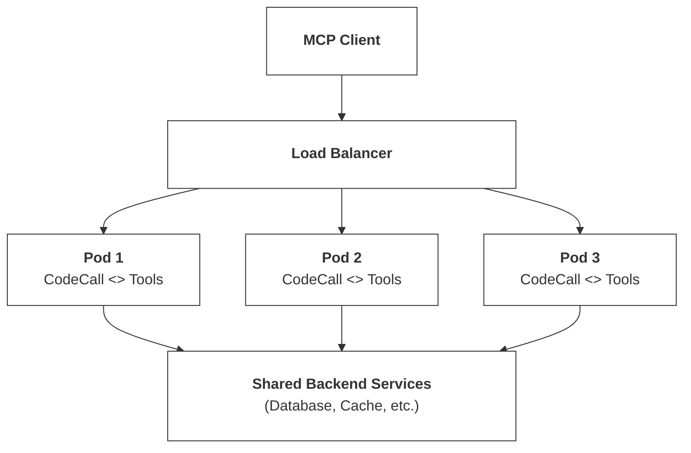

This guide covers everything you need to deploy CodeCall in production: performance optimization, monitoring, multi-instance deployment, and operational best practices.

---

## Performance Characteristics

### Latency Breakdown

| Stage               | Typical Time | Notes                        |
| ------------------- | ------------ | ---------------------------- |
| AST Parsing         | 1-5ms        | Scales with code size        |
| AST Validation      | 2-10ms       | Depends on rule count        |
| Code Transformation | 1-3ms        | One-time per script          |
| AI Scoring Gate     | ~1ms         | Rule-based (cached)          |
| VM Execution        | Variable     | Depends on script complexity |
| Tool Calls          | Variable     | Network/database bound       |
| Output Sanitization | 1-5ms        | Scales with output size      |

**Total overhead** (excluding tool calls): ~10-25ms for typical scripts.

### Worker Pool Mode

When using Worker Pool adapter for OS-level isolation, latency changes slightly:

| Metric               | Standard VM | Worker Pool (4 workers) |
| -------------------- | ----------- | ----------------------- |
| Cold start           | ~5ms        | ~50ms (pool warm-up)    |
| Warm execution       | ~1ms        | ~3ms (message passing)  |
| Concurrent capacity  | 1           | 4 (parallel isolation)  |
| Memory per execution | Shared      | Isolated per worker     |

Worker Pool adds ~2-3ms latency per execution due to message passing overhead, but provides OS-level isolation and hard halt capability.

### Throughput

| Configuration                            | Requests/sec | Notes                       |
| ---------------------------------------- | ------------ | --------------------------- |
| Single instance, TF-IDF                  | ~500         | Bottleneck: VM isolation    |
| Single instance, Embeddings              | ~200         | Bottleneck: Model inference |
| Single instance, Worker Pool (4 workers) | ~800         | Parallel isolation          |
| Multi-instance (4 pods)                  | ~1,500+      | Near-linear scaling         |
| Multi-instance + Worker Pool             | ~3,000+      | Best isolation + throughput |

<Note>
  Throughput depends heavily on script complexity and tool call latency. These numbers assume simple scripts with 1-3 tool calls.
</Note>

### Worker Pool Scaling Guidelines

| Workload      | minWorkers | maxWorkers | memoryLimit | Use Case        |
| ------------- | ---------- | ---------- | ----------- | --------------- |
| Low volume    | 1          | 2          | 128MB       | &lt;10 req/min  |
| Medium volume | 2          | 4          | 256MB       | 10-100 req/min  |
| High volume   | 4          | 8          | 256MB       | 100-500 req/min |
| Burst traffic | 2          | 16         | 128MB       | Spiky workloads |

```ts
// Worker Pool for production
CodeCallPlugin.init({
  vm: {
    adapter: 'worker_threads',
    preset: 'secure',
    workerPoolConfig: {
      minWorkers: 2,
      maxWorkers: 8,
      memoryLimitPerWorker: 256 * 1024 * 1024,  // 256MB
      maxExecutionsPerWorker: 1000,              // Recycle after 1000 executions
    },
  },
});
```

---

## Performance Optimization

### 1. Use TF-IDF for Most Cases

Unless you have 100+ tools with similar descriptions, TF-IDF provides excellent relevance with minimal overhead:

```ts
CodeCallPlugin.init({
  embedding: {
    strategy: 'tfidf',  // 10x faster than embedding
    similarityThreshold: 0.25,
  },
});
```

### 2. Enable HNSW for Large Toolsets

For 1000+ tools with embedding strategy, enable HNSW indexing:

```ts
CodeCallPlugin.init({
  embedding: {
    strategy: 'embedding',
    useHNSW: true,
    hnsw: {
      M: 16,              // Connections per node
      efConstruction: 200, // Build-time accuracy
      efSearch: 64,        // Query-time accuracy
    },
  },
});
```

### 3. Warm the Search Index on Startup

Pre-index tools during server initialization:

```ts
import { CodeCallPlugin } from '@frontmcp/plugins';

@App({
  plugins: [
    CodeCallPlugin.init({
      // ... config
    }),
  ],
})
export default class MyApp {
  async onReady() {
    // Index is built automatically, but you can force warmup
    const searchService = this.scope.get(ToolSearchService);
    await searchService.initialize();
    console.log(`Indexed ${searchService.getTotalCount()} tools`);
  }
}
```

### 4. Use Direct Invoke for Simple Calls

Bypass VM overhead for single-tool operations:

```ts
// Instead of
{
  "tool": "codecall:execute",
  "input": {
    "script": "return await callTool('users:getById', { id: '123' });"
  }
}

// Use
{
  "tool": "codecall:invoke",
  "input": {
    "tool": "users:getById",
    "input": { "id": "123" }
  }
}
```

**Savings:** ~15-20ms per call.

### 5. Cache Describe Results

Tool schemas rarely change. Enable caching:

```ts
import { CachePlugin } from '@frontmcp/plugins';

@App({
  plugins: [
    CachePlugin.init({
      tools: {
        'codecall:describe': { ttl: 300 },  // 5 minutes
        'codecall:search': { ttl: 60 },     // 1 minute
      },
    }),
    CodeCallPlugin.init({ ... }),
  ],
})
```

---

## Multi-Instance Deployment

CodeCall is stateless and scales horizontally.

### Architecture



### Shared Cache (Redis)

For consistent search results across instances:

```ts
import { RedisStorageAdapter } from 'vectoriadb';

CodeCallPlugin.init({
  embedding: {
    strategy: 'embedding',
    storageAdapter: new RedisStorageAdapter({
      client: redisClient,
      namespace: 'codecall:tools',
      ttl: 3600,  // 1 hour
    }),
  },
});
```

### Kubernetes Deployment

```yaml
apiVersion: apps/v1
kind: Deployment
metadata:
  name: mcp-server
spec:
  replicas: 3
  template:
    spec:
      containers:
        - name: mcp-server
          image: your-mcp-server:latest
          resources:
            requests:
              memory: "512Mi"
              cpu: "500m"
            limits:
              memory: "1Gi"
              cpu: "1000m"
          env:
            - name: CODECALL_VM_PRESET
              value: "secure"
            - name: CODECALL_EMBEDDING_STRATEGY
              value: "tfidf"
          readinessProbe:
            httpGet:
              path: /health
              port: 3000
            initialDelaySeconds: 10
          livenessProbe:
            httpGet:
              path: /health
              port: 3000
            initialDelaySeconds: 30
```

### Resource Recommendations

| Workload                 | CPU      | Memory | Instances |
| ------------------------ | -------- | ------ | --------- |
| Light (&lt;100 req/min)  | 0.5 core | 512MB  | 1-2       |
| Medium (100-500 req/min) | 1 core   | 1GB    | 2-4       |
| Heavy (500+ req/min)     | 2 cores  | 2GB    | 4+        |

<Warning>
  Embedding strategy requires additional memory (~200MB) for the transformer model. Account for this in resource limits.
</Warning>

---

## Monitoring

### Metrics to Track

<CardGroup cols={2}>
  <Card title="Execution Latency" icon="clock">
    Track p50, p95, p99 of `codecall:execute` duration
  </Card>
  <Card title="Error Rate" icon="triangle-exclamation">
    Monitor validation errors, timeouts, and tool failures
  </Card>
  <Card title="Tool Call Count" icon="wrench">
    Average tool calls per script execution
  </Card>
  <Card title="Search Latency" icon="magnifying-glass">
    Track search response times for index health
  </Card>
</CardGroup>

### Logging

CodeCall emits structured logs for observability:

```ts
// Enable structured logging
import { LoggingPlugin } from '@frontmcp/plugins';

@App({
  plugins: [
    LoggingPlugin.init({
      level: 'info',
      format: 'json',
      includeToolCalls: true,
    }),
    CodeCallPlugin.init({ ... }),
  ],
})
```

**Log events:**

```json
// Script execution start
{ "event": "codecall:execute:start", "executionId": "abc123", "scriptSize": 245 }

// Tool call
{ "event": "codecall:tool:call", "executionId": "abc123", "tool": "users:list", "duration": 45 }

// Script execution complete
{ "event": "codecall:execute:complete", "executionId": "abc123", "status": "ok", "duration": 234, "toolCalls": 3 }

// Security event
{ "event": "codecall:security:blocked", "reason": "self_reference", "tool": "codecall:execute" }
```

### Health Checks

Expose CodeCall health via your health endpoint:

```ts
@Tool({
  name: 'health:codecall',
  description: 'Check CodeCall plugin health',
})
class CodeCallHealthTool extends ToolContext {
  async execute() {
    const searchService = this.scope.get(ToolSearchService);
    const config = this.scope.get(CodeCallConfig);

    return {
      status: 'healthy',
      indexedTools: searchService.getTotalCount(),
      embeddingStrategy: config.get('embedding.strategy'),
      vmPreset: config.get('vm.preset'),
    };
  }
}
```

### Alerting Recommendations

| Metric              | Warning | Critical    |
| ------------------- | ------- | ----------- |
| Execute p99 latency | > 2s    | > 5s        |
| Error rate          | > 5%    | > 15%       |
| Timeout rate        | > 1%    | > 5%        |
| Security blocks     | Any     | High volume |

---

## Cost Optimization

### Token Savings

CodeCall dramatically reduces token usage:

| Scenario                      | Without CodeCall | With CodeCall | Savings |
| ----------------------------- | ---------------- | ------------- | ------- |
| 100 tools in context          | ~25,000 tokens   | ~3,000 tokens | **88%** |
| Multi-tool workflow (5 calls) | ~50,000 tokens   | ~5,000 tokens | **90%** |
| Complex filtering             | ~100,000 tokens  | ~8,000 tokens | **92%** |

### Compute Costs

| Factor              | Impact         | Optimization                           |
| ------------------- | -------------- | -------------------------------------- |
| VM isolation        | ~10ms overhead | Use `codecall:invoke` for simple calls |
| Embedding inference | ~50ms/query    | Use TF-IDF for fewer than 100 tools    |
| Tool calls          | Dominant cost  | Optimize underlying tools              |

### Cost vs. Performance Tradeoffs

<AccordionGroup>
  <Accordion title="Minimize Latency">
    - Use TF-IDF search
    - Enable caching for describe/search
    - Use direct invoke for simple calls
    - Increase VM timeout for complex scripts
  </Accordion>

  <Accordion title="Minimize Compute">
    - Use locked_down preset (shorter timeouts)
    - Limit maxToolCalls aggressively
    - Cache aggressively
    - Use fewer instances with more resources
  </Accordion>

  <Accordion title="Minimize Tokens">
    - Use codecall_only mode
    - Hide all tools from list_tools
    - Return minimal data from tools
    - Let scripts filter server-side
  </Accordion>
</AccordionGroup>

---

## Security in Production

### Checklist

<Steps>
  <Step title="Use secure or locked_down preset">
    Never use `experimental` in production.
  </Step>

  <Step title="Enable audit logging">
    Log all script executions and security events.
  </Step>

  <Step title="Configure rate limiting">
    Prevent abuse via aggressive rate limits.
  </Step>

  <Step title="Monitor security events">
    Alert on validation failures and self-reference attempts.
  </Step>

  <Step title="Regular security reviews">
    Review tool allowlists and filter rules quarterly.
  </Step>
</Steps>

### Rate Limiting

```ts
import { RateLimitPlugin } from '@frontmcp/plugins';

@App({
  plugins: [
    RateLimitPlugin.init({
      rules: [
        // Strict limits on execute
        { tool: 'codecall:execute', limit: 10, window: '1m', per: 'user' },
        { tool: 'codecall:execute', limit: 100, window: '1m', per: 'global' },

        // More generous for search/describe
        { tool: 'codecall:search', limit: 100, window: '1m', per: 'user' },
        { tool: 'codecall:describe', limit: 50, window: '1m', per: 'user' },
      ],
    }),
    CodeCallPlugin.init({ ... }),
  ],
})
```

---

## Audit Logging

CodeCall provides comprehensive audit logging for compliance and security monitoring.

### What Gets Logged

| Event                  | Data Captured                                | Purpose                   |
| ---------------------- | -------------------------------------------- | ------------------------- |
| Script execution start | executionId, scriptHash, timestamp           | Track execution lifecycle |
| Tool calls             | toolName, args (sanitized), duration, result | Audit trail of actions    |
| Security events        | blocked construct, rule triggered            | Security monitoring       |
| Scoring gate results   | riskLevel, signals, score                    | Risk assessment audit     |
| Script completion      | status, duration, toolCallCount              | Performance tracking      |

### Enabling Audit Logging

```ts
import { AuditLogPlugin } from '@frontmcp/plugins';

CodeCallPlugin.init({
  audit: {
    enabled: true,

    // What to log
    logScripts: true,          // Log script content (hashed by default)
    logToolArgs: true,         // Log tool call arguments
    logResults: false,         // Don't log result data (PII concerns)

    // Redaction
    redactFields: ['password', 'token', 'apiKey', 'secret'],

    // External integration
    sink: async (event) => {
      await auditService.log(event);
    },
  },
});
```

### Audit Event Schema

```ts
interface AuditEvent {
  eventType: 'execution:start' | 'tool:call' | 'security:block' | 'execution:complete';
  timestamp: string;          // ISO 8601
  executionId: string;        // Unique execution identifier
  tenantId?: string;          // From codecallContext
  userId?: string;            // From codecallContext

  // For tool:call events
  tool?: {
    name: string;
    argsHash: string;         // SHA-256 of arguments (not raw args)
    durationMs: number;
    success: boolean;
  };

  // For security:block events
  security?: {
    rule: string;
    construct: string;
    severity: 'low' | 'medium' | 'high' | 'critical';
  };

  // For execution:complete events
  execution?: {
    status: 'ok' | 'error' | 'timeout';
    durationMs: number;
    toolCallCount: number;
    scoringResult?: {
      riskLevel: string;
      score: number;
    };
  };
}
```

### Integration Examples

<AccordionGroup>
  <Accordion title="Datadog">
    ```ts
    audit: {
      sink: async (event) => {
        dogstatsd.increment('codecall.execution', 1, {
          status: event.execution?.status,
          tenant: event.tenantId,
        });
        dogstatsd.histogram('codecall.duration', event.execution?.durationMs);
      },
    }
    ```
  </Accordion>

  <Accordion title="AWS CloudWatch">
    ```ts
    import { CloudWatchLogsClient, PutLogEventsCommand } from '@aws-sdk/client-cloudwatch-logs';

    audit: {
      sink: async (event) => {
        await cloudwatch.send(new PutLogEventsCommand({
          logGroupName: 'codecall-audit',
          logStreamName: event.tenantId || 'default',
          logEvents: [{ timestamp: Date.now(), message: JSON.stringify(event) }],
        }));
      },
    }
    ```

  </Accordion>

  <Accordion title="Database">
    ```ts
    audit: {
      sink: async (event) => {
        await db.auditEvents.insert({
          ...event,
          createdAt: new Date(),
        });
      },
    }
    ```
  </Accordion>
</AccordionGroup>

---

## Multi-Tenancy Patterns

CodeCall supports multiple isolation strategies for multi-tenant deployments.

### Tenant Context

Pass tenant information via `codecallContext`:

```json
{
  "tool": "codecall:execute",
  "input": {
    "script": "...",
    "context": {
      "tenantId": "acme-corp",
      "userId": "user-123",
      "permissions": ["read", "write"]
    }
  }
}
```

### Per-Tenant Tool Filtering

Restrict tools based on tenant:

```ts
CodeCallPlugin.init({
  includeTools: (tool, context) => {
    // Filter by tenant subscription
    const tenantPlan = getTenantPlan(context.tenantId);

    if (tenantPlan === 'free' && tool.metadata?.premium) {
      return false;
    }

    // Filter by app ownership
    if (tool.metadata?.codecall?.appId) {
      return context.tenantApps?.includes(tool.metadata.codecall.appId);
    }

    return true;
  },
});
```

### Per-Tenant Configuration

Different security levels per tenant:

```ts
CodeCallPlugin.init({
  vm: {
    // Dynamic preset based on tenant
    preset: (context) => {
      const trust = getTenantTrustLevel(context.tenantId);
      return trust === 'enterprise' ? 'balanced' : 'secure';
    },

    // Dynamic timeout based on subscription
    timeoutMs: (context) => {
      return context.subscription === 'premium' ? 10000 : 3500;
    },
  },
});
```

### Isolation Strategies

| Strategy               | Isolation Level | Cost | Use Case         |
| ---------------------- | --------------- | ---- | ---------------- |
| Shared pool            | Low             | $    | Dev/staging      |
| Tenant-specific limits | Medium          | $$   | SaaS standard    |
| Separate worker pools  | High            | $$$  | Enterprise       |
| Dedicated instances    | Maximum         | $$$$ | Compliance-heavy |

### Per-Tenant Resource Quotas

```ts
CodeCallPlugin.init({
  quotas: {
    enabled: true,

    // Per-tenant limits
    maxExecutionsPerMinute: (context) => {
      const quotas = { free: 10, pro: 100, enterprise: 1000 };
      return quotas[context.subscription] || 10;
    },

    maxToolCallsPerExecution: (context) => {
      return context.subscription === 'enterprise' ? 500 : 100;
    },

    // Quota exceeded handler
    onQuotaExceeded: (tenant, quotaType) => {
      notifyTenant(tenant, `CodeCall quota exceeded: ${quotaType}`);
      metrics.increment('codecall.quota.exceeded', { tenant, quotaType });
    },
  },
});
```

### Audit Trail Separation

Separate audit logs by tenant:

```ts
audit: {
  sink: async (event) => {
    // Route to tenant-specific log stream
    const streamName = `codecall/${event.tenantId || 'default'}`;

    await auditService.log(streamName, event);
  },
}
```

---

## Troubleshooting

### Common Issues

<AccordionGroup>
  <Accordion title="Scripts timing out">
    **Symptoms:** Frequent `TIMEOUT` errors

    **Causes:**
    - Script too complex
    - Tool calls too slow
    - Timeout too aggressive

    **Solutions:**
    1. Profile tool call latency
    2. Increase `vm.timeoutMs` if tools are slow
    3. Break complex scripts into smaller pieces
    4. Use `Promise.all()` for independent tool calls

  </Accordion>

  <Accordion title="Search returning irrelevant results">
    **Symptoms:** Low relevance scores, wrong tools returned

    **Causes:**
    - Poor tool descriptions
    - Threshold too low
    - TF-IDF limitations

    **Solutions:**
    1. Improve tool descriptions
    2. Increase `similarityThreshold`
    3. Switch to embedding strategy for semantic matching
    4. Add more specific keywords to descriptions

  </Accordion>

  <Accordion title="High memory usage">
    **Symptoms:** OOM errors, pod restarts

    **Causes:**
    - Embedding model loaded
    - Large tool index
    - Scripts returning large data

    **Solutions:**
    1. Use TF-IDF instead of embeddings
    2. Increase memory limits
    3. Configure output sanitization limits
    4. Enable HNSW for large indexes

  </Accordion>

  <Accordion title="Validation errors for valid code">
    **Symptoms:** Scripts rejected that should work

    **Causes:**
    - Using blocked constructs
    - Reserved prefix collision
    - Unicode issues

    **Solutions:**
    1. Check for `eval`, `Function`, etc.
    2. Avoid `__ag_` and `__safe_` prefixes
    3. Use ASCII identifiers
    4. Review AST Guard rules

  </Accordion>
</AccordionGroup>

---

## Migration & Rollback

### Gradual Rollout

1. **Phase 1:** Deploy with `mode: 'metadata_driven'`

   - All tools visible normally
   - Mark select tools for CodeCall
   - Monitor for issues

2. **Phase 2:** Switch to `mode: 'codecall_opt_in'`

   - Tools opt into CodeCall
   - Both access methods work
   - Measure token savings

3. **Phase 3:** Move to `mode: 'codecall_only'`
   - Hide tools from list_tools
   - Full CodeCall experience
   - Maximum token savings

### Rollback Plan

```ts
// Emergency rollback: disable CodeCall
@App({
  plugins: process.env.CODECALL_ENABLED === 'false'
    ? []
    : [CodeCallPlugin.init({ ... })],
})
```

Feature flag CodeCall to enable instant rollback without redeployment.

---

## Related

<CardGroup cols={2}>
  <Card title="Configuration" icon="gear" href="/docs/frontmcp/plugins/codecall/configuration">
    All configuration options
  </Card>
  <Card title="Security Model" icon="shield" href="/docs/frontmcp/plugins/codecall/security">
    Security architecture and settings
  </Card>
  <Card title="VectoriaDB" icon="magnifying-glass" href="/docs/frontmcp/guides/vectoriadb">
    Embedding and search internals
  </Card>
  <Card title="Deployment Guide" icon="rocket" href="/docs/frontmcp/deployment/production-build">
    General FrontMCP production deployment
  </Card>
</CardGroup>
