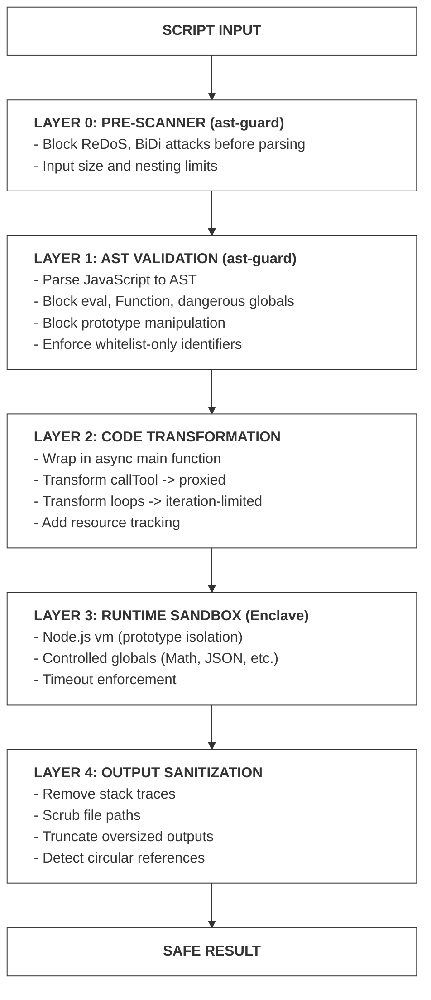

CodeCall implements **bank-grade security** through a defense-in-depth architecture. Every script passes through **five security layers** before execution, ensuring that even if one layer is bypassed, others catch malicious behavior.

<CardGroup cols={2}>
  <Card title="100+ Attack Vectors Blocked" icon="shield-check">
    Pre-Scanner + AST Guard blocks ReDoS, BiDi attacks, eval, prototype pollution, and more
  </Card>
  <Card title="Layer 0 Defense" icon="radar">
    Pre-Scanner catches attacks BEFORE parser execution - blocks parser-level DoS
  </Card>
  <Card title="Zero Trust Runtime" icon="lock">
    Enclave sandbox with whitelist-only globals and resource limits
  </Card>
</CardGroup>

---

## Security Pipeline

Every script goes through this 5-layer pipeline:



---

## Layer 0: Pre-Scanner (Defense-in-Depth)

The Pre-Scanner is a new security layer that runs **BEFORE** the JavaScript parser (acorn). It provides defense-in-depth protection against attacks that could DoS or exploit the parser itself.

### Why Layer 0?

Traditional security scanners operate on the AST (Abstract Syntax Tree), which means they rely on the parser completing successfully. Sophisticated attackers can exploit this by:

1. **Parser DoS**: Deeply nested brackets/braces can cause stack overflow in recursive descent parsers
2. **ReDoS at Parse Time**: Complex regex literals can hang the parser
3. **Memory Exhaustion**: Large inputs can exhaust memory before validation
4. **Trojan Source Attacks**: Unicode BiDi characters can make code appear different from how it executes

### Mandatory Limits (Cannot Be Disabled)

These limits are enforced regardless of configuration:

| Limit             | Value                                          | Purpose                      |
| ----------------- | ---------------------------------------------- | ---------------------------- |
| Max Input Size    | 100 MB (absolute) / 50 KB (AgentScript preset) | Prevents memory exhaustion   |
| Max Nesting Depth | 200 levels                                     | Prevents stack overflow      |
| Max Line Length   | 100,000 chars                                  | Handles minified code safely |
| Max Regex Length  | 1,000 chars                                    | Prevents ReDoS               |
| Max Regex Count   | 50                                             | Limits ReDoS attack surface  |

### Pre-Scanner Attacks Blocked

<AccordionGroup>
  <Accordion title="ReDoS (Regular Expression Denial of Service)" icon="clock">
    **Blocked Patterns:**
    - `(a+)+` - Nested quantifiers
    - `(a|a)+` - Overlapping alternation
    - `(.*a)+` - Greedy backtracking
    - `(a+){2,}` - Star in repetition

    **Why:** These patterns cause exponential backtracking that can hang the parser or runtime for hours.

  </Accordion>

  <Accordion title="BiDi/Trojan Source Attacks" icon="eye-slash">
    **Blocked Characters:**
    - U+202E (Right-to-Left Override)
    - U+2066 (Left-to-Right Isolate)
    - U+2069 (Pop Directional Isolate)

    **Why:** Makes code appear different from how it executes (CVE-2021-42574).

  </Accordion>

  <Accordion title="Parser Stack Overflow" icon="layer-group">
    **Blocked:**
    - Deeply nested brackets: `(((((((((x)))))))))`
    - Deeply nested braces: `{{{{{{{{{}}}}}}}}}`

    **Why:** Recursive descent parsers can overflow their stack on deep nesting.

  </Accordion>

  <Accordion title="Input Size DoS" icon="file-arrow-up">
    **Blocked:**
    - Inputs > 50KB (AgentScript preset)
    - Inputs > configured maxInputSize

    **Why:** Large inputs can exhaust memory before validation completes.

  </Accordion>

  <Accordion title="Null Byte Injection" icon="ban">
    **Blocked:**
    - `\x00` characters anywhere in input

    **Why:** Often indicates binary data injection or attack payloads.

  </Accordion>
</AccordionGroup>

### Pre-Scanner Configuration

CodeCall uses the **AgentScript preset** which provides the strictest pre-scanning:

```ts
// AgentScript Pre-Scanner settings (automatic with CodeCall)
{
  regexMode: 'block',        // Block ALL regex literals
  maxInputSize: 50_000,      // 50KB limit
  maxNestingDepth: 30,       // Conservative nesting
  bidiMode: 'strict',        // Block all BiDi characters
}
```

---

## Layer 1: AST Validation

[AST Guard](/docs/frontmcp/guides/ast-guard) parses JavaScript into an Abstract Syntax Tree and validates every node against security rules before any code executes.

### Blocked Constructs

<AccordionGroup>
  <Accordion title="Code Execution Attacks" icon="code">
    **Blocked:**
    - `eval('malicious code')` - Dynamic code execution
    - `new Function('return process')()` - Function constructor
    - `setTimeout(() => {}, 0)` - Timer-based execution
    - `setInterval`, `setImmediate` - Async execution escape

    **Why:** These allow arbitrary code injection that bypasses AST validation.

  </Accordion>

  <Accordion title="Global/System Access" icon="globe">
    **Blocked:**
    - `process.env.SECRET` - Node.js process access
    - `require('fs')` - Module loading
    - `window.location` - Browser globals
    - `global`, `globalThis` - Global object access
    - `this` - Context leakage

    **Why:** Prevents sandbox escape and system access.

  </Accordion>

  <Accordion title="Prototype Pollution" icon="virus">
    **Blocked:**
    - `obj.__proto__ = {}` - Direct prototype manipulation
    - `obj.constructor.prototype` - Indirect prototype access
    - `Object.prototype.polluted = true` - Global prototype pollution

    **Why:** Prototype pollution can corrupt the entire runtime.

  </Accordion>

  <Accordion title="Unicode/Trojan Source Attacks" icon="eye-slash">
    **Blocked:**
    - Bidirectional override characters (CVE-2021-42574)
    - Homoglyph attacks (Cyrillic 'a' vs Latin 'a')
    - Zero-width characters
    - Invisible formatting characters

    **Why:** Makes code appear different from how it executes.

  </Accordion>

  <Accordion title="Resource Exhaustion" icon="infinity">
    **Blocked:**
    - `while (true) {}` - Unbounded while loops
    - `do {} while (true)` - Unbounded do-while loops
    - `for (key in obj)` - Prototype chain walking
    - Recursive function definitions

    **Why:** Can freeze the server or exhaust memory.

  </Accordion>
</AccordionGroup>

### AgentScript Preset

CodeCall uses the **AgentScript preset** - the most restrictive preset designed for LLM-generated code:

The AgentScript preset enforces these rules:

| Rule | Setting | Rationale |
| --- | --- | --- |
| **Allowed globals** | `callTool`, `getTool`, `codecallContext`, `Math`, `JSON`, `Array`, `Object`, `String`, `Number`, `Date`, `console` (optional) | Whitelist-only access to safe built-ins |
| **`for` loops** | Allowed | Bounded iteration with `maxIterations` enforcement |
| **`for-of` loops** | Allowed | Bounded by array length + `maxIterations` |
| **`while` loops** | Blocked | Unbounded — risk of infinite loops |
| **`do-while` loops** | Blocked | Unbounded — risk of infinite loops |
| **`for-in` loops** | Blocked | Walks prototype chain — security risk |
| **Arrow functions** | Allowed | No recursion risk (anonymous) |
| **Function declarations** | Blocked | Enables recursion and hoisting tricks |

### What's Allowed

```js
// ✅ Tool calls
const users = await callTool('users:list', { limit: 100 });

// ✅ Variables
const filtered = users.filter(u => u.active);
let count = 0;

// ✅ Bounded loops
for (let i = 0; i < users.length; i++) { count++; }
for (const user of users) { console.log(user.name); }

// ✅ Array methods with arrow functions
const names = users.map(u => u.name);
const total = users.reduce((sum, u) => sum + u.score, 0);

// ✅ Safe built-ins
const max = Math.max(1, 2, 3);
const parsed = JSON.parse('{"a":1}');
const keys = Object.keys(obj);

// ✅ Context access (read-only)
const tenant = codecallContext.tenantId;

// ✅ Return values
return { count, names, total };
```

---

## Layer 2: Code Transformation

After AST validation passes, code is transformed for safe execution:

### Transformations Applied

| Original           | Transformed                          | Purpose                |
| ------------------ | ------------------------------------ | ---------------------- |
| Top-level code     | `async function __ag_main() { ... }` | Enable top-level await |
| `callTool(...)`    | `__safe_callTool(...)`               | Proxy through Enclave  |
| `for (...)`        | Iteration-limited version            | Enforce maxIterations  |
| `console.log(...)` | `__safe_console.log(...)`            | Capture for logging    |

### Example

```js
// Input
const users = await callTool('users:list', {});
for (const user of users) {
  console.log(user.name);
}
return users.length;

// Transformed
async function __ag_main() {
  const users = await __safe_callTool('users:list', {});
  __safe_forOf(users, (user) => {
    __safe_console.log(user.name);
  });
  return users.length;
}
```

### Reserved Prefixes

User code **cannot** declare identifiers with these prefixes:

- `__ag_` - AgentScript internal functions
- `__safe_` - Safe runtime proxies

```js
// ❌ BLOCKED by AST validation
const __ag_hack = 'foo';
let __safe_bypass = 123;
```

---

## Layer 3: Runtime Sandbox

[Enclave](/docs/frontmcp/guides/enclave) executes transformed code in an isolated Node.js `vm` context.

### Isolation Guarantees

<CardGroup cols={2}>
  <Card title="Fresh Context" icon="plus">
    Each execution gets a new, isolated context with no access to the host environment
  </Card>
  <Card title="Controlled Globals" icon="list-check">
    Only whitelisted globals available: Math, JSON, Array, Object, etc.
  </Card>
  <Card title="No Module Access" icon="ban">
    No require, import, or dynamic module loading
  </Card>
  <Card title="No Async Escape" icon="clock">
    No setTimeout, setInterval, or Promise.race tricks
  </Card>
</CardGroup>

### Resource Limits

| Limit                   | Default | Purpose                                       |
| ----------------------- | ------- | --------------------------------------------- |
| `timeoutMs`             | 3,500ms | Maximum execution time                        |
| `maxIterations`         | 5,000   | Maximum loop iterations                       |
| `maxToolCalls`          | 100     | Maximum tool invocations                      |
| `maxConsoleOutputBytes` | 64KB    | Maximum console output (I/O flood protection) |
| `maxConsoleCalls`       | 100     | Maximum console calls (I/O flood protection)  |

```ts
CodeCallPlugin.init({
  vm: {
    preset: 'secure',  // Uses defaults above
    timeoutMs: 5000,   // Override timeout
  },
});
```

### VM Presets

| Preset         | Timeout | Iterations | Tool Calls | Console Output | Console Calls | Use Case               |
| -------------- | ------- | ---------- | ---------- | -------------- | ------------- | ---------------------- |
| `locked_down`  | 2s      | 2,000      | 10         | 32KB           | 50            | Ultra-sensitive data   |
| `secure`       | 3.5s    | 5,000      | 100        | 64KB           | 100           | **Production default** |
| `balanced`     | 5s      | 10,000     | 200        | 256KB          | 500           | Complex workflows      |
| `experimental` | 10s     | 20,000     | 500        | 1MB            | 1000          | Development only       |

### Security Levels vs VM Presets

<Warning>
  Don't confuse **Enclave Security Levels** with **CodeCall VM Presets** - they serve different purposes but work together.
</Warning>

The Enclave library uses **Security Levels** (`STRICT`, `SECURE`, `STANDARD`, `PERMISSIVE`) for internal configuration, while CodeCall exposes **VM Presets** (`locked_down`, `secure`, `balanced`, `experimental`) as a user-friendly interface.

**Mapping:**

| VM Preset      | Enclave Security Level | Description                            |
| -------------- | ---------------------- | -------------------------------------- |
| `locked_down`  | `STRICT`               | Maximum security, minimal capabilities |
| `secure`       | `SECURE`               | Production-safe with reasonable limits |
| `balanced`     | `STANDARD`             | More flexibility for complex scripts   |
| `experimental` | `PERMISSIVE`           | Development/testing only               |

**Enclave Security Level Defaults:**

| Config                | STRICT  | SECURE  | STANDARD | PERMISSIVE |
| --------------------- | ------- | ------- | -------- | ---------- |
| timeout               | 2,000ms | 3,500ms | 5,000ms  | 10,000ms   |
| maxIterations         | 2,000   | 5,000   | 10,000   | 20,000     |
| maxToolCalls          | 10      | 100     | 200      | 500        |
| maxConsoleOutputBytes | 32KB    | 64KB    | 256KB    | 1MB        |
| maxConsoleCalls       | 50      | 100     | 500      | 1,000      |
| maxSanitizeDepth      | 5       | 10      | 15       | 20         |
| maxSanitizeProperties | 500     | 1,000   | 5,000    | 10,000     |

**When configuring CodeCall, use VM Presets:**

```ts
CodeCallPlugin.init({
  vm: {
    preset: 'secure',  // Maps to SECURE level
    timeoutMs: 5000,   // Override specific values as needed
  },
});
```

---

## Self-Reference Guard

**Critical Security Feature:** Scripts cannot call CodeCall meta-tools from within scripts.

```js
// Inside codecall:execute script
// ❌ BLOCKED - Self-reference detected
const result = await callTool('codecall:execute', {
  script: 'return "nested"'
});
// Returns: { success: false, error: { code: 'SELF_REFERENCE_BLOCKED' } }

// ❌ Also blocked
await callTool('codecall:search', { query: 'users' });
await callTool('codecall:describe', { toolNames: ['users:list'] });
await callTool('codecall:invoke', { tool: 'users:list', input: {} });
```

### Why This Matters

Without self-reference blocking, an attacker could:

1. **Recursive execution**: `codecall:execute` calls itself infinitely
2. **Sandbox escape**: Nest executions to accumulate privileges
3. **Resource exhaustion**: Each nested call multiplies resource usage
4. **Audit bypass**: Hide malicious calls in nested scripts

### Implementation

The guard runs **before** any other security checks:

```ts
// execute.tool.ts - First line of callTool handler
assertNotSelfReference(toolName);  // Throws if codecall:* tool
```

---

## Tool Access Control

Beyond the Self-Reference Guard, CodeCall controls which tools scripts can invoke through two configuration options.

### includeTools Filter

The `includeTools` option on `CodeCallPlugin.init()` filters which tools are available to CodeCall at the global level:

```ts
CodeCallPlugin.init({
  includeTools: (tool) => {
    // Block admin tools
    if (tool.name.startsWith('admin:')) return false;
    // Block destructive tools
    if (tool.metadata?.annotations?.destructiveHint) return false;
    return true;
  },
});
```

### Direct Invoke Allowlist

For the `codecall:invoke` meta-tool, restrict which tools can be called directly:

```ts
CodeCallPlugin.init({
  directCalls: {
    enabled: true,
    allowedTools: ['users:list', 'users:get', 'orders:list'],
  },
});
```

### Per-Tool Metadata

Individual tools opt in or out via the `codecall` metadata field:

```ts
@Tool({
  name: 'admin:deleteUser',
  codecall: {
    enabledInCodeCall: false,  // Not available in scripts
    visibleInListTools: true,  // Still visible for direct use
  },
})
```

### Default Blocked Patterns

Internally, the `ToolAccessControlService` blocks these patterns by default:

- `system:*` - System administration tools
- `internal:*` - Internal/private tools
- `__*` - Internal implementation tools
- `codecall:*` - Self-reference (via the Self-Reference Guard)

---

## Layer 4: Output Sanitization

All outputs are sanitized before returning to the client through two mechanisms: **Value Sanitization** (structure/content) and **Stack Trace Sanitization** (information leakage).

### Value Sanitization Rules

| Rule              | Default | Purpose                       |
| ----------------- | ------- | ----------------------------- |
| `maxDepth`        | 20      | Prevent deeply nested objects |
| `maxProperties`   | 10,000  | Limit total object keys       |
| `maxStringLength` | 10,000  | Truncate oversized strings    |
| `maxArrayLength`  | 1,000   | Truncate large arrays         |

### What Gets Stripped

Value sanitization removes potentially dangerous content:

| Stripped           | Reason                          |
| ------------------ | ------------------------------- |
| Functions          | Prevents code injection         |
| Symbols            | Prevents prototype manipulation |
| `__proto__` keys   | Prevents prototype pollution    |
| `constructor` keys | Prevents constructor tampering  |
| Getters/Setters    | Prevents trap execution         |

### Type Handling

The sanitizer handles special JavaScript types safely:

```ts
// Input types are converted to safe representations
Date        → ISO string
Error       → { name, message, code? }
RegExp      → string pattern
Map         → plain object
Set         → array
Buffer      → "[Buffer]"
ArrayBuffer → "[ArrayBuffer]"
```

### Circular Reference Detection

```js
// Script returns circular reference
const obj = { name: 'test' };
obj.self = obj;
return obj;

// Sanitized output
{
  "name": "test",
  "self": "[Circular]"
}
```

### Information Leakage Prevention (Stack Trace Sanitization)

<Warning>
  Stack traces can reveal sensitive information about your infrastructure. CodeCall sanitizes **40+ patterns** from error messages.
</Warning>

**File System Paths Redacted:**

| Category     | Examples                               |
| ------------ | -------------------------------------- |
| Unix home    | `/Users/john/`, `/home/deploy/`        |
| System paths | `/var/log/`, `/etc/`, `/tmp/`          |
| App paths    | `/app/`, `/srv/`, `/opt/`              |
| Windows      | `C:\Users\`, `D:\Projects\`, UNC paths |

**Package Manager Paths Redacted:**

| Manager   | Patterns                 |
| --------- | ------------------------ |
| npm       | `node_modules/`, `.npm/` |
| yarn      | `.yarn/`, `yarn-cache/`  |
| pnpm      | `.pnpm/`, `pnpm-store/`  |
| workspace | `packages/`, `libs/`     |

**Cloud/Container Paths Redacted:**

| Environment | Patterns                       |
| ----------- | ------------------------------ |
| Docker      | `/docker/`, container IDs      |
| Kubernetes  | `/var/run/secrets/`, pod names |
| AWS         | Lambda paths, ECS task IDs     |
| GCP         | Cloud Run paths, function IDs  |
| Azure       | Functions paths, container IDs |

**CI/CD Paths Redacted:**

- GitHub Actions: `/runner/`, `/_work/`
- GitLab CI: `/builds/`, CI variables
- Jenkins: `/var/jenkins/`, workspace paths
- CircleCI: `/circleci/`, project paths

**Credentials Redacted:**

```
Bearer [token]     → Bearer [REDACTED]
Authorization: ... → Authorization: [REDACTED]
api_key=xxx        → api_key=[REDACTED]
password=xxx       → password=[REDACTED]
```

**Network Information Redacted:**

- Internal hostnames: `*.internal`, `*.local`
- Private IPs: `10.x.x.x`, `192.168.x.x`, `172.16-31.x.x`
- Service URLs: Internal load balancers, databases

### Example: Before and After

```json
// Before sanitization (DANGEROUS - leaks infrastructure details)
{
  "error": {
    "message": "Cannot read property 'foo' of undefined",
    "stack": "TypeError: Cannot read property 'foo'\n    at processUser (/home/deploy/app/src/handlers/users.ts:42:15)\n    at /home/deploy/app/node_modules/@company/sdk/dist/index.js:156:23",
    "path": "/home/deploy/app/src/handlers/users.ts",
    "env": "production",
    "dbHost": "postgres.internal.company.com"
  }
}

// After sanitization (SAFE)
{
  "error": {
    "message": "Cannot read property 'foo' of undefined",
    "stack": "TypeError: Cannot read property 'foo'\n    at processUser (...)\n    at (...)",
    "code": "RUNTIME_ERROR"
  }
}
```

---

## Error Categories

CodeCall categorizes all errors for safe exposure:

| Category       | Code                     | Exposed To Client  | Contains             |
| -------------- | ------------------------ | ------------------ | -------------------- |
| Syntax         | `SYNTAX_ERROR`           | Message + location | Line/column of error |
| Validation     | `VALIDATION_ERROR`       | Rule that failed   | Blocked construct    |
| Timeout        | `TIMEOUT`                | Duration           | -                    |
| Self-Reference | `SELF_REFERENCE_BLOCKED` | Tool name          | -                    |
| Tool Not Found | `TOOL_NOT_FOUND`         | Tool name          | -                    |
| Tool Error     | `TOOL_ERROR`             | Sanitized message  | -                    |
| Runtime        | `RUNTIME_ERROR`          | Sanitized message  | -                    |

```json
// Example error response
{
  "status": "illegal_access",
  "error": {
    "kind": "IllegalBuiltinAccess",
    "message": "Identifier 'eval' is not allowed in AgentScript"
  }
}
```

---

## Security Checklist

Before deploying CodeCall to production:

<Steps>
  <Step title="Choose VM Preset">
    Use `secure` for production, `locked_down` for sensitive data.
    ```ts
    vm: { preset: 'secure' }
    ```
  </Step>
  <Step title="Configure Tool Allowlists">
    Limit which tools are accessible via CodeCall.
    ```ts
    codecall: { enabledInCodeCall: true }  // per-tool
    includeTools: (tool) => !tool.name.startsWith('admin:')  // global
    ```
  </Step>
  <Step title="Verify Stack Trace Sanitization">
    Output sanitization is enabled by default. Verify that error responses don't leak file paths or internal details in your staging environment.
  </Step>
  <Step title="Test Security Boundaries">
    Run the attack vector tests from ast-guard's security audit.
  </Step>
</Steps>

---

## Threat Model

### What CodeCall Protects Against

<CardGroup cols={2}>
  <Card title="Code Injection" icon="syringe">
    AST validation blocks eval, Function, and dynamic code execution
  </Card>
  <Card title="Sandbox Escape" icon="door-open">
    Isolated vm context with no access to Node.js APIs or globals
  </Card>
  <Card title="Data Exfiltration" icon="file-export">
    Tool access control and iteration limits restrict data movement patterns
  </Card>
  <Card title="Prototype Pollution" icon="virus">
    Blocked at AST level and isolated at runtime
  </Card>
  <Card title="Resource Exhaustion" icon="infinity">
    Timeouts, iteration limits, and tool call caps
  </Card>
  <Card title="I/O Flood Attacks" icon="wave-pulse">
    Console output size and call count limits prevent logging abuse
  </Card>
  <Card title="Information Leakage" icon="eye">
    Stack traces and file paths sanitized from outputs
  </Card>
  <Card title="Recursive Execution" icon="arrows-rotate">
    Self-reference guard blocks codecall:* tool calls
  </Card>
</CardGroup>

### What CodeCall Does NOT Protect Against

<Warning>
  CodeCall is not a silver bullet. Defense-in-depth means combining CodeCall with other security measures.
</Warning>

| Threat                     | Mitigation                                                        |
| -------------------------- | ----------------------------------------------------------------- |
| **Tool abuse**             | Use `enabledInCodeCall: false` on sensitive tools                 |
| **Algorithmic complexity** | Scripts can run O(n²) within limits - monitor performance         |
| **Memory exhaustion**      | Large arrays/objects within timeout - set reasonable limits       |
| **Tool side effects**      | Tool calls have real effects - use read-only tools where possible |
| **Business logic bugs**    | Script logic errors are not security issues                       |

---

## Related Documentation

<CardGroup cols={2}>
  <Card title="AST Guard" icon="shield-check" href="/docs/frontmcp/guides/ast-guard">
    Deep dive into AST validation rules, presets, and custom rule creation
  </Card>
  <Card title="Enclave" icon="lock" href="/docs/frontmcp/guides/enclave">
    Runtime sandbox configuration, sidecar storage, and advanced options
  </Card>
  <Card title="Security Audit" icon="file-shield" href="https://github.com/agentfront/enclave/blob/main/libs/ast-guard/docs/SECURITY-AUDIT.md">
    Full list of 100+ blocked attack vectors including Layer 0 Pre-Scanner
  </Card>
  <Card title="Configuration" icon="gear" href="/frontmcp/plugins/codecall/configuration">
    Complete configuration reference for security settings
  </Card>
  <Card title="AgentScript Guide" icon="scroll" href="/frontmcp/plugins/codecall/agentscript">
    What's allowed and blocked in the scripting language
  </Card>
  <Card title="Production &amp; Scaling" icon="server" href="/frontmcp/plugins/codecall/production">
    Security checklist and best practices for production
  </Card>
</CardGroup>
