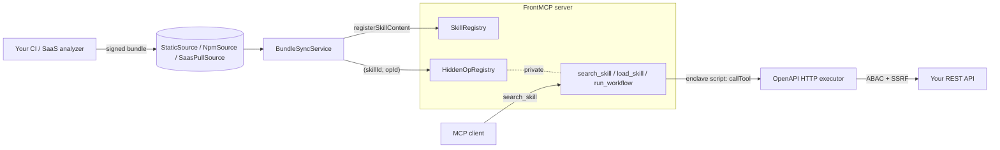

The **Skilled OpenAPI plugin** turns an existing REST API into a **skilled MCP server** without rewriting any controllers. A signed *skill bundle* (an OpenAPI spec plus an OpenAPI Overlay annotated with skill grouping) is consumed at runtime by the plugin, projected into the FrontMCP `SkillRegistry`, and exposed through three meta-tools — `search_skill`, `load_skill`, `run_workflow`. The per-operation tools stay hidden from `tools/list` so the LLM never sees a 150-endpoint dump.

<CardGroup cols={2}>
  <Card title="Skills, not flat tools" icon="layer-group">
    The MCP client sees curated skills. Per-operation tools are hidden behind the skill abstraction.
  </Card>
  <Card title="Signed, hot-swappable bundles" icon="signature">
    OPA-style JWT-of-hashes signing on every bundle. Atomic apply with rollback. Skills update without a server restart.
  </Card>
  <Card title="Standards-aligned wire format" icon="code-branch">
    Bundle is an OpenAPI Overlay (OAI 1.0/1.1) carrying skill annotations. Anticipates SEP-2076 (Skills as MCP primitive).
  </Card>
  <Card title="Five-gate authorization stack" icon="shield-check">
    Bundle signature → RFC 8707 audience check → per-skill ABAC → credential allowlist → outbound SSRF + IP blocklist.
  </Card>
</CardGroup>

---

## The problem this solves

Wrap your REST API with a flat OpenAPI→MCP generator and you hit a familiar wall:

- The agent sees 47 (or 470) tool definitions and can't pick the right one. Claude reliability degrades past ~20 tools; OpenAI GPT Actions caps at 30; Cursor caps at 40.
- Token cost explodes on every `tools/list` even when the agent uses two endpoints.
- Credentials end up in tool input schemas — every MCP client sees them.
- Schema changes ship through a server redeploy, not your CI pipeline.

The Skilled OpenAPI plugin pivots the unit of discovery from "endpoint" to **"skill"** — a curated bundle of operations the LLM treats as one named capability — and bakes the security gates the [OpenAPI security post](/blog/posts/openapi-mcp-security) describes into the runtime path.

---

## How it works

The MCP client only ever sees the three meta-tools plus whatever skills the active bundle declares. Per-operation tools are reachable **only** through `run_workflow`: the agent submits a short **AgentScript** program that runs inside a dependency-free **enclave** sandbox (no host access, no network except tool calls), and each `await callTool(actionId, input)` invokes a loaded skill's operation — evaluating the action's `requiredAuthorities` against the caller's `authInfo` before the executor builds the outbound request. A single workflow can chain many `callTool`s in one round-trip; its final `return <value>` is the result.

---

## When to use this plugin (and when not to)

| Scenario | Use this plugin | Use the [OpenAPI adapter](/frontmcp/adapters/openapi-adapter) instead |
| --- | --- | --- |
| 5–20 hand-curated endpoints, MCP-native server | | ✅ |
| 50+ endpoints, multi-service, customer-facing | ✅ | |
| Schema changes ship through CI, not redeploys | ✅ | |
| You need every operation visible in `tools/list` | | ✅ |
| You need ABAC per operation + signed-bundle origin trust | ✅ | |

The two are designed to coexist in the same FrontMCP server. See [Coexistence](/frontmcp/plugins/skilled-openapi/coexistence) for the integration story.

---

## What's included

- **Three bundle sources**: static (filesystem with optional `fs.watch`), npm (dynamic import of a published bundle package), saas-pull (HTTPS GET against a configured endpoint with JWT, interval polling, last-good cache fallback).
- **OpenAPI Overlay + custom JSON** wire formats, both validated by Zod and cross-referenced for service / authBinding / operationId integrity.
- **Bundle signing** via RS256 / Ed25519 JWT-of-hashes, modeled on [OPA's signed-bundle pattern](https://www.openpolicyagent.org/docs/management-bundles).
- **OpenAPI runtime executor** that reuses `@frontmcp/adapters/openapi`'s `buildRequest` / `parseResponse` — not a re-implementation.
- **Layered SSRF defenses**: scheme allowlist, host allowlist, post-DNS IPv4/IPv6 blocklist (RFC 1918, link-local incl. AWS/GCP/Azure metadata 169.254.169.254, loopback, ULA), cloud-metadata hostname blocklist.
- **ABAC integration** via `@frontmcp/auth`'s `AuthoritiesEngine` (RBAC + ABAC + custom evaluators).
- **`notifications/skills/list_changed`** broadcast on every bundle swap, with `bundleVersion` on every skill so polling clients can detect changes regardless of client `list_changed` support.

---

## Next steps

<CardGroup cols={2}>
  <Card title="Quick Start" icon="rocket" href="/frontmcp/plugins/skilled-openapi/quickstart">
    Install, point the plugin at a fixture bundle, and run a `run_workflow` AgentScript end-to-end in 5 minutes.
  </Card>
  <Card title="Bundle Format" icon="file-code" href="/frontmcp/plugins/skilled-openapi/bundle-format">
    The wire format the plugin consumes — services, authBindings, skills, operations, signature envelope.
  </Card>
  <Card title="Security" icon="shield-check" href="/frontmcp/plugins/skilled-openapi/security">
    Bundle signing, RFC 8707, SSRF defenses, OWASP MCP Top 10 mapping.
  </Card>
  <Card title="API Reference" icon="book" href="/frontmcp/plugins/skilled-openapi/api-reference">
    Exported types, classes, DI tokens.
  </Card>
</CardGroup>
