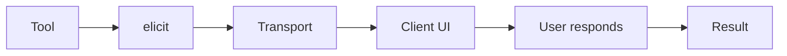
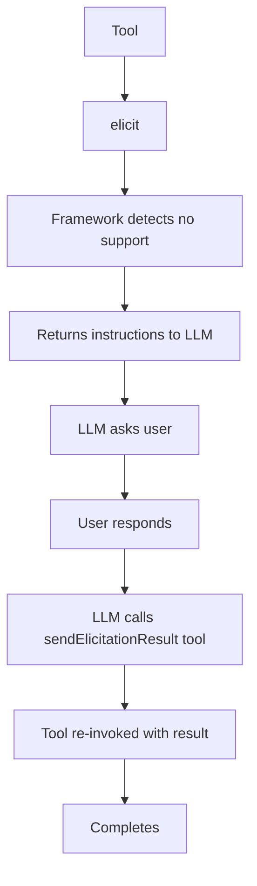
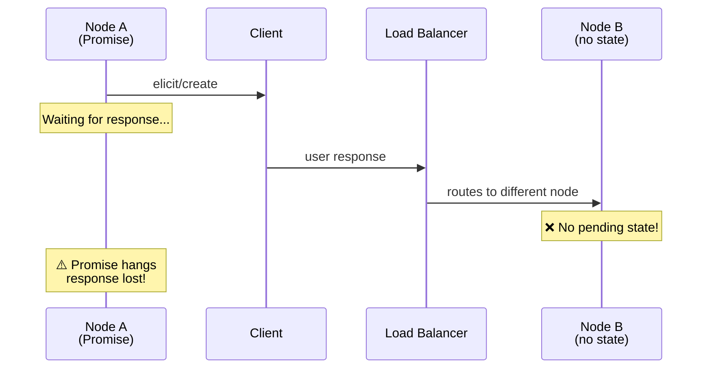
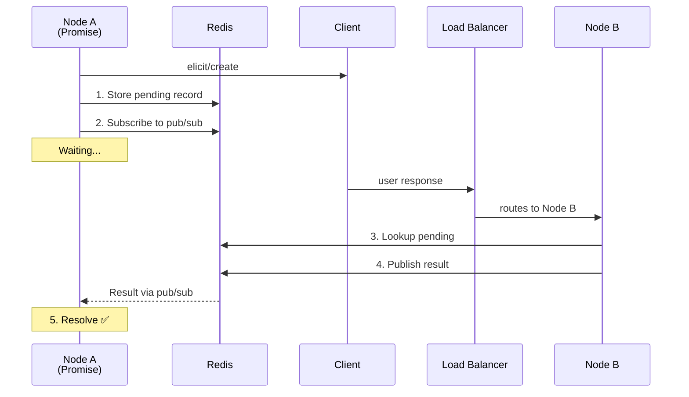
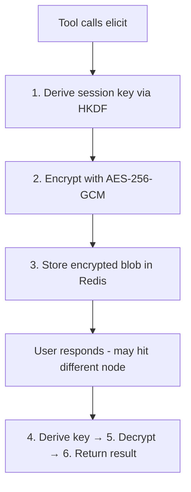

Elicitation allows tools and agents to **request interactive user input** during execution. This enables approval workflows, multi-step confirmations, OAuth flows, and any scenario where a tool needs user input before continuing.

<Info>
This feature implements the [MCP Elicitation specification](https://modelcontextprotocol.io/specification/2025-11-25/server/elicitation). FrontMCP handles all protocol details automatically.
</Info>

## Why Elicitation?

In the Model Context Protocol, elicitation fills a critical gap:

| Aspect          | Tool                            | Elicitation                     |
| --------------- | ------------------------------- | ------------------------------- |
| **Direction**   | Model triggers, server executes | Server requests, user responds  |
| **Interaction** | One-way (model → server)        | Two-way (server ↔ user)        |
| **Use case**    | Actions, calculations           | Confirmations, approvals, OAuth |
| **Blocking**    | No                              | Yes (waits for user response)   |

Elicitation is ideal for:

- **Approval workflows** — confirm destructive operations before execution
- **Multi-step forms** — collect additional information during tool execution
- **OAuth flows** — redirect users to external authentication (URL mode)
- **Human-in-the-loop** — require explicit user consent for sensitive actions
- **Disambiguation** — ask users to clarify ambiguous requests

---

## Basic Usage

### Class Style (ToolContext)

Use `this.elicit()` within any tool that extends `ToolContext`:

```ts
import { Tool, ToolContext } from '@frontmcp/sdk';
import { z } from 'zod';

@Tool({
  name: 'delete-account',
  description: 'Permanently delete a user account',
  inputSchema: {
    userId: z.string(),
  },
})
class DeleteAccountTool extends ToolContext {
  async execute({ userId }: { userId: string }) {
    // Request user confirmation before proceeding
    const result = await this.elicit(
      `Are you sure you want to permanently delete account ${userId}? This cannot be undone.`,
      z.object({
        confirmed: z.boolean().describe('Confirm deletion'),
        reason: z.string().optional().describe('Reason for deletion'),
      })
    );

    // Handle user response
    if (result.status !== 'accept') {
      return { cancelled: true, reason: `User ${result.status}d the request` };
    }

    if (!result.content?.confirmed) {
      return { cancelled: true, reason: 'User did not confirm deletion' };
    }

    // Proceed with deletion
    await this.deleteUser(userId, result.content.reason);
    return { deleted: true, userId };
  }
}
```

### Class Style (AgentContext)

Agents are LLM-powered autonomous units that can also use elicitation. Override `execute()` to add custom logic like approval workflows:

```ts
import { Agent, AgentContext } from '@frontmcp/sdk';
import { z } from 'zod';

@Agent({
  name: 'expense-processor',
  description: 'Processes expense reports with AI categorization and manager approval',
  systemInstructions: `You are an expense processing assistant. Analyze expense reports,
    categorize them, and prepare summaries. Always verify large expenses with the user.`,
  llm: {
    adapter: 'openai',
    model: 'gpt-4o',
    apiKey: { env: 'OPENAI_API_KEY' },
  },
  inputSchema: {
    description: z.string().describe('Expense description'),
    amount: z.number().describe('Expense amount in USD'),
    category: z.string().optional().describe('Optional category hint'),
  },
  tools: [ExpenseCategoryTool, ReceiptAnalyzerTool],
})
class ExpenseProcessorAgent extends AgentContext {
  async execute(input: { description: string; amount: number; category?: string }) {
    // Large expenses require manager approval before AI processing
    if (input.amount > 1000) {
      const approval = await this.elicit(
        `Expense of $${input.amount} for "${input.description}" requires manager approval.`,
        z.object({
          approved: z.boolean().describe('Approve this expense'),
          notes: z.string().optional().describe('Optional approval notes'),
        })
      );

      if (approval.status !== 'accept' || !approval.content?.approved) {
        return {
          status: 'rejected',
          reason: approval.status === 'accept' ? 'Not approved' : `User ${approval.status}d`,
        };
      }

      // Notify that approval was received
      await this.notify(`Expense approved by manager`, 'info');
    }

    // Run the default agent loop (LLM + tools) to process the expense
    return super.execute(input);
  }
}
```

<Tip>
Most agents don't need to override `execute()`. The default implementation runs the LLM loop automatically. Override only when you need custom pre/post processing like approval workflows.
</Tip>

---

## Elicitation Modes

FrontMCP supports two elicitation modes per the MCP specification:

### Form Mode (Default)

Displays a form to collect structured input directly in the client:

```ts
const result = await this.elicit(
  'Please provide your shipping preferences',
  z.object({
    address: z.string(),
    priority: z.enum(['standard', 'express', 'overnight']),
    signature: z.boolean().default(false),
  }),
  { mode: 'form' } // Default, can be omitted
);
```

### URL Mode

Redirects the user to an external URL for out-of-band interaction (OAuth, payments, etc.):

```ts
import { generateElicitationToken } from '@frontmcp/sdk';

// Generate a secure token (never expose raw sessionId!)
const token = await generateElicitationToken(this.getAuthInfo().sessionId, {
  ttl: 300000, // 5 minutes (matches elicitation timeout)
});

const result = await this.elicit(
  'Please authorize access to your GitHub account',
  z.object({
    authorized: z.boolean(),
    scope: z.array(z.string()),
  }),
  {
    mode: 'url',
    elicitationId: token, // Secure opaque token
  }
);
```

<Warning>
**Security:** Never expose raw session IDs in elicitation URLs. Use `generateElicitationToken()` to create a secure, time-limited token that encrypts the session ID. When the callback returns, the token is validated and decrypted server-side.
</Warning>

The token includes:

- Encrypted session ID (AES-256-GCM)
- Expiration timestamp (defaults to elicitation TTL)
- HMAC signature for tamper detection

---

## Elicitation Result

The `elicit()` method returns an `ElicitResult` with the following structure:

```ts
interface ElicitResult<T> {
  status: 'accept' | 'cancel' | 'decline';
  content?: T;  // Only present when status is 'accept'
}
```

### Status Values

| Status    | Description                                    | Content Present |
| --------- | ---------------------------------------------- | --------------- |
| `accept`  | User submitted the form / completed the action | Yes             |
| `cancel`  | User cancelled the elicitation                 | No              |
| `decline` | User declined to provide the requested input   | No              |

### Handling Responses

```ts
const result = await this.elicit('Confirm action?', schema);

switch (result.status) {
  case 'accept':
    // User submitted - content is typed according to your schema
    console.log(result.content); // { confirmed: boolean, ... }
    break;

  case 'cancel':
    // User cancelled - no content
    return { cancelled: true };

  case 'decline':
    // User declined - no content
    return { declined: true };
}
```

---

## Schema Validation

When the client returns an elicitation result with `action: 'accept'`, FrontMCP automatically validates the content against the original schema you provided. This ensures type safety and data integrity.

### How It Works

1. When you call `this.elicit(message, schema)`, FrontMCP stores the schema alongside the pending elicitation record
2. When the user responds, FrontMCP validates the content against the stored schema
3. Invalid content is rejected with an `InvalidInputError` (same as tool input validation)

### Validation Behavior

| Scenario                           | Validation   | Result                        |
| ---------------------------------- | ------------ | ----------------------------- |
| `accept` with valid content        | ✅ Validated | Success                       |
| `accept` with invalid content      | ✅ Validated | `InvalidInputError` thrown    |
| `cancel` or `decline`              | ⏭️ Skipped   | Success (no content expected) |
| No schema stored (backward compat) | ⏭️ Skipped   | Success                       |

### Error Handling

Invalid elicitation content throws the same `InvalidInputError` used for tool input validation. This allows LLMs (especially in fallback mode) to recognize the error format and retry with corrected data:

```json
{
  "content": [{
    "type": "text",
    "text": "Invalid elicitation result content\nDetails: [{\"path\":[\"age\"],\"message\":\"Expected number, received string\"}]"
  }],
  "isError": true,
  "_meta": {
    "errorId": "err_a1b2c3d4e5f6g7h8",
    "code": "INVALID_INPUT"
  }
}
```

The error includes:

- **path**: The JSON path to the invalid field (e.g., `["user", "age"]`)
- **message**: Human-readable validation error message

### Example: Schema Mismatch

```ts
// Tool defines a schema
const result = await this.elicit(
  'Enter your details',
  z.object({
    name: z.string(),
    age: z.number(),      // Expects number
  })
);

// If client sends { name: "John", age: "thirty" }
// FrontMCP throws InvalidInputError:
// "Invalid elicitation result content"
// Details: [{ path: ["age"], message: "Expected number, received string" }]
```

<Tip>
Schema validation uses the same `InvalidInputError` as tool input validation (HTTP 400, code `INVALID_INPUT`). This consistency helps LLMs understand and recover from validation errors.
</Tip>

---

## Timeout Handling

Elicitation requests have a configurable timeout. When the timeout expires, an `ElicitationTimeoutError` is thrown to **kill the tool execution** and release resources.

### Default Timeout

The default timeout is **5 minutes** (300,000ms):

```ts
// Uses default 5 minute timeout
const result = await this.elicit('Confirm?', schema);
```

### Custom Timeout

Specify a custom timeout with the `ttl` option:

```ts
// 1 minute timeout
const result = await this.elicit('Quick confirmation needed', schema, {
  ttl: 60000,
});

// 10 minute timeout for complex forms
const result = await this.elicit('Complete the following form', complexSchema, {
  ttl: 600000,
});
```

### Handling Timeouts

Timeouts throw an exception to ensure the tool execution is terminated:

```ts
import { ElicitationTimeoutError } from '@frontmcp/sdk';

@Tool({
  name: 'approval-tool',
  inputSchema: { action: z.string() },
})
class ApprovalTool extends ToolContext {
  async execute({ action }) {
    try {
      const result = await this.elicit(`Approve ${action}?`, schema, {
        ttl: 60000,
      });
      // Handle response...
    } catch (error) {
      if (error instanceof ElicitationTimeoutError) {
        // Timeout occurred - tool execution will be terminated
        // You can log or perform cleanup before the error propagates
        this.logger.warn(`Elicitation timed out after ${error.ttl}ms`);
      }
      throw error; // Re-throw to terminate execution
    }
  }
}
```

<Warning>
Timeouts are designed to **throw exceptions** to kill tool execution. Do not catch and suppress timeout errors—this defeats the purpose of resource cleanup.
</Warning>

---

## Single Elicit Per Session

Only **one elicitation can be pending per session** at a time. If a new elicitation is requested while one is pending, the previous one is automatically cancelled with `status: 'cancel'`.

```ts
// First elicit starts
const result1Promise = this.elicit('First question?', schema1);

// Second elicit cancels the first one
const result2Promise = this.elicit('Second question?', schema2);

// result1Promise resolves with { status: 'cancel' }
const result1 = await result1Promise;
console.log(result1.status); // 'cancel'

// result2Promise waits for user response
const result2 = await result2Promise;
```

This design ensures predictable behavior and prevents conflicting elicitation UI states.

---

## Elicitation Hooks

FrontMCP provides flow hooks to intercept elicitation requests and results. Hooks are **methods inside plugin classes** that run before, after, or around specific flow stages.

### Hook Types

| Decorator          | Description                                       |
| ------------------ | ------------------------------------------------- |
| `.Will('stage')`   | Runs **before** the stage executes                |
| `.Did('stage')`    | Runs **after** the stage completes                |
| `.Stage('stage')`  | Runs **as** the stage (replaces default)          |
| `.Around('stage')` | Wraps stage execution (call `next()` to continue) |

### ElicitationRequestHook

Intercepts the elicitation request flow before sending to the client.

**Stages:**

| Stage                | Description                                               |
| -------------------- | --------------------------------------------------------- |
| `parseInput`         | Parse and validate the elicitation parameters             |
| `validateRequest`    | Validate mode requirements (URL mode needs elicitationId) |
| `generateElicitId`   | Generate unique elicitation ID                            |
| `storePendingRecord` | Store pending elicitation in the store                    |
| `buildRequestParams` | Build the MCP elicitation request parameters              |
| `finalize`           | Final processing before sending                           |

### ElicitationResultHook

Intercepts the elicitation result flow when the user responds.

**Stages:**

| Stage             | Description                                                         |
| ----------------- | ------------------------------------------------------------------- |
| `parseInput`      | Parse the result payload                                            |
| `lookupPending`   | Lookup the pending elicitation record by session ID                 |
| `validateContent` | Validate content against stored schema (skipped for cancel/decline) |
| `buildResult`     | Build the typed result object                                       |
| `publishResult`   | Publish result via pub/sub (for distributed deployments)            |
| `finalize`        | Final processing and cleanup                                        |

### Example: Plugin with Elicitation Hooks

```ts
import { DynamicPlugin, Plugin, FlowHooksOf, FlowCtxOf } from '@frontmcp/sdk';

const ElicitationRequestHook = FlowHooksOf<'elicitation:request'>('elicitation:request');
const ElicitationResultHook = FlowHooksOf<'elicitation:result'>('elicitation:result');

@Plugin({
  name: 'elicitation-audit',
  description: 'Audit logging for elicitation flows',
})
export class ElicitationAuditPlugin extends DynamicPlugin {
  private auditLog: AuditLog;

  constructor(auditLog: AuditLog) {
    super();
    this.auditLog = auditLog;
  }

  // Runs AFTER storePendingRecord stage
  @ElicitationRequestHook.Did('storePendingRecord')
  async logElicitationStarted(ctx: FlowCtxOf<'elicitation:request'>) {
    const { elicitId, sessionId, message } = ctx.state;
    await this.auditLog.record({
      type: 'elicitation_started',
      elicitId,
      sessionId,
      message,
      timestamp: Date.now(),
    });
  }

  // Runs AFTER buildResult stage
  @ElicitationResultHook.Did('buildResult')
  async logElicitationResult(ctx: FlowCtxOf<'elicitation:result'>) {
    const { sessionId, elicitResult, pendingRecord } = ctx.state;
    if (pendingRecord && elicitResult) {
      const duration = Date.now() - pendingRecord.createdAt;
      await this.auditLog.record({
        type: 'elicitation_completed',
        elicitId: pendingRecord.elicitId,
        sessionId,
        status: elicitResult.status,
        duration,
        timestamp: Date.now(),
      });
    }
  }
}
```

### Registering the Plugin

```ts
import { FrontMcp } from '@frontmcp/sdk';
import { ElicitationAuditPlugin } from './plugins/elicitation-audit';

@FrontMcp({
  name: 'my-app',
  plugins: [ElicitationAuditPlugin],
})
class MyApp {}
```

### Use Cases

**Input Sanitization (BEFORE buildResult):**

```ts
@Plugin({ name: 'elicitation-sanitizer', description: 'Sanitize elicitation input' })
class SanitizerPlugin extends DynamicPlugin {
  @ElicitationResultHook.Will('buildResult')
  async sanitizeInput(ctx: FlowCtxOf<'elicitation:result'>) {
    // Sanitize content before it's built into result
    if (ctx.state.content) {
      ctx.state.content = this.sanitize(ctx.state.content);
    }
  }
}
```

**Analytics (AFTER finalize):**

```ts
@Plugin({ name: 'elicitation-analytics', description: 'Track elicitation completions' })
class AnalyticsPlugin extends DynamicPlugin {
  @ElicitationResultHook.Did('finalize')
  async trackCompletion(ctx: FlowCtxOf<'elicitation:result'>) {
    const { pendingRecord, elicitResult } = ctx.state;
    if (pendingRecord) {
      await analytics.track('elicitation_completed', {
        elicitId: pendingRecord.elicitId,
        duration: Date.now() - pendingRecord.createdAt,
        status: elicitResult?.status,
      });
    }
  }
}
```

**Conditional Hooks (with filter):**

```ts
@Plugin({ name: 'admin-audit', description: 'Audit admin elicitation actions' })
class AdminAuditPlugin extends DynamicPlugin {
  @ElicitationRequestHook.Did('finalize', {
    filter: (ctx) => ctx.authInfo?.role === 'admin',
  })
  async auditAdminElicitation(ctx: FlowCtxOf<'elicitation:request'>) {
    // Only runs for admin users
    await this.auditLog.recordAdminAction(ctx.state);
  }
}
```

---

## Client Capability Detection

Not all MCP clients support elicitation. FrontMCP automatically checks client capabilities before sending elicitation requests.

### Automatic Validation

When you call `this.elicit()`, FrontMCP:

1. Checks if the client declared `elicitation` capability during initialization
2. Verifies the client supports the requested mode (`form` or `url`)
3. Throws `ElicitationNotSupportedError` if elicitation is not supported

### Manual Capability Check

You can check elicitation support before calling `elicit()`:

```ts
import { supportsElicitation } from '@frontmcp/sdk';

@Tool({
  name: 'conditional-elicit',
  inputSchema: { action: z.string() },
})
class ConditionalElicitTool extends ToolContext {
  async execute({ action }) {
    const capabilities = this.scope.notifications.getClientCapabilities(
      this.getAuthInfo().sessionId
    );

    if (supportsElicitation(capabilities, 'form')) {
      // Client supports form elicitation
      const result = await this.elicit('Confirm?', schema);
      // ...
    } else {
      // Fallback for clients without elicitation support
      return { warning: 'This action requires user confirmation which is not supported by your client' };
    }
  }
}
```

### Capability Helper

The `supportsElicitation` helper function:

```ts
import { supportsElicitation, ClientCapabilities } from '@frontmcp/sdk';

// Check for any elicitation support
supportsElicitation(capabilities); // true/false

// Check for specific mode
supportsElicitation(capabilities, 'form'); // true/false
supportsElicitation(capabilities, 'url');  // true/false
```

---

## Universal LLM Support

FrontMCP elicitation works with **all LLMs**, not just those that support the MCP elicitation protocol. For clients that don't support elicitation (like OpenAI, Google Gemini, Cursor, etc.), FrontMCP automatically falls back to an LLM-mediated approach.

<Info>
**Zero code changes required!** Your tools use the same `this.elicit()` API regardless of client capabilities. FrontMCP handles detection and routing automatically.
</Info>

### How It Works

**Standard Elicitation (Claude, supporting clients):**



**Fallback Elicitation (OpenAI, Gemini, etc.):**



### Client Compatibility

| Client         | Elicitation Support | Mechanism                                   |
| -------------- | ------------------- | ------------------------------------------- |
| Claude Desktop | ✅ Native           | Standard MCP protocol                       |
| Claude.ai      | ✅ Native           | Standard MCP protocol                       |
| OpenAI ChatGPT | ✅ Automatic        | Fallback via `sendElicitationResult`        |
| Google Gemini  | ✅ Automatic        | Fallback via `sendElicitationResult`        |
| Cursor         | ✅ Automatic        | Fallback via `sendElicitationResult`        |
| Custom Clients | Depends             | Check `experimental.elicitation` capability |

### Fallback Response Format

When a tool calls `elicit()` and the client doesn't support elicitation, FrontMCP returns a structured response:

```json
{
  "content": [
    {
      "type": "text",
      "text": "This tool requires user input to continue.\n\n**Question:** Are you sure?\n\n..."
    }
  ],
  "_meta": {
    "elicitationPending": {
      "elicitId": "elicit-1234-abc",
      "message": "Are you sure?",
      "schema": { "type": "object", "properties": { "confirmed": { "type": "boolean" } } },
      "instructions": "Call sendElicitationResult tool after collecting user input"
    }
  }
}
```

The LLM reads these instructions, asks the user, then calls the `sendElicitationResult` tool:

```json
{
  "name": "sendElicitationResult",
  "arguments": {
    "elicitId": "elicit-1234-abc",
    "action": "accept",
    "content": { "confirmed": true }
  }
}
```

### The sendElicitationResult Tool

This system tool is **automatically registered** for clients that don't support elicitation. It:

- Is hidden from clients that support standard elicitation
- Accepts the `elicitId`, user `action`, and `content`
- Re-invokes the original tool with the result pre-injected
- Returns the original tool's final result

**Input Schema:**

| Parameter  | Type                                | Description                                          |
| ---------- | ----------------------------------- | ---------------------------------------------------- |
| `elicitId` | `string`                            | The elicitation ID from the pending request          |
| `action`   | `'accept' \| 'cancel' \| 'decline'` | User's action                                        |
| `content`  | `unknown`                           | User's response (required when action is `'accept'`) |

### Key Benefits

1. **Transparent to developers** — Same `this.elicit()` API for all clients
2. **Automatic detection** — Framework checks client capabilities at runtime
3. **Works with Redis** — Fallback state is stored in Redis for distributed deployments
4. **Type-safe** — Schema is converted to JSON Schema for LLM understanding

---

## Error Handling

### ElicitationNotSupportedError

Thrown when:

- Client doesn't support elicitation
- Client doesn't support the requested mode (form/url)
- No session is available
- Transport is not available

```ts
import { ElicitationNotSupportedError } from '@frontmcp/sdk';

try {
  const result = await this.elicit('Question?', schema);
} catch (error) {
  if (error instanceof ElicitationNotSupportedError) {
    // Handle gracefully - perhaps skip the confirmation
    return { skippedConfirmation: true, reason: error.message };
  }
  throw error;
}
```

### ElicitationTimeoutError

Thrown when the user doesn't respond within the TTL:

```ts
import { ElicitationTimeoutError } from '@frontmcp/sdk';

try {
  const result = await this.elicit('Question?', schema, { ttl: 30000 });
} catch (error) {
  if (error instanceof ElicitationTimeoutError) {
    console.log(`Timed out after ${error.ttl}ms`);
    console.log(`Elicit ID: ${error.elicitId}`);
  }
  throw error;
}
```

---

## Configuration Options

The `elicit()` method accepts an options object:

```ts
interface ElicitOptions {
  mode?: 'form' | 'url';    // Default: 'form'
  ttl?: number;              // Default: 300000 (5 minutes)
  elicitationId?: string;    // Required for URL mode
}
```

| Option          | Description                             | Default                      |
| --------------- | --------------------------------------- | ---------------------------- |
| `mode`          | Elicitation mode (`'form'` or `'url'`)  | `'form'`                     |
| `ttl`           | Timeout in milliseconds before throwing | 300000                       |
| `elicitationId` | Unique ID for URL mode correlation      | Auto (form) / Required (url) |

---

## Distributed Deployments

By default, elicitation state is stored in-memory on the server that initiated the elicit request. This works for single-node deployments but fails in distributed environments where different nodes may handle the initial request and the user's response.

### The Problem

In a distributed deployment:



### Redis Mode (Recommended for Production)

When Redis is configured, FrontMCP automatically uses Redis for elicitation state storage and pub/sub for cross-node result routing:

```ts
@FrontMcp({
  // Configure Redis for distributed elicitation
  redis: {
    provider: 'redis',
    host: process.env.REDIS_HOST ?? 'localhost',
    port: parseInt(process.env.REDIS_PORT ?? '6379'),
    password: process.env.REDIS_PASSWORD,
  },
})
class MyApp {}
```

With Redis configured, elicitation works seamlessly across nodes:



### Single-Node Mode (Development)

Without Redis, FrontMCP uses in-memory storage with a warning:

```
[FrontMCP] Elicitation: using in-memory store (single-node mode).
Configure Redis for distributed deployments.
```

This is appropriate for:

- Local development
- Single-node deployments
- Testing environments

### Sticky Sessions (Alternative)

If you cannot use Redis, configure your load balancer for session affinity to ensure requests from the same client always reach the same server:

**Nginx:**

```nginx
upstream backend {
  ip_hash;  # Sticky sessions by client IP
  server node1:3000;
  server node2:3000;
}
```

**AWS ALB:**

- Enable "Stickiness" in target group settings
- Use application-based cookie (recommended) or duration-based stickiness
- Set appropriate stickiness duration (longer than your elicitation TTL)

**Kubernetes (Ingress):**

```yaml
apiVersion: networking.k8s.io/v1
kind: Ingress
metadata:
  annotations:
    nginx.ingress.kubernetes.io/affinity: "cookie"
    nginx.ingress.kubernetes.io/session-cookie-name: "mcp-session"
    nginx.ingress.kubernetes.io/session-cookie-expires: "172800"
```

<Warning>
Sticky sessions are less reliable than Redis because they depend on load balancer behavior and can fail during node restarts or scaling events. Use Redis for production deployments.
</Warning>

### Vercel Edge Functions

Edge functions are stateless and **require Redis** for elicitation. An error is thrown if elicitation is attempted without Redis on Edge:

```
Error: Elicitation requires Redis configuration when running on Edge runtime.
Edge functions are stateless and cannot use in-memory elicitation.
Configure redis in @FrontMcp({ redis: { provider: "redis", host: "...", port: ... } })
```

Configure Redis when deploying to Vercel Edge:

```ts
@FrontMcp({
  redis: {
    provider: 'redis',
    host: process.env.UPSTASH_REDIS_HOST!,
    port: parseInt(process.env.UPSTASH_REDIS_PORT ?? '6379'),
    password: process.env.UPSTASH_REDIS_PASSWORD,
    tls: true,  // Required for Upstash
  },
})
class MyApp {}
```

<Tip>
[Upstash](https://upstash.com) provides serverless Redis that works well with Vercel Edge functions.
</Tip>

### Deployment Mode Summary

| Environment              | Storage          | Notes                              |
| ------------------------ | ---------------- | ---------------------------------- |
| Local development        | In-memory        | Automatic, no configuration needed |
| Single-node production   | In-memory        | Works but shows warning            |
| Multi-node production    | Redis            | Configure `redis` in `@FrontMcp`   |
| Vercel Edge              | Redis (required) | Use Upstash or similar             |
| Kubernetes               | Redis            | Use Redis cluster for HA           |
| Load balanced (no Redis) | Sticky sessions  | Configure session affinity         |

---

## Encrypted Elicitation

When collecting sensitive user data (passwords, PII, payment information), FrontMCP can encrypt all elicitation data at rest using session-derived keys.

### Why Encrypt?

Elicitation often collects sensitive data:

- Account credentials and API keys
- Personal information (SSN, address, phone)
- Financial data (card numbers, bank accounts)
- Health information (HIPAA-protected data)

Without encryption, this data is stored in plaintext in Redis or memory, accessible to anyone with database access.

### Security Model

Encrypted elicitation provides **zero-knowledge storage**:

1. **Session-Derived Keys**: Each session gets a unique encryption key derived from `HKDF-SHA256(serverSecret + sessionId)`
2. **AES-256-GCM**: Authenticated encryption prevents tampering
3. **Cross-Session Isolation**: Session B cannot decrypt Session A's data, even with database access
4. **Fail-Safe Decryption**: Decryption fails silently for tampered or corrupted data

### Configuration

Set one of these environment variables to enable encryption:

```bash
# Recommended - dedicated secret for elicitation
MCP_ELICITATION_SECRET=your-secure-random-secret-at-least-32-chars

# Fallback options (checked in order)
MCP_SESSION_SECRET=your-session-secret
MCP_SERVER_SECRET=your-server-secret
```

Encryption is **automatic** when a secret is available. No code changes required.

### How It Works



### Cross-Session Isolation

Even if an attacker gains database access, they cannot decrypt elicitation data without:

1. The server secret (`MCP_ELICITATION_SECRET`)
2. The specific sessionId used to encrypt the data

```ts
// Session A encrypts sensitive data
const resultA = await this.elicit('Enter your API key', z.object({
  apiKey: z.string(),
}));
// Stored as encrypted blob with Session A's derived key

// Session B cannot decrypt Session A's data
// Even with database access, decryption returns null
```

### Best Practices

**Do:**

- Use a strong random secret (32+ characters)
- Rotate secrets periodically (with care for in-flight elicitations)
- Set secrets via environment variables, not code
- Use `MCP_ELICITATION_SECRET` for dedicated elicitation security

**Don't:**

- Store secrets in version control
- Use weak or predictable secrets
- Share secrets across environments (dev/staging/prod)
- Log or expose encrypted data for debugging

---

## Real-World Examples

### Approval Workflow

```ts
@Tool({
  name: 'approve-expense',
  description: 'Process an expense report with manager approval',
  inputSchema: {
    expenseId: z.string(),
    amount: z.number(),
    description: z.string(),
  },
  annotations: {
    destructiveHint: true,
  },
})
class ApproveExpenseTool extends ToolContext {
  async execute({ expenseId, amount, description }) {
    // Large expenses require approval
    if (amount > 500) {
      const approval = await this.elicit(
        `Expense #${expenseId} for $${amount.toFixed(2)}: "${description}"`,
        z.object({
          approved: z.boolean().describe('Approve this expense'),
          notes: z.string().optional().describe('Optional approval notes'),
        }),
        { ttl: 300000 } // 5 minute timeout
      );

      if (approval.status !== 'accept') {
        return {
          status: 'cancelled',
          expenseId,
          reason: `Manager ${approval.status}d the approval request`
        };
      }

      if (!approval.content?.approved) {
        return {
          status: 'rejected',
          expenseId,
          notes: approval.content?.notes,
        };
      }
    }

    // Process the expense
    await this.processExpense(expenseId);
    return { status: 'approved', expenseId };
  }
}
```

### Multi-Step Confirmation

```ts
@Tool({
  name: 'transfer-funds',
  description: 'Transfer funds between accounts',
  inputSchema: {
    fromAccount: z.string(),
    toAccount: z.string(),
    amount: z.number(),
  },
})
class TransferFundsTool extends ToolContext {
  async execute({ fromAccount, toAccount, amount }) {
    // Step 1: Confirm transfer details
    const confirm = await this.elicit(
      `Transfer $${amount} from ${fromAccount} to ${toAccount}?`,
      z.object({
        confirmed: z.boolean(),
      })
    );

    if (confirm.status !== 'accept' || !confirm.content?.confirmed) {
      return { cancelled: true };
    }

    // Step 2: Verify with additional security
    const verification = await this.elicit(
      'Please verify this transfer',
      z.object({
        verificationCode: z.string().min(6).max(6).describe('Enter the 6-digit code sent to your phone'),
      }),
      { ttl: 120000 } // 2 minute timeout for verification
    );

    if (verification.status !== 'accept') {
      return { cancelled: true, reason: 'Verification not completed' };
    }

    // Validate code and process transfer
    if (!this.validateCode(verification.content?.verificationCode)) {
      return { error: 'Invalid verification code' };
    }

    await this.executeTransfer(fromAccount, toAccount, amount);
    return { success: true, transactionId: this.generateTxId() };
  }
}
```

### OAuth Authorization (URL Mode)

```ts
import { generateElicitationToken } from '@frontmcp/sdk';

@Tool({
  name: 'connect-github',
  description: 'Connect your GitHub account',
  inputSchema: {},
})
class ConnectGitHubTool extends ToolContext {
  async execute() {
    // Generate secure token - sessionId is encrypted inside
    const elicitationToken = await generateElicitationToken(
      this.getAuthInfo().sessionId,
      { ttl: 300000 } // 5 minute timeout
    );

    // Store OAuth state (token already contains encrypted sessionId)
    await this.get(OAuthStateStore).set(elicitationToken, {
      provider: 'github',
      startedAt: Date.now(),
    });

    const result = await this.elicit(
      'Click the link to authorize FrontMCP to access your GitHub account',
      z.object({
        accessToken: z.string(),
        scope: z.array(z.string()),
        username: z.string(),
      }),
      {
        mode: 'url',
        elicitationId: elicitationToken,
        ttl: 300000,
      }
    );

    if (result.status !== 'accept') {
      return { connected: false, reason: `Authorization ${result.status}d` };
    }

    // Store the token and return success
    await this.get(TokenStore).save(
      this.getAuthInfo().sessionId,
      'github',
      result.content!.accessToken
    );

    return {
      connected: true,
      username: result.content!.username,
      scope: result.content!.scope,
    };
  }
}
```

<Info>
The `generateElicitationToken()` creates an opaque token containing the encrypted session ID. When the OAuth callback returns, the token is automatically validated and decrypted—you never need to expose raw session IDs in URLs.
</Info>

### Graceful Fallback

```ts
@Tool({
  name: 'delete-file',
  description: 'Delete a file with optional confirmation',
  inputSchema: {
    path: z.string(),
    skipConfirmation: z.boolean().optional(),
  },
})
class DeleteFileTool extends ToolContext {
  async execute({ path, skipConfirmation }) {
    // Check if we should/can request confirmation
    const shouldConfirm = !skipConfirmation;
    const capabilities = this.scope.notifications.getClientCapabilities(
      this.getAuthInfo().sessionId
    );
    const canElicit = supportsElicitation(capabilities, 'form');

    if (shouldConfirm && canElicit) {
      const result = await this.elicit(
        `Delete "${path}"? This cannot be undone.`,
        z.object({ confirmed: z.boolean() })
      );

      if (result.status !== 'accept' || !result.content?.confirmed) {
        return { deleted: false, reason: 'User did not confirm' };
      }
    } else if (shouldConfirm && !canElicit) {
      // Client doesn't support elicitation - return warning
      return {
        deleted: false,
        reason: 'Confirmation required but client does not support elicitation. Use skipConfirmation: true to proceed.',
      };
    }

    // Proceed with deletion
    await this.deleteFile(path);
    return { deleted: true, path };
  }
}
```

---

## MCP Protocol Integration

Elicitation integrates with the MCP protocol via:

| Flow                 | Description                                 |
| -------------------- | ------------------------------------------- |
| `elicitation/create` | Server sends elicitation request to client  |
| Result callback      | Client sends result with action and content |

### Client Capabilities

Clients advertise elicitation support during MCP initialization:

```json
{
  "capabilities": {
    "elicitation": {
      "form": {},
      "url": {}
    }
  }
}
```

FrontMCP automatically reads these capabilities and validates them before sending elicitation requests.

### Protocol Flow

1. Tool calls `this.elicit(message, schema, options)`
2. FrontMCP validates client capabilities
3. FrontMCP sends `elicitation/create` request to client
4. Client displays form/redirects user based on mode
5. User interacts with the elicitation UI
6. Client sends result back with `action` ('accept', 'cancel', 'decline') and optional `content`
7. FrontMCP resolves the promise with typed `ElicitResult`

<Tip>
For the full protocol specification, see [MCP Elicitation](https://modelcontextprotocol.io/specification/2025-11-25/server/elicitation).
</Tip>

---

## Best Practices

**Do:**

- Use descriptive messages that clearly explain what information is needed
- Define clear Zod schemas with `.describe()` on each field
- Set appropriate timeouts based on the complexity of the request
- Handle all three status values (`accept`, `cancel`, `decline`)
- Provide graceful fallbacks for clients without elicitation support
- Use form mode for simple confirmations and structured data collection
- Use URL mode only for external authentication flows

**Don't:**

- Suppress timeout errors—let them propagate to terminate execution
- Request elicitation for every tool—only when user input is truly needed
- Set extremely long timeouts that could leave resources hanging
- Assume all clients support elicitation—always check or handle errors
- Chain multiple dependent elicitations without clear user guidance
- Use elicitation for data that should be provided upfront in tool input

---

## API Reference

### Types

```ts
// Status of an elicitation result
type ElicitStatus = 'accept' | 'cancel' | 'decline';

// Result returned by elicit()
interface ElicitResult<T = unknown> {
  status: ElicitStatus;
  content?: T;  // Only present when status is 'accept'
}

// Options for elicit()
interface ElicitOptions {
  mode?: 'form' | 'url';
  ttl?: number;
  elicitationId?: string;
}

// Default timeout constant
const DEFAULT_ELICIT_TTL = 300000; // 5 minutes
```

### Errors

```ts
// Thrown when client doesn't support elicitation
class ElicitationNotSupportedError extends PublicMcpError {
  // code: 'ELICITATION_NOT_SUPPORTED'
  // statusCode: 400
}

// Thrown when elicitation times out
class ElicitationTimeoutError extends PublicMcpError {
  readonly elicitId: string;
  readonly ttl: number;
  // code: 'ELICITATION_TIMEOUT'
  // statusCode: 408
}
```

### Helpers

```ts
// Check if client supports elicitation
function supportsElicitation(
  capabilities?: ClientCapabilities,
  mode?: 'form' | 'url'
): boolean;
```
