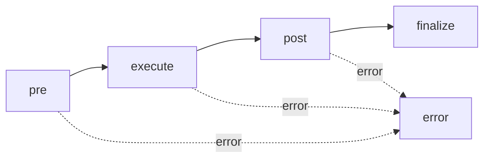

Flows are **named execution pipelines** that define how requests are processed through a series of lifecycle stages. Every MCP operation (calling a tool, reading a resource, getting a prompt) passes through a flow that controls pre-processing, execution, post-processing, and finalization.

<Info>
Flows are part of the FrontMCP execution model. They provide hook points for cross-cutting concerns like logging, caching, validation, and error handling.
</Info>

## Why Flows?

Flows give you fine-grained control over request processing without modifying tool, resource, or prompt code directly.

| Aspect            | Flow                          | Tool            | Plugin                   |
| ----------------- | ----------------------------- | --------------- | ------------------------ |
| **Purpose**       | Request lifecycle management  | Execute actions | Cross-cutting extensions |
| **Scope**         | Per-request pipeline          | Single action   | Across all requests      |
| **Customization** | Stage-level hooks             | Execute method  | Registration hooks       |
| **Use case**      | Logging, caching, auth checks | Business logic  | Feature extensions       |

Flows are ideal for:

- **Request validation** — check permissions, validate inputs before execution
- **Caching** — intercept responses and serve from cache
- **Logging and auditing** — trace every request through the system
- **Error handling** — centralized error recovery and formatting
- **Performance monitoring** — measure timing across stages

---

## Flow Lifecycle

Every request passes through these stages in order:


```mermaid
graph LR
    A[pre] --> B[execute]
    B --> C[post]
    C --> D[finalize]
    B -.->|error| E[error]
    A -.->|error| E
    C -.->|error| E
```

| Stage        | Purpose                                         | Example                                    |
| ------------ | ----------------------------------------------- | ------------------------------------------ |
| **pre**      | Validation, auth checks, input transformation   | Check API key, parse headers               |
| **execute**  | Run the core operation (tool, resource, prompt) | Call `execute()` on the tool               |
| **post**     | Transform output, apply caching, logging        | Cache response, format output              |
| **finalize** | Send response, cleanup                          | Emit response to client, release resources |
| **error**    | Handle failures from any stage                  | Log error, return formatted error response |

---

## Built-in Flows

FrontMCP provides built-in flows for all MCP protocol operations:

| Flow Name                  | Trigger                       | Description                             |
| -------------------------- | ----------------------------- | --------------------------------------- |
| `tools:call-tool`          | `tools/call` request          | Execute a tool with validated arguments |
| `tools:list-tools`         | `tools/list` request          | List all available tools                |
| `resources:read-resource`  | `resources/read` request      | Read a resource by URI                  |
| `resources:list-resources` | `resources/list` request      | List all available resources            |
| `resources:subscribe`      | `resources/subscribe` request | Subscribe to resource changes           |
| `prompts:get-prompt`       | `prompts/get` request         | Generate a prompt with arguments        |
| `prompts:list-prompts`     | `prompts/list` request        | List all available prompts              |

---

## Creating Custom Flows

Custom flows are defined with the `@Flow` decorator, a typed `FlowPlan`, and stage handlers attached via `FlowHooksOf(...).Stage(...)`. The plan is keyed by phase (`pre`, `execute`, `post`, `finalize`) and lists the stage names that run in that phase. Each named stage in the plan is implemented by a method on the flow class decorated with `@Stage('<stage-name>')`.

```ts
import { z } from '@frontmcp/lazy-zod';
import { Flow, FlowBase, FlowHooksOf, type FlowPlan } from '@frontmcp/sdk';

const name = 'custom:my-flow' as const;

const inputSchema = z.object({ query: z.string() });
const outputSchema = z.object({ result: z.string() });
const stateSchema = z.object({ result: z.string().optional() });

const plan = {
  pre: ['validate'],
  execute: ['process'],
  post: ['format'],
  finalize: ['send'],
} as const satisfies FlowPlan<string>;

const { Stage } = FlowHooksOf(name);

@Flow({
  name,
  access: 'authorized',
  inputSchema,
  outputSchema,
  plan,
})
export default class MyCustomFlow extends FlowBase<typeof name> {
  @Stage('validate')
  async validate() {
    if (!this.rawInput.query) {
      this.fail(new Error('Missing query'));
    }
  }

  @Stage('process')
  async process() {
    this.state.set('result', `processed: ${this.rawInput.query}`);
  }

  @Stage('format')
  async format() {
    const result = this.state.get('result') ?? '';
    this.state.set('result', result.toUpperCase());
  }

  @Stage('send')
  async send() {
    this.respond({ result: this.state.get('result') ?? '' });
  }
}
```

### Flow Metadata

```ts
@Flow({
  name: string,              // Required: registered FlowName from ExtendFlows
  access?: 'public' | 'authorized', // Default: 'public'
  inputSchema: ZodSchema,    // Required: input validation
  outputSchema?: ZodSchema,  // Optional: output validation
  plan: FlowPlan,            // Required: phase → stage names
  dependsOn?: Token[],       // Optional: DI tokens this flow depends on
  middleware?: FlowMiddlewareOptions, // Optional: HTTP middleware mounting
  description?: string,      // Optional: documentation
})
```

---

## Hooking into Flows

You don't need to create a full custom flow to customize behavior. Use **hooks** to intercept specific stages of existing flows.

### Hook Types

| Hook Type  | When It Runs                | Use Case                              |
| ---------- | --------------------------- | ------------------------------------- |
| **Will**   | Before a stage executes     | Validate, transform input             |
| **Did**    | After a stage completes     | Log, cache, transform output          |
| **Around** | Wraps the entire stage      | Timing, retry logic, circuit breakers |
| **Stage**  | Implements the stage itself | Define custom stage behavior          |

### Applying Hooks

Hooks are method decorators returned from a flow-specific factory. Use the pre-built hook factories (e.g. `ToolHook`, `ResourceHook`) or build your own with `FlowHooksOf(flowName)`.

```ts
import { Tool, ToolContext, ToolHook } from '@frontmcp/sdk';
import { z } from '@frontmcp/sdk';

const { Will, Did } = ToolHook;

@Tool({
  name: 'my-tool',
  inputSchema: { query: z.string() },
})
class MyTool extends ToolContext {
  @Will('execute')
  async beforeExecute() {
    console.log('About to execute tool');
  }

  @Did('execute')
  async afterExecute() {
    console.log('Tool execution complete');
  }

  async execute({ query }: { query: string }) {
    return `Result for: ${query}`;
  }
}
```

For other flows, build hook decorators with `FlowHooksOf(flowName)`:

```ts
import { FlowHooksOf } from '@frontmcp/sdk';

const { Will, Did, Around, Stage } = FlowHooksOf('http:request');
```

### Around Hooks

Around hooks wrap a stage completely, giving you control over whether the stage executes:

```ts
import { ToolHook } from '@frontmcp/sdk';

const { Around } = ToolHook;

class TimingHook {
  @Around('execute')
  async timeExecution(next: () => Promise<void>) {
    const start = Date.now();
    try {
      await next();
    } finally {
      console.log(`Execution took ${Date.now() - start}ms`);
    }
  }
}
```

<Tip>
For a complete guide to hooks, see the [Hooks decorator reference](/frontmcp/sdk-reference/decorators/hooks).
</Tip>

---

## Flow Control

Within flow stages, you have access to control methods:

| Method                       | Description                                    |
| ---------------------------- | ---------------------------------------------- |
| `this.respond(value)`        | End the flow and send a response to the client |
| `this.fail(error)`           | Abort the flow with an `Error` instance        |
| `this.state.get(key)`        | Read from flow state                           |
| `this.state.set(key, value)` | Write to flow state                            |

### State Management

Flows expose `this.rawInput` (raw request payload) and `this.input` (validated against `inputSchema`). Use `this.state` to pass data between stages — never mutate `rawInput` directly.

```ts
@Stage('pre')
async pre() {
  // Validated input from the request
  const input = this.input;

  // Transform and store in state for later stages
  this.state.set('normalizedInput', {
    ...input,
    timestamp: Date.now(),
  });
}

@Stage('execute')
async execute() {
  // Read from state set in previous stage
  const input = this.state.get('normalizedInput');
  const result = await this.process(input);
  this.state.set('result', result);
}
```

<Info>
Never mutate `rawInput` in flows — use `state.set()` for flow state. This ensures each stage works with clean, immutable inputs.
</Info>

---

## Generating Flows

Use the Nx generator to scaffold a new flow:

```bash
nx g @frontmcp/nx:flow --name audit-log --project my-app
```

This generates a flow class with all lifecycle methods:

```
src/flows/
  audit-log.flow.ts
```

---

## Best Practices

**Do:**

- Use hooks for cross-cutting concerns instead of duplicating logic in tools
- Keep flow stages focused — each stage should have a single responsibility
- Use `state.set()` / `state.get()` for passing data between stages
- Handle errors in the `error()` stage for centralized error management
- Validate hook flows match their entry type (e.g., tool hooks use `tools:call-tool`)

**Don't:**

- Mutate `rawInput` directly — use flow state instead
- Create custom flows for simple operations that built-in flows already handle
- Skip the `error()` stage — unhandled errors surface as generic MCP errors
- Add business logic to hooks — keep hooks lightweight, delegate to providers
