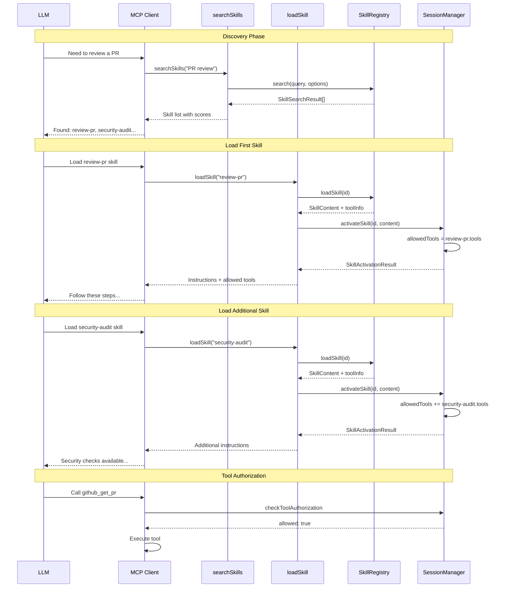

Skills are **modular knowledge packages** that teach AI how to perform multi-step tasks using tools. Unlike tools (which are individual actions), skills are recipes/playbooks that combine tools into coherent workflows.

<Info>
Skills extend the MCP model by providing workflow guidance. They're discovered via `searchSkills` and loaded via `loadSkill` tools that FrontMCP automatically registers.
</Info>

## Why Skills?

In the Model Context Protocol ecosystem, skills serve a distinct purpose from tools, resources, and prompts:

| Aspect           | Skill                                    | Tool                     | Resource         | Prompt                         |
| ---------------- | ---------------------------------------- | ------------------------ | ---------------- | ------------------------------ |
| **Purpose**      | Multi-step workflows                     | Execute actions          | Provide data     | Provide templated instructions |
| **Contains**     | Instructions + tool references           | Execution logic          | Read-only data   | Message templates              |
| **Direction**    | Model loads on demand                    | Model triggers execution | Model pulls data | Model uses messages            |
| **Side effects** | No (guidance only)                       | Yes (mutations, API calls)| No (read-only)  | No (message generation)        |
| **Use case**     | Complex procedures, workflows            | Actions, integrations    | Context loading  | Conversation templates         |

Skills are ideal for:

- **Complex workflows** — multi-step procedures like PR reviews, deployments, migrations
- **Domain expertise** — codified knowledge from experts (security audits, code reviews)
- **Orchestration guides** — coordinating multiple tools in sequence
- **Reusable playbooks** — standardized procedures across teams

---

## How Skills Work



---

## Creating Skills

### Class Style

Use class decorators for skills that need dependency injection or lifecycle hooks:

```ts
import { Skill, SkillContext } from '@frontmcp/sdk';

@Skill({
  name: 'review-pr',
  description: 'Review a GitHub pull request for code quality and issues',
  instructions: `
    ## PR Review Process

    1. First, fetch the PR details using github_get_pr
    2. Review the changed files using github_get_pr_files
    3. For each file, analyze for:
       - Code quality issues
       - Security vulnerabilities
       - Performance concerns
    4. Add review comments using github_add_review_comment
    5. Submit the review using github_submit_review
  `,
  tools: [
    { name: 'github_get_pr', purpose: 'Fetch PR details', required: true },
    { name: 'github_get_pr_files', purpose: 'Get changed files' },
    { name: 'github_add_review_comment', purpose: 'Add inline comments' },
    { name: 'github_submit_review', purpose: 'Submit final review' },
  ],
  tags: ['github', 'code-review', 'quality'],
})
class ReviewPRSkill extends SkillContext {}
```

### Function Style

For simpler skills, use the functional builder:

```ts
import { skill } from '@frontmcp/sdk';

const DeployAppSkill = skill({
  name: 'deploy-app',
  description: 'Deploy application to production environment',
  instructions: { file: './skills/deploy-app.md' },
  tools: ['docker_build', 'docker_push', 'k8s_apply'],
  tags: ['deployment', 'devops'],
});
```

---

## Registering Skills

Add skills to your app via the `skills` array:

```ts
import { App } from '@frontmcp/sdk';

@App({
  id: 'my-app',
  name: 'My Application',
  tools: [GitHubTool, DockerTool, K8sTool],
  skills: [ReviewPRSkill, DeployAppSkill, RefactorSkill],
})
class MyApp {}
```

Skills are automatically:
- Indexed for search via `searchSkills`
- Loadable via `loadSkill` with tool availability info

---

## Skill Metadata

```ts
@Skill({
  name: string,              // Required: unique identifier
  description: string,       // Required: short description for discovery
  instructions: InstructionSource, // Required: detailed guidance (see below)
  tools?: ToolRef[],         // Optional: tool references with purpose
  tags?: string[],           // Optional: categorization tags
  parameters?: Parameter[],  // Optional: input parameters
  examples?: Example[],      // Optional: usage examples
  priority?: number,         // Optional: search ranking weight (default: 0)
  hideFromDiscovery?: boolean, // Optional: hide from searchSkills (default: false)
})
```

**Field descriptions:**

| Field               | Description                                                  |
| ------------------- | ------------------------------------------------------------ |
| `name`              | Unique identifier used in search and load operations         |
| `description`       | Short text helping the model understand when to use this skill |
| `instructions`      | Detailed step-by-step guidance (inline, file, or URL)        |
| `tools`             | Tools this skill uses, with optional purpose descriptions    |
| `tags`              | Categorization for filtering and organization                |
| `parameters`        | Input values that customize skill behavior                   |
| `examples`          | Scenarios demonstrating when and how to use the skill        |
| `priority`          | Higher values appear earlier in search results               |
| `hideFromDiscovery` | When `true`, skill is loadable but not listed in search      |

---

## Instruction Sources

Skills support three instruction sources:

### Inline String (Recommended)

Best for dependency tracking and version control:

```ts
@Skill({
  name: 'security-audit',
  instructions: `
    ## Security Audit Process

    1. Scan dependencies with security_scan_deps
    2. Check for hardcoded secrets with secrets_scan
    3. Analyze code for OWASP top 10 with code_analyze
    4. Generate report with create_report
  `,
})
```

### File Path

Load from a markdown file at runtime:

```ts
@Skill({
  name: 'migration-guide',
  instructions: { file: './skills/database-migration.md' },
})
```

### URL

Fetch from a remote source at load time:

```ts
@Skill({
  name: 'external-workflow',
  instructions: { url: 'https://docs.example.com/workflows/deploy.md' },
})
```

<Tip>
Inline instructions are recommended because they enable static analysis, type checking, and ensure the skill definition is complete and self-contained.
</Tip>

---

## Tool References

Reference tools with simple names or detailed objects:

### Simple References

```ts
@Skill({
  name: 'simple-workflow',
  tools: ['github_create_pr', 'github_merge_pr', 'slack_notify'],
})
```

### Detailed References

Include purpose and required flag for better LLM understanding:

```ts
@Skill({
  name: 'detailed-workflow',
  tools: [
    { name: 'github_create_pr', purpose: 'Create the pull request', required: true },
    { name: 'github_request_review', purpose: 'Request code review' },
    { name: 'github_merge_pr', purpose: 'Merge after approval', required: true },
    { name: 'slack_notify', purpose: 'Notify team of completion' },
  ],
})
```

| Property   | Description                                              |
| ---------- | -------------------------------------------------------- |
| `name`     | The tool's identifier                                    |
| `purpose`  | Explains why/how the tool is used in this skill          |
| `required` | If `true`, skill may not work without this tool          |

---

## Parameters

Define input parameters that customize skill behavior:

```ts
@Skill({
  name: 'review-pr',
  parameters: [
    {
      name: 'pr_url',
      description: 'URL of the pull request to review',
      required: true,
      type: 'string',
    },
    {
      name: 'focus_areas',
      description: 'Specific areas to focus on (security, performance, etc.)',
      type: 'array',
    },
    {
      name: 'strictness',
      description: 'Review strictness level',
      type: 'string',
      default: 'normal',
    },
  ],
})
```

| Property      | Description                                       |
| ------------- | ------------------------------------------------- |
| `name`        | Parameter identifier                              |
| `description` | Human-readable description                        |
| `required`    | Whether the parameter must be provided            |
| `type`        | Type hint: `string`, `number`, `boolean`, `object`, `array` |
| `default`     | Default value if not provided                     |

---

## Examples

Provide usage examples to help LLMs understand when to use the skill:

```ts
@Skill({
  name: 'review-pr',
  examples: [
    {
      scenario: 'User asks to review a PR for security issues',
      parameters: {
        pr_url: 'https://github.com/org/repo/pull/123',
        focus_areas: ['security', 'authentication'],
      },
      expectedOutcome: 'Detailed security-focused review with inline comments',
    },
    {
      scenario: 'User wants a quick review of a small PR',
      parameters: {
        pr_url: 'https://github.com/org/repo/pull/456',
        strictness: 'lenient',
      },
      expectedOutcome: 'High-level review focusing on major issues only',
    },
  ],
})
```

---

## Real-World Examples

### PR Review Skill

```ts
@Skill({
  name: 'review-pr',
  description: 'Review a GitHub pull request for code quality, security, and best practices',
  instructions: `
    ## PR Review Workflow

    ### Phase 1: Gather Context
    1. Use github_get_pr to fetch PR metadata (title, description, author)
    2. Use github_get_pr_files to get the list of changed files
    3. For large PRs, prioritize: security-sensitive files, API changes, database migrations

    ### Phase 2: Analyze Changes
    For each changed file:
    - Check for security vulnerabilities (SQL injection, XSS, auth bypass)
    - Review error handling and edge cases
    - Verify test coverage for new functionality
    - Look for performance issues (N+1 queries, memory leaks)

    ### Phase 3: Provide Feedback
    1. Use github_add_review_comment for inline suggestions
    2. Group related issues together
    3. Distinguish between blocking issues and suggestions

    ### Phase 4: Submit Review
    Use github_submit_review with:
    - APPROVE: No blocking issues found
    - REQUEST_CHANGES: Blocking issues that must be fixed
    - COMMENT: Suggestions only, no blocking issues
  `,
  tools: [
    { name: 'github_get_pr', purpose: 'Fetch PR metadata and description', required: true },
    { name: 'github_get_pr_files', purpose: 'List all changed files', required: true },
    { name: 'github_add_review_comment', purpose: 'Add inline review comments' },
    { name: 'github_submit_review', purpose: 'Submit the final review verdict' },
  ],
  tags: ['github', 'code-review', 'quality', 'security'],
  parameters: [
    { name: 'pr_url', description: 'Pull request URL', required: true },
    { name: 'focus_areas', description: 'Areas to focus on', type: 'array' },
  ],
})
class ReviewPRSkill extends SkillContext {}
```

### Deploy Application Skill

```ts
@Skill({
  name: 'deploy-app',
  description: 'Deploy application to Kubernetes production environment',
  instructions: `
    ## Deployment Workflow

    ### Pre-flight Checks
    1. Verify all tests pass with run_tests
    2. Check for security vulnerabilities with security_scan
    3. Ensure environment variables are configured

    ### Build Phase
    1. Build Docker image with docker_build
    2. Tag with version and commit SHA
    3. Push to registry with docker_push

    ### Deploy Phase
    1. Update Kubernetes manifests with k8s_update_manifests
    2. Apply changes with k8s_apply
    3. Wait for rollout with k8s_wait_rollout

    ### Post-deployment
    1. Run smoke tests with run_smoke_tests
    2. Notify team with slack_notify
    3. If any step fails, trigger k8s_rollback
  `,
  tools: [
    { name: 'run_tests', purpose: 'Run test suite', required: true },
    { name: 'security_scan', purpose: 'Scan for vulnerabilities' },
    { name: 'docker_build', purpose: 'Build container image', required: true },
    { name: 'docker_push', purpose: 'Push to container registry', required: true },
    { name: 'k8s_apply', purpose: 'Apply Kubernetes manifests', required: true },
    { name: 'k8s_wait_rollout', purpose: 'Wait for deployment completion' },
    { name: 'k8s_rollback', purpose: 'Rollback on failure' },
    { name: 'slack_notify', purpose: 'Send deployment notifications' },
  ],
  tags: ['deployment', 'kubernetes', 'devops', 'production'],
})
class DeployAppSkill extends SkillContext {}
```

### Code Refactoring Skill

```ts
const RefactorSkill = skill({
  name: 'refactor-code',
  description: 'Safely refactor code with comprehensive testing',
  instructions: `
    ## Refactoring Workflow

    ### Analysis
    1. Read the target code with read_file
    2. Identify code smells and improvement opportunities
    3. Plan refactoring steps (small, testable changes)

    ### Refactoring Loop
    For each planned change:
    1. Make the change with edit_file
    2. Run tests with run_tests
    3. If tests fail, revert and try alternative approach
    4. Commit working changes with git_commit

    ### Verification
    1. Run full test suite
    2. Check for regressions
    3. Review final diff with git_diff
  `,
  tools: [
    { name: 'read_file', purpose: 'Read source code', required: true },
    { name: 'edit_file', purpose: 'Make code changes', required: true },
    { name: 'run_tests', purpose: 'Verify changes', required: true },
    { name: 'git_commit', purpose: 'Commit working changes' },
    { name: 'git_diff', purpose: 'Review final changes' },
  ],
  tags: ['refactoring', 'code-quality', 'testing'],
});
```

---

## MCP Protocol Integration

FrontMCP automatically registers two flows for skill discovery and loading:

| Flow            | Description                                                       |
| --------------- | ----------------------------------------------------------------- |
| `skills/search` | Search for relevant skills by query, tags, or required tools      |
| `skills/load`   | Load a skill's full content including instructions and tool info  |

### searchSkills

Search for skills matching a query:

```json
{
  "method": "skills/search",
  "params": {
    "query": "review pull request",
    "tags": ["github"],
    "limit": 10,
    "requireAllTools": false
  }
}
```

**Response:**

```json
{
  "skills": [
    {
      "id": "review-pr",
      "name": "review-pr",
      "description": "Review a GitHub pull request...",
      "score": 0.95,
      "tags": ["github", "code-review"],
      "tools": [
        { "name": "github_get_pr", "available": true },
        { "name": "github_submit_review", "available": true }
      ],
      "source": "local"
    }
  ],
  "total": 5,
  "hasMore": false
}
```

### loadSkill

Load a skill's full content:

```json
{
  "method": "skills/load",
  "params": {
    "skillId": "review-pr",
    "format": "full"
  }
}
```

**Response:**

```json
{
  "skill": {
    "id": "review-pr",
    "name": "review-pr",
    "description": "Review a GitHub pull request...",
    "instructions": "## PR Review Workflow\n\n### Phase 1...",
    "tools": [
      { "name": "github_get_pr", "purpose": "Fetch PR metadata", "available": true },
      { "name": "github_submit_review", "purpose": "Submit review", "available": true }
    ],
    "parameters": [
      { "name": "pr_url", "required": true }
    ]
  },
  "availableTools": ["github_get_pr", "github_submit_review"],
  "missingTools": [],
  "isComplete": true,
  "formattedContent": "# Skill: review-pr\n\n## Instructions\n..."
}
```

---

## Tool Validation

When loading a skill, FrontMCP validates tool availability:

- **Available tools**: Tools registered in the current scope
- **Missing tools**: Referenced tools that don't exist
- **Hidden tools**: Tools that exist but are hidden from discovery

### Handling Missing Tools

Skills are still loadable even when some tools are missing:

```json
{
  "skill": { ... },
  "availableTools": ["github_get_pr"],
  "missingTools": ["github_submit_review"],
  "isComplete": false,
  "warning": "Skill 'review-pr' is missing 1 tool(s): github_submit_review. Some functionality may not work."
}
```

The LLM receives this information and can:
- Proceed with available tools only
- Inform the user about limitations
- Suggest alternative approaches

<Info>
Setting `required: true` on a tool reference indicates the skill cannot function without it. Missing required tools are highlighted in the warning message.
</Info>

---

## Search Algorithm

Skills are searched using TF-IDF with weighted terms:

| Field       | Weight |
| ----------- | ------ |
| description | 3x     |
| tags        | 2x     |
| tools       | 1x     |
| name        | 1x     |

Results are ranked by:
1. Relevance score
2. Priority field (higher = earlier)
3. Tool availability (complete skills rank higher)

---

## Best Practices

**Do:**

- Write clear, step-by-step instructions that guide the LLM through the workflow
- Reference specific tools with purpose descriptions
- Include examples for common scenarios
- Use tags for categorization and discovery
- Keep skills focused on a single workflow or domain

**Don't:**

- Create overly broad skills that try to do everything
- Skip tool purposes (hurts discoverability and understanding)
- Hardcode values that should be parameters
- Forget to list required tools
- Create skills for simple, single-tool operations (just use the tool directly)

