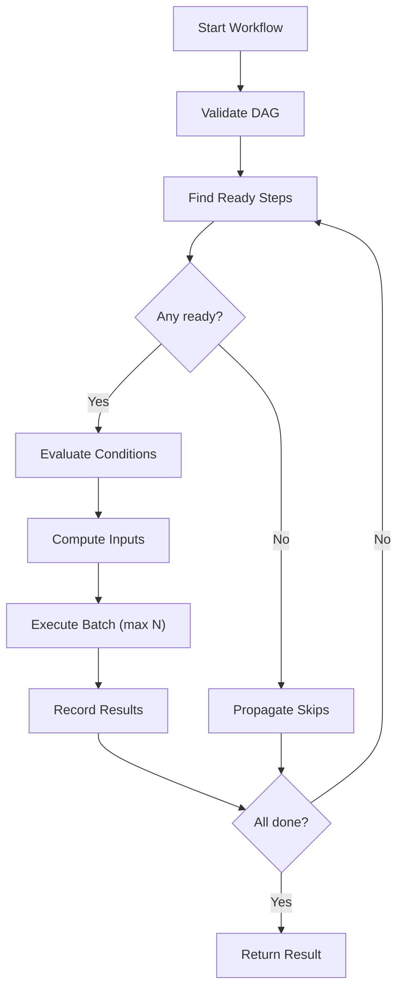

Workflows are **DAG-based multi-step pipelines** that compose [Jobs](/frontmcp/servers/jobs) with dependencies, conditional execution, and parallel step processing. They provide orchestration for complex operations that span multiple jobs.

<Info>
Workflows execute jobs in dependency order with automatic cycle detection, parallel batching, and per-step error handling.
</Info>

## Why Workflows?

Workflows handle orchestration that individual jobs cannot:

| Aspect | Job | Workflow | Skill |
| --- | --- | --- | --- |
| **Purpose** | Single unit of work | Multi-step pipeline | AI instruction guide |
| **Composition** | Standalone | Chains multiple jobs | References tools |
| **Dependencies** | None | DAG with `dependsOn` | None |
| **Parallelism** | Single execution | Bounded concurrent steps | None |
| **Triggers** | On-demand | Manual, webhook, or event | On-demand |

Workflows are ideal for:

- **Multi-step data pipelines** — extract, transform, load sequences
- **Approval chains** — sequential steps with conditional logic
- **Parallel processing** — fan-out/fan-in patterns with bounded concurrency
- **Event-driven automation** — webhook-triggered multi-job flows

---

## Creating Workflows

Workflows are defined declaratively using the `@Workflow` decorator with a `steps` array:

```ts
import { Workflow } from '@frontmcp/sdk';

@Workflow({
  name: 'greet-and-analyze',
  description: 'Greet a user then analyze the greeting',
  trigger: 'manual',
  steps: [
    {
      id: 'greet',
      jobName: 'greet',
      input: { name: 'World', formal: false },
    },
    {
      id: 'analyze',
      jobName: 'analyze-text',
      dependsOn: ['greet'],
      input: (steps) => ({
        text: steps.get('greet').outputs.message,
        language: 'en',
      }),
    },
  ],
})
class GreetAndAnalyzeWorkflow {}
```

### Function Style

```ts
import { workflow } from '@frontmcp/sdk';

const GreetAndAnalyzeWorkflow = workflow({
  name: 'greet-and-analyze',
  description: 'Greet a user then analyze the greeting',
  steps: [
    {
      id: 'greet',
      jobName: 'greet',
      input: { name: 'World' },
    },
    {
      id: 'analyze',
      jobName: 'analyze-text',
      dependsOn: ['greet'],
      input: (steps) => ({
        text: steps.get('greet').outputs.message,
      }),
    },
  ],
});
```

---

## Registering Workflows

Add workflows to your app via the `workflows` array:

```ts
import { App } from '@frontmcp/sdk';

@App({
  id: 'text-processing',
  name: 'Text Processing',
  jobs: [GreetJob, AnalyzeTextJob],
  workflows: [GreetAndAnalyzeWorkflow],
})
class TextProcessingApp {}
```

<Note>
Jobs referenced by workflow steps must be registered in the same app or available in the scope's job registry.
</Note>

---

## Workflow Steps

Each step defines a job to execute and how it connects to other steps:

```ts
interface WorkflowStep {
  id: string;           // Unique step identifier
  jobName: string;      // Reference to a registered job
  dependsOn?: string[]; // Step IDs that must complete first
  input?: Record<string, unknown> | ((steps) => Record<string, unknown>);
  condition?: (steps) => boolean;
  continueOnError?: boolean;
  timeout?: number;     // Per-step timeout override (ms)
  retry?: JobRetryConfig; // Per-step retry override
}
```

| Field | Type | Default | Description |
| --- | --- | --- | --- |
| `id` | `string` | — | **Required.** Unique step identifier |
| `jobName` | `string` | — | **Required.** Name of the job to execute |
| `dependsOn` | `string[]` | `[]` | Step IDs that must complete before this step runs |
| `input` | `object \| function` | Workflow input | Static input or dynamic callback from previous step outputs |
| `condition` | `function` | — | Skip step if returns `false` |
| `continueOnError` | `boolean` | `false` | Continue workflow if this step fails |
| `timeout` | `number` | Job default | Per-step timeout override in ms |
| `retry` | `JobRetryConfig` | Job default | Per-step retry override |

---

## Step Dependencies

Steps declare dependencies using `dependsOn`. The engine validates the DAG before execution:

- **Duplicate ID detection** — no two steps can share an ID
- **Missing reference detection** — `dependsOn` must reference existing step IDs
- **Cycle detection** — DFS-based cycle detection prevents infinite loops

```ts
steps: [
  { id: 'fetch', jobName: 'fetch-data' },
  { id: 'validate', jobName: 'validate-data', dependsOn: ['fetch'] },
  { id: 'transform', jobName: 'transform-data', dependsOn: ['validate'] },
  { id: 'load', jobName: 'load-data', dependsOn: ['transform'] },
]
```

---

## Dynamic Input

Steps can compute their input dynamically based on previous step outputs:

```ts
steps: [
  {
    id: 'fetch-users',
    jobName: 'fetch-users',
    input: { limit: 100 },
  },
  {
    id: 'enrich',
    jobName: 'enrich-users',
    dependsOn: ['fetch-users'],
    input: (steps) => ({
      users: steps.get('fetch-users').outputs.users,
      source: 'crm',
    }),
  },
]
```

The `steps` context provides a `get(stepId)` method that returns `WorkflowStepResult`:

```ts
interface WorkflowStepResult {
  outputs: Record<string, unknown>;
  state: 'completed' | 'failed' | 'skipped';
}
```

---

## Conditional Steps

Steps can be conditionally skipped based on previous step results:

```ts
steps: [
  {
    id: 'check-eligibility',
    jobName: 'check-eligibility',
  },
  {
    id: 'send-notification',
    jobName: 'send-notification',
    dependsOn: ['check-eligibility'],
    condition: (steps) =>
      steps.get('check-eligibility').outputs.eligible === true,
    input: (steps) => ({
      userId: steps.get('check-eligibility').outputs.userId,
    }),
  },
]
```

When a condition returns `false`, the step is marked as `skipped` and downstream steps that depend on it will still execute (skipped steps are treated as completed for dependency resolution).

---

## Parallel Execution

Steps with no mutual dependencies execute in parallel, bounded by `maxConcurrency`:

```ts
@Workflow({
  name: 'parallel-analysis',
  maxConcurrency: 3, // Run up to 3 steps concurrently
  steps: [
    { id: 'fetch', jobName: 'fetch-data' },
    // These three run in parallel after 'fetch' completes
    { id: 'analyze-sentiment', jobName: 'sentiment', dependsOn: ['fetch'] },
    { id: 'analyze-entities', jobName: 'entities', dependsOn: ['fetch'] },
    { id: 'analyze-topics', jobName: 'topics', dependsOn: ['fetch'] },
    // This runs after all three analyses complete
    {
      id: 'aggregate',
      jobName: 'aggregate-results',
      dependsOn: ['analyze-sentiment', 'analyze-entities', 'analyze-topics'],
    },
  ],
})
```

---

## Configuration

| Field | Type | Default | Description |
| --- | --- | --- | --- |
| `name` | `string` | — | **Required.** Unique workflow identifier |
| `description` | `string` | — | Human-readable description |
| `steps` | `WorkflowStep[]` | — | **Required.** Ordered step definitions (min 1) |
| `trigger` | `'manual' \| 'webhook' \| 'event'` | `'manual'` | How the workflow is triggered |
| `webhook` | `WorkflowWebhookConfig` | — | Webhook configuration (when trigger is `'webhook'`) |
| `timeout` | `number` | `600000` | Maximum total execution time in ms (10 min) |
| `maxConcurrency` | `number` | `5` | Maximum parallel step concurrency |
| `id` | `string` | `name` | Stable identifier for tracking |
| `tags` | `string[]` | — | Categorization tags |
| `labels` | `Record<string, string>` | — | Fine-grained key-value labels |
| `hideFromDiscovery` | `boolean` | `false` | Hide from `list-workflows` |
| `permissions` | `JobPermission[]` | — | RBAC permission rules |
| `inputSchema` | `ZodShape` | — | Workflow-level input schema |
| `outputSchema` | `ZodShape` | — | Workflow-level output schema |

### Webhook Configuration

```ts
interface WorkflowWebhookConfig {
  path?: string;          // Custom path (default: /workflows/webhook/{name})
  secret?: string;        // Webhook secret for validation
  methods?: ('GET' | 'POST')[]; // Allowed HTTP methods (default: ['POST'])
}
```

---

## Triggers

| Trigger | Description |
| --- | --- |
| `manual` | Triggered via `execute-workflow` tool or DirectClient |
| `webhook` | Triggered by HTTP webhook with optional secret validation |
| `event` | Triggered by internal events |

---

## Execution Flow



---

## Error Handling

When a step fails:

1. **Default behavior** — the step is marked as `failed`, and downstream dependents are `skipped`
2. **With `continueOnError: true`** — the step is marked as `failed` but treated as completed for dependency resolution, allowing downstream steps to proceed

```ts
steps: [
  {
    id: 'optional-enrichment',
    jobName: 'enrich-data',
    continueOnError: true, // Workflow continues even if this fails
  },
  {
    id: 'save',
    jobName: 'save-results',
    dependsOn: ['optional-enrichment'],
    // This will run even if enrichment failed
  },
]
```

---

## MCP Tools

When workflows are enabled, the following MCP tools are automatically registered:

| Tool | Description |
| --- | --- |
| `list-workflows` | List registered workflows with optional filtering |
| `execute-workflow` | Execute a workflow (inline or background) |
| `get-workflow-status` | Get execution status with per-step results |
| `register-workflow` | Register a dynamic workflow at runtime |
| `remove-workflow` | Remove a dynamic workflow |

---

## Best Practices

**Do:**

- Keep steps focused on a single job each
- Use `dependsOn` to make data flow explicit
- Set `continueOnError: true` for non-critical steps
- Use dynamic input functions to pass data between steps
- Set appropriate `maxConcurrency` based on resource constraints

**Don't:**

- Create deeply nested dependency chains when parallel execution is possible
- Skip DAG validation by referencing non-existent step IDs
- Set `maxConcurrency` too high for resource-intensive jobs
- Use workflows for single-step operations (use jobs directly)

## Next Steps

<CardGroup cols={2}>
  <Card title="Jobs" icon="briefcase" href="/frontmcp/servers/jobs">
    Define the jobs that workflows orchestrate
  </Card>
  <Card title="@Workflow" icon="at" href="/frontmcp/sdk-reference/decorators/workflow">
    Decorator reference
  </Card>
  <Card title="WorkflowRegistry" icon="database" href="/frontmcp/sdk-reference/registries/workflow-registry">
    Registry API reference
  </Card>
  <Card title="DirectClient" icon="plug" href="/frontmcp/sdk-reference/core/direct-client">
    Programmatic workflow execution
  </Card>
</CardGroup>
