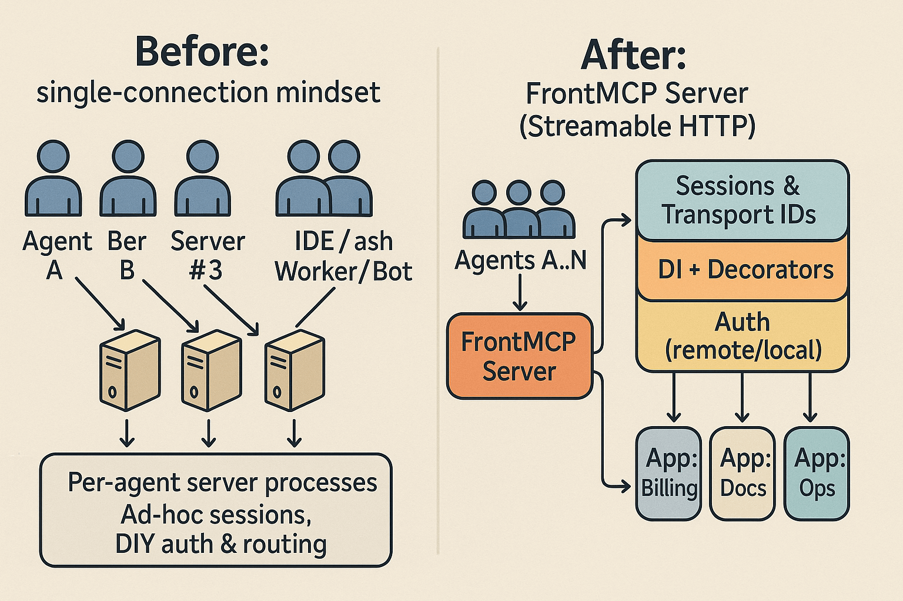

# One Server, Many Agents

Turn your MCP server into a shared, multi-app service—without transport gymnastics

**TL;DR**: The MCP spec and official SDKs give you transports and sessions, but most examples wire a **single connection** to a **single server instance**. That’s fine until you want _several IDEs, bots, and dashboards_ to share **one** server—and to host **multiple apps** behind clean auth and scopes. **FrontMCP** makes that the default with **sessions, transport identity, per-app scoping, DI, decorators, and authentication** out of the box.

<Note>
  This is <b>not</b> a “stdio vs SSE” post. The issue is the <i>connection model</i> and defaults most examples
  encourage—regardless of transport. Streamable HTTP + sessions is the spec-aligned path for multi-client servers;
  FrontMCP productizes it and layers scoping, auth, and DI on top.
</Note>

---

## How the “one client, one server” pattern sneaks into production

If you follow the happy path:

1. You open the official <code>@modelcontextprotocol/sdk</code> docs.
2. You copy the example that spins up a server.
3. You attach a transport (stdio, HTTP, SSE, or Streamable HTTP).
4. You connect an MCP client, see your tools, call them, and ship a demo.

So far, life is good:

- One IDE ↔ one MCP client ↔ one server.
- Logs are readable.
- JSON-RPC messages look clean.
- You can restart everything with a single command.

The problems show up the moment you try to do something slightly more realistic:

- A second IDE instance for another developer.
- A background worker using the same tools.
- A dashboard that introspects tools and runs them on behalf of users.
- Maybe even multiple agents orchestrating workflows together.

You quickly notice patterns like:

- **N agents = N server processes**
  Each agent spins its own server, often as a child process or a separate container.
- **Zombie servers**
  When a client crashes, the server it launched may keep running.
- **Scattered logs and state**
  Caches, warmups, and logs live in different processes.
- **Awkward auth stories**
  Access tokens and OAuth flows are tied to a single client/server pair.

None of these are protocol problems. They’re **shape-of-server** problems:

> You accidentally treated your MCP server as a client-owned subprocess instead of a shared, long-lived service.

---

## Why this isn’t really about stdio vs HTTP vs SSE

It’s tempting to blame the transport:

- “Maybe stdio is the problem.”
- “Maybe SSE is the problem.”
- “Maybe I should just switch to Streamable HTTP and everything will be fine.”

Transport matters, but the deeper issue is independent of the wire:

- If your code assumes **one transport = one connection = one client**,
- Then it doesn’t matter whether that transport is stdio, SSE, or Streamable HTTP,
- You’ll still end up multiplying servers for every serious client.

The MCP spec’s Streamable HTTP transport is explicitly designed to support **multiple clients + sessions**. The challenge is that most starter servers don’t implement a **multi-client server model**; they implement a **single-client demo**.

That’s where you start writing glue:

- a homegrown session store,
- hand-managed transport IDs,
- per-app routing,
- DIY auth integration,
- and a bunch of conditionals sprinkled across tools and handlers.

You can do it—but you’re building a framework on evenings and weekends.

---

## The real problem you’re hitting

When you move beyond a single client, you suddenly need to solve:

- **Session IDs & transport identity**
  So requests don’t collide across clients and nodes, and you can safely resume or route streams.
- **Per-app scoping**
  So multiple products/tenants can share one host without stepping on each other.
- **Auth surfaces**
  Remote IdP or local issuer, wired consistently and scoped correctly to apps and tools.
- **Lifecycle management**
  Sessions that can be created, resumed, and ended in a way that survives proxies, restarts, and load balancers.
- **DI & hooks**
  So you can inject config, secrets, caches, tenants, and logging **without** duplicating boilerplate in every tool.

All of that is infrastructure work. Necessary, but not what makes your product interesting.

What you actually want is:

- “Here are my tools and apps, written like normal TypeScript services.”
- “Give me a multi-agent, multi-app MCP server that Just Works.”

---

## What we actually want from an MCP server

If you strip away the noise, most teams want their MCP server to behave like a modern web backend:

1. **Multi-client by design**

   - Many IDEs, agents, and services share one server.
   - Sessions keep each client isolated and resumable.
   - Transport identity is stable across reconnections and nodes.

2. **Multi-app composition**

   - Group tools into apps by product/domain/tenant.
   - Sometimes expose a unified toolbox.
   - Sometimes isolate apps with separate auth and base paths.
   - Sometimes expose an app as a standalone MCP server.

3. **Auth-aware tool surface**

   - The tools a client sees are based on _who is logged in_, not just what’s deployed.
   - OAuth scopes and identities matter.

4. **Typed code with DI**

   - Tools look like clean TypeScript handlers.
   - Inputs/outputs are validated with Zod.
   - Dependencies (DB, caches, external APIs) are injected via DI.

5. **Adapters for existing systems**
   - Already have REST APIs? Use OpenAPI, not Ctrl+C/Ctrl+V into new @Tool classes.

The MCP spec gives you the foundations (JSON-RPC, transports, sessions).
**FrontMCP** takes those foundations and bakes them into a framework that assumes multi-client, multi-app from day one.

---

## What FrontMCP flips to “on by default”

FrontMCP is a TypeScript-first framework that treats MCP servers like proper services, not disposable processes.

<Columns cols={2}>
    <Card title="Multi-client server" icon="cloud">
        Start a Streamable HTTP host that accepts many clients concurrently. Sessions and transport IDs are handled for
        you, so multiple IDEs, copilots, and workers can share one server safely.
    </Card>

    <Card title="Multi-app composition" icon="grip">
        Host several apps under one server or isolate them via <code>splitByApp</code>. Each app gets clean base paths
        and can define its own auth.
    </Card>

    <Card title="Auth that fits" icon="shield-check">
        Use <b>remote OAuth</b> to front an external IdP, or <b>local OAuth</b> with a built-in issuer. Scope auth at
        the server or per app.
    </Card>

    <Card title="DI + decorators" icon="wrench">
        Describe servers, apps, tools, resources, and prompts with decorators. Inject providers with <code>GLOBAL</code>,
        <code>SESSION</code>, or <code>REQUEST</code> scope. Add hooks for logging, rates, and policy without
        boilerplate.
    </Card>

</Columns>

---

## Standard MCP vs FrontMCP (visually)

Sometimes it’s easier to just see it:




- On the left: the “one client, one server” pattern duplicated per agent.
- On the right: one FrontMCP server hosting many apps and many agents in a spec-aligned way.

---

## Show me the code (multi-agent, multi-app, scoped & authenticated)

Let’s look at what a multi-client, multi-app server looks like in FrontMCP.

We’ll define:

- A server with Streamable HTTP.
- Two apps: `billing` and `docs`.
- Per-app auth for `billing`.

```ts title="src/server.ts"
import 'reflect-metadata';
import { FrontMcp, LogLevel } from '@frontmcp/sdk';
import BillingApp from './billing.app';
import DocsApp from './docs.app';

@FrontMcp({
  info: { name: 'FrontMCP Demo', version: '1.0.0' },

  // Host multiple apps; split makes base paths & auth per-app:
  splitByApp: true,
  apps: [BillingApp, DocsApp],

  // Streamable HTTP host (multi-client capable)
  http: {
    port: 3001,
    entryPath: '', // align with your .well-known PRM resourcePath, can be /mcp to prevent conflicts
  },

  logging: { level: LogLevel.INFO },
})
export default class Server {}
```

```ts title="src/billing.app.ts"
import { App } from '@frontmcp/sdk';
import CreateInvoice from './tools/create-invoice.tool';

@App({
  id: 'billing',
  name: 'Billing',
  tools: [CreateInvoice],
  // Per-app auth surface:
  auth: {
    type: 'remote',
    name: 'corp-idp',
    baseUrl: 'https://auth.example.com',
  },
})
export default class BillingApp {}
```

```ts title="src/tools/create-invoice.tool.ts"
import { Tool, ToolContext } from '@frontmcp/sdk';
import { z } from 'zod';

@Tool({
  name: 'create_invoice',
  description: 'Create an invoice for a customer',
  inputSchema: { customerId: z.string(), amount: z.number().positive() },
})
export default class CreateInvoice extends ToolContext {
  async execute({ customerId, amount }) {
    // DI-provided services are available from the execution context if needed
    return { status: 'ok', invoiceId: `inv_${customerId}_${Date.now()}`, amount };
  }
}
```

From here, any number of MCP-capable clients can:

- Connect over Streamable HTTP.
- Create their own sessions.
- Call `billing.create_invoice` (if authorized).
- Share the same app code and server instance.

No more “one agent, one server” as an architectural constraint.

---

## Composition modes: one server, many ways to slice apps

The most underrated part of FrontMCP is how you can expose the same apps in different shapes—without changing the app code.

### `splitByApp: false` — unified tool surface per user

When `splitByApp` is **false** (the default):

- All your applications are combined under **one MCP server**.
- A connected client can **list all tools** the **logged-in OAuth user** is allowed to see, regardless of which app defines them.
- Auth still applies, but the visible tools and resources are filtered by the user’s identity and scopes.
- If two apps define tools with the same name, FrontMCP automatically **prefixes the tool name with the app id**
  —for example: `billing.create_invoice` vs `ops.create_invoice`.

This mode is perfect when you want:

- A single, large toolbox in the IDE.
- Agents that can orchestrate across many domains (billing + docs + ops).
- One “MCP endpoint” for the whole suite, with per-user filtering.

Under the hood, your apps are still cleanly separated. The unified tool surface is a **view**, not a monolith.

### `splitByApp: true` — per-app isolation

When `splitByApp` is **true**:

- Each app gets its own **base path** and can define its own **auth**.
- You can run multiple products/tenants under one server but with clearly separated surfaces.
- Clients can connect directly to the specific app they care about, while you still deploy just one server process.

This is ideal when:

- Apps have distinct consumers and security boundaries.
- You want a “microservices-like” feel, but still prefer one deployment unit.
- You’re onboarding teams gradually and want a clear line between their responsibilities.

### Standalone apps under `/{appId}`

Some apps need to serve double duty:

- They live inside a grouped server (for internal or cross-app usage).
- They also need to behave as **standalone MCP servers** for specific clients.

FrontMCP supports apps that are **standalone and excluded from the grouped surface**:

- The app is served under the prefix `/{appId}` as if it were its own MCP server.
- From the client’s perspective, `/{appId}` is a standalone MCP endpoint with its own discovery and tools.
- From your perspective, it’s still the same app class and the same deployment.

This lets you:

- Expose a clean `/{appId}` endpoint for partners while keeping internal tools under a unified host.
- Gradually carve out apps from a single MCP server into more “independent” endpoints without duplicating code.

One deployment, one codebase, multiple MCP “faces” tuned to who’s calling you.

---

## Plugging in existing REST APIs with OpenAPIAdapter

A common reaction to any MCP framework is:

> “This is cool, but I already have a REST API. Do I really have to rewrite everything as @Tool classes?”

With FrontMCP, the answer is **no**.

### Connect your REST API with OpenAPIAdapter

The **OpenAPI adapter** lets you generate tools directly from an OpenAPI spec:

1. Provide an OpenAPI document (URL or file).
2. Specify the base URL for requests.
3. Optionally plug in middleware for auth, tenancy, or logging.
4. Get a bundle of MCP tools that call your REST endpoints.

Here’s a sketch:

```ts title="src/openapi.app.ts"
import { App } from '@frontmcp/sdk';
import { createOpenApiAdapter } from '@frontmcp/openapi-adapter';

const openApi = await createOpenApiAdapter({
  id: 'my-rest-api',
  name: 'My REST API',
  schemaUrl: 'https://api.example.com/openapi.json',
  baseUrl: 'https://api.example.com',
  requestMiddleware: async (req, ctx) => {
    const token = await ctx.providers.auth.getApiToken();
    req.headers['Authorization'] = `Bearer ${token}`;
    return req;
  },
});

@App({
  id: 'rest',
  name: 'REST-backed tools',
  tools: openApi.tools,
})
export default class RestApp {}
```

You can find the full details in the docs:
👉 **[OpenAPI Adapter docs](/docs/adapters/openapi-adapter)** (based on the guide at `https://docs.agentfront.dev/0.3/adapters/openapi-adapter`).

This is the fastest path to:

- Making your existing API “MCP-native.”
- Letting agents and IDEs call it via tools.
- Avoiding a full parallel tool implementation.

---

## Migration playbook (keep your tools; change your host)

If you already have MCP servers or REST APIs, here’s a practical way to move into FrontMCP without a rewrite:

<Steps>
  <Step title="Lift your tools into an app">
    Wrap existing handlers with <code>@Tool</code> or <code>tool()(handler)</code> and group them under{' '}
    <code>@App</code>. Or plug in the OpenAPI adapter to generate tools from your REST API.
  </Step>
  <Step title="Choose composition">
    Start with <code>splitByApp: false</code> for a unified tool surface, then introduce
    <code>splitByApp: true</code> or standalone apps under <code>
      /{'{'}appId{'}'}
    </code> where isolation is needed.
  </Step>
  <Step title="Wire auth once">
    Decide on <b>remote</b> vs <b>local</b> OAuth. Make your tool surface depend on the logged-in user and scopes, not
    just the server process.
  </Step>
  <Step title="Expose discovery cleanly">
    Keep <code>entryPath</code> in sync with your <code>.well-known</code> PRM <code>resourcePath</code>. Test behind
    your real proxy/load balancer to validate streaming and keep-alives.
  </Step>
  <Step title="Turn on observability">
    Add DI providers and hooks for logging, metrics, and tracing so you can see which apps and tools your agents
    actually use.
  </Step>
</Steps>

<Tip>
  Already running locally? Use <code>frontmcp dev</code> to boot the host and attach multiple MCP clients at once.
  Multi-agent scenarios stop being hypothetical when you can open two clients and see them share one server.
</Tip>

---

## FAQs

**Is this about “legacy SSE vs stdio”?**
No. The issue is the <b>single-connection default</b> common in examples across transports. Streamable HTTP + sessions already solves multi-client semantics; FrontMCP makes that the default and adds scoping, auth, and DI.

**Can one server safely host multiple apps for multiple agents?**
Yes. With <code>splitByApp: false</code>, you get a unified tool surface per user (with automatic name-conflict prefixing). With <code>splitByApp: true</code>, each app gets isolated paths and optional per-app auth, while sharing the same underlying server. Standalone apps under <code>/{'{'}appId{'}'}</code> give you separate MCP endpoints when you need them.

**Can I connect my current REST API without writing tools?**
Yes. Use the <b>OpenAPIAdapter</b> to generate tools automatically from your existing REST API. Point FrontMCP at your OpenAPI definition and let the adapter create MCP tools for you—no manual tool classes required.
See: <a href="/docs/adapters/openapi-adapter">OpenAPI Adapter docs</a> (based on <a href="https://docs.agentfront.dev/0.3/adapters/openapi-adapter" target="_blank" rel="noreferrer">this guide</a>).

---

## Where to go next

<Columns cols={2}>
  <Card
    title="Read the Welcome doc"
    href="/docs/getting-started/welcome"
    icon="book-open"
    arrow="true"
    cta="Start here"
  >
    Get the high-level overview of FrontMCP’s concepts and how it fits into MCP.
  </Card>
  <Card
    title="Follow the Quickstart"
    href="/docs/getting-started/quickstart"
    icon="rocket"
    arrow="true"
    cta="Build your first server"
  >
    Go step-by-step from empty folder to a running MCP server with a real tool.
  </Card>
</Columns>

<Columns cols={2}>
  <Card
    title="Check out the examples"
    href="https://github.com/agentfront/frontmcp/tree/main/apps/demo"
    icon="code-branch"
    arrow="true"
    cta="Browse demos"
  >
    Explore example apps and tools that showcase patterns you can reuse in your own servers.
  </Card>
  <Card
    title="Star the repo & contribute"
    href="https://github.com/agentfront/frontmcp"
    icon="star"
    arrow="true"
    cta="Join the project"
  >
    FrontMCP is open source (Apache-2.0). Issues, PRs, and feedback are very welcome.
  </Card>
</Columns>
