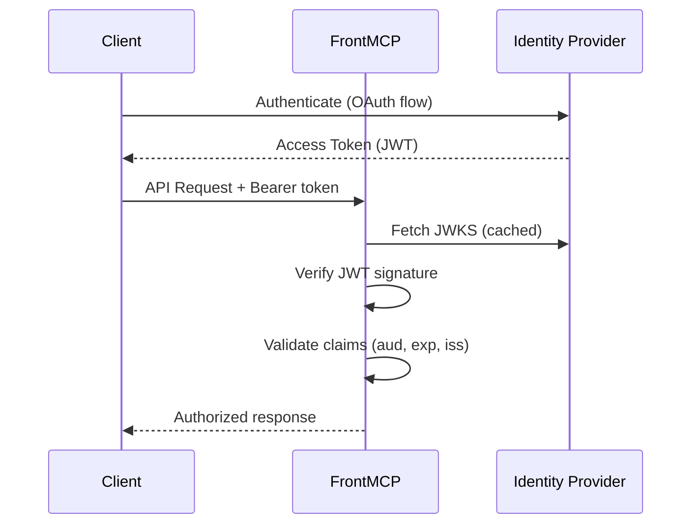
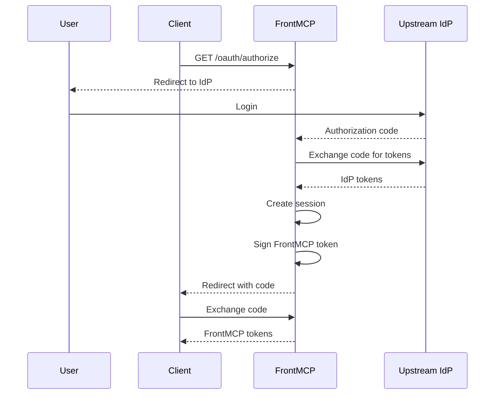

FrontMCP supports two approaches for integrating external identity providers:

<CardGroup cols={2}>
  <Card title="Transparent Mode" icon="arrow-right-arrow-left">
    Pass-through tokens from the IdP. FrontMCP validates but doesn't issue tokens.

    **Best for:** Single IdP, existing auth infrastructure

  </Card>
  <Card title="Orchestrated Remote" icon="sitemap">
    FrontMCP acts as OAuth server, proxying user authentication to upstream IdP.

    **Best for:** Multi-provider, progressive auth, federated scenarios

  </Card>
</CardGroup>

---

## Transparent Mode

Direct token pass-through from external identity provider.

```typescript
@FrontMcp({
  info: { name: 'MyServer', version: '1.0.0' },
  auth: {
    mode: 'transparent',
    provider: 'https://auth.example.com',
    expectedAudience: 'https://api.myservice.com',
  },
})
export class Server {}
```

### Configuration Options

| Option             | Type                 | Default              | Description                          |
| ------------------ | -------------------- | -------------------- | ------------------------------------ |
| `provider`         | `string`             | Required             | Base URL of the identity provider    |
| `clientId`         | `string`             | -                    | OAuth client ID                      |
| `clientSecret`     | `string`             | -                    | OAuth client secret                  |
| `jwksUri`          | `string`             | Auto-discovered      | Custom JWKS endpoint                 |
| `expectedAudience` | `string \| string[]` | Issuer URL           | Required audience claim value(s)     |
| `requiredScopes`   | `string[]`           | `[]`                 | Scopes that must be present in token |
| `allowAnonymous`   | `boolean`            | `false`              | Allow requests without tokens        |
| `advanced`         | `object`             | -                    | Advanced options (inline jwks, scopes, dcrEnabled, endpoint overrides) |

### Provider Examples

<Tabs>
  <Tab title="Auth0">
    ```typescript
    @FrontMcp({
      info: { name: 'MyServer', version: '1.0.0' },
      auth: {
        mode: 'transparent',
        provider: 'https://your-tenant.auth0.com',
        clientId: 'your-client-id',
        expectedAudience: 'https://api.yourservice.com',
        requiredScopes: ['openid', 'profile'],
      },
    })
    export class Server {}
    ```
  </Tab>
  <Tab title="Okta">
    ```typescript
    @FrontMcp({
      info: { name: 'MyServer', version: '1.0.0' },
      auth: {
        mode: 'transparent',
        provider: 'https://your-org.okta.com',
        clientId: 'your-client-id',
        expectedAudience: 'api://default',
      },
    })
    export class Server {}
    ```
  </Tab>
  <Tab title="Azure AD">
    ```typescript
    @FrontMcp({
      info: { name: 'MyServer', version: '1.0.0' },
      auth: {
        mode: 'transparent',
        provider: 'https://login.microsoftonline.com/{tenant}/v2.0',
        jwksUri: 'https://login.microsoftonline.com/{tenant}/discovery/v2.0/keys',
        expectedAudience: 'api://{client-id}',
      },
    })
    export class Server {}
    ```
  </Tab>
  <Tab title="Google">
    ```typescript
    @FrontMcp({
      info: { name: 'MyServer', version: '1.0.0' },
      auth: {
        mode: 'transparent',
        provider: 'https://accounts.google.com',
        jwksUri: 'https://www.googleapis.com/oauth2/v3/certs',
        expectedAudience: '{your-client-id}.apps.googleusercontent.com',
      },
    })
    export class Server {}
    ```
  </Tab>
</Tabs>

### Token Flow



---

## Orchestrated Remote Mode

FrontMCP acts as an OAuth server while proxying user authentication to upstream IdP.

```typescript
@FrontMcp({
  info: { name: 'MyServer', version: '1.0.0' },
  auth: {
    mode: 'orchestrated',
    type: 'remote',
    remote: {
      provider: 'https://auth.example.com',
      clientId: 'your-client-id',
      clientSecret: 'your-client-secret',
      scopes: ['openid', 'profile', 'email'],
    },
    consent: { enabled: true },
    sessionMode: 'stateful',
  },
})
export class Server {}
```

### Configuration Options

| Option                | Type                        | Default      | Description                                |
| --------------------- | --------------------------- | ------------ | ------------------------------------------ |
| `remote.provider`     | `string`                    | Required     | Upstream IdP base URL                      |
| `remote.clientId`     | `string`                    | Required     | OAuth client ID                            |
| `remote.clientSecret` | `string`                    | -            | OAuth client secret (confidential clients) |
| `remote.scopes`       | `string[]`                  | `['openid']` | Scopes to request from IdP                 |
| `remote.dcrEnabled`   | `boolean`                   | `false`      | Use Dynamic Client Registration            |
| `consent`             | `boolean`                   | `false`      | Show consent UI after IdP login            |
| `sessionMode`         | `'stateful' \| 'stateless'` | `'stateful'` | Session management strategy                |

### When to Use Orchestrated Remote

<Check>**Multiple identity providers** - Federate users from different IdPs under one session</Check>
<Check>**Progressive authorization** - Users authorize apps incrementally</Check>
<Check>**Custom token claims** - Add claims not available from upstream</Check>
<Check>**Consent UI** - Let users select which tools/resources to grant</Check>

### Token Flow



---

## Dynamic Client Registration

When the IdP supports DCR, FrontMCP can register clients automatically:

```typescript
auth: {
  mode: 'orchestrated',
  type: 'remote',
  remote: {
    provider: 'https://auth.example.com',
    dcrEnabled: true, // Enable DCR
    // clientId/clientSecret derived from registration
  },
}
```

<Info>
  Not all providers support DCR. Check your IdP documentation.
</Info>

---

## Endpoint Overrides

Override auto-discovered endpoints for non-standard IdPs:

```typescript
auth: {
  mode: 'orchestrated',
  type: 'remote',
  remote: {
    provider: 'https://legacy-idp.example.com',
    authEndpoint: 'https://legacy-idp.example.com/auth',
    tokenEndpoint: 'https://legacy-idp.example.com/token',
    userInfoEndpoint: 'https://legacy-idp.example.com/userinfo',
    jwksUri: 'https://legacy-idp.example.com/keys',
  },
}
```

---

## Inline JWKS

For offline verification or non-discoverable providers, use the `advanced` option:

```typescript
auth: {
  mode: 'transparent',
  provider: 'https://auth.example.com',
  advanced: {
    jwks: {
      keys: [
        {
          kty: 'RSA',
          kid: 'key-id-1',
          alg: 'RS256',
          n: '...',
          e: 'AQAB',
        },
      ],
    },
  },
}
```

---

## Multi-Provider Setup

Combine multiple providers with orchestrated mode:

```typescript
@App({
  name: 'Slack',
  auth: {
    mode: 'transparent',
    provider: 'https://slack.com/oauth',
  },
  standalone: true,
})
export class SlackApp {}

@App({
  name: 'CRM',
  auth: {
    mode: 'transparent',
    provider: 'https://company.auth0.com',
    clientId: 'crm-client-id',
  },
})
export class CrmApp {}

@FrontMcp({
  info: { name: 'Suite', version: '1.0.0' },
  apps: [SlackApp, CrmApp],
  auth: {
    mode: 'orchestrated',
    type: 'local',
    consent: { enabled: true },
  },
})
export class Server {}
```

---

## Per-App Remote Auth

Configure different providers per app:

```typescript
@App({
  name: 'Billing',
  auth: {
    mode: 'transparent',
    provider: 'https://billing.auth0.com',
    clientId: 'billing-client-id',
  },
})
export class BillingApp {}

@App({
  name: 'Analytics',
  auth: {
    mode: 'transparent',
    provider: 'https://analytics.okta.com',
    clientId: 'analytics-client-id',
  },
})
export class AnalyticsApp {}

@FrontMcp({
  info: { name: 'Suite', version: '1.0.0' },
  apps: [BillingApp, AnalyticsApp],
  splitByApp: true,
})
export class Server {}
```

<Tip>
  Use `standalone: true` to expose an app's OAuth endpoints directly, bypassing the parent auth.
</Tip>

---

## Troubleshooting

<AccordionGroup>
  <Accordion title="Token verification fails">
    - Check `expectedAudience` matches the token's `aud` claim
    - Verify JWKS endpoint is accessible
    - Ensure token hasn't expired
  </Accordion>
  <Accordion title="JWKS fetch fails">
    - Verify IdP URL is correct
    - Check network connectivity
    - Try providing inline JWKS via `remote.jwks`
  </Accordion>
  <Accordion title="Redirect URI mismatch">
    - Register exact redirect URI with IdP
    - Check for trailing slashes
    - Ensure protocol (http/https) matches
  </Accordion>
</AccordionGroup>

---

## Next Steps

<CardGroup cols={2}>
  <Card title="Remote Proxy" icon="share" href="/docs/authentication/remote-proxy">
    Handle IdPs without DCR support
  </Card>
  <Card title="Progressive Authorization" icon="forward" href="/docs/authentication/progressive">
    Implement incremental app authorization
  </Card>
  <Card title="Local OAuth" icon="server" href="/docs/authentication/local">
    Built-in OAuth server setup
  </Card>
  <Card title="Production Checklist" icon="clipboard-check" href="/docs/authentication/production">
    Security requirements for deployment
  </Card>
</CardGroup>
