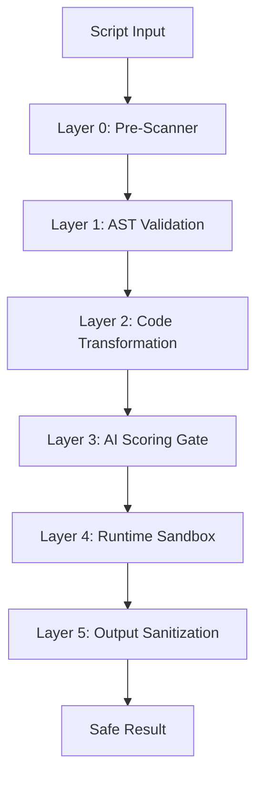

**Enclave** is a production-grade JavaScript sandbox designed for AI agent systems. It enables safe execution of LLM-generated code through a defense-in-depth architecture with **1000+ security tests** and **100% CVE coverage** against known vm2/isolated-vm exploits.

<CardGroup cols={3}>
  <Card title="Bank-Grade Security" icon="shield-check">
    6 defense layers with 150+ blocked attack vectors. Zero known bypasses.
  </Card>
  <Card title="Production Ready" icon="rocket">
    Battle-tested in enterprise deployments. Sub-millisecond validation overhead.
  </Card>
  <Card title="Zero Dependencies" icon="feather">
    Pure TypeScript. No native modules. Works everywhere Node.js runs.
  </Card>
</CardGroup>

---

## Why Enclave?

Traditional JavaScript sandboxes like vm2 and isolated-vm have been [repeatedly bypassed](https://github.com/nickmccurdy/isolated-vm/issues/116). Enclave takes a fundamentally different approach:

| Approach | vm2 / isolated-vm | Enclave |
|----------|-------------------|---------|
| Validation | Runtime only | AST + Runtime + AI Scoring |
| Attack vectors blocked | ~50 | **150+** |
| CVE coverage | Multiple CVEs | **100% coverage** |
| Security tests | ~100 | **1000+** |
| Code generation detection | No | **Yes (STRICT mode)** |

<Note>
  Enclave powers the [CodeCall Plugin](/docs/plugins/codecall/overview) for executing LLM-generated orchestration scripts. It's also available as a standalone library for custom use cases.
</Note>

---

## Installation

<CodeGroup>
```bash npm
npm install enclave-vm
```
```bash pnpm
pnpm add enclave-vm
```
```bash yarn
yarn add enclave-vm
```
</CodeGroup>

---

## Quick Start

```ts
import { Enclave } from 'enclave-vm';

const enclave = new Enclave({
  securityLevel: 'SECURE',
  toolHandler: async (toolName, args) => {
    // Your tool execution logic
    return { result: 'data' };
  },
});

const result = await enclave.execute(`
  const users = await callTool('users:list', { limit: 10 });
  const active = users.filter(u => u.active);
  return { count: active.length };
`);

if (result.success) {
  console.log('Result:', result.value);
} else {
  console.error('Blocked:', result.error);
}

enclave.dispose();
```

---

## Defense-in-Depth Architecture

Enclave implements **6 security layers** that work together. Even if one layer is bypassed, others catch the attack.



### Layer 0: Pre-Scanner

Runs **before** the JavaScript parser to catch attacks that could DoS or crash the parser itself.

- **ReDoS protection** - Detects catastrophic backtracking patterns
- **BiDi/Trojan Source** - Blocks Unicode attacks (CVE-2021-42574)
- **Parser DoS** - Limits nesting depth to prevent stack overflow
- **Size limits** - Enforces input size constraints

### Layer 1: AST Validation

Static analysis using [ast-guard](/docs/guides/ast-guard) blocks dangerous constructs before execution:

```ts
// All blocked by AST validation:
eval('code');                    // Code injection
new Function('return 1')();       // Dynamic code execution
process.env.SECRET;               // System access
obj.__proto__ = {};               // Prototype pollution
setTimeout(() => {}, 100);        // Timer-based escape
```

### Layer 2: Code Transformation

Valid code is transformed for safe execution with proxied functions and resource tracking:

```ts
// Original
const users = await callTool('users:list', {});

// Transformed
const users = await __safe_callTool('users:list', {});
```

### Layer 3: AI Scoring Gate

Semantic analysis detects attack patterns that pass static validation:

| Pattern | Score | Description |
|---------|-------|-------------|
| `SENSITIVE_FIELD` | 35 | Access to password/token/secret fields |
| `EXCESSIVE_LIMIT` | 25 | Limit values > 10,000 |
| `EXFIL_PATTERN` | 50 | Fetch data → send to external service |
| `LOOP_TOOL_CALL` | 25 | Tool calls inside loops (fan-out risk) |

### Layer 4: Runtime Sandbox

Isolated Node.js vm context with controlled globals and resource limits:

- Fresh context per execution
- Whitelist-only globals (Math, JSON, Array, etc.)
- Timeout enforcement
- Iteration limits
- Tool call caps

### Layer 5: Output Sanitization

All outputs are sanitized before returning:

- Stack traces redacted (40+ path patterns)
- Circular references handled
- Prototype chain stripped
- File paths removed

---

## Security Levels

Enclave provides four pre-configured security profiles:

| Setting | STRICT | SECURE | STANDARD | PERMISSIVE |
|---------|--------|--------|----------|------------|
| Timeout | 2s | 3.5s | 5s | 10s |
| Max Iterations | 2,000 | 5,000 | 10,000 | 20,000 |
| Max Tool Calls | 10 | 100 | 200 | 500 |
| Console Output | 32KB | 64KB | 256KB | 1MB |
| Code Gen Detection | YES | NO | NO | NO |
| Stack Sanitization | YES | YES | NO | NO |

```ts
// For untrusted LLM-generated code
const enclave = new Enclave({ securityLevel: 'STRICT' });

// For production workloads (recommended)
const enclave = new Enclave({ securityLevel: 'SECURE' });

// Override specific values
const enclave = new Enclave({
  securityLevel: 'SECURE',
  timeout: 10000, // Override timeout
});
```

<Warning>
  Use **STRICT** for any code from untrusted sources, including external LLM providers. Use **SECURE** for internal AI systems with controlled prompts.
</Warning>

---

## Worker Pool Adapter

For OS-level memory isolation, enable the Worker Pool adapter:

```ts
const enclave = new Enclave({
  adapter: 'worker_threads',
  workerPoolConfig: {
    minWorkers: 2,
    maxWorkers: 8,
    memoryLimitPerWorker: 256 * 1024 * 1024, // 256MB
  },
});
```

### Dual-Layer Isolation

Worker Pool provides **dual-layer sandboxing**:

1. **OS-level** - Worker thread with memory limits and hard halt capability
2. **VM-level** - Isolated context with prototype isolation

### When to Use Worker Pool

| Scenario | Recommendation |
|----------|----------------|
| Trusted internal scripts | Standard VM (lower overhead) |
| Multi-tenant execution | Worker Pool (OS isolation) |
| Untrusted AI code | Worker Pool (hard halt) |
| Memory-sensitive workloads | Worker Pool (per-worker limits) |

---

## AI Scoring Gate

The Scoring Gate adds semantic security analysis beyond static validation:

```ts
const enclave = new Enclave({
  scoringGate: {
    scorer: 'rule-based',
    blockThreshold: 70,    // Block if score >= 70
    warnThreshold: 40,     // Warn if score >= 40
    failOpen: true,        // Allow on scorer errors
  },
});
```

### Detection Example

```js
// This script triggers multiple detection rules:
const users = await callTool('users:list', {
  limit: 100000,                    // EXCESSIVE_LIMIT: +25
  fields: ['email', 'password'],    // SENSITIVE_FIELD: +35
});
await callTool('webhooks:send', { data: users }); // EXFIL_PATTERN: +50

// Total score: 110 = BLOCKED (critical risk)
```

---

## Reference Sidecar

Handle large data without embedding it in the script:

```ts
const enclave = new Enclave({
  sidecar: {
    enabled: true,
    extractionThreshold: 1024,     // Extract strings > 1KB
    maxTotalSize: 64 * 1024 * 1024, // 64MB total
    allowComposites: false,         // Block ref + "_suffix" attacks
  },
});
```

Large tool results are automatically stored in the sidecar and replaced with reference tokens. Scripts see lightweight tokens; data resolves on access.

---

## Execution Results

```ts
interface ExecutionResult<T> {
  success: boolean;
  value?: T;
  error?: {
    name: string;
    message: string;
    code: string;
  };
  stats: {
    duration: number;
    toolCallCount: number;
    iterationCount: number;
  };
  scoringResult?: {
    riskLevel: 'none' | 'low' | 'medium' | 'high' | 'critical';
    score: number;
    signals: Array<{ id: string; score: number }>;
  };
}
```

---

## Configuration Reference

<ParamField path="securityLevel" type="string" default="SECURE">
  Security preset: `STRICT`, `SECURE`, `STANDARD`, or `PERMISSIVE`
</ParamField>

<ParamField path="timeout" type="number" default="3500">
  Maximum execution time in milliseconds
</ParamField>

<ParamField path="maxToolCalls" type="number" default="100">
  Maximum tool calls per execution
</ParamField>

<ParamField path="maxIterations" type="number" default="5000">
  Maximum loop iterations
</ParamField>

<ParamField path="toolHandler" type="function">
  Async function to handle `callTool()` invocations
</ParamField>

<ParamField path="globals" type="object">
  Additional globals available in scripts
</ParamField>

<ParamField path="adapter" type="string" default="vm">
  Execution adapter: `vm` or `worker_threads`
</ParamField>

---

## Resources

<CardGroup cols={2}>
  <Card title="ast-guard" icon="shield-check" href="/docs/guides/ast-guard">
    Learn about AST validation rules and presets
  </Card>
  <Card title="CodeCall Plugin" icon="code" href="/docs/plugins/codecall/overview">
    See Enclave in action with the CodeCall plugin
  </Card>
  <Card title="GitHub" icon="github" href="https://github.com/agentfront/enclave">
    View source code and security audit
  </Card>
  <Card title="Playground" icon="play" href="https://enclave.agentfront.dev">
    Test Enclave security in your browser
  </Card>
</CardGroup>
