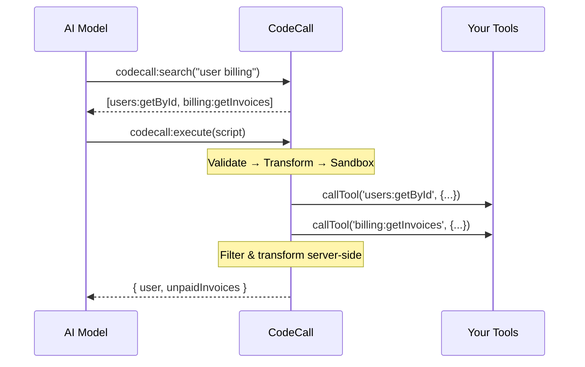

**CodeCall** transforms how AI agents interact with your tools. Instead of calling tools one at a time, AI models write JavaScript that orchestrates multiple tools in a single request. **90% fewer tokens. Complex workflows. Bank-grade security.**


<CardGroup cols={3}>
  <Card title="90% Token Savings" icon="coins">
    Hide 100+ tools from context. AI searches and calls only what it needs.
  </Card>
  <Card title="Complex Workflows" icon="diagram-project">
    Filter, join, and transform data server-side. One request, many operations.
  </Card>
  <Card title="Bank-Grade Security" icon="shield-check">
    1000+ security tests. 6 defense layers. Zero CVEs. Powered by [Enclave](/docs/guides/enclave).
  </Card>
</CardGroup>

---

## The Problem

Traditional MCP tool calling doesn't scale:

| Challenge                    | Impact                                                   |
| ---------------------------- | -------------------------------------------------------- |
| **Token explosion**          | 100 tools = ~25,000 tokens per request                   |
| **Round-trip latency**       | Each operation needs a full model round-trip             |
| **No server-side filtering** | Fetch everything, pay for all tokens, filter client-side |
| **Discovery failure**        | Models miss relevant tools buried in long lists          |

---

## The Solution

CodeCall exposes **4 meta-tools** that replace direct tool access:

| Meta-Tool           | Purpose                                 |
| ------------------- | --------------------------------------- |
| `codecall:search`   | Find relevant tools by natural language |
| `codecall:describe` | Get schemas for specific tools          |
| `codecall:execute`  | Run JavaScript to orchestrate tools     |
| `codecall:invoke`   | Direct tool call (no JS overhead)       |



**One request** executes a complex workflow that would otherwise require multiple round-trips.

---

## Token Savings

| Scenario             | Traditional     | CodeCall      | Savings |
| -------------------- | --------------- | ------------- | ------- |
| 100 tools in context | ~25,000 tokens  | ~3,000 tokens | **88%** |
| 5-tool workflow      | ~50,000 tokens  | ~5,000 tokens | **90%** |
| Complex filtering    | ~100,000 tokens | ~8,000 tokens | **92%** |

---

## Quick Start

### 1. Install

```bash
npm install @frontmcp/plugins
```

### 2. Enable CodeCall

```ts
import { App } from '@frontmcp/sdk';
import { CodeCallPlugin } from '@frontmcp/plugins';

@App({
  id: 'my-app',
  plugins: [
    CodeCallPlugin.init({
      mode: 'codecall_only',
      vm: { preset: 'secure' },
    }),
  ],
})
export default class MyApp {}
```

### 3. AI Writes Scripts

```js
// AI-generated script
const user = await callTool('users:getById', { id: userId });
const invoices = await callTool('billing:getInvoices', {
  userId: user.id,
  status: 'unpaid',
});

return {
  name: user.name,
  unpaidTotal: invoices.reduce((sum, inv) => sum + inv.amount, 0),
};
```

---

## Operating Modes

| Mode              | Description                               | Best For               |
| ----------------- | ----------------------------------------- | ---------------------- |
| `codecall_only`   | All tools hidden, only meta-tools exposed | Maximum token savings  |
| `codecall_opt_in` | Tools opt in via metadata                 | Gradual migration      |
| `metadata_driven` | All tools visible, CodeCall available     | Testing, compatibility |

```ts
CodeCallPlugin.init({
  mode: 'codecall_only',  // Recommended
})
```

---

## Security Architecture

CodeCall uses [Enclave](/docs/guides/enclave) for bank-grade execution with **6 defense layers**:

1. **Pre-Scanner** - Blocks ReDoS, Trojan Source, parser DoS
2. **AST Validation** - Blocks eval, prototype pollution, system access
3. **Code Transformation** - Proxies functions, adds resource limits
4. **AI Scoring Gate** - Detects exfiltration and abuse patterns
5. **Runtime Sandbox** - Isolated VM with controlled globals
6. **Output Sanitization** - Strips stack traces and file paths

### Security Presets

| Preset        | Timeout | Max Tools | Use Case          |
| ------------- | ------- | --------- | ----------------- |
| `locked_down` | 2s      | 10        | Untrusted AI      |
| `secure`      | 3.5s    | 100       | Production        |
| `balanced`    | 5s      | 200       | Complex workflows |

```ts
CodeCallPlugin.init({
  vm: {
    preset: 'secure',
    timeoutMs: 5000,
    maxToolCalls: 150,
  },
})
```

---

## Tool Search

Powered by [VectoriaDB](/docs/guides/vectoriadb) for semantic discovery:

| Strategy    | Latency | Best For        |
| ----------- | ------- | --------------- |
| `tfidf`     | ~1ms    | Under 100 tools |
| `embedding` | ~5ms    | 100+ tools      |

```ts
CodeCallPlugin.init({
  embedding: {
    strategy: 'tfidf',
    similarityThreshold: 0.3,
  },
})
```

---

## AgentScript Language

Scripts run in a restricted JavaScript subset:

### Allowed

```js
// Tool calls
const data = await callTool('users:list', { limit: 10 });

// Logic and filtering
const active = data.filter(u => u.active);

// Bounded loops
for (const user of active) {
  console.log(user.name);
}

// Return values
return { count: active.length };
```

### Blocked

```js
eval('code');              // Code injection
process.env.SECRET;        // System access
obj.__proto__ = {};        // Prototype pollution
require('fs');             // Module access
```

---

## When to Use CodeCall

<CardGroup cols={2}>
  <Card title="Use CodeCall" icon="check" color="#16A34A">
    - 20+ tools or growing
    - OpenAPI adapters (50-200+ endpoints)
    - Multi-tool workflows
    - Need server-side filtering
    - Any-LLM compatibility
  </Card>
  <Card title="Skip CodeCall" icon="xmark" color="#DC2626">
    - Less than 10 simple tools
    - Single-tool operations
    - Quick prototypes
  </Card>
</CardGroup>

---

## Architecture

CodeCall is built on three battle-tested libraries:

<CardGroup cols={3}>
  <Card title="ast-guard" icon="shield-check" href="/docs/guides/ast-guard">
    Static AST validation. 600+ security tests.
  </Card>
  <Card title="Enclave" icon="lock" href="/docs/guides/enclave">
    Runtime sandbox. 1000+ security tests.
  </Card>
  <Card title="VectoriaDB" icon="magnifying-glass" href="/docs/guides/vectoriadb">
    Offline semantic search. Sub-ms queries.
  </Card>
</CardGroup>


---

## Next Steps

<CardGroup cols={2}>
  <Card title="Configuration" icon="gear" href="/docs/plugins/codecall/configuration">
    All configuration options
  </Card>
  <Card title="Security Model" icon="shield" href="/docs/plugins/codecall/security">
    Defense-in-depth architecture
  </Card>
  <Card title="API Reference" icon="book" href="/docs/plugins/codecall/api-reference">
    Meta-tool documentation
  </Card>
  <Card title="Production Guide" icon="server" href="/docs/plugins/codecall/scaling">
    Scaling and monitoring
  </Card>
</CardGroup>

---

## Resources

<CardGroup cols={2}>
  <Card title="GitHub" icon="github" href="https://github.com/agentfront/frontmcp/tree/main/plugins/plugin-codecall">
    View source code
  </Card>
  <Card title="Enclave Playground" icon="play" href="https://enclave.agentfront.dev">
    Test security in your browser
  </Card>
</CardGroup>
