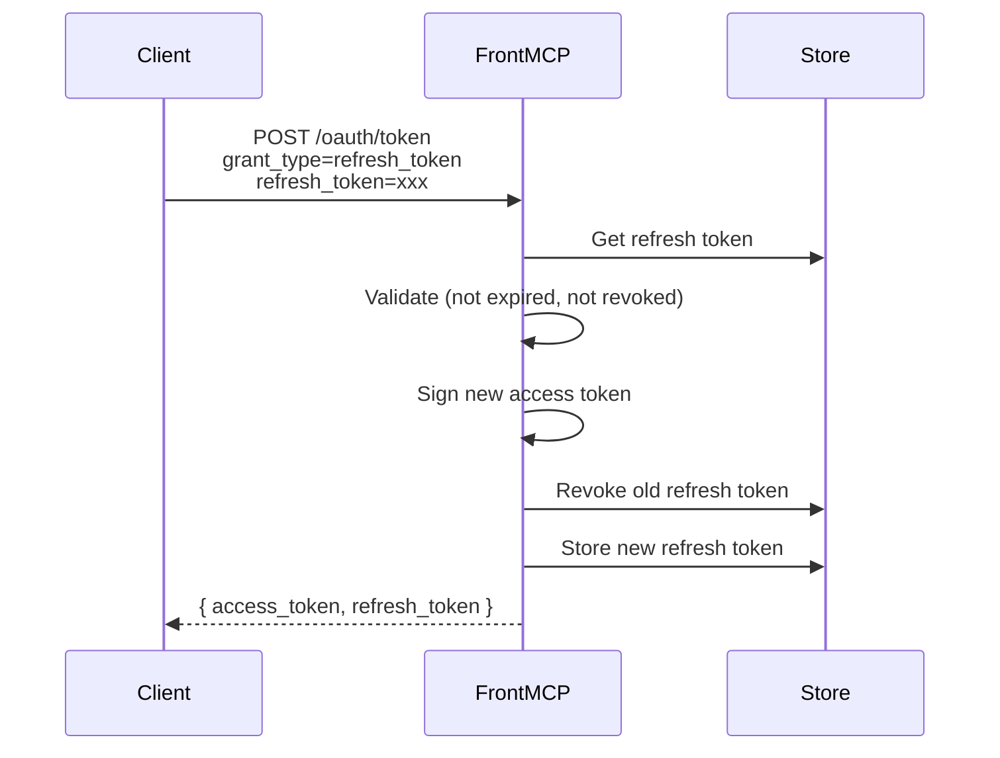
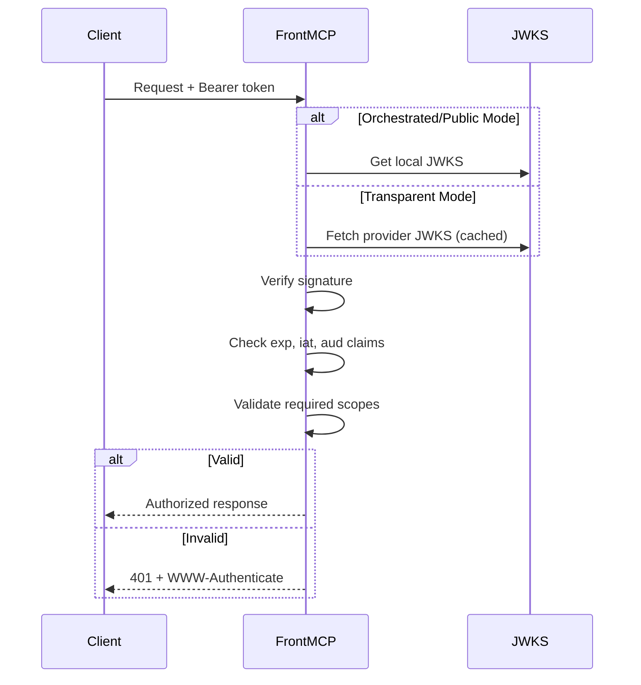

FrontMCP provides flexible token and session management with support for both stateful and stateless patterns.

## Token Types

| Token                  | Purpose                  | Lifetime          | Storage                 |
| ---------------------- | ------------------------ | ----------------- | ----------------------- |
| **Access Token**       | API authorization        | 1 hour (default)  | Client-side (JWT)       |
| **Refresh Token**      | Obtain new access tokens | 30 days (default) | Server-side             |
| **Authorization Code** | OAuth flow exchange      | 60 seconds        | Server-side, single-use |
| **Session Token**      | Track user session       | Configurable      | Depends on mode         |

---

## Session Modes

FrontMCP supports two session management strategies:

<CardGroup cols={2}>
  <Card title="Stateful Sessions" icon="database">
    Tokens stored server-side. Clients hold lightweight references.

    **Pros:**
    - Silent token refresh
    - Revocation without client update
    - Secure token storage

    **Cons:**
    - Requires shared storage (Redis)
    - State management complexity

  </Card>
  <Card title="Stateless Sessions" icon="file-code">
    All data embedded in JWT. No server-side storage.

    **Pros:**
    - Horizontally scalable
    - No shared state
    - Simple architecture

    **Cons:**
    - No silent refresh
    - Larger token size
    - Can't revoke without expiry

  </Card>
</CardGroup>

### Stateful Session Configuration

```typescript
@FrontMcp({
  info: { name: 'MyServer', version: '1.0.0' },
  auth: {
    mode: 'orchestrated',
    type: 'local',
    sessionMode: 'stateful',
    tokenStorage: {
      type: 'redis',
      config: {
        host: 'localhost',
        port: 6379,
        keyPrefix: 'myapp:auth:',
      },
    },
  },
})
export class Server {}
```

### Stateless Session Configuration

```typescript
@FrontMcp({
  info: { name: 'MyServer', version: '1.0.0' },
  auth: {
    mode: 'orchestrated',
    type: 'local',
    sessionMode: 'stateless',
  },
})
export class Server {}
```

<Warning>
  **Stateful sessions require shared storage** when running multiple server instances. Without Redis, each instance maintains its own session state.
</Warning>

---

## Token Storage

### In-Memory (Development)

```typescript
tokenStorage: {
  type: 'memory',
}
```

<Info>
  In-memory storage loses all data on restart. Use only for development.
</Info>

### Redis (Production)

```typescript
tokenStorage: {
  type: 'redis',
  config: {
    host: 'redis.example.com',
    port: 6379,
    password: process.env.REDIS_PASSWORD,
    keyPrefix: 'auth:',
    tls: true,
  },
}
```

### Storage Contents

| Key Pattern               | Data                  | TTL          |
| ------------------------- | --------------------- | ------------ |
| `{prefix}pending:{id}`    | Pending authorization | 10 minutes   |
| `{prefix}code:{code}`     | Authorization code    | 60 seconds   |
| `{prefix}refresh:{token}` | Refresh token         | 30 days      |
| `{prefix}session:{id}`    | Session data          | Configurable |

---

## Token Lifetimes

FrontMCP uses default token lifetimes:

| Token Type         | Default Lifetime |
| ------------------ | ---------------- |
| Access Token       | 1 hour           |
| Refresh Token      | 30 days          |
| Authorization Code | 60 seconds       |

### Token Refresh Configuration

```typescript
auth: {
  mode: 'orchestrated',
  type: 'local',
  refresh: {
    enabled: true,      // Enable automatic token refresh
    skewSeconds: 60,    // Refresh 60s before expiry
  },
}
```

<Info>
  Token lifetimes are currently set at the server level. Refresh tokens are rotated on each use per OAuth 2.1 best practices.
</Info>

---

## Token Refresh Flow

Refresh tokens are rotated on each use (OAuth 2.1 best practice):



---

## JWT Structure

Access tokens are JWTs with standard claims:

```json
{
  "header": {
    "alg": "RS256",
    "typ": "JWT",
    "kid": "key-id-123"
  },
  "payload": {
    "sub": "user-uuid",
    "iss": "https://api.myservice.com",
    "aud": "https://api.myservice.com",
    "exp": 1234567890,
    "iat": 1234567800,
    "jti": "unique-token-id",
    "scope": "read write",
    "email": "user@example.com"
  }
}
```

### Custom Claims

Add custom claims to tokens:

```typescript
auth: {
  mode: 'orchestrated',
  type: 'local',
  tokenClaims: async (user) => ({
    roles: user.roles,
    tenant_id: user.tenantId,
  }),
}
```

---

## Consent & Scopes

Enable consent to let users select granted permissions:

```typescript
auth: {
  mode: 'orchestrated',
  type: 'local',
  consent: { enabled: true },
}
```

### How Consent Works

1. User authenticates
2. FrontMCP displays available tools/resources/prompts
3. User selects which to grant
4. Access token includes only selected scopes

### Tool-Level Scopes

```typescript
@Tool({
  name: 'send_message',
  description: 'Send a message',
  scopes: ['messages:write'], // Required scope
})
export class SendMessageTool {
  async execute(ctx: ToolContext) {
    // Only callable if token has messages:write scope
  }
}
```

---

## JWKS Management

FrontMCP manages cryptographic keys for token signing:

### Auto-Generated Keys

By default, keys are auto-generated at startup:

```typescript
auth: {
  mode: 'orchestrated',
  type: 'local',
  // Keys auto-generated
}
```

<Warning>
  Auto-generated keys are lost on restart. Tokens signed with old keys become invalid.
</Warning>

### Persistent Keys

Provide keys for stable token validation across restarts:

```typescript
auth: {
  mode: 'orchestrated',
  type: 'local',
  local: {
    signKey: {
      kty: 'RSA',
      // ... full JWK
    },
    jwks: {
      keys: [/* public keys */],
    },
  },
}
```

### Key Rotation

For production, implement key rotation:

```typescript
auth: {
  mode: 'orchestrated',
  type: 'local',
  local: {
    keyRotationDays: 30, // Rotate every 30 days
    maxKeys: 3, // Keep 3 keys for validation
  },
}
```

---

## Token Verification

### Verification Flow



### Verification Options

```typescript
auth: {
  mode: 'transparent',
  remote: {
    provider: 'https://auth.example.com',
  },
  expectedAudience: 'https://api.myservice.com',
  requiredScopes: ['openid', 'profile'],
  clockTolerance: 30, // seconds of clock skew allowed
}
```

---

## Error Responses

Token-related errors follow OAuth 2.0 error format:

| Error                | HTTP Status | Description                                    |
| -------------------- | ----------- | ---------------------------------------------- |
| `invalid_token`      | 401         | Token expired, malformed, or invalid signature |
| `insufficient_scope` | 403         | Token missing required scopes                  |
| `invalid_request`    | 400         | Malformed token request                        |
| `invalid_grant`      | 400         | Invalid authorization code or refresh token    |

### Example Error Response

```json
{
  "error": "invalid_token",
  "error_description": "Token has expired",
  "error_uri": "https://tools.ietf.org/html/rfc6750#section-3.1"
}
```

---

## Next Steps

<CardGroup cols={2}>
  <Card title="Authorization Modes" icon="layer-group" href="/docs/authentication/modes">
    Choose the right auth mode for your use case
  </Card>
  <Card title="Progressive Authorization" icon="forward" href="/docs/authentication/progressive">
    Implement incremental app authorization
  </Card>
  <Card title="Production Checklist" icon="clipboard-check" href="/docs/authentication/production">
    Security requirements for deployment
  </Card>
  <Card title="Remote OAuth" icon="cloud" href="/docs/authentication/remote">
    Connect to external identity providers
  </Card>
</CardGroup>
