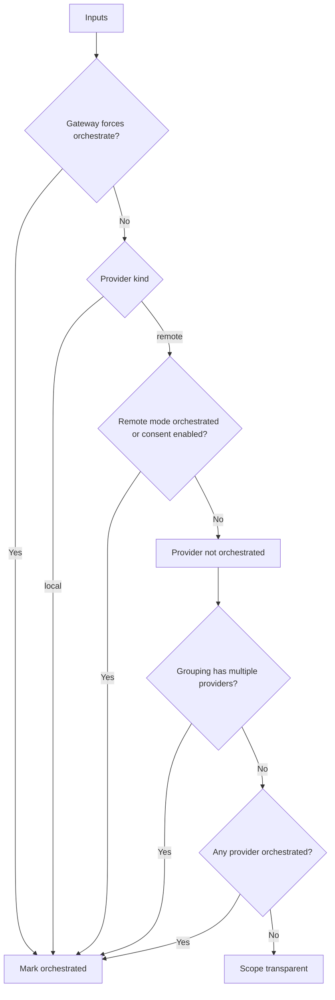
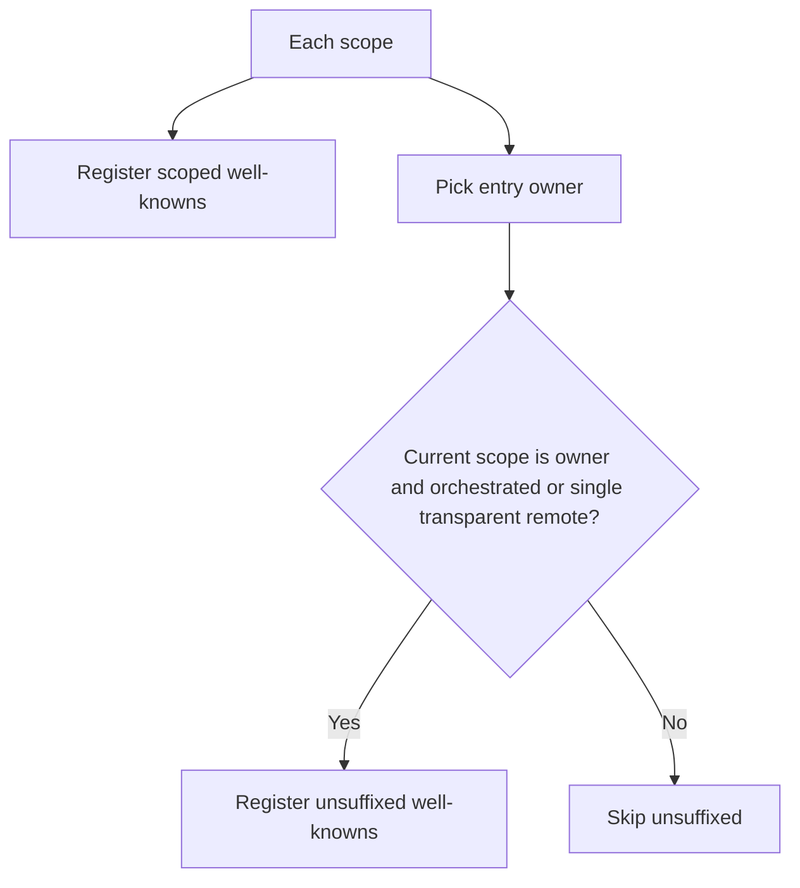
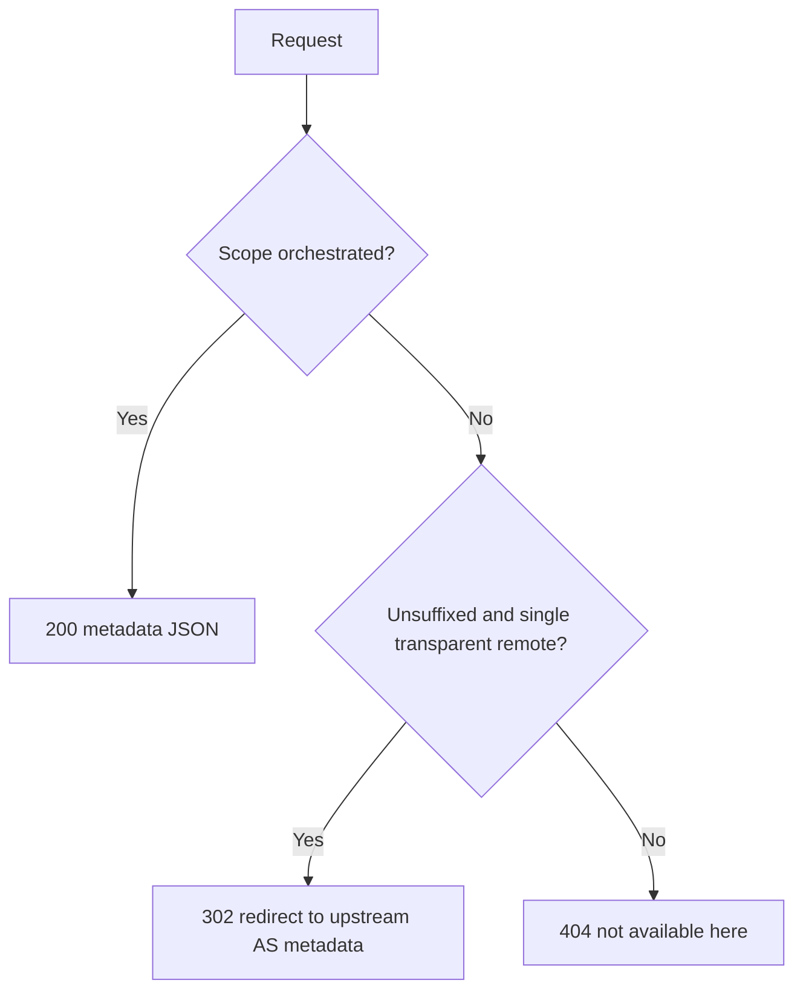
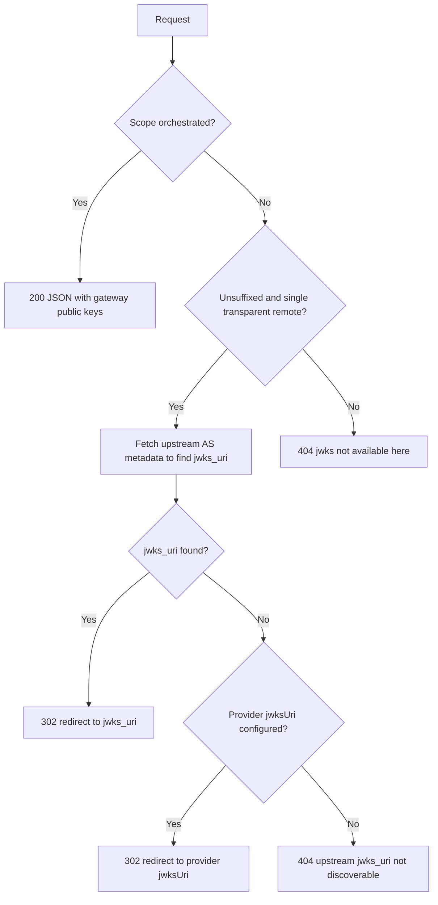
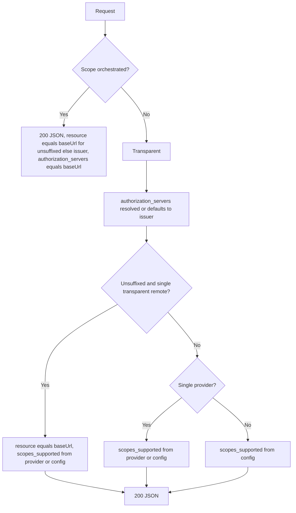

# OAuth Orchestration and Well-Known Endpoints – Flow Charts

This document visualizes how the gateway:
- Scans and detects orchestrated auth providers (per provider and per scope)
- Mounts well-known routes (scoped vs unsuffixed)
- Computes the returned content for each well-known endpoint

References to source files and lines are included for traceability.

---

## 1) Detecting Orchestrated Providers and Scopes

Rules from auth.registry.ts:
- isOrchestratedForProvider (lines 192–203)
  - Orchestrated if gateway forces options.auth.orchestrate === true
  - Local provider implies orchestrated
  - Remote provider orchestrated if mode is orchestrated or enableConsent is true
- buildScopesByApp (lines 205–220): scope.orchestrated = isOrchestratedForProvider(provider)
- buildScopesByAuth (lines 222–247): scope.orchestrated if gateway forces, or providers.length > 1, or any provider orchestrated
- buildSingleScope (lines 249–260): scope.orchestrated if gateway forces, or multiple unique providers, or any provider orchestrated

Notes:
- In by-app grouping, the scope contains a single provider; the flag comes directly from isOrchestratedForProvider.
- In by-auth or single grouping, multi-provider scopes are always orchestrated.

---

## 2) Mounting Well-Known Routes

Where routes are mounted:
- auth.registry.ts registerRoutes (lines 276–288)
  - Always registers scoped well-knowns via oauth.registerScopedRoutes
  - Registers unsuffixed well-knowns only for the entry owner when the owner scope is orchestrated or a single transparent remote
- services/oauth.service.ts (lines 87–102)
  - registerScopedRoutes mounts three well-known endpoints for scoped variants
  - registerGatewayRoutes mounts the same endpoints without scope suffix
- Path variants from auth.utils.ts makeWellKnownPaths (lines 35–42)

Path variants for each name (from makeWellKnownPaths):
- Reversed root: /.well-known/<name><entryPrefix><scopeBase>
- In prefix root: <entryPrefix>/.well-known/<name><scopeBase>
- In prefix and scope: <entryPrefix><scopeBase>/.well-known/<name>

Names used: oauth-protected-resource, oauth-authorization-server, jwks.json

---

## 3) /.well-known/oauth-authorization-server (AS metadata)

Source: flows/well-known.authorization-server.flow.ts
- parseInput (lines 94–117): derives issuer, baseUrl, isUnsuffixedPath
- collectData (lines 124–175): branching behavior

200 response includes issuer, authorization_endpoint, token_endpoint, userinfo_endpoint, jwks_uri, optional registration_endpoint, and supported arrays.

---

## 4) /.well-known/jwks.json (JWKS)

Source: flows/well-known.jwks.flow.ts
- parseInput (lines 82–102): derives isUnsuffixedPath
- collectData (lines 108–167): branching behavior and upstream JWKS discovery

---

## 5) /.well-known/oauth-protected-resource (PRM)

Source: flows/well-known.protected-resource.flow.ts
- parseInput (lines 65–79): derives issuer, baseUrl, routeKind
- collectData (lines 85–135): branching behavior

Returned fields: resource, authorization_servers, scopes_supported, bearer_methods_supported header.

---

## 6) Variable and Path Definitions

- baseUrl = protocol + host + entryPath (auth.utils.ts lines 4–8)
- issuer (scoped) = baseUrl + entryPrefix + scopeBase (auth.utils.ts lines 10–14)
- entryPrefix = normalized gateway prefix (path.utils.ts lines 6–10)
- scopeBase = normalized scope suffix (path.utils.ts lines 12–16)
- makeWellKnownPaths(name, entryPrefix, scopeBase) returns three variants (auth.utils.ts lines 35–42)

---

## 7) Summary

- Orchestration can be forced globally, implied by local providers, by remote provider settings, or by multi-provider scopes
- Scoped well-known routes are always mounted; unsuffixed ones are mounted only by the entry owner and only when the owner is orchestrated or a single transparent remote
- Each well-known endpoint has a clear decision tree for responses based on scope.orchestrated, route kind or unsuffixed path, and provider composition
