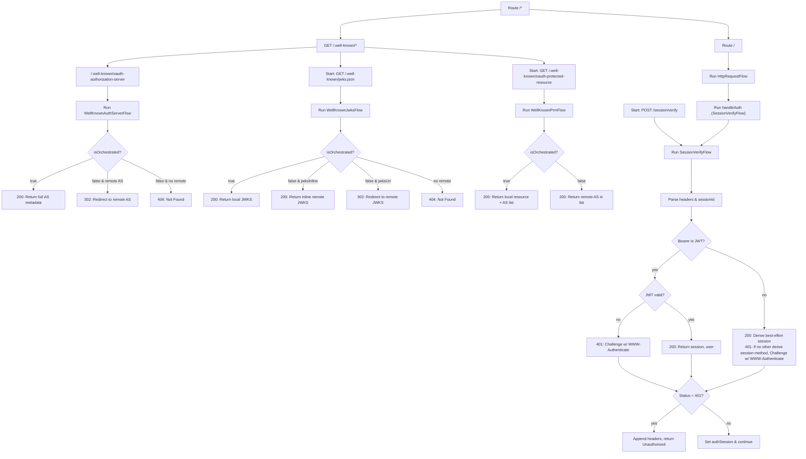

Handles MCP transport selection and routing for multiple sessions per Authorization token.

**Supported modes:**
**1. legacy-sse**
Long-lived SSE connection; client receives responses on the open SSE stream.
Requests are sent fire-and-forget via POST with `Mcp-Session-Id`; if the local node
has no matching transport, the request is forwarded over pub/sub and the POST ends
immediately. The actual response arrives on the existing SSE socket. :contentReference[oaicite:0]{index=0}

**2. sse (server → client notifications / reverse channel)**
Client opens an SSE listener to receive global or targeted server notifications and
server-initiated requests. The SSE transport is torn down when the socket closes.
Unreached messages are buffered in an event store for later replay; broadcast messages
go to all listeners, targeted messages go only to an active session, otherwise they’re
added to the event store. Supports `id`/`Last-Event-ID` for resumable streams. :contentReference[oaicite:1]{index=1}

**3. streamable-http (POST → short-lived SSE)**
A single POST with `Accept: text/event-stream` opens a short-lived SSE stream used to
deliver chunks, progress, and notifications tied to that request. The stream closes
when the response completes. The session ID is recorded in the event store with a TTL
to enable resuming on another node (e.g., after reconnect), aligned with Streamable
HTTP semantics. :contentReference[oaicite:2]{index=2}

**4. stateful-http (POST → JSON batch, no SSE during execution)**
Same request lifecycle as streamable-http, but when `Accept: application/json` the
server aggregates all events and returns a single JSON response (no live elicit/
notifications mid-flight). Out-of-band notifications for the same session are sent via
any active SSE listener; if none is active, they are stored in the event store. :contentReference[oaicite:3]{index=3}

**5. stateless-http (optional)**
When enabled and no `Mcp-Session-Id` header is present, treat the call as a standard,
stateless tool invocation (no session allocation, no event store). JSON response for
`Accept: application/json`; a short-lived SSE MAY be used for `text/event-stream`,
but no state is persisted. Any server notifications are queued under the Authorization
principal and consumed by active legacy-sse/sse listeners; they are not delivered via
streamable-http/stateful-http. When disabled, non-initialize calls without a session
yield 400/404 per configuration. :contentReference[oaicite:4]{index=4}

**Cross-node behavior:**
Pub/Sub keyed by `Mcp-Session-Id` forwards requests/results to the node that owns the
relevant SSE transport. Include origin metadata so non-owning nodes can route correctly. ([GitHub][1])

**Resumability & event IDs:**
SSE events include an `id` and clients may resume with `Last-Event-ID`; the server MAY
replay from the event store within a bounded window. If the gap is too large, require a
new request/session per spec guidance. ([HTML Living Standard][2])

**Configuration expectations:**
Each mode is feature-flagged (enable/disable). If stateless HTTP is disabled and a
streamable action arrives without `Mcp-Session-Id`, return 400/404 “initialize first”.
If stateless is enabled but a request includes a stale or unknown `Mcp-Session-Id`,
clear `Mcp-Session-Id` in the response and return 404 “no active transport” to signal
that stateless requests must not carry a session header. ([Model Context Protocol][3])

References: MCP 2025-03-26 transports (Streamable HTTP), SSE standard and Last-Event-ID. ([Model Context Protocol][3])
[1]: https://github.com/modelcontextprotocol/example-remote-server/blob/main/docs/streamable-http-design.md?utm_source=chatgpt.com "
example-remote-server/docs/streamable-http-design.md at main ..."
[2]: https://html.spec.whatwg.org/multipage/server-sent-events.html?utm_source=chatgpt.com "HTML Standard - WHATWG"
[3]: https://modelcontextprotocol.io/specification/2025-03-26/basic/transports?utm_source=chatgpt.com "Transports -
Model Context Protocol"
