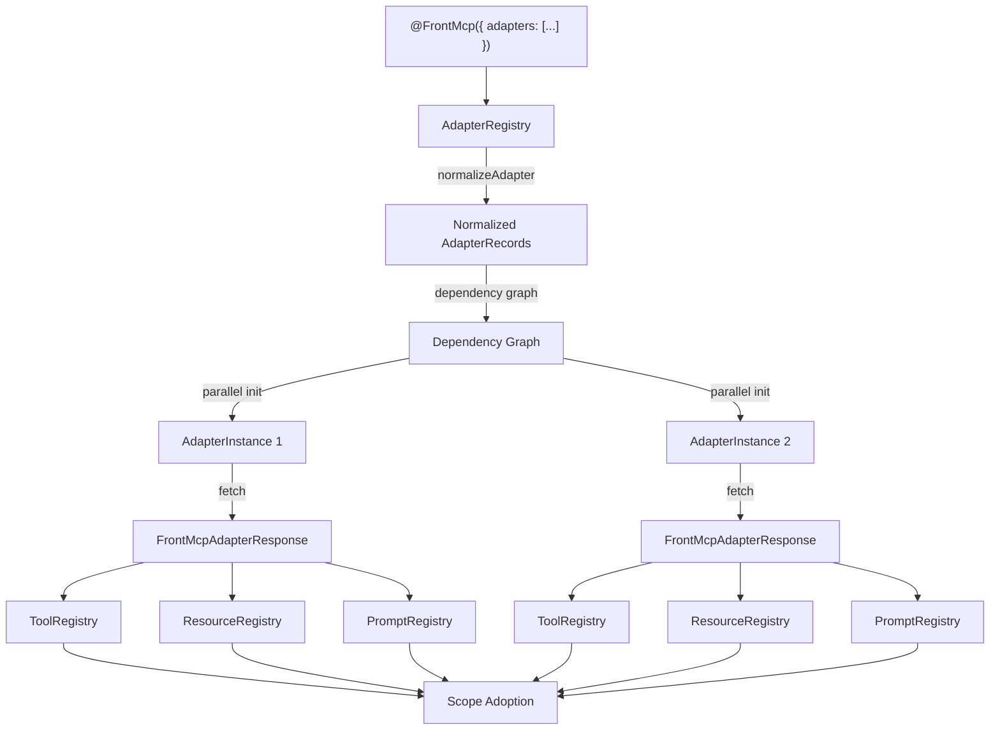
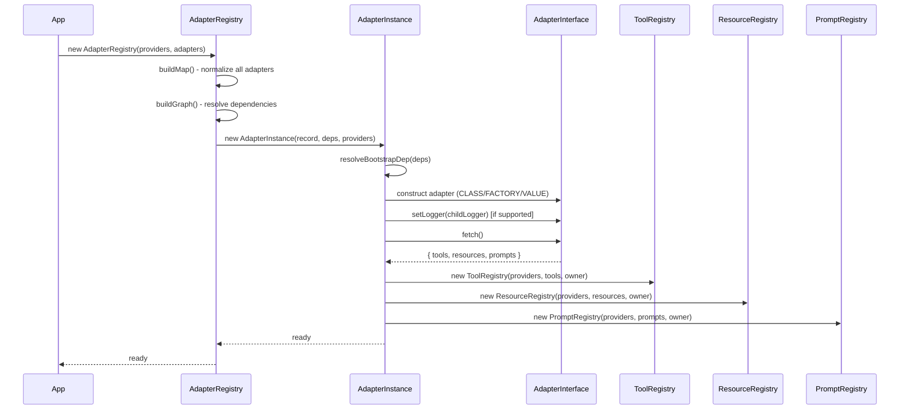

# Adapter Module

Adapters are the bridge between external systems (OpenAPI services, third-party SDKs, legacy APIs) and the FrontMCP tool/resource/prompt model. An adapter fetches definitions from an external source and translates them into registerable entries.

## Architecture



## Creating Custom Adapters

### What is an Adapter?

An adapter is a class that connects an external system (an API, a database, a file on disk) to your FrontMCP app. The SDK constructs your adapter, optionally hands it a logger, then calls `fetch()`. Whatever tools, resources, or prompts you return from `fetch()` get registered into the app scope automatically — just as if you had listed them in `@FrontMcp()` directly.

### The `AdapterInterface`

Every adapter must satisfy this interface (from `common/interfaces/adapter.interface.ts`):

```typescript
interface AdapterInterface {
  /** Identifies this adapter instance. `name` is required. */
  options: { name: string } & Record<string, unknown>;

  /**
   * Optional — called by the SDK before fetch() to give you a scoped logger.
   * If you don't implement it, the SDK silently skips the call.
   */
  setLogger?: (logger: FrontMcpLogger) => void;

  /** Return the tools / resources / prompts this adapter provides. */
  fetch(): Promise<FrontMcpAdapterResponse> | FrontMcpAdapterResponse;
}
```

**Lifecycle:** construct → `setLogger(logger)` (if implemented) → `fetch()` → entries registered.

### Approach 1: Simple Adapter with `@Adapter` Decorator

Use this when you have a single-instance adapter that doesn't need runtime configuration.

**Step 1 — Create a class that implements `AdapterInterface`:**

```typescript
import { Adapter, AdapterInterface, FrontMcpAdapterResponse, FrontMcpLogger, Tool, ToolContext } from '@frontmcp/sdk';
import { z } from 'zod';
```

**Step 2 — Add the `@Adapter` decorator and declare `options`:**

```typescript
@Adapter({ name: 'greeting', description: 'Provides a greeting tool' })
class GreetingAdapter implements AdapterInterface {
  // `name` must be present; add any extra fields you like.
  options = { name: 'greeting' };
```

**Step 3 — Optionally implement `setLogger` to receive the SDK logger:**

```typescript
  private logger?: FrontMcpLogger;

  setLogger(logger: FrontMcpLogger): void {
    this.logger = logger;
  }
```

**Step 4 — Implement `fetch()` returning `{ tools?, resources?, prompts? }`:**

```typescript
  async fetch(): Promise<FrontMcpAdapterResponse> {
    this.logger?.debug('Building greeting tool');

    // Define an inline tool class
    @Tool({
      name: 'greet',
      description: 'Say hello to someone',
      inputSchema: z.object({ name: z.string() }),
    })
    class GreetTool extends ToolContext<{ name: string }, string> {
      async execute(input: { name: string }) {
        return `Hello, ${input.name}!`;
      }
    }

    return { tools: [GreetTool] };
  }
}
```

**Step 5 — Register in your app:**

```typescript
@FrontMcp({
  name: 'my-app',
  adapters: [GreetingAdapter],
})
class MyApp {}
```

The SDK will construct `GreetingAdapter`, call `setLogger`, call `fetch()`, and register the returned `GreetTool` into the app scope.

### Approach 2: `DynamicAdapter` with `init()`

Use this when you need **runtime configuration** or want **multiple instances** of the same adapter class with different settings.

`DynamicAdapter<TOptions>` is an abstract base class that provides a static `init()` method. Each `init()` call creates a unique provider token so the SDK can manage multiple instances independently.

**Step 1 — Define your options type:**

```typescript
import { Adapter, DynamicAdapter, FrontMcpAdapterResponse, FrontMcpLogger } from '@frontmcp/sdk';

interface MyApiOptions {
  name: string; // required by DynamicAdapter
  baseUrl: string; // your custom config
  apiKey?: string;
}
```

**Step 2 — Create a class extending `DynamicAdapter<TOptions>` with the `@Adapter` decorator:**

```typescript
@Adapter({ name: 'my-api', description: 'Imports tools from an HTTP API' })
class MyApiAdapter extends DynamicAdapter<MyApiOptions> {
  // DynamicAdapter declares `abstract options: { name: string } & TOptions`.
  // You must provide the concrete property:
  public options: MyApiOptions;

  private logger?: FrontMcpLogger;

  constructor(options: MyApiOptions) {
    super(); // no arguments
    this.options = options; // store the runtime config
  }

  setLogger(logger: FrontMcpLogger): void {
    this.logger = logger;
  }

  async fetch(): Promise<FrontMcpAdapterResponse> {
    this.logger?.info(`Fetching tools from ${this.options.baseUrl}`);

    // Use this.options to drive your adapter logic
    const resp = await fetch(`${this.options.baseUrl}/tools`);
    const data = await resp.json();

    // ... convert `data` into tool/resource/prompt classes ...

    return {
      tools: [
        /* ... */
      ],
    };
  }
}
```

**Step 3 — Register via `init()`:**

```typescript
@FrontMcp({
  name: 'my-app',
  adapters: [
    MyApiAdapter.init({
      name: 'production-api',
      baseUrl: 'https://api.example.com',
      apiKey: process.env.API_KEY,
    }),
  ],
})
class MyApp {}
```

**Multiple instances of the same adapter:**

```typescript
@FrontMcp({
  name: 'my-app',
  adapters: [
    MyApiAdapter.init({ name: 'users-api', baseUrl: 'https://users.example.com' }),
    MyApiAdapter.init({ name: 'orders-api', baseUrl: 'https://orders.example.com' }),
  ],
})
class MyApp {}
```

Each `init()` call creates a unique `Symbol.for('adapter:MyApiAdapter:<name>')` token, so the SDK treats them as separate adapters. The `name` must be unique per adapter class — duplicates throw at registration time.

**`init()` with factory injection:**

If your adapter needs DI-resolved dependencies instead of plain options, pass `useFactory` and `inject`:

```typescript
MyApiAdapter.init({
  name: 'injected-api',
  inject: () => [ConfigService],
  useFactory: (config: ConfigService) => ({
    name: 'injected-api',
    baseUrl: config.get('API_URL'),
  }),
});
```

### Approach 3: Factory / Value Patterns

For full control over construction without using `DynamicAdapter`, provide raw provider records:

```typescript
const MY_ADAPTER = Symbol('MY_ADAPTER');

@FrontMcp({
  adapters: [
    // Factory: SDK calls your factory function, optionally injecting dependencies
    {
      provide: MY_ADAPTER,
      name: 'my-adapter',
      useFactory: (config: ConfigService) => new MyAdapter(config),
      inject: () => [ConfigService],
    },

    // Value: provide a pre-constructed adapter instance
    {
      provide: MY_ADAPTER,
      name: 'my-adapter',
      useValue: new StaticAdapter({ name: 'static' }),
    },
  ],
})
```

Use **factory** when your adapter needs injected services. Use **value** when you can construct the adapter up front.

## Adapter Response

The `FrontMcpAdapterResponse` interface defines what `fetch()` returns:

```typescript
interface FrontMcpAdapterResponse {
  tools?: ToolType[]; // Tool definitions to register
  resources?: ResourceType[]; // Resource definitions to register
  prompts?: PromptType[]; // Prompt definitions to register
}
```

All three fields are optional. Each is passed to the corresponding registry with an `EntryOwnerRef` of `kind: 'adapter'`.

## Sequence Diagram



## Module Structure

```
adapter/
  adapter.instance.ts    # AdapterInstance - lifecycle for a single adapter
  adapter.registry.ts    # AdapterRegistry - manages all adapters
  adapter.utils.ts       # normalizeAdapter, collectAdapterMetadata, adapterDiscoveryDeps
  __tests__/
    adapter.instance.test.ts
    adapter.registry.test.ts
    adapter.utils.test.ts
  README.md
```

## Adapter Kinds

| Kind          | Description                                                   | Source                            |
| ------------- | ------------------------------------------------------------- | --------------------------------- |
| `CLASS_TOKEN` | Decorated class used as both token and implementation         | `@Adapter()` class                |
| `CLASS`       | Separate token with `useClass` pointing to the implementation | `{ provide, useClass }`           |
| `FACTORY`     | Factory function with optional dependency injection           | `{ provide, useFactory, inject }` |
| `VALUE`       | Pre-constructed adapter instance                              | `{ provide, useValue }`           |

## Related

- [`common/decorators/adapter.decorator.ts`](../common/decorators/adapter.decorator.ts) - `@Adapter` decorator
- [`common/interfaces/adapter.interface.ts`](../common/interfaces/adapter.interface.ts) - `AdapterInterface`, `FrontMcpAdapterResponse`
- [`common/metadata/adapter.metadata.ts`](../common/metadata/adapter.metadata.ts) - `AdapterMetadata` schema
- [`common/records/adapter.record.ts`](../common/records/adapter.record.ts) - `AdapterRecord`, `AdapterKind`
- [`common/tokens/adapter.tokens.ts`](../common/tokens/adapter.tokens.ts) - `FrontMcpAdapterTokens`
