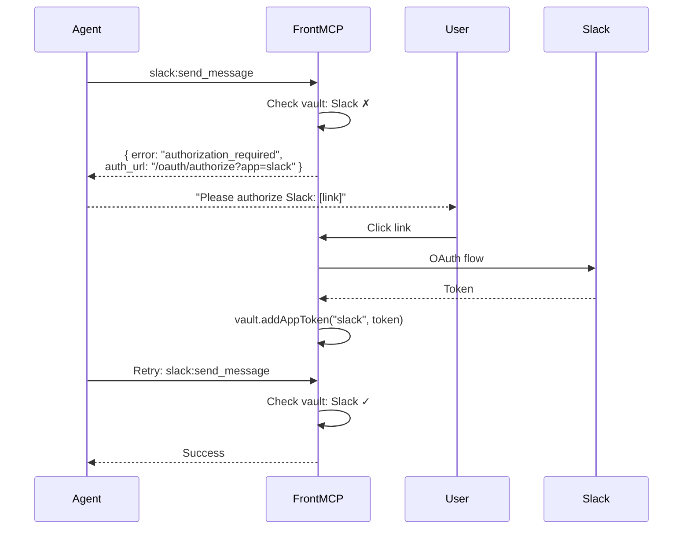
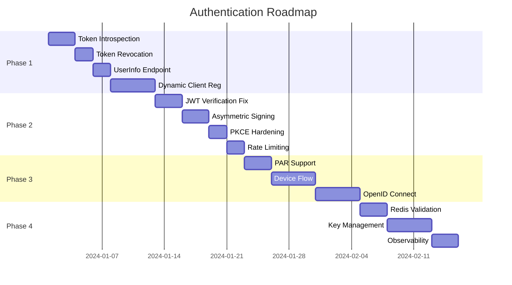

# FrontMCP Authentication Roadmap

This document outlines the development plan for completing the FrontMCP authentication system.

## Current Status

### Implemented

| Component                  | Status  | Notes                                                                   |
| -------------------------- | ------- | ----------------------------------------------------------------------- |
| Auth Options Schema        | Done    | `mode: 'public' \| 'transparent' \| 'orchestrated'` with Zod validation |
| LocalPrimaryAuth           | Partial | Basic flows work, needs production hardening                            |
| RemotePrimaryAuth          | Partial | Token pass-through works, needs full OIDC support                       |
| `/oauth/authorize`         | Done    | PKCE validation, login page rendering                                   |
| `/oauth/callback`          | Done    | Authorization code generation                                           |
| `/oauth/token`             | Done    | Authorization code + refresh token grants                               |
| `/oauth/register`          | Stub    | Dynamic Client Registration not implemented                             |
| JwksService                | Partial | Key generation works, verification has limitations                      |
| InMemoryAuthorizationStore | Done    | Full implementation                                                     |
| RedisAuthorizationStore    | Stub    | Structure exists, needs testing                                         |

### Not Implemented

| Component           | Priority | Notes                                   |
| ------------------- | -------- | --------------------------------------- |
| `/oauth/introspect` | P1       | Token introspection (RFC 7662)          |
| `/oauth/revoke`     | P1       | Token revocation (RFC 7009)             |
| `/oauth/userinfo`   | P1       | UserInfo endpoint (OIDC Core)           |
| Nested App Auth     | P1       | Federated authorization for child apps  |
| Client Validation   | P1       | Validate client_id against DCR registry |
| `/oauth/par`        | P2       | Pushed Authorization Requests           |
| Device Code Flow    | P2       | For CLI/TV apps                         |
| DPoP Support        | P3       | Demonstration of Proof-of-Possession    |
| mTLS Client Auth    | P3       | For confidential clients                |

---

## Phase 1: Core OAuth Completion

**Goal**: Complete essential OAuth 2.1 endpoints for production use.

### 1.1 Token Introspection (`/oauth/introspect`)

**File**: `auth/flows/oauth.introspect.flow.ts`

```typescript
// POST /oauth/introspect
// Request: token, token_type_hint?
// Response: { active, sub, scope, client_id, exp, iat, ... }
```

**Tasks**:

- [ ] Implement introspection flow
- [ ] Support access_token and refresh_token hints
- [ ] Return RFC 7662 compliant response
- [ ] Add client authentication (for confidential clients)
- [ ] Add rate limiting

### 1.2 Token Revocation (`/oauth/revoke`)

**File**: `auth/flows/oauth.revoke.flow.ts`

```typescript
// POST /oauth/revoke
// Request: token, token_type_hint?
// Response: 200 OK (always, even if token invalid)
```

**Tasks**:

- [ ] Implement revocation flow
- [ ] Support access_token and refresh_token revocation
- [ ] Cascade revocation (revoke refresh = revoke all access tokens)
- [ ] Add client authentication

### 1.3 UserInfo Endpoint (`/oauth/userinfo`)

**File**: `auth/oauth/flows/oauth.userinfo.flow.ts`

```typescript
// GET/POST /oauth/userinfo
// Request: Bearer token
// Response: { sub, name, email, picture, ... }
```

**Tasks**:

- [ ] Implement userinfo flow
- [ ] Support scope-based claim filtering
- [ ] Add `email`, `profile`, `address`, `phone` scope support
- [ ] Return standard OIDC claims

### 1.4 Dynamic Client Registration

**File**: `auth/flows/oauth.register.flow.ts`

```typescript
// POST /oauth/register
// Request: { redirect_uris, client_name, ... }
// Response: { client_id, client_secret?, ... }
```

**Tasks**:

- [ ] Implement DCR flow (RFC 7591)
- [ ] Store client registrations
- [ ] Support client management (GET, PUT, DELETE)
- [ ] Add initial access token support

### 1.5 Progressive Authorization & Nested Applications

**Goal**: Implement hierarchical auth with three levels (Global → App → Tool) supporting progressive authorization.

**New Files**:

- `auth/flows/oauth.progressive-authorize.flow.ts`
- `auth/session/token.vault.ts` (extend)
- `auth/authorization/app.authorization.ts`
- `auth/authorization/tool.authorization.ts`

**Architecture**:

```
Server (Global Auth - Orchestrated)
├── /slack (standalone: true → direct Slack OAuth)
├── /crm (nested → federated via parent)
├── /github (OpenAPI adapter → GitHub OAuth group)
└── /stripe (OpenAPI adapter → Stripe OAuth group)
```

**Core Concepts**:

- Users can **skip** apps during initial auth
- AI agents receive **auth_url** when calling unauthorized tools
- Token vault **expands** as users authorize more apps
- Same session token, evolving permissions

---

#### 1.5.1 Authorization Hierarchy

**Tasks**:

- [ ] Define three-level auth hierarchy (Global → App → Tool)
- [ ] Support `standalone` option for direct app access
- [ ] Support `excludeFromParent` to hide from federated auth
- [ ] Auto-group tools by auth provider (OpenAPI adapters)

---

#### 1.5.2 Progressive Authorization UI

**Tasks**:

- [ ] Add **Skip** button for each app
- [ ] Track authorized/skipped/pending status per app
- [ ] Show tool list per app in UI
- [ ] Display "Authorize Later" option for skipped
- [ ] Allow **Continue with authorized apps** button
- [ ] Show warning about skipped apps

---

#### 1.5.3 Incremental Authorization Flow

**Tasks**:

- [ ] Return structured `authorization_required` error:
  ```typescript
  {
    error: "authorization_required",
    app: "slack",
    tool: "slack:send_message",
    auth_url: "/oauth/authorize?app=slack",
    message: "Click to authorize Slack"
  }
  ```
- [ ] Support single-app authorization (`?app=slack`)
- [ ] Preserve existing session during incremental auth
- [ ] Update token vault without issuing new session token

---

#### 1.5.4 Token Vault Evolution

**Tasks**:

- [ ] Store child tokens server-side (not in JWT)
- [ ] Track `authorized_apps` and `pending_apps` in session
- [ ] Support vault expansion without token reissue
- [ ] Implement `vault.addAppToken(app, token)`
- [ ] Implement `vault.getAppToken(app)` for tool execution
- [ ] Handle token refresh per app

---

#### 1.5.5 OpenAPI Adapter Auth Groups

**Tasks**:

- [ ] Auto-detect auth requirements from OpenAPI spec
- [ ] Group tools by auth provider
- [ ] Support `security` schemes from OpenAPI
- [ ] Apply tool prefix for namespacing (e.g., `github:repos_list`)
- [ ] Inherit adapter auth to all generated tools

---

#### 1.5.6 Standalone App Mode

**Tasks**:

- [ ] Support `standalone: true` for direct app access
- [ ] Serve app's own `.well-known/oauth-authorization-server`
- [ ] Bypass parent federated auth when accessing directly
- [ ] Support `path` option for URL prefix
- [ ] Handle both standalone and federated access for same app

---

#### 1.5.7 Tool Authorization Check

**Tasks**:

- [ ] Check tool's required scopes before execution
- [ ] Resolve scope → app mapping
- [ ] Return `authorization_required` with auth_url
- [ ] Support `auth.getAppToken(appName)` in tools
- [ ] Auto-inject correct token based on tool's app

---

**Example Progressive Flow**:



### 1.6 Client Validation

**Goal**: Validate client_id against DCR registry in authorize flow.

**File**: `auth/flows/oauth.authorize.flow.ts`

**Tasks**:

- [ ] Add `validateClient` stage before login
- [ ] Check client_id exists in registry
- [ ] Verify redirect_uri matches registered URIs
- [ ] Return proper OAuth errors for invalid clients
- [ ] Support pre-registered clients (config-based)

---

## Phase 2: Security Hardening

**Goal**: Production-ready security features.

### 2.1 JWT Signature Verification

**Current Issue**: `verifyGatewayToken` only decodes JWT, doesn't verify signature.

**File**: `auth/jwks/jwks.service.ts:44-79`

```typescript
// CURRENT (unsafe):
const payload = decodeJwtPayloadSafe(token);
return { ok: true, payload };

// NEEDED:
const jwks = this.getPublicJwks();
const JWKS = createLocalJWKSet(jwks);
const { payload } = await jwtVerify(token, JWKS, { issuer });
```

**Tasks**:

- [ ] Enable proper JWT signature verification
- [ ] Use asymmetric keys (RS256/ES256) by default
- [ ] Remove HS256 fallback in LocalPrimaryAuth
- [ ] Add key ID (kid) matching
- [ ] Add issuer validation

### 2.2 Access Token Signing

**Current Issue**: LocalPrimaryAuth uses symmetric HS256 with shared secret.

**File**: `auth/instances/instance.local-primary-auth.ts`

**Tasks**:

- [ ] Use JwksService for signing (asymmetric keys)
- [ ] Add kid to token header
- [ ] Support configurable token TTL
- [ ] Add audience claim validation
- [ ] Implement token binding (optional)

### 2.3 PKCE Enhancements

**Tasks**:

- [ ] Add replay attack protection (nonce)
- [ ] Store code_challenge with pending authorization
- [ ] Verify redirect_uri exactly matches
- [ ] Add CSRF protection with state

### 2.4 Rate Limiting

**Tasks**:

- [ ] Add rate limiting to token endpoint
- [ ] Add rate limiting to authorize endpoint
- [ ] Implement account lockout after failed attempts
- [ ] Add brute force protection for codes

---

## Phase 3: Advanced Features

### 3.1 Pushed Authorization Requests (PAR)

**File**: `auth/oauth/flows/oauth.par.flow.ts`

**Tasks**:

- [ ] Implement PAR endpoint (RFC 9126)
- [ ] Store PAR requests with short TTL
- [ ] Support `request_uri` in authorize
- [ ] Add client authentication

### 3.2 Device Authorization Flow

**Files**:

- `auth/oauth/flows/oauth.device-authorization.flow.ts`
- `auth/flows/oauth.activate.flow.ts`

**Tasks**:

- [ ] Implement device_authorization endpoint
- [ ] Generate user code and device code
- [ ] Implement polling in token endpoint
- [ ] Create activation UI
- [ ] Add slow_down and authorization_pending errors

### 3.3 DPoP (Proof-of-Possession)

**Tasks**:

- [ ] Parse DPoP proof header
- [ ] Validate DPoP proof JWT
- [ ] Bind tokens to DPoP key
- [ ] Add DPoP thumbprint to token claims

### 3.4 OpenID Connect

**Tasks**:

- [ ] Add ID token generation
- [ ] Implement discovery (`.well-known/openid-configuration`)
- [ ] Add nonce support
- [ ] Implement hybrid flow (optional)
- [ ] Add logout endpoint

---

## Phase 4: Production Infrastructure

### 4.1 Redis Store Validation

**File**: `auth/session/authorization.store.ts`

**Tasks**:

- [ ] Add integration tests with Redis
- [ ] Implement connection pooling
- [ ] Add retry logic
- [ ] Handle Redis cluster mode
- [ ] Add metrics/monitoring

### 4.2 Key Management

**Tasks**:

- [ ] Add external key import
- [ ] Implement key versioning
- [ ] Add key rotation scheduling
- [ ] Support HSM integration (PKCS#11)
- [ ] Add key backup/restore

### 4.3 Observability

**Tasks**:

- [ ] Add structured logging
- [ ] Add metrics (Prometheus)
- [ ] Add distributed tracing
- [ ] Create health check endpoints
- [ ] Add audit logging

### 4.4 Multi-Tenancy

**Tasks**:

- [ ] Add tenant isolation
- [ ] Per-tenant key management
- [ ] Tenant-specific configuration
- [ ] Cross-tenant token validation

---

## Known Issues & Limitations

### JwksService

| Issue                      | Severity | Description                                       |
| -------------------------- | -------- | ------------------------------------------------- |
| No signature verification  | High     | `verifyGatewayToken` only decodes, doesn't verify |
| Symmetric key in LocalAuth | Medium   | Uses HS256 with env-based secret                  |
| No key persistence         | Medium   | Keys regenerate on restart                        |
| No graceful rotation       | Low      | Old keys immediately invalid                      |

### Authorization Store

| Issue                    | Severity | Description                       |
| ------------------------ | -------- | --------------------------------- |
| No Redis testing         | Medium   | RedisAuthorizationStore untested  |
| No distributed locking   | Medium   | Race conditions possible in Redis |
| No token family tracking | Low      | Can't detect token reuse attacks  |

### OAuth Flows

| Issue                      | Severity | Description                             |
| -------------------------- | -------- | --------------------------------------- |
| Basic login UI             | Medium   | Needs proper authentication UI          |
| No consent screen          | Medium   | Auto-grants all scopes                  |
| No client validation       | High     | Any client_id accepted                  |
| No redirect_uri validation | High     | Should validate against registered URIs |

---

## Implementation Priority



---

## Quick Wins

These can be done immediately with minimal effort:

1. **Fix JWT verification** - Uncomment the proper verification code in `verifyGatewayToken`
2. **Add client registration store** - Simple in-memory map for registered clients
3. **Validate redirect_uri** - Check against registered URIs before redirecting
4. **Add introspection** - Simple lookup in authorization store
5. **Add revocation** - Mark tokens as revoked in store

---

## Testing Strategy

### Unit Tests

- [ ] Auth options parsing and validation
- [ ] PKCE generation and verification
- [ ] JWT signing and verification
- [ ] Authorization store operations
- [ ] Token refresh rotation

### Integration Tests

- [ ] Full authorization code flow
- [ ] Refresh token rotation
- [ ] Token introspection
- [ ] Token revocation
- [ ] Device code flow

### Security Tests

- [ ] PKCE bypass attempts
- [ ] Token replay attacks
- [ ] Redirect URI manipulation
- [ ] CSRF attacks
- [ ] Token substitution

---

## References

- [OAuth 2.1 Draft](https://datatracker.ietf.org/doc/html/draft-ietf-oauth-v2-1-11)
- [RFC 7636 - PKCE](https://datatracker.ietf.org/doc/html/rfc7636)
- [RFC 7662 - Token Introspection](https://datatracker.ietf.org/doc/html/rfc7662)
- [RFC 7009 - Token Revocation](https://datatracker.ietf.org/doc/html/rfc7009)
- [RFC 8628 - Device Authorization Grant](https://datatracker.ietf.org/doc/html/rfc8628)
- [RFC 9126 - Pushed Authorization Requests](https://datatracker.ietf.org/doc/html/rfc9126)
- [RFC 9449 - DPoP](https://datatracker.ietf.org/doc/html/rfc9449)
- [OpenID Connect Core](https://openid.net/specs/openid-connect-core-1_0.html)
