# FrontMCP Authentication System

This document describes the FrontMCP authentication architecture, flows, and implementation details.

## Table of Contents

- [Overview](#overview)
- [Authentication Modes](#authentication-modes)
- [Architecture](#architecture)
- [OAuth 2.1 Flows](#oauth-21-flows)
- [Dynamic Client Registration (DCR)](#dynamic-client-registration-dcr)
- [Nested Application Authentication](#nested-application-authentication)
- [JWT and JWKS](#jwt-and-jwks)
- [Session Management](#session-management)
- [Configuration](#configuration)

---

## Overview

FrontMCP implements a three-tier authentication system designed for flexibility and security:


### Key Features

- **OAuth 2.1 Compliant**: PKCE required (S256), authorization code flow only
- **JWT-based**: Access tokens are signed JWTs with configurable algorithms (RS256/ES256)
- **Flexible Storage**: In-memory (dev) or Redis (production)
- **Session Support**: Both stateful and stateless session modes
- **Discovery**: Standard `.well-known` endpoints for OAuth and JWKS

---

## Security & Limitations

> **WARNING**: This section documents intentional security shortcuts for development convenience. Review carefully before deploying to production.

### Development-Only Features

| Feature                | Description                                                                 | Production Risk                                                 |
| ---------------------- | --------------------------------------------------------------------------- | --------------------------------------------------------------- |
| **Default JWT Secret** | If `JWT_SECRET` env var is not set, a random in-process secret is generated | Tokens become invalid on restart; predictable in some scenarios |
| **In-Memory Storage**  | `InMemoryAuthorizationStore` loses all data on restart                      | Session loss; not suitable for multi-instance deployments       |
| **Localhost DCR**      | Dynamic Client Registration only allows localhost redirect URIs             | N/A - disabled in production by default                         |
| **Demo Login Page**    | Built-in login page accepts any email without validation                    | Must be replaced with real identity provider                    |

### When NOT to Use Each Mode

| Mode                    | Do NOT Use When                                          |
| ----------------------- | -------------------------------------------------------- |
| **Public**              | You need user identity, audit trails, or access control  |
| **Transparent**         | You need to orchestrate tokens across multiple providers |
| **Orchestrated Local**  | You're running multiple server instances without Redis   |
| **Orchestrated Remote** | The upstream IdP doesn't support the required scopes     |

### What Verification is Skipped

| Scenario                                | Skipped Verification        | Why                              |
| --------------------------------------- | --------------------------- | -------------------------------- |
| Public mode with `allowAnonymous: true` | Token verification entirely | Anonymous access by design       |
| `type: 'local'` without IdP             | User authentication         | Demo login only validates format |
| Missing `expectedAudience`              | Audience claim validation   | Defaults to issuer URL           |
| In-memory JWKS                          | Key persistence             | Keys regenerate on restart       |

### Production Deployment Checklist

- [ ] Set `JWT_SECRET` environment variable (min 32 bytes, high entropy)
- [ ] Configure Redis for `AuthorizationStore` and `TokenStorage`
- [ ] Replace demo login page with real identity provider
- [ ] Set explicit `expectedAudience` matching your resource server
- [ ] Enable HTTPS (required for OAuth 2.1 compliance)
- [ ] Configure rate limiting on `/oauth/register` and `/oauth/token`
- [ ] Review `publicAccess.tools` whitelist if using public mode
- [ ] Test token refresh flows under load
- [ ] Set up monitoring for token verification failures

---

## Authentication Modes

### 1. Public Mode (`mode: 'public'`)

No authentication required. All users get anonymous sessions.

```typescript
const auth: AuthOptionsInput = {
  mode: 'public',
  sessionTtl: 3600, // 1 hour default
  anonymousScopes: ['anonymous'],
};
```

**Use case**: Public APIs, development, testing


### 2. Transparent Mode (`mode: 'transparent'`)

Pass-through OAuth tokens from a remote identity provider. FrontMCP validates tokens against the upstream provider's JWKS.

```typescript
const auth: AuthOptionsInput = {
  mode: 'transparent',
  remote: {
    provider: 'https://auth.example.com',
    jwksUri: 'https://auth.example.com/.well-known/jwks.json',
  },
  allowAnonymous: false,
};
```

**Use case**: Integrating with existing IdP (Auth0, Okta, etc.)


### 3. Orchestrated Mode (`mode: 'orchestrated'`)

FrontMCP acts as a full OAuth 2.1 authorization server.

#### Local Type (`type: 'local'`)

Self-contained auth server with its own user management.

```typescript
const auth: AuthOptionsInput = {
  mode: 'orchestrated',
  type: 'local',
  allowDefaultPublic: false,
  consent: true,
  tokenStorage: { type: 'memory' },
  sessionMode: 'stateful',
};
```

#### Remote Type (`type: 'remote'`)

Local auth server that proxies to an upstream IdP for user authentication.

```typescript
const auth: AuthOptionsInput = {
  mode: 'orchestrated',
  type: 'remote',
  remote: {
    provider: 'https://auth.example.com',
    clientId: 'my-client-id',
    clientSecret: 'secret',
  },
  allowDefaultPublic: false,
};
```

---

## Architecture

### Component Overview


### File Structure

```
auth/
├── auth.registry.ts          # Main auth registry, creates providers
├── auth.utils.ts             # Auth utility functions
├── path.utils.ts             # URL/path utilities
│
├── instances/
│   ├── instance.local-primary-auth.ts   # LocalPrimaryAuth (public/orchestrated)
│   └── instance.remote-primary-auth.ts  # RemotePrimaryAuth (transparent)
│
├── flows/
│   ├── oauth.authorize.flow.ts    # GET /oauth/authorize
│   ├── oauth.callback.flow.ts     # GET /oauth/callback (login callback)
│   ├── oauth.token.flow.ts        # POST /oauth/token
│   ├── oauth.register.flow.ts     # POST /oauth/register (DCR)
│   ├── session.verify.flow.ts     # Session/token verification
│   ├── well-known.oauth-authorization-server.flow.ts
│   ├── well-known.jwks.flow.ts
│   └── well-known.prm.flow.ts
│
├── oauth/flows/               # OAuth endpoint stubs (not yet implemented)
│   ├── oauth.introspect.flow.ts   # POST /oauth/introspect
│   ├── oauth.revoke.flow.ts       # POST /oauth/revoke
│   ├── oauth.par.flow.ts          # POST /oauth/par (PAR)
│   ├── oauth.device-authorization.flow.ts
│   └── oauth.userinfo.flow.ts
│
├── jwks/
│   ├── index.ts
│   ├── jwks.service.ts       # JWKS management, key generation, verification
│   ├── jwks.types.ts
│   └── jwks.utils.ts
│
├── session/
│   ├── authorization.store.ts     # Auth code & refresh token storage
│   ├── session.service.ts
│   ├── session.transport.ts
│   ├── token.vault.ts
│   ├── token.refresh.ts
│   └── utils/
│       ├── auth-token.utils.ts
│       ├── session-id.utils.ts
│       └── tiny-ttl-cache.ts
│
└── authorization/
    ├── authorization.class.ts
    ├── public.authorization.ts
    ├── transparent.authorization.ts
    └── orchestrated.authorization.ts
```

---

## OAuth 2.1 Flows

### Authorization Code Flow with PKCE


### Refresh Token Flow


### Token Verification


---

## Dynamic Client Registration (DCR)

Dynamic Client Registration (RFC 7591) allows OAuth clients to register programmatically without manual configuration.

### How DCR Works


### Registration Request

```typescript
// POST /oauth/register
{
  // Required: at least one redirect URI
  "redirect_uris": ["http://localhost:3000/callback"],

  // Optional: client authentication method
  // "none" for public clients (default)
  // "client_secret_basic" or "client_secret_post" for confidential
  "token_endpoint_auth_method": "none",

  // Optional: grant types (default: ["authorization_code"])
  "grant_types": ["authorization_code", "refresh_token"],

  // Optional: response types (default: ["code"])
  "response_types": ["code"],

  // Optional: human-readable name
  "client_name": "My MCP Application",

  // Optional: requested scopes
  "scope": "read write"
}
```

### Registration Response

```typescript
// 201 Created
{
  "client_id": "550e8400-e29b-41d4-a716-446655440000",
  "client_secret": "dGhpcyBpcyBhIHNlY3JldA",  // if confidential
  "client_id_issued_at": 1234567890,
  "client_secret_expires_at": 0,  // 0 = never expires
  "token_endpoint_auth_method": "none",
  "grant_types": ["authorization_code", "refresh_token"],
  "response_types": ["code"],
  "redirect_uris": ["http://localhost:3000/callback"],
  "client_name": "My MCP Application",
  "scope": "read write"
}
```

### Client Validation

After registration, the client_id is validated in `/oauth/authorize`:


### Security Considerations

| Aspect                      | Implementation                           |
| --------------------------- | ---------------------------------------- |
| **Dev Mode Only**           | DCR is disabled in production by default |
| **Redirect URI Validation** | Only localhost URIs allowed in dev       |
| **Client Secret**           | Generated for confidential clients only  |
| **Rate Limiting**           | Should be applied to prevent abuse       |

---

## Progressive Authorization & Nested Applications

FrontMCP implements a hierarchical authorization model with three levels:

1. **Global Auth** - Server-level authentication
2. **App Auth** - Per-application authentication (child apps, OpenAPI adapters)
3. **Tool/Resource Auth** - Per-tool authorization requirements

### Authorization Hierarchy


### Standalone vs Nested Apps

Apps can be configured as **standalone** (direct access) or **nested** (under parent):

```typescript
const server = new FrontMcp({
  // Global auth - orchestrates all nested apps
  auth: {
    mode: 'orchestrated',
    type: 'local',
  },
  children: [
    {
      name: 'slack',
      path: '/slack',
      standalone: true, // Direct access at /slack
      auth: {
        mode: 'transparent',
        remote: { provider: 'https://slack.com/oauth' },
      },
    },
    {
      name: 'crm',
      path: '/crm',
      standalone: false, // Nested under parent (default)
      auth: {
        mode: 'transparent',
        remote: { provider: 'https://mycompany.auth0.com' },
      },
    },
    {
      name: 'billing',
      // No path = nested only, no direct access
      auth: {
        mode: 'orchestrated',
        type: 'local',
      },
    },
  ],
});
```

**Access Patterns**:

| URL                                                | Behavior                               |
| -------------------------------------------------- | -------------------------------------- |
| `https://my-server`                                | Global orchestrator, federated auth    |
| `https://my-server/slack`                          | Direct Slack auth (standalone)         |
| `https://my-server/crm`                            | Redirects to parent for federated auth |
| `https://my-server/oauth/authorize?scope=crm:read` | Federated auth including CRM           |

### Progressive Authorization Flow

Users can authorize apps incrementally. Skip now, authorize later when needed:


### Token Vault Evolution

The token vault expands as users authorize more apps:

```mermaid
graph LR
    subgraph "Initial State"
        T1["Session Token<br/>sub: user-123"]
        V1["Vault:<br/>- CRM ✓"]
    end

    subgraph "After Slack Auth"
        T2["Same Session Token<br/>sub: user-123"]
        V2["Vault:<br/>- CRM ✓<br/>- Slack ✓"]
    end

    subgraph "After GitHub Auth"
        T3["Same Session Token<br/>sub: user-123"]
        V3["Vault:<br/>- CRM ✓<br/>- Slack ✓<br/>- GitHub ✓"]
    end

    T1 --> T2
    T2 --> T3
```



### Authorization UI with Skip Option

```
┌─────────────────────────────────────────────────────────┐
│                  Authorize Access                        │
│                                                          │
│  MyApp requests access to the following services:        │
│                                                          │
│  ┌─────────────────────────────────────────────────┐    │
│  │  ✅ CRM (Auth0)                    [Authorized] │    │
│  │     Tools: get_contacts, update_contact         │    │
│  └─────────────────────────────────────────────────┘    │
│                                                          │
│  ┌─────────────────────────────────────────────────┐    │
│  │  ⏭️  Slack                         [Skipped]    │    │
│  │     Tools: send_message, list_channels          │    │
│  │                                                 │    │
│  │     [ Authorize Later ]                         │    │
│  └─────────────────────────────────────────────────┘    │
│                                                          │
│  ┌─────────────────────────────────────────────────┐    │
│  │  🔄 GitHub                         [Pending]    │    │
│  │     Tools: create_issue, list_repos             │    │
│  │                                                 │    │
│  │  [ Authorize ]  [ Skip ]                        │    │
│  └─────────────────────────────────────────────────┘    │
│                                                          │
│            [ Continue with authorized apps ]             │
│                                                          │
│  ⚠️ Skipped apps can be authorized later when needed    │
└─────────────────────────────────────────────────────────┘
```

### OpenAPI Adapter Auth Groups

When using OpenAPI adapters, tools are automatically grouped by their auth provider:

```typescript
// Multiple OpenAPI adapters with different auth
const server = new FrontMcp({
  auth: { mode: 'orchestrated', type: 'local' },
  adapters: [
    {
      type: 'openapi',
      spec: 'https://api.github.com/openapi.json',
      auth: {
        mode: 'transparent',
        remote: {
          provider: 'https://github.com',
          clientId: 'github-client-id',
          scopes: ['repo', 'user'],
        },
      },
    },
    {
      type: 'openapi',
      spec: 'https://api.stripe.com/openapi.json',
      auth: {
        mode: 'transparent',
        remote: {
          provider: 'https://connect.stripe.com',
          clientId: 'stripe-client-id',
        },
      },
    },
  ],
});
```

**Resulting Tool Authorization Groups**:


### Incremental Authorization Response

When a tool requires unauthorized access:

```typescript
// Tool execution with missing authorization
{
  "error": "authorization_required",
  "code": "AUTH_REQUIRED",
  "app": "slack",
  "tool": "slack:send_message",
  "required_scopes": ["chat:write"],
  "auth_url": "https://my-server/oauth/authorize?app=slack&scope=chat:write",
  "message": "Slack authorization required. Please authorize to use this tool.",
  "hint": "Click the authorization link to grant access to Slack."
}
```

### Session Token Structure

The session token tracks authorized apps without embedding child tokens:

```json
{
  "sub": "user-123",
  "iss": "https://my-server",
  "iat": 1234567890,
  "exp": 1234571490,
  "session_id": "sess_abc123",
  "authorized_apps": ["crm", "billing"],
  "pending_apps": ["slack", "github"],
  "scopes": ["crm:read", "crm:write", "billing:read"]
}
```

Child tokens are stored in the **Token Vault** (server-side), not in the JWT.

### Configuration Reference

```typescript
interface AppAuthOptions {
  // App identification
  name: string;
  path?: string; // URL path prefix

  // Standalone mode
  standalone?: boolean; // true = direct access, false = nested (default)
  excludeFromParent?: boolean; // Hide from parent's federated auth

  // Auth configuration
  auth: AuthOptionsInput;

  // Tool grouping (for OpenAPI adapters)
  toolPrefix?: string; // Prefix for tool names
}

interface FrontMcpOptions {
  // Global auth
  auth: AuthOptionsInput;

  // Child applications
  children?: AppAuthOptions[];

  // OpenAPI adapters (auto-create auth groups)
  adapters?: OpenAPIAdapterOptions[];
}
```

### Direct App Access

When `standalone: true`, the app is accessible directly:


---

## JWT and JWKS

### JwksService

The `JwksService` manages cryptographic keys for token signing and verification.

**Features:**

- Auto-generates RS256 or ES256 key pairs for orchestrated mode
- Key rotation (configurable, default: 30 days)
- Provider JWKS caching with TTL (default: 6 hours)
- Discovery via `.well-known/oauth-authorization-server`

**Key Methods:**

```typescript
class JwksService {
  // Get gateway's public JWKS (for /.well-known/jwks.json)
  getPublicJwks(): JSONWebKeySet;

  // Get signing key for issuing tokens
  getOrchestratorSigningKey(): { kid: string; key: KeyObject; alg: string };

  // Verify a token issued by the gateway
  verifyGatewayToken(token: string, expectedIssuer: string): Promise<VerifyResult>;

  // Verify a token from external providers (transparent mode)
  verifyTransparentToken(token: string, candidates: ProviderVerifyRef[]): Promise<VerifyResult>;

  // Cache provider JWKS
  setProviderJwks(providerId: string, jwks: JSONWebKeySet): void;
}
```

### Token Structure

Access tokens are JWTs with standard claims:

```json
{
  "header": {
    "alg": "RS256",
    "typ": "JWT",
    "kid": "abc123"
  },
  "payload": {
    "sub": "user-uuid",
    "iss": "http://localhost:3001/api",
    "aud": "https://resource.example.com",
    "exp": 1234567890,
    "iat": 1234567800,
    "jti": "unique-token-id",
    "scope": "read write",
    "email": "user@example.com",
    "name": "John Doe"
  }
}
```

---

## Session Management

### Authorization Store

Manages OAuth artifacts during the authorization flow.


**Security Features:**

- Authorization codes are single-use (marked as used immediately)
- Refresh tokens are rotated on each use
- Automatic cleanup of expired records
- PKCE verification (S256 only per OAuth 2.1)

---

## Configuration

### Auth Options Schema

```typescript
// Public mode - no auth
type PublicAuthOptions = {
  mode: 'public';
  issuer?: string;
  sessionTtl?: number; // default: 3600
  anonymousScopes?: string[]; // default: ['anonymous']
  publicAccess?: PublicAccessConfig;
  jwks?: JSONWebKeySet;
  signKey?: JWK | Uint8Array;
};

// Transparent mode - pass-through tokens
type TransparentAuthOptions = {
  mode: 'transparent';
  remote: RemoteProviderConfig; // required
  expectedAudience?: string | string[];
  requiredScopes?: string[]; // default: []
  allowAnonymous?: boolean; // default: false
  anonymousScopes?: string[]; // default: ['anonymous']
  publicAccess?: PublicAccessConfig;
};

// Orchestrated local - self-contained auth
type OrchestratedLocalOptions = {
  mode: 'orchestrated';
  type: 'local';
  local?: LocalSigningConfig;
  tokenStorage?: TokenStorageConfig; // default: { type: 'memory' }
  sessionMode?: 'stateful' | 'stateless'; // default: 'stateful'
  allowDefaultPublic?: boolean; // default: false
  anonymousScopes?: string[]; // default: ['anonymous']
  publicAccess?: PublicAccessConfig;
  consent?: boolean; // default: false
  refresh?: TokenRefreshConfig;
  expectedAudience?: string | string[];
};

// Orchestrated remote - proxy to upstream IdP
type OrchestratedRemoteOptions = {
  mode: 'orchestrated';
  type: 'remote';
  remote: RemoteProviderConfig; // required
  local?: LocalSigningConfig;
  tokenStorage?: TokenStorageConfig;
  sessionMode?: 'stateful' | 'stateless';
  allowDefaultPublic?: boolean;
  anonymousScopes?: string[];
  publicAccess?: PublicAccessConfig;
  consent?: boolean;
  refresh?: TokenRefreshConfig;
  expectedAudience?: string | string[];
};
```

### Remote Provider Config

```typescript
type RemoteProviderConfig = {
  provider: string; // OAuth provider base URL
  name?: string; // Display name
  id?: string; // Unique identifier
  jwks?: JSONWebKeySet; // Inline JWKS for offline verification
  jwksUri?: string; // Custom JWKS URI
  clientId?: string; // For orchestrated mode
  clientSecret?: string; // For confidential clients
  scopes?: string[]; // Scopes to request
  dcrEnabled?: boolean; // Dynamic Client Registration
  authEndpoint?: string; // Override
  tokenEndpoint?: string; // Override
  registrationEndpoint?: string; // Override
  userInfoEndpoint?: string; // Override
};
```

---

## Well-Known Endpoints

| Endpoint                                  | Description                                        |
| ----------------------------------------- | -------------------------------------------------- |
| `/.well-known/oauth-authorization-server` | OAuth 2.0 Authorization Server Metadata (RFC 8414) |
| `/.well-known/jwks.json`                  | JSON Web Key Set (RFC 7517)                        |
| `/.well-known/oauth-protected-resource`   | Protected Resource Metadata                        |

### Example Authorization Server Metadata

```json
{
  "issuer": "http://localhost:3001/api",
  "authorization_endpoint": "http://localhost:3001/api/oauth/authorize",
  "token_endpoint": "http://localhost:3001/api/oauth/token",
  "userinfo_endpoint": "http://localhost:3001/api/oauth/userinfo",
  "jwks_uri": "http://localhost:3001/api/.well-known/jwks.json",
  "registration_endpoint": "http://localhost:3001/api/oauth/register",
  "response_types_supported": ["code"],
  "grant_types_supported": ["authorization_code", "refresh_token"],
  "code_challenge_methods_supported": ["S256"],
  "scopes_supported": ["openid", "profile", "email"]
}
```
