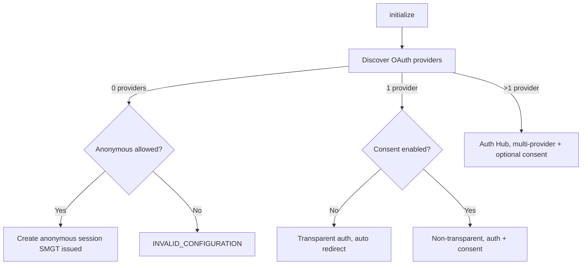
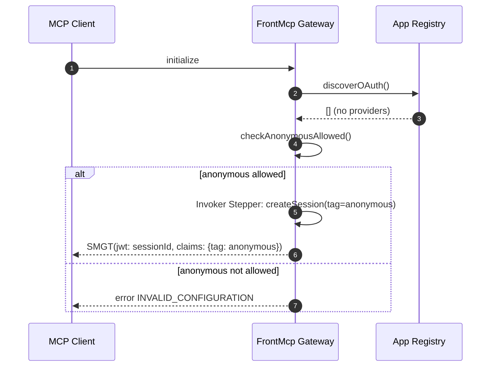
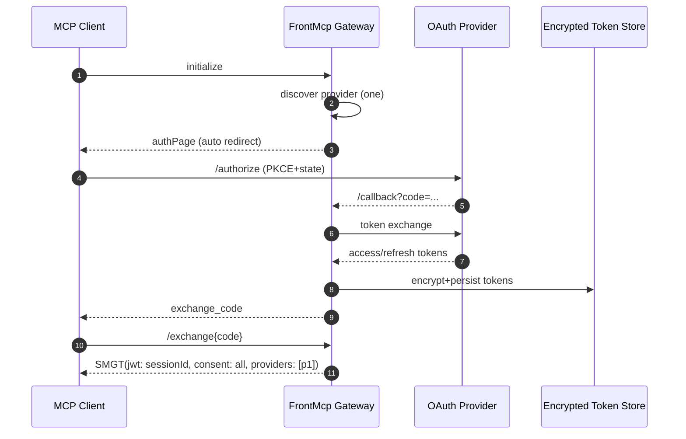
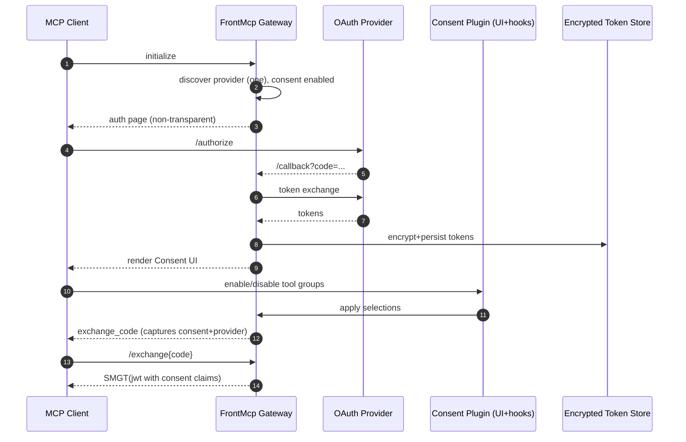
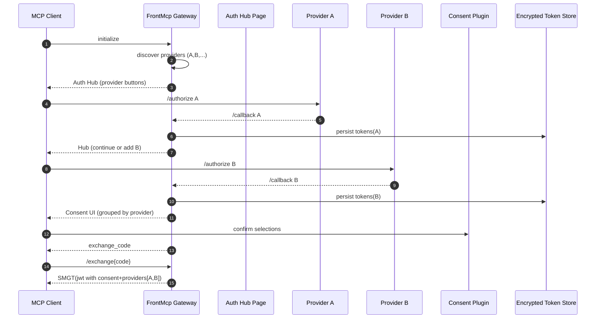

# FrontMcp Authentication & Consent — Requirements & Flow

This document refines the authentication/consent requirements and explains how the **FrontMcp Gateway** negotiates
sessions, OAuth, consent, and tool visibility for MCP clients (LLMs/browsers).

---

## TL;DR

- The MCP client initializes against FrontMcp. The gateway discovers OAuth providers from the App Registry
  (plugins/adapters/tools).
- If **anonymous** is allowed and no OAuth is configured/selected → create an **anonymous session**.
- If **no anonymous** and **no OAuth** → **configuration error**.
- If exactly **one** OAuth provider is discovered and **transparent auth** is enabled → auto-redirect → exchange → issue
  **SecureMcpGatewayToken (SMGT)** = **session id**.
- If **consent** is enabled, auth becomes **non‑transparent**: show a consent page (plugin) to approve tool groups;
  persist consent + tokens; issue **SMGT** with consent claims.
- If **multiple** OAuth providers exist → always **non‑transparent**: show an Auth Hub with provider buttons; optionally
  chain multiple authorizations; then (if enabled) show consent; finalize with **SMGT**.
- On **every tool invocation**, FrontMcp verifies **SMGT** and injects either **claims** or **full tokens** into the
  **Invoke Context** according to policy.
- Consent plugin injects: (1) a filter on tool listing; (2) an inline tool to request additional consent later; (3) a
  **`notifications/tools/list_changed`** JSON‑RPC notification to clients after consent changes.

---

## Glossary

- **App Registry**: Declarative registry of plugins/adapters/tools and their OAuth/consent metadata.
- **SecureMcpGatewayToken (SMGT)**: A signed JWT returned to the client after exchange. Used as the **MCP session id**.
  Carries references/hashes to decrypt server‑side OAuth tokens and includes consent claims.
- **Exchange Code**: Short‑lived, one‑time code the client sends to `/exchange` to obtain the SMGT. Tethers the stored
  encrypted tokens and consent state to the session being opened.
- **Encrypted Token Store**: Server‑side vault for provider tokens, encrypted at rest. Decryption key derived/guarded
  per SMGT claims + KMS/KEK.
- **Transparent Auth**: Auto‑redirect to the sole discovered OAuth provider (no user choice/auth hub or consent UI shown
  unless policy disables transparency).
- **Consent Plugin**: Pluggable UI + hooks that enforce tool visibility/enablement and inject consent into the exchange
  pipeline.

---

## Refined Requirements

1. **Client Initialization**

- (LLM/Browser) starts MCP client.
- Client sends `initialize` to FrontMcp.
- Gateway queries **App Registry** to discover available **OAuth providers** and tool metadata (grouping, consent
  groups).

2. **Anonymous Path**

- If **no OAuth** discovered and **anonymous** is **accepted** → run **Invoker Stepper** to create a session tagged
  `anonymous` and issue **SMGT**.
- If **no OAuth** and **anonymous** is **not accepted** → return an **Invalid Configuration** error.

3. **Single OAuth Provider Detected**

- **Default**: **Transparent Auth** if consent is disabled.

  - MCP client → FrontMcp auth page → immediate redirect to provider start.
  - Register callback at the gateway.
  - On callback, gateway obtains tokens, stores them encrypted, generates **Exchange Code**.
  - Gateway returns code to client; client calls `/exchange` and receives **SMGT**.

- **Non‑Transparent variant** (policy requires):

  - After provider callback, **direct exchange** at the gateway (no code to client), or still use the code → either way
    the tokens are stored encrypted.
  - If **consent is enabled**, show consent page before issuing **SMGT**.

4. **Multiple OAuth Providers Detected**

- **Always non‑transparent**. Show an **Auth Hub** with provider buttons.
- Each authorization round trips back to the hub showing:

  - **Continue** (finish and return to MCP), and
  - A list of **not‑yet‑authorized** providers that can **extend** the available tool set.

- Each provider has a stable **`providerId`** to map tools → provider.
- If **consent plugin** is enabled, show consent after the final provider returns, group tools by provider and custom
  consent groups, then issue **SMGT**.

5. **Consent**

- **Consent page** (plugin) is injected into the **exchange** flow when enabled.
- Users can **enable/disable** tool groups. Default: **all enabled**.
- Final exchange returns a **code** whose state contains: selected providers, encrypted token handles, and **consent
  selections**. `/exchange` yields **SMGT** whose claims include consent + provider mapping.
- Consent plugin injects an **inline tool** (e.g., `consent.manage`) that:

  - Lists **unconsented/disabled** tools.
  - Returns a **generated link** to re‑open consent UI.
  - When consent changes, the plugin updates stored consent for the **SMGT** and emits
    **`notifications/tools/list_changed`** so clients refresh `listTools`.

6. **Invocation & Policy**

- Every action validates **SMGT**. If valid, construct **Invoke Context**:

  - **Token Access**: `claims-only` (default) or `full-token` per tool/provider policy.
  - **Consent Filter**: only consented tools are visible in `listTools` and invocable.
  - **Provider Scoping**: tools declare which `providerId` they require; the gateway attaches the corresponding token
    claims (or token) to the context.

7. **Errors**

- No anonymous + no OAuth providers → `INVALID_CONFIGURATION` with remediation hint (“add OAuth or enable anonymous”).
- Expired/invalid Exchange Code → `EXCHANGE_INVALID_OR_EXPIRED`.
- Missing consent on a required tool → `CONSENT_REQUIRED`.

---

## Decision Tree (High‑Level)

---

## Sequence Diagrams

### 1) Anonymous Session

### 2) Single OAuth, Transparent (no consent)

### 3) Single OAuth with Consent (non‑transparent)

### 4) Multiple OAuth Providers (Auth Hub) + Consent

---

## Token & Session Model

### SecureMcpGatewayToken (SMGT)

- **Type**: JWT signed by the gateway (kid‑rotated). Acts as **MCP session id**.
- **Claims** (illustrative):

  - `sid`: session id
  - `sub`: client identifier
  - `providers`: `{ [providerId]: { handle: vaultRef, scopes: [...], at_hash: ..., expires_at: ... } }`
  - `consent`: `{ groupsEnabled: string[], toolsEnabled: string[] }`
  - `tag`: `anonymous` | `authenticated`
  - `policy`: `claims-only` | `full-token` (default: `claims-only`)
  - `nonce`, `iat`, `exp`

### Exchange Code

- **Short‑lived**, one‑time; binds the callback result (providers, consent selections) to the **/exchange** call from
  the same client.

### Encrypted Token Store

- Provider tokens never leave the server by default.
- Encrypted with KEK/HSM/KMS; per‑record DEK.
- SMGT contains **handles/hashes**, not raw tokens.

### Session Registry

- Sessions are keyed by **SMGT**.
- Reuse on repeated `initialize` if a valid SMGT is supplied.
- Anonymous sessions are tagged and filtered accordingly.

---

## Invocation Context & Tool Access

- On **every call** (`listTools`, `callTool`, etc.):

  1. Validate **SMGT**.
  2. Resolve **consent filter** → only consented tools appear/execute.
  3. Resolve **provider requirements** per tool:

  - Inject **claims** (default) or **full token** as configured:

    - Global default: `claims-only`.
    - Per‑tool override: `full-token` allowed/denied.
    - Per‑provider override: e.g., always claims‑only for high‑risk providers.

- **Consent Plugin Hooks**:

  - Intercept **/exchange** to bind consent → SMGT.
  - Inject a **virtual tool** (e.g., `consent.manage`) that returns:

    - List of **currently disabled/unconsented** tools.
    - A link to reopen consent UI for adjustments.

  - After changes, emit **`notifications/tools/list_changed`** to clients.

---

## Configuration Surface

- **App Registry**

  - Declares providers with `providerId`, scopes, callback URIs.
  - Annotates tools with `providerId` dependencies and `consentGroup` tags.

- **Gateway Options**

  - `allowAnonymous`: boolean.
  - `transparentAuth`: boolean | per-provider override (default: true if exactly one provider and consent disabled).
  - `consent.enabled`: boolean (forces non‑transparent).
  - `tokenAccessDefault`: `claims-only` | `full-token`.
  - `tokenAccessOverrides`: per tool/provider.

---

## API Shape (Illustrative)

- `POST /initialize` → `{ providers[], allowAnonymous, transparentAuth, consentEnabled }`
- `GET /auth/:providerId/start` (PKCE + state)
- `GET /auth/:providerId/callback` → stores tokens → returns **HTML** (either auto‑redirect with code or consent UI)
- `POST /consent/submit` → persists selections → returns **exchange_code**
- `POST /exchange` `{ code }` → `{ smgt }`
- JSON‑RPC Notification: `notifications/tools/list_changed` (optional `relatedRequestId`)

---

## Error Handling (Examples)

- `INVALID_CONFIGURATION`: no providers + anonymous disabled.
- `EXCHANGE_INVALID_OR_EXPIRED`: code replay/timeout.
- `CONSENT_REQUIRED`: attempt to call a tool not granted by consent.

---

## Security Considerations

- **PKCE + state** on all OAuth flows.
- **CSRF** protection on consent submissions.
- **JWT** signed with rotating keys; short‑lived **SMGT** with rolling refresh.
- **Token minimization**: default **claims-only** injection; never expose raw tokens unless explicitly configured.
- **Eventing**: `tools/list_changed` is broadcast only to sessions with matching `sid`.

---

## Example: Tool Listing & Consent Update

1. Client calls `listTools` with SMGT.
2. Gateway filters tools by consent and provider availability.
3. User runs `consent.manage` tool to enable more tools → gets a link.
4. User opens link, adjusts consent → plugin persists → emits `tools/list_changed`.
5. Client receives notification and refreshes `listTools`.

---

## Appendix: Policy Matrix

| Scenario                     | Providers | Consent | Transparency | Result                                                 |
| ---------------------------- | --------: | ------: | -----------: | ------------------------------------------------------ |
| Anonymous                    |         0 |     n/a |          n/a | Create anonymous session, issue SMGT                   |
| Misconfigured                |         0 |     n/a |          n/a | Error: INVALID_CONFIGURATION                           |
| Single Provider (no consent) |         1 |     Off |           On | Auto redirect, exchange, SMGT                          |
| Single Provider (consent)    |         1 |      On |          Off | Auth → Consent → Exchange → SMGT                       |
| Multiple Providers           |        >1 |     Any |          Off | Auth Hub (optionally auth multiple) → (Consent) → SMGT |

---

## Notes

- The **Invoker Stepper** encapsulates session creation mechanics for anonymous and authenticated paths.
- Provider‑specific tool groupings are driven by `providerId` metadata in the App Registry.
- Clients should treat **SMGT** as the **session id** for all MCP requests.
