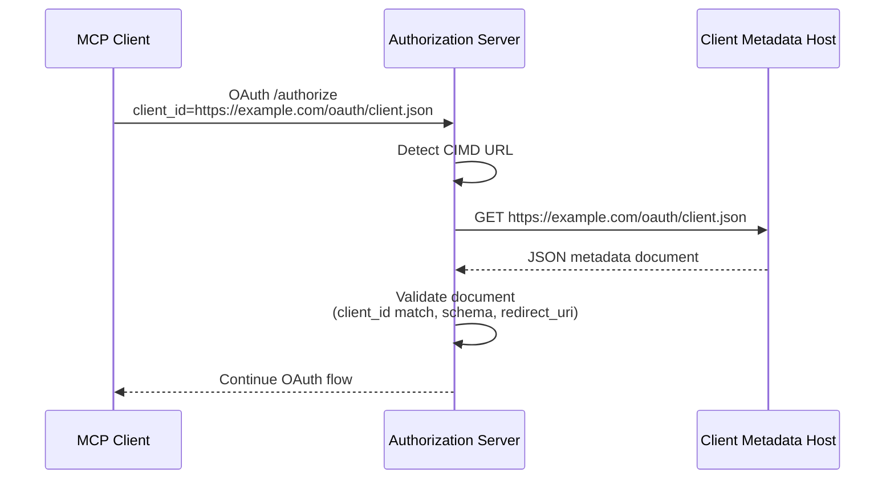
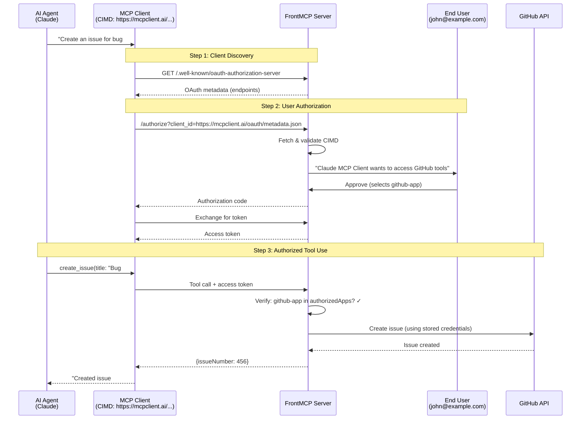
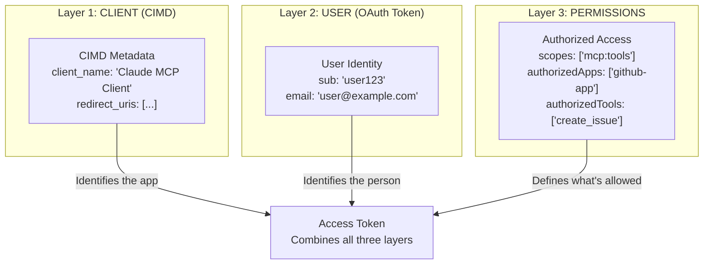
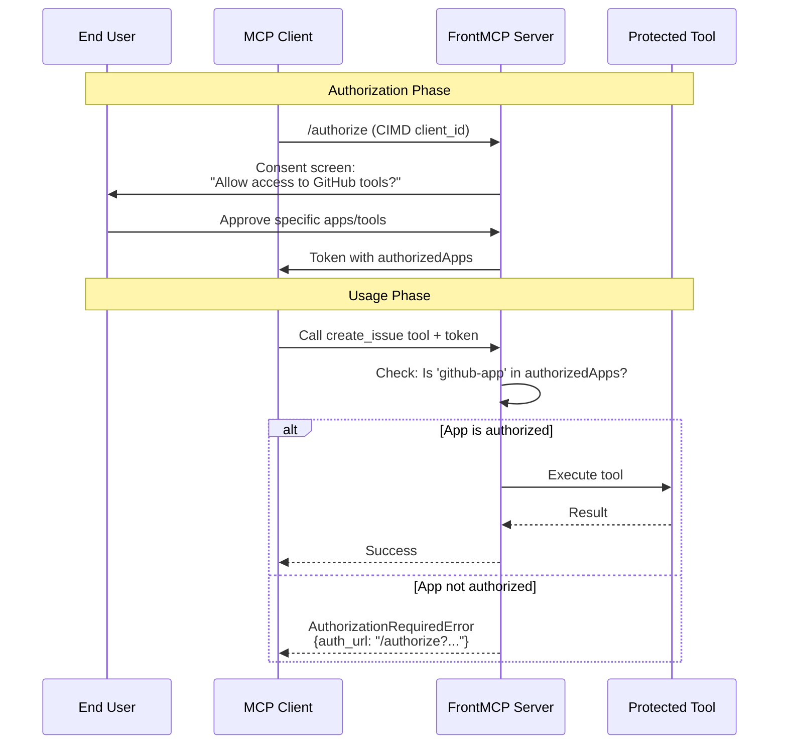

# CIMD - Client ID Metadata Documents

OAuth Client ID Metadata Documents implementation per [draft-ietf-oauth-client-id-metadata-document-00](https://datatracker.ietf.org/doc/html/draft-ietf-oauth-client-id-metadata-document-00).

## Overview

CIMD enables MCP clients to use **HTTPS URLs as client identifiers**. Instead of pre-registering clients with the authorization server, clients can host their metadata at a URL, and that URL becomes their `client_id`.

This enables:

- **Self-service client registration** - Clients can publish their own metadata without coordinating with the authorization server
- **Verifiable client identity** - The authorization server can verify the client by fetching the metadata from the URL
- **Decentralized trust** - Metadata is hosted by the client, not stored centrally

## How It Works



**Flow:**

1. Client sends OAuth request with `client_id` set to an HTTPS URL (e.g., `https://example.com/oauth/client-metadata.json`)
2. Authorization server detects this is a CIMD URL and fetches the document
3. Client's server returns a JSON metadata document
4. Authorization server validates the document (schema, client_id match, redirect_uri)
5. OAuth flow continues with the verified client metadata

## Real-World Example: AI Agent Authorization

This example shows the complete flow when an AI Agent wants to use protected MCP tools.

### The Scenario

- **AI Agent**: Claude wants to create a GitHub issue
- **MCP Client**: "Claude MCP Client" publishes metadata at `https://mcpclient.ai/oauth/metadata.json`
- **User**: John (john@example.com) must approve the access
- **Protected Tool**: `create_issue` in the `github-app`

### Complete Authorization Flow



### What Each Layer Contains

**Layer 1 - CLIENT (CIMD at https://mcpclient.ai/oauth/metadata.json):**

```json
{
  "client_id": "https://mcpclient.ai/oauth/metadata.json",
  "client_name": "Claude MCP Client",
  "redirect_uris": ["https://mcpclient.ai/callback"],
  "logo_uri": "https://mcpclient.ai/logo.png"
}
```

**Layer 2 - USER (from OAuth token):**

```json
{
  "sub": "user_john_123",
  "email": "john@example.com",
  "name": "John Doe"
}
```

**Layer 3 - PERMISSIONS (from consent):**

```json
{
  "scope": "mcp:tools",
  "authorized_apps": ["github-app"],
  "authorized_tools": ["create_issue", "list_repos"]
}
```

### Example FrontMCP Server Configuration

```typescript
import { FrontMcpServer } from '@frontmcp/sdk';

const server = new FrontMcpServer({
  auth: {
    mode: 'orchestrated',
    cimd: {
      enabled: true,
      security: {
        blockPrivateIPs: true,
        allowedDomains: ['*.verified-clients.mcp'],
      },
    },
  },
});
```

### Why This Matters

- **No Pre-Registration Required**: The MCP client doesn't need to register with every MCP server it wants to use
- **Verifiable Identity**: The authorization server fetches and validates the client's metadata from its published URL
- **User Transparency**: The consent screen shows the verified client name and information from the metadata document
- **Decentralized Trust**: Each MCP client controls its own metadata, enabling a decentralized ecosystem

## Understanding the Identity Layers

CIMD is often confused with user authentication, but it serves a different purpose. FrontMCP uses a **three-layer identity model**:

### The Three Layers

| Layer           | What It Identifies         | How It's Represented                                        | Purpose                                 |
| --------------- | -------------------------- | ----------------------------------------------------------- | --------------------------------------- |
| **CLIENT**      | The MCP client application | CIMD URL (e.g., `https://mcpclient.ai/oauth/metadata.json`) | Verifies which app is requesting access |
| **USER**        | The person authorizing     | OAuth token claims (`sub`, `name`, `email`)                 | Identifies who is granting permissions  |
| **PERMISSIONS** | What can be accessed       | OAuth scopes + authorized apps/tools                        | Controls what actions are allowed       |

### Visual Representation



### Key Insight: CIMD ≠ User Identity

- **CIMD identifies the CLIENT APPLICATION** (e.g., "Claude MCP Client")
- **OAuth token identifies the USER** (e.g., "john@example.com")
- **The token is bound to BOTH**: issued for a specific user via a specific client

## CIMD vs Standard OAuth

CIMD changes **how clients are registered**, not the OAuth flow itself. You still get an access token with user identity.

| Aspect                  | Standard OAuth                            | CIMD                                                   |
| ----------------------- | ----------------------------------------- | ------------------------------------------------------ |
| **Client Registration** | Pre-register with server, get `client_id` | Self-host metadata at a URL                            |
| **Client ID Format**    | Opaque string (`client_abc123`)           | HTTPS URL (`https://mcpclient.ai/oauth/metadata.json`) |
| **Metadata Storage**    | On authorization server's database        | Hosted by the client                                   |
| **Adding New Clients**  | Requires server admin action              | Client just publishes JSON file                        |
| **Token Contains**      | User identity + scopes                    | Same! User identity + scopes                           |
| **Who Approves**        | End user via consent screen               | Same! End user via consent screen                      |

### What Stays the Same

The core OAuth flow is identical:

1. User authenticates
2. User consents to permissions
3. Token is issued with user identity and scopes
4. Token is used to call protected tools

### What Changes

Only the **client identification** step:

- **Standard**: Server looks up `client_id` in its database
- **CIMD**: Server fetches metadata from the `client_id` URL

## Tool-Specific Permissions

When a tool requires specific permissions, the flow works like this:

### How Permissions Are Granted



### Token Structure with Tool Permissions

```json
{
  "sub": "user123",
  "client_id": "https://mcpclient.ai/oauth/metadata.json",
  "scope": "mcp:tools",
  "authorized_apps": {
    "github-app": {
      "id": "github-app",
      "toolIds": ["create_issue", "list_repos"]
    }
  },
  "authorized_tool_ids": ["create_issue", "list_repos"]
}
```

### Progressive Authorization

If a tool requires authorization the user hasn't granted yet:

1. Tool call returns `AuthorizationRequiredError` with an `auth_url`
2. Client redirects user to `auth_url`
3. User grants additional permissions
4. Client retries the tool call with updated token

## Configuration

```typescript
import { CimdService } from '@frontmcp/sdk';

const cimdService = new CimdService(logger, {
  // Enable/disable CIMD support (default: true)
  enabled: true,

  // Cache settings
  cache: {
    defaultTtlMs: 3600_000, // 1 hour default
    maxTtlMs: 86400_000, // 24 hours max
    minTtlMs: 60_000, // 1 minute min
  },

  // Security settings
  security: {
    blockPrivateIPs: true, // SSRF protection (default: true)
    allowedDomains: ['trusted.com'], // Optional allow-list
    blockedDomains: ['blocked.com'], // Optional block-list
    warnOnLocalhostRedirects: true, // Warn on dev clients (default: true)
  },

  // Network settings
  network: {
    timeoutMs: 5000, // 5 second timeout
    maxResponseSizeBytes: 65536, // 64KB max response
  },
});
```

### Configuration Options

| Option                              | Default               | Description                                  |
| ----------------------------------- | --------------------- | -------------------------------------------- |
| `enabled`                           | `true`                | Enable CIMD support                          |
| `cache.defaultTtlMs`                | `3600000` (1 hour)    | Default cache TTL when no headers present    |
| `cache.maxTtlMs`                    | `86400000` (24 hours) | Maximum TTL even if server suggests longer   |
| `cache.minTtlMs`                    | `60000` (1 minute)    | Minimum TTL even if server suggests shorter  |
| `security.blockPrivateIPs`          | `true`                | Block private/internal IP addresses          |
| `security.allowedDomains`           | `undefined`           | If set, only these domains can host CIMD     |
| `security.blockedDomains`           | `undefined`           | These domains cannot host CIMD               |
| `security.warnOnLocalhostRedirects` | `true`                | Log warning for localhost-only redirect URIs |
| `network.timeoutMs`                 | `5000` (5s)           | Request timeout                              |
| `network.maxResponseSizeBytes`      | `65536` (64KB)        | Maximum response body size                   |

## Client Metadata Document Format

The metadata document is a JSON file hosted at the client's URL:

```json
{
  "client_id": "https://example.com/oauth/client-metadata.json",
  "client_name": "My MCP Client",
  "redirect_uris": ["https://example.com/callback", "http://localhost:8080/callback"],
  "token_endpoint_auth_method": "none",
  "grant_types": ["authorization_code"],
  "response_types": ["code"],
  "client_uri": "https://example.com",
  "logo_uri": "https://example.com/logo.png",
  "tos_uri": "https://example.com/terms",
  "policy_uri": "https://example.com/privacy",
  "scope": "read write",
  "contacts": ["admin@example.com"]
}
```

### Required Fields

| Field           | Type       | Description                                                 |
| --------------- | ---------- | ----------------------------------------------------------- |
| `client_id`     | `string`   | **MUST** match the URL from which this document was fetched |
| `client_name`   | `string`   | Human-readable name of the client                           |
| `redirect_uris` | `string[]` | Array of allowed redirect URIs (at least one required)      |

### Optional Fields

| Field                        | Type       | Default                  | Description                                                                         |
| ---------------------------- | ---------- | ------------------------ | ----------------------------------------------------------------------------------- |
| `token_endpoint_auth_method` | `string`   | `"none"`                 | Auth method: `none`, `client_secret_basic`, `client_secret_post`, `private_key_jwt` |
| `grant_types`                | `string[]` | `["authorization_code"]` | OAuth grant types                                                                   |
| `response_types`             | `string[]` | `["code"]`               | OAuth response types                                                                |
| `client_uri`                 | `string`   | -                        | URL of the client's home page                                                       |
| `logo_uri`                   | `string`   | -                        | URL of the client's logo image                                                      |
| `jwks_uri`                   | `string`   | -                        | URL of the client's JWKS (for `private_key_jwt`)                                    |
| `jwks`                       | `object`   | -                        | Inline JWKS `{ keys: [...] }`                                                       |
| `tos_uri`                    | `string`   | -                        | URL of the terms of service                                                         |
| `policy_uri`                 | `string`   | -                        | URL of the privacy policy                                                           |
| `scope`                      | `string`   | -                        | Requested OAuth scopes                                                              |
| `contacts`                   | `string[]` | -                        | Array of contact email addresses                                                    |
| `software_statement`         | `string`   | -                        | Signed JWT software statement                                                       |
| `software_id`                | `string`   | -                        | Unique identifier for the client software                                           |
| `software_version`           | `string`   | -                        | Version of the client software                                                      |

## Security Features

### SSRF Protection

When `security.blockPrivateIPs` is enabled (default), the following addresses are blocked:

**IPv4 Blocked Ranges:**
| Range | Description |
|-------|-------------|
| `127.0.0.0/8` | Loopback addresses |
| `10.0.0.0/8` | Private Class A |
| `172.16.0.0/12` | Private Class B (172.16.x.x - 172.31.x.x) |
| `192.168.0.0/16` | Private Class C |
| `169.254.0.0/16` | Link-local addresses |
| `0.0.0.0/8` | Current network |
| `224.0.0.0/4` | Multicast (224.x.x.x - 239.x.x.x) |
| `255.255.255.255` | Broadcast |

**IPv6 Blocked Ranges:**
| Range | Description |
|-------|-------------|
| `::1` | Loopback |
| `::` | Unspecified |
| `fe80::/10` | Link-local |
| `fc00::/7` | Unique local (ULA) |
| `::ffff:x.x.x.x` | IPv4-mapped (checked against IPv4 rules) |

**Hostname Blocking:**

- `localhost`
- `localhost.localdomain`
- `*.localhost`

### Domain Allow/Block Lists

```typescript
// Only allow specific trusted domains
security: {
  allowedDomains: ['trusted.example.com', '*.mycompany.com'],
}

// Block specific domains
security: {
  blockedDomains: ['malicious.com', '*.untrusted.org'],
}
```

Domain matching supports:

- **Exact match**: `example.com` matches only `example.com`
- **Subdomain match**: `example.com` also matches `sub.example.com`
- **Wildcard**: `*.example.com` matches `sub.example.com` and `example.com`

### Response Size Limits

Documents larger than `maxResponseSizeBytes` (default 64KB) are rejected to prevent resource exhaustion attacks.

### Request Timeouts

Requests that take longer than `timeoutMs` (default 5 seconds) are aborted.

## HTTP Caching

The CIMD service respects HTTP caching headers to minimize network requests:

### Cache-Control Support

```
Cache-Control: max-age=3600        → Cache for 1 hour
Cache-Control: s-maxage=7200       → Cache for 2 hours (shared cache)
Cache-Control: no-cache            → Use minimum TTL
Cache-Control: no-store            → Use minimum TTL
```

The `Age` header is subtracted from `max-age` if present.

### Conditional Requests

When a cached entry has an `ETag` or `Last-Modified` header, the service sends conditional requests:

```
If-None-Match: "abc123"            → Server returns 304 if unchanged
If-Modified-Since: Wed, 01 Jan...  → Server returns 304 if unchanged
```

A `304 Not Modified` response refreshes the cache TTL without re-downloading the document.

### TTL Bounds

The computed TTL is always clamped to the configured bounds:

```typescript
finalTtl = Math.max(minTtlMs, Math.min(maxTtlMs, serverSuggestedTtl));
```

## API Reference

### CimdService

```typescript
class CimdService {
  // Check if a client_id is a CIMD URL
  isCimdClientId(clientId: string): boolean;

  // Resolve a client_id to its metadata document
  async resolveClientMetadata(clientId: string): Promise<CimdResolutionResult>;

  // Validate that a redirect_uri is registered
  validateRedirectUri(redirectUri: string, metadata: ClientMetadataDocument): void;

  // Clear cache (specific client or all)
  clearCache(clientId?: string): void;

  // Get cache statistics
  getCacheStats(): { size: number };

  // Whether CIMD is enabled
  get enabled(): boolean;
}
```

### Exported Types

```typescript
// Document schema and type
import {
  clientMetadataDocumentSchema,
  type ClientMetadataDocument,
  type ClientMetadataDocumentInput,
} from '@frontmcp/sdk';

// Configuration schemas and types
import {
  cimdConfigSchema,
  cimdCacheConfigSchema,
  cimdSecurityConfigSchema,
  cimdNetworkConfigSchema,
  type CimdConfig,
  type CimdConfigInput,
  type CimdCacheConfig,
  type CimdSecurityConfig,
  type CimdNetworkConfig,
} from '@frontmcp/sdk';

// Resolution result
import { type CimdResolutionResult } from '@frontmcp/sdk';

// Cache types
import { CimdCache, type CimdCacheEntry, type CacheableHeaders } from '@frontmcp/sdk';
```

### Utility Functions

```typescript
import {
  isCimdClientId, // Check if string is a CIMD URL
  validateClientIdUrl, // Validate URL (throws on error)
  checkSsrfProtection, // Check hostname against SSRF rules
  hasOnlyLocalhostRedirectUris, // Check for dev-only redirects
} from '@frontmcp/sdk';
```

## Error Handling

### Error Classes

| Error                       | HTTP Status | Description                                          |
| --------------------------- | ----------- | ---------------------------------------------------- |
| `InvalidClientIdUrlError`   | 400         | Invalid CIMD URL format (HTTP, missing path, etc.)   |
| `CimdFetchError`            | 502         | Failed to fetch document (network error, HTTP error) |
| `CimdValidationError`       | 400         | Document failed schema validation                    |
| `CimdClientIdMismatchError` | 400         | `client_id` in document doesn't match URL            |
| `CimdSecurityError`         | 403         | URL blocked by security policy                       |
| `RedirectUriMismatchError`  | 400         | `redirect_uri` not registered for client             |
| `CimdResponseTooLargeError` | 502         | Response exceeds size limit                          |
| `CimdDisabledError`         | 400         | CIMD disabled but CIMD client_id used                |

### Example Error Handling

```typescript
import { CimdError, InvalidClientIdUrlError, CimdSecurityError, CimdFetchError } from '@frontmcp/sdk';

try {
  const result = await cimdService.resolveClientMetadata(clientId);
} catch (error) {
  if (error instanceof InvalidClientIdUrlError) {
    // Invalid URL format
    console.error('Invalid client_id URL:', error.reason);
  } else if (error instanceof CimdSecurityError) {
    // Blocked by security policy
    console.error('Security error:', error.securityReason);
  } else if (error instanceof CimdFetchError) {
    // Network/HTTP error
    console.error('Fetch failed:', error.httpStatus);
  } else if (error instanceof CimdError) {
    // Other CIMD error
    console.error('CIMD error:', error.message);
  }
}
```

## Usage Example

```typescript
import { CimdService } from '@frontmcp/sdk';

// In your OAuth authorize flow
async function handleAuthorizeRequest(clientId: string, redirectUri: string) {
  const cimd = new CimdService(logger);

  // Check if this is a CIMD client
  if (!cimd.isCimdClientId(clientId)) {
    // Traditional client_id - look up in database
    return lookupClient(clientId);
  }

  // Resolve CIMD metadata
  const result = await cimd.resolveClientMetadata(clientId);

  if (!result.isCimdClient || !result.metadata) {
    throw new Error('Failed to resolve CIMD client');
  }

  // Validate redirect_uri
  cimd.validateRedirectUri(redirectUri, result.metadata);

  // Return client info for the authorize flow
  return {
    clientId: result.metadata.client_id,
    clientName: result.metadata.client_name,
    redirectUri: redirectUri,
    logoUri: result.metadata.logo_uri,
  };
}
```
