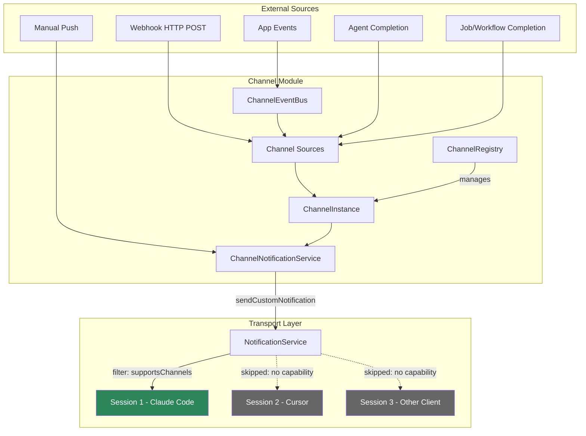
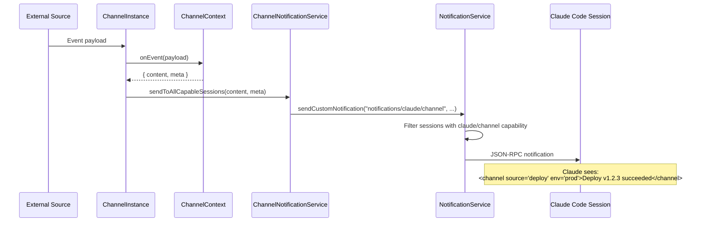
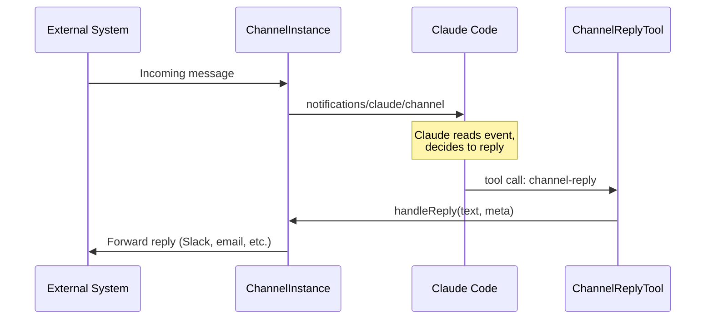
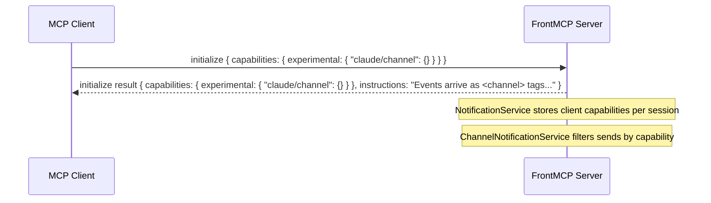
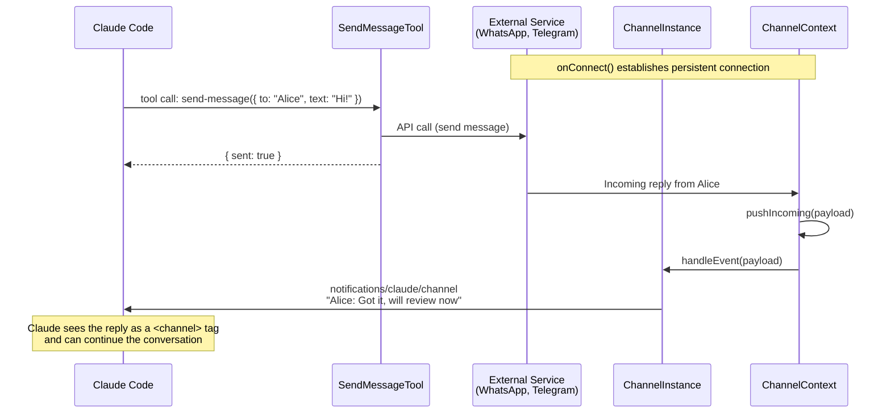
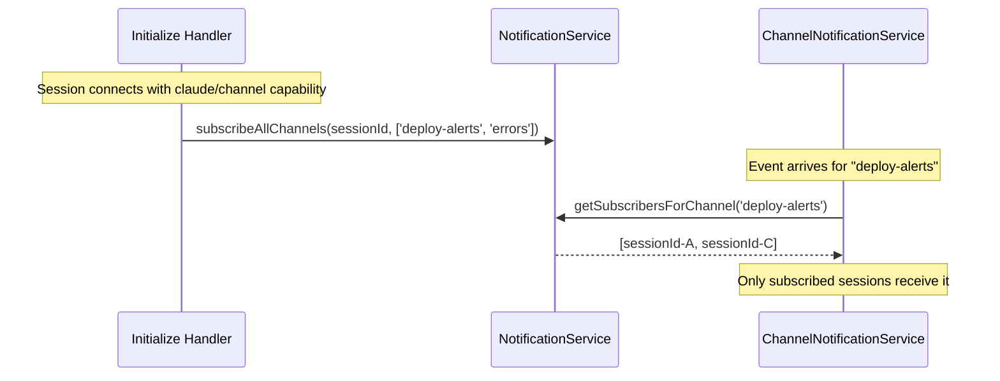

# FrontMCP Channels

Push-based notification channels for Claude Code and other MCP clients that support the `notifications/claude/channel` experimental extension.

## Architecture



## Notification Flow



## Two-Way Communication



## Capability Handshake



## Service Connector Pattern



Service connectors maintain persistent connections to external messaging services.
Claude sends messages via channel-contributed tools and receives responses as channel notifications.

```typescript
@Channel({
  name: 'whatsapp',
  source: { type: 'service', service: 'whatsapp-business' },
  tools: [SendWhatsAppTool], // Claude calls this to send messages
  twoWay: true,
})
class WhatsAppChannel extends ChannelContext {
  private client: WhatsAppClient;

  async onConnect(): Promise<void> {
    this.client = new WhatsAppClient(process.env['WA_TOKEN']);
    this.client.on('message', (msg) => this.pushIncoming(msg));
    await this.client.connect();
  }

  async onDisconnect(): Promise<void> {
    await this.client.disconnect();
  }

  async onEvent(payload: unknown): Promise<ChannelNotification> {
    const msg = payload as { from: string; text: string; chatId: string };
    return { content: `${msg.from}: ${msg.text}`, meta: { chat_id: msg.chatId } };
  }
}
```

## Module Structure

```
channel/
├── index.ts                           # Barrel exports
├── channel.events.ts                  # ChannelEmitter + ChannelChangeEvent
├── channel.instance.ts                # Concrete ChannelEntry implementation
├── channel.registry.ts                # Registry (extends RegistryAbstract)
├── channel.types.ts                   # IndexedChannel row type
├── channel.utils.ts                   # normalizeChannel() helpers
├── channel-notification.service.ts    # Sends notifications/claude/channel
├── channel-scope.helper.ts            # Orchestrates registration in Scope
├── flows/
│   ├── send-channel-notification.flow.ts  # Programmatic send flow
│   └── list-channels.flow.ts              # Health/status listing flow
├── reply/
│   ├── channel-reply.tool.ts          # Auto-registered reply tool
│   └── reply.types.ts                 # Reply input schema
└── sources/
    ├── index.ts                       # Source barrel
    ├── agent-completion.source.ts     # Subscribes to AgentEmitter
    ├── job-completion.source.ts       # Subscribes to JobEmitter
    ├── webhook.source.ts              # HTTP POST middleware
    └── app-event.source.ts            # In-process ChannelEventBus
```

## How It Works

### 1. Declaration

Channels are declared using `@Channel()` decorator or `channel()` function builder:

```typescript
@Channel({
  name: 'deploy-alerts',
  description: 'CI/CD deployment notifications',
  source: { type: 'webhook', path: '/hooks/deploy' },
  twoWay: true,
  meta: { team: 'platform' },
})
class DeployChannel extends ChannelContext {
  async onEvent(payload: unknown): Promise<ChannelNotification> {
    const data = payload as { body: { status: string; version: string } };
    return {
      content: `Deploy ${data.body.status}: ${data.body.version}`,
      meta: { env: 'production' },
    };
  }

  async onReply(reply: string): Promise<void> {
    await sendToSlack(reply);
  }
}
```

### 2. Registration

Channels are registered via app metadata:

```typescript
@App({
  name: 'DevOps',
  channels: [DeployChannel, ErrorChannel],
})
class DevOpsApp {}
```

And enabled at the server level:

```typescript
@FrontMcp({
  info: { name: 'my-server', version: '1.0.0' },
  apps: [DevOpsApp],
  channels: { enabled: true },
})
class Server {}
```

### 3. Scope Initialization

During `Scope.initialize()` (Batch 3, after NotificationService is ready):

1. `registerChannelCapabilities()` creates the `ChannelRegistry`
2. Each `ChannelInstance` gets a reference to `ChannelNotificationService`
3. Sources are wired: agent emitters, job emitters, event bus subscriptions
4. If any channel is `twoWay`, the `ChannelReplyTool` is auto-registered in `ToolRegistry`
5. Channel flows are registered in `FlowRegistry`

### 4. Capability Advertisement

The `ChannelRegistry.getCapabilities()` returns:

```json
{ "experimental": { "claude/channel": {} } }
```

This is merged into the MCP server's capabilities during transport setup (local adapter, stdio, unix socket).

### 5. Session-Scoped Notification Delivery

Channel notifications are **session-scoped** — each session only receives notifications
from channels it is subscribed to. This prevents data leaking between connected agents.



When an event arrives:

1. Source triggers `ChannelInstance.handleEvent(payload)`
2. Instance creates a `ChannelContext` and calls `onEvent(payload)`
3. The returned `ChannelNotification` is merged with static metadata
4. `ChannelNotificationService.sendToSubscribedSessions()` is called
5. `NotificationService.getSubscribersForChannel(channelName)` returns only subscribed sessions
6. Each subscribed session is also checked for `supportsChannels()` capability
7. Only subscribed + capable sessions receive the JSON-RPC notification

**Auto-subscription:** When a session initializes with `experimental: { 'claude/channel': {} }`
capability, it is automatically subscribed to all available channels. This happens in the
`initialize-request.handler.ts` (HTTP) and `runStdio()` (stdio).

**Manual subscription:** For fine-grained control, use `scope.notifications.subscribeChannel(sessionId, channelName)`.

**Unsubscription:** Channel subscriptions are cleaned up automatically when a session disconnects
(`unregisterServer()` removes all resource and channel subscriptions).

## Source Types

| Source             | Trigger                                   | Config                                                    |
| ------------------ | ----------------------------------------- | --------------------------------------------------------- |
| `webhook`          | HTTP POST to configured path              | `{ type: 'webhook', path: '/hooks/deploy' }`              |
| `app-event`        | In-process event bus emit                 | `{ type: 'app-event', event: 'error' }`                   |
| `agent-completion` | Agent finishes execution                  | `{ type: 'agent-completion', agentIds?: ['reviewer'] }`   |
| `job-completion`   | Job/workflow completes                    | `{ type: 'job-completion', jobNames?: ['daily-report'] }` |
| `service`          | Persistent connection to external service | `{ type: 'service', service: 'whatsapp-business' }`       |
| `manual`           | Programmatic push                         | `{ type: 'manual' }`                                      |

## Wire Protocol

Channel notifications use the `notifications/claude/channel` JSON-RPC method:

```json
{
  "jsonrpc": "2.0",
  "method": "notifications/claude/channel",
  "params": {
    "content": "Deploy succeeded: v1.2.3",
    "meta": {
      "source": "deploy-alerts",
      "team": "platform",
      "env": "production"
    }
  }
}
```

In Claude Code, this renders as:

```xml
<channel source="deploy-alerts" team="platform" env="production">
Deploy succeeded: v1.2.3
</channel>
```

## Key Classes

| Class                        | Purpose                                                             |
| ---------------------------- | ------------------------------------------------------------------- |
| `ChannelContext`             | Abstract base for channel handlers (extends `ExecutionContextBase`) |
| `ChannelEntry`               | Abstract entry in registry (extends `BaseEntry`)                    |
| `ChannelInstance`            | Concrete entry with event handling and notification push            |
| `ChannelRegistry`            | Manages channel entries, provides capabilities                      |
| `ChannelNotificationService` | Sends `notifications/claude/channel` to capable sessions            |
| `ChannelEmitter`             | Pub/sub for registry change events                                  |
| `ChannelEventBus`            | In-process event bus for `app-event` sources                        |
| `ChannelReplyTool`           | Auto-registered tool for two-way channels                           |
