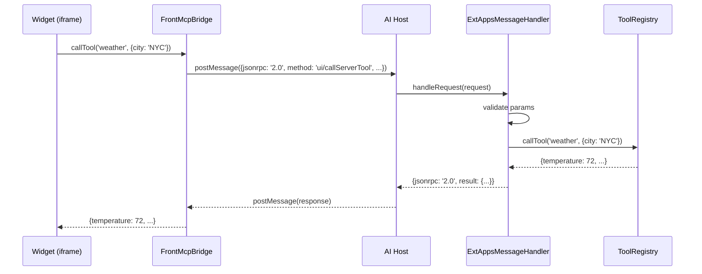
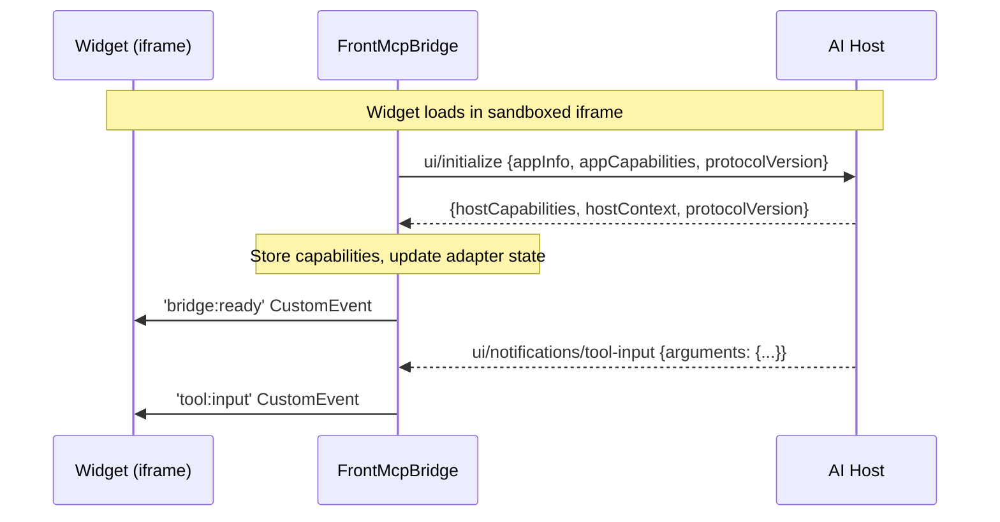

# MCP Apps (ext-apps) Module

This directory implements server-side support for the MCP Apps Extension protocol (SEP-1865). It provides types and handlers for bidirectional communication between embedded widgets and AI hosts.

The README is intended for contributors who want to integrate ext-apps support, handle widget-to-host communication, or extend the message handling system.

## Overview

MCP Apps (ext-apps) is a standardized protocol for embedding interactive widgets in AI host applications. Unlike traditional tool responses that return static data, ext-apps widgets can:

- Call server tools from within the widget (bidirectional communication)
- Update the model context with widget state
- Register widget-defined tools dynamically
- Request display mode changes (inline, fullscreen, pip)
- Send structured logs to the host

Key components:

| Component       | Purpose                                | Location              |
| --------------- | -------------------------------------- | --------------------- |
| Types           | JSON-RPC message definitions           | `ext-apps.types.ts`   |
| Message Handler | Server-side request routing            | `ext-apps.handler.ts` |
| IIFE Adapter    | Client-side bridge runtime (in uipack) | `@frontmcp/uipack`    |
| TS Adapter      | TypeScript client adapter (in ui)      | `@frontmcp/ui`        |

## Architecture

```text
┌─────────────────────────────────────────────────────────────────┐
│  AI Host (Claude, ChatGPT, etc.)                                │
│  ┌───────────────────────────────────────────────────────────┐  │
│  │  MCP Server (FrontMCP SDK)                                │  │
│  │  ┌─────────────────────────────────────────────────────┐  │  │
│  │  │  ExtAppsMessageHandler                              │  │  │
│  │  │  - Routes ui/* JSON-RPC requests                    │  │  │
│  │  │  - Validates parameters                             │  │  │
│  │  │  - Proxies tool calls to ToolRegistry               │  │  │
│  │  └─────────────────────────────────────────────────────┘  │  │
│  └───────────────────────────────────────────────────────────┘  │
│                              ▲                                   │
│                              │ JSON-RPC 2.0 over postMessage     │
│                              ▼                                   │
│  ┌───────────────────────────────────────────────────────────┐  │
│  │  Widget Iframe (sandboxed)                                │  │
│  │  ┌─────────────────────────────────────────────────────┐  │  │
│  │  │  FrontMcpBridge (IIFE runtime)                      │  │  │
│  │  │  - ExtAppsAdapter for postMessage communication     │  │  │
│  │  │  - Handles ui/initialize handshake                  │  │  │
│  │  │  - Exposes callTool, updateModelContext, etc.       │  │  │
│  │  └─────────────────────────────────────────────────────┘  │  │
│  └───────────────────────────────────────────────────────────┘  │
└─────────────────────────────────────────────────────────────────┘
```

**Data Flow:**

1. **Widget Initialization**: Widget sends `ui/initialize` with capabilities
2. **Host Response**: Server responds with host capabilities and context
3. **Widget Actions**: Widget sends requests (callServerTool, updateModelContext, etc.)
4. **Host Notifications**: Server sends notifications (tool-input, tool-result, context-changed)

## JSON-RPC Methods

### Widget → Host Requests

| Method                  | Purpose                         | Host Capability Required              |
| ----------------------- | ------------------------------- | ------------------------------------- |
| `ui/initialize`         | Protocol handshake              | (always supported)                    |
| `ui/callServerTool`     | Invoke a server-side MCP tool   | `serverToolProxy`                     |
| `ui/updateModelContext` | Update model context with state | `modelContextUpdate`                  |
| `ui/openLink`           | Request to open a URL           | `openLink`                            |
| `ui/setDisplayMode`     | Change display mode             | Handler context must provide callback |
| `ui/close`              | Close the widget                | Handler context must provide callback |
| `ui/log`                | Send log message to host        | `logging`                             |
| `ui/registerTool`       | Register widget-defined tool    | `widgetTools`                         |
| `ui/unregisterTool`     | Unregister widget-defined tool  | `widgetTools`                         |

### Host → Widget Notifications

| Method                                  | Purpose                     |
| --------------------------------------- | --------------------------- |
| `ui/notifications/tool-input`           | Tool arguments available    |
| `ui/notifications/tool-input-partial`   | Streaming tool input update |
| `ui/notifications/tool-result`          | Tool execution result       |
| `ui/notifications/host-context-changed` | Theme, display mode changed |
| `ui/notifications/cancelled`            | Operation was cancelled     |

## Files in this folder

### Core Files

- **ext-apps.types.ts** - Complete type definitions for all JSON-RPC messages, capabilities, and error codes
- **ext-apps.handler.ts** - Message handler that routes and validates widget requests
- **index.ts** - Barrel exports for the module

## Core Types

### ExtAppsHostCapabilities

Capabilities advertised by the host during initialization:

```typescript
interface ExtAppsHostCapabilities {
  serverToolProxy?: boolean; // Host can proxy tool calls
  openLink?: boolean; // Host can open links
  modelContextUpdate?: boolean; // Host supports context updates
  widgetTools?: boolean; // Host supports widget-defined tools
  displayModes?: ('inline' | 'fullscreen' | 'pip')[];
  logging?: boolean; // Host supports widget logging
}
```

### ExtAppsWidgetCapabilities

Capabilities advertised by the widget during initialization:

```typescript
interface ExtAppsWidgetCapabilities {
  tools?: {
    listChanged?: boolean; // Widget can emit tool list changes
  };
  supportsPartialInput?: boolean; // Widget handles streaming input
}
```

### Error Codes

Standard JSON-RPC error codes for ext-apps:

```typescript
const EXT_APPS_ERROR_CODES = {
  PARSE_ERROR: -32700, // Invalid JSON
  INVALID_REQUEST: -32600, // Not a valid Request object
  METHOD_NOT_FOUND: -32601, // Method does not exist
  INVALID_PARAMS: -32602, // Invalid parameters
  INTERNAL_ERROR: -32603, // Internal error
  TOOL_NOT_FOUND: -32001, // Tool not found
  TOOL_EXECUTION_FAILED: -32002, // Tool execution failed
  NOT_SUPPORTED: -32003, // Feature not supported
  CANCELLED: -32004, // Operation cancelled
};
```

## ExtAppsMessageHandler

The main server-side handler for processing widget requests:

```typescript
import { createExtAppsMessageHandler } from '@frontmcp/sdk';

const handler = createExtAppsMessageHandler({
  context: {
    sessionId: 'session-123',
    logger: scopeLogger,
    callTool: async (name, args) => {
      // Route to tool call flow
      return scope.runFlow('tools:call-tool', {
        request: { method: 'tools/call', params: { name, arguments: args } },
        ctx: { authInfo: { sessionId: 'session-123' } },
      });
    },
    updateModelContext: async (context, merge) => {
      // Update model context
    },
  },
  hostCapabilities: {
    serverToolProxy: true,
    modelContextUpdate: true,
    logging: true,
  },
});

// Handle incoming JSON-RPC request
const response = await handler.handleRequest(request);
```

### Handler Context

The handler context provides callbacks for routing requests:

```typescript
interface ExtAppsHandlerContext {
  sessionId: string;
  logger: FrontMcpLogger;
  callTool: (name: string, args: Record<string, unknown>) => Promise<unknown>;
  updateModelContext?: (context: unknown, merge: boolean) => Promise<void>;
  openLink?: (url: string) => Promise<void>;
  setDisplayMode?: (mode: string) => Promise<void>;
  close?: (reason?: string) => Promise<void>;
  registerTool?: (name: string, description: string, inputSchema: Record<string, unknown>) => Promise<void>;
  unregisterTool?: (name: string) => Promise<void>;
}
```

## Error Classes

Custom error classes for proper JSON-RPC error codes:

```typescript
import {
  ExtAppsError,
  ExtAppsMethodNotFoundError,
  ExtAppsInvalidParamsError,
  ExtAppsNotSupportedError,
  ExtAppsToolNotFoundError,
} from '@frontmcp/sdk/ext-apps';

// Thrown when method doesn't exist
throw new ExtAppsMethodNotFoundError('Unknown method: ui/foo');

// Thrown when parameters are invalid
throw new ExtAppsInvalidParamsError('Tool name is required');

// Thrown when capability is not supported
throw new ExtAppsNotSupportedError('Widget tools not supported');

// Thrown when tool is not found
throw new ExtAppsToolNotFoundError('Tool not found: weather_api');
```

## Tool Discovery Metadata

When UI templates have ext-apps configuration, the tool discovery includes metadata:

```typescript
// In tool annotations (tools/list response)
{
  "ui/resourceUri": "ui://widget/weather.html",
  "ui/capabilities": {
    "toolListChanged": false,
    "supportsPartialInput": true
  }
}
```

Configure via `UITemplateConfig`:

```typescript
@Tool({
  name: 'get_weather',
  ui: {
    template: WeatherWidget,
    resourceUri: 'ui://my-app/weather.html',  // Custom URI (optional)
    widgetCapabilities: {
      toolListChanged: false,
      supportsPartialInput: true,
    },
  },
})
class GetWeatherTool extends ToolContext<...> { ... }
```

## MIME Types

ext-apps uses specific MIME types for HTML content:

```typescript
import { getExtAppsMimeType, isExtAppsMimeType } from '@frontmcp/uipack/adapters';

// Standard MIME type
getExtAppsMimeType('standard'); // 'text/html+mcp'

// Profile variant
getExtAppsMimeType('profile'); // 'text/html;profile=mcp-app'

// Check if a MIME type is ext-apps
isExtAppsMimeType('text/html+mcp'); // true
```

## Client-Side Integration

### IIFE Bridge Runtime

The bridge runtime (in `@frontmcp/uipack`) generates vanilla JavaScript that handles:

```typescript
import { generateBridgeIIFE } from '@frontmcp/uipack/bridge-runtime';

const script = generateBridgeIIFE({
  adapters: ['ext-apps', 'openai', 'generic'],
  trustedOrigins: ['https://claude.ai'],
});

// Inject into HTML template
const html = `<script>${script}</script>`;
```

The generated code exposes `window.FrontMcpBridge` with methods:

```javascript
// From widget JavaScript
await FrontMcpBridge.callTool('weather_api', { city: 'NYC' });
await FrontMcpBridge.updateModelContext({ lastCity: 'NYC' });
await FrontMcpBridge.log('info', 'Weather fetched');
await FrontMcpBridge.registerTool('custom_tool', 'A custom tool', schema);
```

### TypeScript Adapter

For TypeScript/React widgets:

```typescript
import { ExtAppsAdapter } from '@frontmcp/ui/bridge';

const adapter = new ExtAppsAdapter({
  options: {
    trustedOrigins: ['https://claude.ai'],
  },
});

if (adapter.canHandle()) {
  await adapter.initialize();
  const result = await adapter.callTool('weather_api', { city: 'NYC' });
}
```

## Security Considerations

### Origin Validation

The ext-apps protocol uses postMessage for communication. Security is enforced via:

1. **Explicit Trusted Origins**: Configure allowed origins in adapter options
2. **Trust-on-First-Use**: When no origins configured, trusts first message origin

```typescript
// Recommended: Explicit trusted origins
const adapter = new ExtAppsAdapter({
  options: {
    trustedOrigins: ['https://claude.ai', 'https://chat.openai.com'],
  },
});
```

### Content Security Policy

Widget HTML runs in a sandboxed iframe with CSP headers. Configure allowed domains:

```typescript
ui: {
  template: MyWidget,
  csp: {
    connectDomains: ['https://api.weather.com'],
    resourceDomains: ['https://cdn.example.com'],
  },
}
```

## Sequence Diagram: Tool Call



## Sequence Diagram: Initialization



## Related Packages

- **@frontmcp/uipack** - Bridge runtime IIFE generator, platform adapters
- **@frontmcp/ui** - TypeScript adapter, React hooks for widgets
- **@frontmcp/sdk** - Core SDK with tool registry and flows

## External References

- [MCP Apps Specification (SEP-1865)](https://github.com/modelcontextprotocol/ext-apps)
- [JSON-RPC 2.0 Specification](https://www.jsonrpc.org/specification)

## Notes for Contributors

- All JSON-RPC methods must be documented in `ext-apps.types.ts`
- Error classes should map to standard JSON-RPC error codes
- Test handler with all capability combinations
- Validate parameters before routing to context callbacks
- Keep the IIFE adapter in sync with the TypeScript adapter
- Consider backwards compatibility when adding new methods
