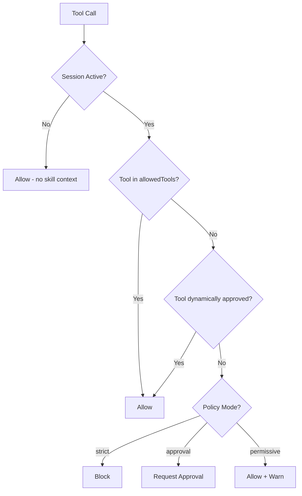
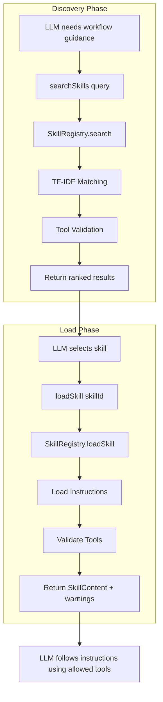
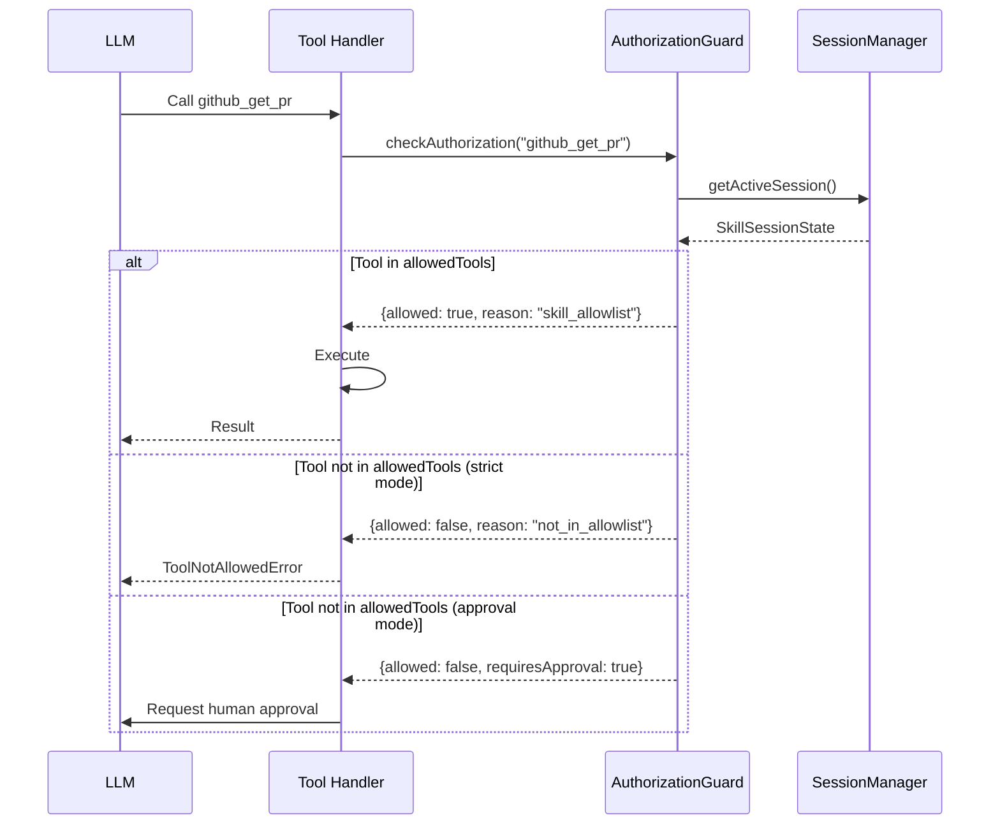

# Skill System

This directory implements the Skill discovery and loading system. It covers:

- Skill representation and metadata schemas
- Discovery via TF-IDF search
- Session-based tool authorization
- Tool validation at initialization and load time
- MCP protocol integration (`searchSkills`, `loadSkill`)

The README is intended for contributors who want to add skills, integrate external skill providers, or extend the session/authorization system.

## Overview

A Skill is a modular knowledge/workflow package that teaches AI how to perform multi-step tasks using tools. Unlike tools (individual actions), skills are recipes/playbooks that combine tools into coherent workflows.

Key differences from tools:

| Aspect       | Skill                          | Tool                    |
| ------------ | ------------------------------ | ----------------------- |
| Purpose      | Multi-step workflows           | Execute single actions  |
| Contains     | Instructions + tool references | Execution logic         |
| Direction    | Model loads on demand          | Model triggers directly |
| Side effects | No (guidance only)             | Yes (mutations, calls)  |

## Architecture

```text
                         SkillRegistry (Main Facade)
                                  |
              +-------------------+-------------------+
              |                   |                   |
        Local Skills         Instruction          External Provider
     (Map<token, SkillInstance>)  Loader            (optional)
              |                   |                   |
    +--------------------+    Fetches from:    SkillStorageProvider
    |                    |    - Inline string       interface
  @Skill             skill()  - File path              |
  decorator          helper   - URL               VectorDBSkillProvider
                                                 (external vector DB)
```

**Data Flow:**

1. **Registration**: Skills defined via `@Skill` decorator or `skill()` helper are normalized to `SkillRecord`
2. **Initialization**: Registry creates `SkillInstance` for each record, validates tool refs against ToolRegistry
3. **Search**: Queries local skills via TF-IDF, then external provider if configured
4. **Load**: Fetches instructions (from inline/file/URL), returns `SkillContent` with tool validation

## Key Design Decisions

1. **Core SDK**: Skills live in `libs/sdk/src/skill/` (not plugin-only)
2. **Instruction Sources**: Inline string, file, URL (inline recommended for dependency graph)
3. **SkillContext**: Lightweight class for hooks, no `execute()` method
4. **Discovery**: Search/Load only (no auto-injection into prompts)
5. **External Storage**: Hybrid local + external via `SkillStorageProvider`
6. **Tool Validation**: Configurable validation modes (`strict`, `warn`, `ignore`) with graceful degradation

## Files in this folder

### Core Files

- **skill.registry.ts** - Central skill registry with search, load, and adoption from child registries
- **skill.instance.ts** - Individual skill wrapper that handles instruction loading and content building
- **skill.utils.ts** - Normalization, metadata collection, instruction loading, and LLM formatting
- **skill.events.ts** - Event emitter for skill change notifications
- **skill-validator.ts** - Tool validation to check availability of referenced tools
- **skill-storage.interface.ts** - Storage provider interface for search/load operations
- **skill-storage.factory.ts** - Factory for creating storage providers (memory, vector DB)

### Session & Security

- **session/skill-session.types.ts** - Session state, policy modes, and authorization result types
- **session/skill-session.manager.ts** - AsyncLocalStorage-based session manager for multi-skill support
- **session/skill-session-store.interface.ts** - Session persistence interface with memory implementation

### Guards & Errors

- **guards/tool-authorization.guard.ts** - Tool authorization guard that enforces skill allowlists
- **errors/tool-not-allowed.error.ts** - Authorization errors (`ToolNotAllowedError`, `ToolApprovalRequiredError`)

### MCP Integration

- **flows/search-skills.flow.ts** - `skills:search` MCP flow for skill discovery
- **flows/load-skill.flow.ts** - `skills:load` MCP flow for loading skill content
- **tools/search-skills.tool.ts** - `searchSkills` tool definition
- **tools/load-skill.tool.ts** - `loadSkill` tool definition

### Storage Providers

- **providers/memory-skill.provider.ts** - In-memory TF-IDF provider for local skill search

### Hooks

- **hooks/skill-tool.hook.ts** - Hook factory for creating tool authorization guards

## Core Types

### SkillMetadata

```typescript
interface SkillMetadata {
  id?: string; // Unique identifier
  name: string; // Unique name for discovery
  description: string; // Short description for search
  instructions: SkillInstructionSource; // Detailed guidance
  tools?: SkillToolInput[]; // Tool references (class, string, or detailed ref)
  tags?: string[]; // Categorization
  parameters?: SkillParameter[]; // Input parameters
  examples?: SkillExample[]; // Usage examples
  priority?: number; // Search ranking weight (default: 0)
  hideFromDiscovery?: boolean; // Internal skills flag (default: false)
  toolValidation?: 'strict' | 'warn' | 'ignore'; // Validation mode (default: 'warn')
}
```

### SkillInstructionSource

```typescript
type SkillInstructionSource =
  | string // Inline instructions
  | { file: string } // File path to instructions
  | { url: string }; // URL to fetch instructions
```

### SkillToolRef

```typescript
interface SkillToolRef {
  name: string; // Tool name
  purpose?: string; // Why/how the tool is used
  required?: boolean; // Whether tool is required
}

// Tool inputs can also be classes or strings
type SkillToolInput = string | Type<ToolContext> | SkillToolRef | SkillToolRefWithClass;
```

### SkillContent (Loaded Skill)

```typescript
interface SkillContent {
  id: string;
  name: string;
  description: string;
  instructions: string; // Resolved instructions
  tools: Array<{ name: string; purpose?: string }>;
  parameters?: SkillParameter[];
  examples?: SkillExample[];
}
```

## SkillRegistry

The `SkillRegistry` is the main facade for skill management:

```typescript
export default class SkillRegistry
  extends RegistryAbstract<SkillInstance, SkillRecord, SkillType[]>
  implements SkillRegistryInterface
{
  // Get all skills (optionally including hidden)
  getSkills(includeHidden?: boolean): SkillEntry[];

  // Find skill by name or qualified name
  findByName(name: string): SkillEntry | undefined;
  findByQualifiedName(qualifiedName: string): SkillEntry | undefined;

  // Search using TF-IDF
  search(query: string, options?: SkillSearchOptions): Promise<SkillSearchResult[]>;

  // Load full skill content
  loadSkill(skillId: string): Promise<SkillLoadResult | undefined>;

  // List with pagination
  listSkills(options?: SkillListOptions): Promise<SkillListResult>;

  // Subscribe to changes
  subscribe(opts, cb): () => void;
}
```

The registry:

1. Normalizes skills from `@Skill` decorators or `skill()` helpers
2. Creates `SkillInstance` wrappers for each skill
3. Loads skill content (including from file/URL sources)
4. Indexes skills in the storage provider for search
5. Adopts skills from child registries (apps)
6. Validates tool availability when loading

## SkillSessionManager

The `SkillSessionManager` handles session-based tool authorization with multi-skill support:

```typescript
export class SkillSessionManager {
  // Get current session (from AsyncLocalStorage)
  getActiveSession(): SkillSessionState | undefined;

  // Activate a skill (adds to current session)
  activateSkill(skillId: string, content: SkillContent, loadResult: SkillLoadResult): SkillActivationResult;

  // Check tool authorization
  checkToolAuthorization(toolName: string): ToolAuthorizationResult;

  // Approve/deny tools dynamically
  approveTool(toolName: string): boolean;
  denyTool(toolName: string): boolean;

  // Set policy mode
  setPolicyMode(mode: SkillPolicyMode): void;
}
```

### Multi-Skill Sessions

When multiple skills are loaded in a session, their allowed tools are combined (union):

```text
Session State:
  activeSkills: Map<skillId, ActiveSkillInfo>
  allowedTools: Set<string> = union of all active skill tools
```

This allows workflows that span multiple skills while maintaining tool authorization.

## Tool Validation

Skills reference tools that may or may not be available. The `SkillToolValidator` handles this:

```typescript
interface ToolValidationResult {
  available: string[]; // Tools that exist and are accessible
  missing: string[]; // Tools that don't exist
  hidden: string[]; // Tools that exist but are hidden
  complete: boolean; // True if all required tools are available
}
```

### Validation Modes

Each skill can specify a `toolValidation` mode:

| Mode     | Behavior                                            |
| -------- | --------------------------------------------------- |
| `strict` | Fail initialization if any referenced tools missing |
| `warn`   | Log warnings but continue (default)                 |
| `ignore` | Skip validation entirely                            |

Registry-level options can also be configured:

- `defaultToolValidation`: Default mode for all skills
- `failOnInvalidSkills`: Fail entire registry if any skill fails validation

### Validation Flow

1. **At Initialization**: `SkillRegistry.validateAllTools()` is called after all registries are ready
2. **At Load Time**: `loadSkill` validates tools and includes availability info in the result
3. **Graceful Degradation**: When loading a skill with missing tools:
   - The skill is still returned
   - A warning is included in the response
   - `isComplete: false` indicates partial availability
   - LLM can decide how to proceed

## Search Algorithm

Skills are searched using TF-IDF with weighted terms:

| Field       | Weight |
| ----------- | ------ |
| description | 3x     |
| tags        | 2x     |
| tools       | 1x     |
| name        | 1x     |

Results are ranked by:

1. Relevance score (TF-IDF)
2. Priority field (higher = better)
3. Tool availability (complete skills ranked higher)

## Tool Authorization

The `ToolAuthorizationGuard` enforces skill-based tool restrictions:

```typescript
export class ToolAuthorizationGuard {
  // Check if tool is allowed in current session
  async checkAuthorization(toolName: string): Promise<ToolAuthorizationResult>;
}
```

### Policy Modes

| Mode         | Behavior                                    |
| ------------ | ------------------------------------------- |
| `strict`     | Block tools not in skill's allowlist        |
| `approval`   | Request human approval for unapproved tools |
| `permissive` | Allow with warning (logging only) - default |

### Authorization Flow



## Writing a Skill

### Class Style (with decorator)

```typescript
import { Skill, SkillContext } from '@frontmcp/sdk';

@Skill({
  name: 'review-pr',
  description: 'Review a GitHub pull request',
  instructions: `
    ## PR Review Process

    1. Fetch the PR details using github_get_pr
    2. Review the changed files using github_get_pr_files
    3. Add review comments using github_add_review_comment
    4. Submit the review using github_submit_review
  `,
  tools: [
    { name: 'github_get_pr', purpose: 'Fetch PR details', required: true },
    { name: 'github_get_pr_files', purpose: 'Get changed files' },
    { name: 'github_add_review_comment', purpose: 'Add inline comments' },
    { name: 'github_submit_review', purpose: 'Submit final review' },
  ],
  tags: ['github', 'code-review', 'quality'],
})
class ReviewPRSkill extends SkillContext {}
```

### Function Style (inline)

```typescript
import { skill } from '@frontmcp/sdk';

const DeployAppSkill = skill({
  name: 'deploy-app',
  description: 'Deploy application to production',
  instructions: { file: './skills/deploy-app.md' },
  tools: ['docker_build', 'docker_push', 'k8s_apply'],
  tags: ['deployment', 'devops'],
});
```

### Instruction Sources

Skills support three instruction sources:

1. **Inline string** - Embedded in the skill definition
2. **File path** - `{ file: './path/to/instructions.md' }`
3. **URL** - `{ url: 'https://example.com/workflow.md' }`

## Extending with External Providers

To implement a custom storage provider (e.g., for vector DB search):

```typescript
import { SkillStorageProvider, SkillSearchResult, SkillLoadResult } from '@frontmcp/sdk';

export class MyVectorDBProvider implements SkillStorageProvider {
  readonly type = 'vectordb' as const;

  async initialize(): Promise<void> {
    // Connect to vector DB
  }

  async search(query: string, options?: SkillSearchOptions): Promise<SkillSearchResult[]> {
    // Perform semantic search
    const embeddings = await this.embed(query);
    return this.vectorDB.search(embeddings, options?.topK ?? 10);
  }

  async load(skillId: string): Promise<SkillLoadResult | null> {
    // Load skill content from DB
  }

  async list(options?: SkillListOptions): Promise<SkillListResult> {
    // List skills with pagination
  }

  async count(options?: { tags?: string[] }): Promise<number> {
    // Count matching skills
  }
}
```

## Mermaid: Skill Flow



## Mermaid: Authorization Flow



## Notes for Contributors

- Keep skill instructions focused on a single workflow or domain
- Always include tool purposes for better discoverability and LLM understanding
- Test tool authorization with all three policy modes (strict, approval, permissive)
- Consider multi-skill scenarios when adding session features
- Use `hideFromDiscovery: true` for internal/utility skills that shouldn't appear in search
- Prefer inline instructions for static analysis and version control benefits
- Use file-based instructions for long, complex workflows to keep code readable
- Test skills with `toolValidation: 'strict'` during development to catch missing tool references early

## File Structure

```text
libs/sdk/src/
├── skill/
│   ├── index.ts                    # Public exports
│   ├── README.md                   # This file
│   ├── skill.registry.ts           # Main registry facade
│   ├── skill.instance.ts           # Skill wrapper class
│   ├── skill.events.ts             # Event emitter
│   ├── skill.utils.ts              # Normalization, loading utilities
│   ├── skill-validator.ts          # Tool validation
│   ├── skill-storage.interface.ts  # Storage provider interface
│   ├── skill-storage.factory.ts    # Provider factory
│   ├── providers/
│   │   └── memory-skill.provider.ts
│   ├── flows/
│   │   ├── index.ts
│   │   ├── search-skills.flow.ts
│   │   └── load-skill.flow.ts
│   ├── tools/
│   │   ├── index.ts
│   │   ├── search-skills.tool.ts
│   │   └── load-skill.tool.ts
│   ├── session/
│   │   ├── index.ts
│   │   ├── skill-session.manager.ts
│   │   ├── skill-session.types.ts
│   │   └── skill-session-store.interface.ts
│   ├── guards/
│   │   ├── index.ts
│   │   └── tool-authorization.guard.ts
│   ├── hooks/
│   │   ├── index.ts
│   │   └── skill-tool.hook.ts
│   ├── errors/
│   │   ├── index.ts
│   │   ├── tool-not-allowed.error.ts
│   │   └── skill-validation.error.ts
│   └── __tests__/
│
├── common/
│   ├── decorators/skill.decorator.ts
│   ├── tokens/skill.tokens.ts
│   ├── metadata/skill.metadata.ts
│   ├── records/skill.record.ts
│   ├── entries/skill.entry.ts
│   └── interfaces/skill.interface.ts
```
