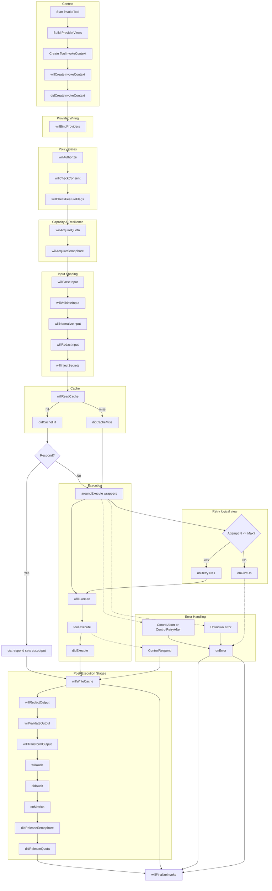
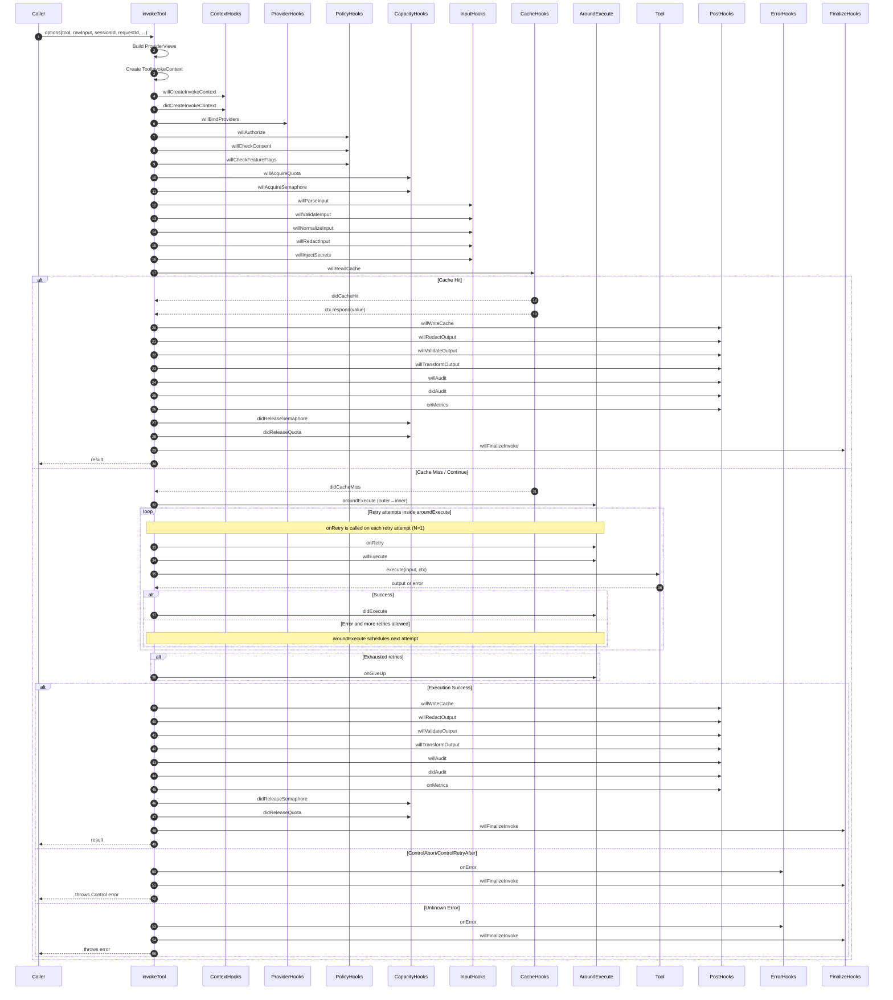

# Core Tool System

This directory implements the Tool invocation model used by the core gateway. It covers:

- The Tool representation and schemas
- Invocation context and DI provider access
- Lifecycle hooks and their stages
- The invokeTool orchestration and control-flow
- Registry/types/validation helpers

The README is intended for contributors who want to add tools, author hooks, or integrate providers.

## Overview

A Tool is a typed unit of work (input → output) with a rich, hook-driven lifecycle. It runs within a ToolInvokeContext
that provides:

- Request/session/global providers (dependency injection)
- Input/output mutation with histories
- User identity
- Control helpers (respond / abort / retryAfter)

The invokeTool function orchestrates the entire lifecycle:

1. Create context
2. Let hooks bind providers (willBindProviders)
3. Run pre-execution stages (authorization, validation, caching, etc.)
4. Wrap execution with aroundExecute hooks
5. Execute tool implementation (execute)
6. Run post-execution stages (write cache, transform, audit, metrics)
7. Handle errors and finalization

## Files in this folder

- tool.record.ts

  - ToolRecord interface: canonical in-process representation of a tool.
  - Includes id, name, description, zod input/output schemas, execute function, hooksByStage, optional tags.

- tool.context.ts

  - ToolInvokeContext class holding identity (tool/session/request), user, DI provider views, input/output payloads with
    history, scratchpad, error, and timing.
  - DI helpers:
    - bindProvider(token, instance, scope?) and bindProviders([...], scope?)
    - get(token) / tryGet(token)
  - Control helpers:
    - respond(value) → short-circuit with a value
    - abort(reason, code?, httpStatus?) → deny/stop
    - retryAfter(ms, reason?) → signal backoff

- tool.hook.ts

  - ToolHookStage enum: full list of lifecycle stages.
  - ToolHook interface: optional priority(), filter(ctx), stage methods, and aroundExecute wrapper.
  - Utility arrays:
    - toolPreStages: run before execution (authorize, rate-limit, parse/validate input, read cache, etc.)
    - toolPostStages: run after successful execution (write cache, redact/validate/transform output, audit/metrics,
      release capacity)
    - toolErrorStages: stages when handling errors (onError, audit/metrics, release capacity)
  - Helpers:
    - sortForStage(stage, hooks)
    - collectHooksForStage(stage, tool, resolve, globalHooksByStage?)

- tool.invoke.ts

  - invokeTool(options): the orchestrator that executes a tool end-to-end with hooks.
  - wrapWithAround: composes aroundExecute hooks into a nested wrapper chain.
  - willBindProvidersStage: lets hooks bind request/session-scoped providers.
  - Error handling for ControlRespond/ControlAbort/ControlRetryAfter, onError, and finalization.

- tool.types.ts

  - Tool type: extends MCP Tool with id, providedBy, preHook, postHook.
  - ToolResolveFn: resolve a class/type token to an instance (DI bridge).

- tool.registry.ts

  - Simple ToolRegistry to collect Tool[] (e.g., from adapters). Has addInline/addValidated/list.

- tool.validation.ts
  - Placeholder for validateTool(tool): intended to add zod-based validation.

## ToolRecord

A tool has a strong contract shaped by zod input/output schemas and an async execute function.

Example:

```ts
import z from 'zod/v4';
import { ToolRecord } from './tool.record';

const Input = z.object({ a: z.number(), b: z.number() });
const Output = z.object({ sum: z.number() });

type In = typeof Input;
type Out = typeof Output;

export const SumTool: ToolRecord<In, Out> = {
  id: 'sum',
  name: 'Sum Two Numbers',
  description: 'Adds a and b',
  inputSchema: Input,
  outputSchema: Output,
  hooksByStage: {},
  async execute(input, ctx) {
    // Access providers via ctx.get(Token)
    const sum = input.a + input.b;
    return Output.parse({ sum });
  },
};
```

## ToolInvokeContext (tool.context.ts)

Key members:

- Identity: toolId, toolName, sessionId, requestId.
- User: user with at least id.
- Providers: request/session/global views; resolution order: request → session → global.
- Payloads and history:
  - ctx.input (get/set) records input history
  - ctx.output (get/set) records output history
- Scratchpad: ctx.data (Map)
- Error/timing: ctx.error, startedAt, finishedAt
- Control:
  - ctx.respond(value): sets output and throws ControlRespond
  - ctx.abort(reason, code?, httpStatus?)
  - ctx.retryAfter(ms, reason?)

Provider binding rules:

- bindProvider(token, instance, scope='request')
- bindProviders([[token, instance], ...], scope)
- Global scope is immutable at invoke-time

## Hooks and Lifecycle (tool.hook.ts)

Stages (excerpt):

- willBindProviders: bind DI providers for the invocation
- willCreateInvokeContext / didCreateInvokeContext
- willAuthorize / willCheckConsent / willCheckFeatureFlags
- willAcquireQuota / didReleaseQuota
- willAcquireSemaphore / didReleaseSemaphore
- willParseInput / willValidateInput / willNormalizeInput / willRedactInput / willInjectSecrets
- willReadCache / didCacheHit / didCacheMiss / willWriteCache
- aroundExecute (wrapper around execution)
- willExecute / didExecute
- willRedactOutput / willValidateOutput / willTransformOutput
- onRetry / onGiveUp
- willAudit / didAudit / onMetrics
- onError
- willFinalizeInvoke

Hook behavior:

- priority(): number — higher runs earlier for will*/around* and later for did\*
- filter(ctx): boolean | Promise<boolean> — if false, hook is skipped
- Each stage is a method with the same name, e.g., willAuthorize(ctx)
- aroundExecute(ctx, next): Promise — must call next() to run inner stages unless short-circuiting

## invokeTool flow (tool.invoke.ts)

High-level steps:

1. Construct ProviderViews using ProviderRegistry:
   - global: registry.getAllSingletons() (read-only)
   - session: registry.sessionMap(sessionId) (mutable per session)
   - request: new Map() (mutable per request)
2. Create ToolInvokeContext with identity, user, input, and providers.
3. willBindProvidersStage: collect hooks for willBindProviders and let them bind providers via ctx.bindProvider(s).
   Return values from hook are also supported (Map/Array/object) for convenience.
4. Run pre-execution stages (toolPreStages) in priority order.
5. Build execution block:
   - Run willExecute
   - Call tool.execute(ctx.input, ctx)
   - Set ctx.output and run didExecute
6. Wrap execution with aroundExecute hooks via wrapWithAround.
7. Run post-execution stages (toolPostStages).
8. Finalization: willFinalizeInvoke stage always runs (best-effort), even after errors.

Control-flow and errors:

- ctx.respond(value) throws ControlRespond: sets output and proceeds to post stages and finalize.
- ctx.abort(...) or ctx.retryAfter(...) are treated as control errors:
  - onError runs, finalize runs, then the error is rethrown to the caller.
- Unknown errors:
  - ctx.error is populated, onError runs, finalize runs, error rethrown.

## Writing a Hook

```ts
import { ToolHookStage, ToolHook } from './tool.hook';

export class RateLimitHook implements ToolHook {
  priority() {
    return 100;
  }

  async willAcquireQuota(ctx) {
    const limiter = ctx.get(RATE_LIMITER);
    const ok = await limiter.tryAcquire(ctx.user.id);
    if (!ok) ctx.retryAfter(1000, 'Rate limit');
  }

  async didReleaseQuota(ctx) {
    const limiter = ctx.tryGet(RATE_LIMITER);
    await limiter?.release(ctx.user.id);
  }
}
```

Registering hooks:

- At tool level: add to tool.hooksByStage[ToolHookStage.willAcquireQuota] = [RateLimitHook]
- Globally: pass globalHooksByStage to invokeTool.

## Invoking a Tool

```ts
import ProviderRegistry from '../provider/provider.registry';
import { invokeTool } from './tool.invoke';
import { ToolHookStage } from './tool.hook';

const registry = new ProviderRegistry();
// registry.registerSingletons(...)
// registry.registerSessionProviders(...)

const result = await invokeTool({
  tool: SumTool,
  rawInput: { a: 1, b: 2 },
  sessionId: 'sess-123',
  requestId: 'req-456',
  registry,
  resolve: (cls) => new cls(), // or your DI container
  globalHooksByStage: {
    [ToolHookStage.willAcquireQuota]: [RateLimitHook],
  },
  user: { id: 'user-1' },
});
```

## Provider Integration

- Provider views are composed once per invocation:
  - requestMap (new Map per request) → mutable
  - sessionMap (Map per session) → mutable, shared by session
  - globalMap (singleton Map) → read-only from context
- Hooks can bind providers via ctx.bindProvider(token, instance, scope?), for example credentials, clients, or feature
  flags.

## Validation

- tool.validation.ts is currently a placeholder. The intended direction is to use zod to validate the Tool shape and
  optionally enforce constraints at adapter boundaries (ToolRegistry.addValidated).

## Notes for Contributors

- Keep tool.execute pure with respect to control flow; prefer shaping input/output via hooks.
- Use schemas (zod/v4) to parse/validate input/output in stages, not only inside execute.
- Use ctx.respond to short-circuit (e.g., cache hits, consent challenges).
- Use ctx.abort for authorization, consent, or business rule violations.
- Always consider capacity hooks (quota/semaphore) and ensure releases in post/error stages.

## Mermaid: Invocation Flow




