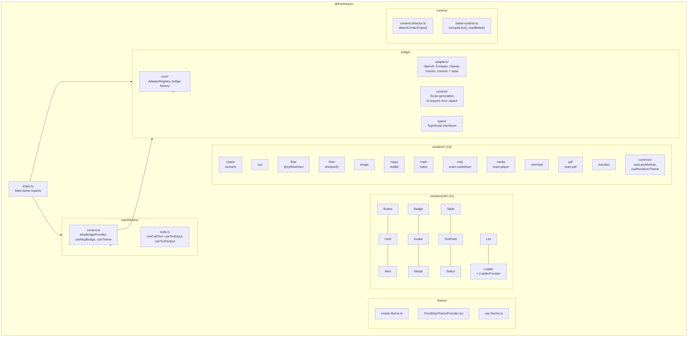
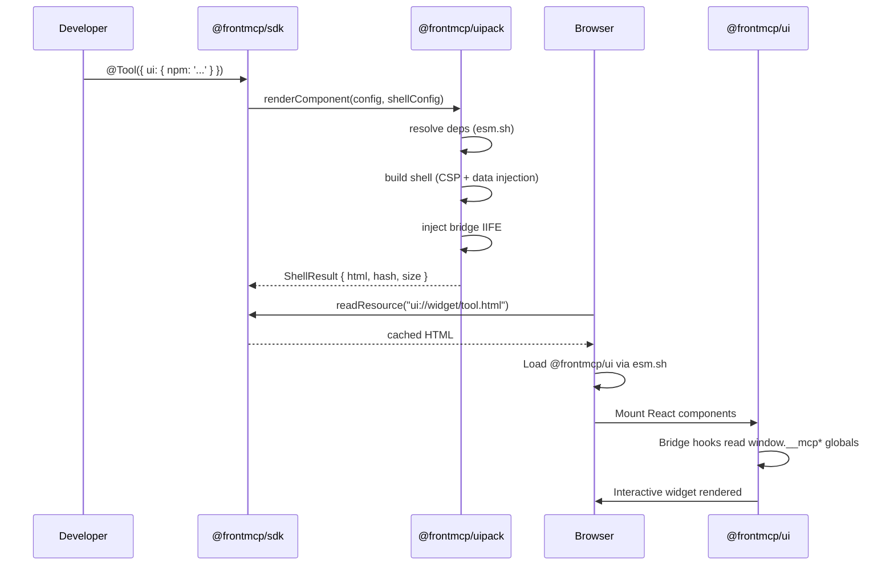

# @frontmcp/ui

MUI-based React components, content renderers, and MCP bridge for building interactive MCP widgets.

[](https://www.npmjs.com/package/@frontmcp/ui)
[](../../LICENSE)

## Install

```bash
npm install @frontmcp/ui react react-dom @mui/material @emotion/react @emotion/styled
```

> **Note:** Renderer libraries (recharts, react-pdf, mermaid, katex, etc.) are **not** installed locally. They are automatically lazy-loaded from [esm.sh](https://esm.sh) in the browser at runtime.

## Quick Start

### Theme + Components

```tsx
import { FrontMcpThemeProvider } from '@frontmcp/ui/theme';
import { Card, Button, Badge } from '@frontmcp/ui/components';

function App() {
  return (
    <FrontMcpThemeProvider>
      <Card title="Weather" elevation={2}>
        <Badge label="Live" variant="success" />
        <p>Temperature: 18C</p>
        <Button variant="primary" onClick={() => {}}>
          Refresh
        </Button>
      </Card>
    </FrontMcpThemeProvider>
  );
}
```

### MCP Bridge Hooks

```tsx
import { McpBridgeProvider, useCallTool, useToolOutput } from '@frontmcp/ui/react';

function WeatherWidget() {
  const output = useToolOutput<{ temp: number }>();
  const { call, loading } = useCallTool('get_weather');

  return (
    <div>
      <p>{output?.temp}C</p>
      <button onClick={() => call({ city: 'London' })} disabled={loading}>
        Refresh
      </button>
    </div>
  );
}

// Wrap with provider
<McpBridgeProvider>
  <WeatherWidget />
</McpBridgeProvider>;
```

### Content Rendering

```tsx
import { renderContent, detectContentType } from '@frontmcp/ui/renderer';

// Auto-detects content type and renders with the appropriate renderer
const type = detectContentType(data); // 'chart' | 'csv' | 'pdf' | 'mermaid' | ...
const element = renderContent(data, { type });
```

## Features

- **11 MUI components** — Button, Card, Alert, Badge, Avatar, Modal, Table, TextField, Select, List, Loader
- **13 content renderers** — Charts, CSV, Flow, HTML, Image, Maps, Math, MDX, Media (video + audio), Mermaid, PDF, React JSX
- **MCP bridge hooks** — `useCallTool`, `useToolInput`, `useToolOutput`, `useSendMessage`, `useOpenLink`, and more
- **5 platform adapters** — OpenAI, ExtApps, Claude, Gemini, Generic (auto-detected)
- **MUI theme system** — `FrontMcpThemeProvider` with light/dark presets and custom theme support
- **Runtime utilities** — Content type auto-detection, Babel JSX transpilation
- **Tree-shakeable** — Import individual components and renderers to minimize bundle size

## Entry Points

| Path                           | Exports                                                                     |
| ------------------------------ | --------------------------------------------------------------------------- |
| `@frontmcp/ui`                 | Bridge core, hooks (main barrel)                                            |
| `@frontmcp/ui/theme`           | `FrontMcpThemeProvider`, `createFrontMcpTheme`, `defaultTheme`, `darkTheme` |
| `@frontmcp/ui/components`      | All 11 React components                                                     |
| `@frontmcp/ui/components/*`    | Individual components (`/Button`, `/Card`, `/Alert`, etc.)                  |
| `@frontmcp/ui/renderer`        | `renderContent`, `detectContentType`, `registerAllRenderers`                |
| `@frontmcp/ui/renderer/*`      | Individual renderers (`/charts`, `/csv`, `/pdf`, `/mdx`, etc.)              |
| `@frontmcp/ui/renderer/common` | Shared renderer utilities (`useLazyModule`, `useRendererTheme`)             |
| `@frontmcp/ui/react`           | `McpBridgeProvider`, all hooks                                              |
| `@frontmcp/ui/bridge`          | `FrontMcpBridge`, `createBridge`, `AdapterRegistry`, adapters               |
| `@frontmcp/ui/runtime`         | `detectContentType`, `transpileJsx`, Babel loader                           |

## Components

| Component   | Key Props                           | Description                             |
| ----------- | ----------------------------------- | --------------------------------------- |
| `Button`    | `variant`, `onClick`, `disabled`    | MUI button with FrontMCP variants       |
| `Card`      | `title`, `elevation`, `slots`       | Content card with customizable slots    |
| `Alert`     | `severity`, `title`, `onClose`      | Status alert banner                     |
| `Badge`     | `label`, `variant`                  | Status/label badge                      |
| `Avatar`    | `src`, `alt`, `size`                | User avatar                             |
| `Modal`     | `open`, `onClose`, `title`, `slots` | Dialog modal                            |
| `Table`     | `columns`, `rows`, `sortable`       | Data table                              |
| `TextField` | `label`, `value`, `onChange`        | Text input field                        |
| `Select`    | `options`, `value`, `onChange`      | Dropdown select                         |
| `List`      | `items`, `onItemClick`              | List with item definitions              |
| `Loader`    | `variant`, context provider         | Loading indicator with `LoaderProvider` |

## Renderers

| Renderer  | Type              | Priority |
| --------- | ----------------- | -------- |
| PDF       | `pdf`             | 90       |
| Charts    | `chart`           | 80       |
| Flow      | `flow`            | 70       |
| Maps      | `map`             | 60       |
| Mermaid   | `mermaid`         | 50       |
| Math      | `math`            | 40       |
| Image     | `image`           | 30       |
| Media     | `video` / `audio` | 20       |
| CSV       | `csv`             | 10       |
| React JSX | `jsx`             | 10       |
| MDX       | `mdx`             | 5        |
| HTML      | `html`            | 0        |

All renderer libraries are lazy-loaded from [esm.sh](https://esm.sh) in the browser at runtime — no local installation is needed. Priority determines which renderer wins when multiple match.

## Bridge Adapters

| Adapter | Detects Via                           | Priority | Key Capabilities                                |
| ------- | ------------------------------------- | -------- | ----------------------------------------------- |
| OpenAI  | `window.openai.callTool`              | 100      | `callTool`, `sendMessage`, `requestDisplayMode` |
| ExtApps | `window.__mcpPlatform === 'ext-apps'` | 80       | Negotiated via `postMessage` handshake          |
| Claude  | `window.claude`, hostname `claude.ai` | 60       | `openLink`                                      |
| Gemini  | `window.__mcpPlatform === 'gemini'`   | 40       | `openLink`, `networkAccess`                     |
| Generic | Always matches (fallback)             | 0        | `openLink`, `networkAccess`                     |

## Contributing

### Architecture



### How @frontmcp/ui works with @frontmcp/uipack

These two packages split concerns between server-side (uipack) and browser-side (ui):

| Concern           | @frontmcp/ui (browser)      | @frontmcp/uipack (server)       |
| ----------------- | --------------------------- | ------------------------------- |
| React dependency  | Yes (peer dep)              | No                              |
| Bridge            | Runtime class + React hooks | IIFE generator (vanilla JS)     |
| Components        | MUI React components        | --                              |
| Shell building    | --                          | HTML shell, CSP, data injection |
| Rendering         | 13 content renderers        | --                              |
| Import resolution | --                          | esm.sh resolver, import maps    |
| Theme             | MUI ThemeProvider           | --                              |

**End-to-end data flow:**



1. **Server-side** (`@frontmcp/uipack`): Resolves component dependencies, builds HTML shell with CSP and bridge IIFE, injects tool data as `window.__mcp*` globals
2. **Browser-side** (`@frontmcp/ui`): Loaded via esm.sh in the browser, provides React components, hooks to read injected data, and the bridge runtime for host communication

### Renderer System

Each renderer implements the `ContentRenderer` interface:

```typescript
interface ContentRenderer {
  type: string; // e.g. 'chart', 'csv', 'pdf'
  priority: number; // Higher wins when multiple match
  canRender(data): boolean;
  render(data, options): ReactElement;
}
```

Renderers are registered via `registerAllRenderers()` and auto-detected at runtime. Each renderer lazy-loads its peer dependencies using `useLazyModule()` — if a peer dep is missing, the renderer gracefully skips.

### Development

```bash
# Build
nx build ui

# Test
nx test ui

# Lint
nx lint ui
```

### Testing

- 95%+ coverage required across statements, branches, functions, lines
- Test all component variants and edge cases
- Test renderer content detection logic
- Test bridge adapter detection and capability checks

## Requirements

- Node.js >= 22.0.0
- React >= 19.0.0
- MUI >= 7.0.0

## Related Packages

- [`@frontmcp/uipack`](../uipack) — React-free server-side shell builder, import resolver, component loader
- [`@frontmcp/sdk`](../sdk) — Core FrontMCP SDK
- [`@frontmcp/testing`](../testing) — UI test assertions

## License

Apache-2.0 — see [LICENSE](../../LICENSE).
