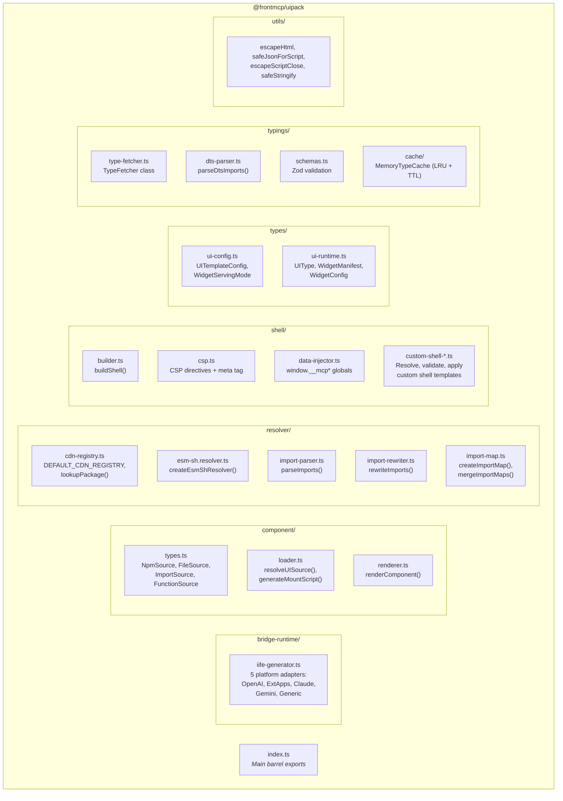
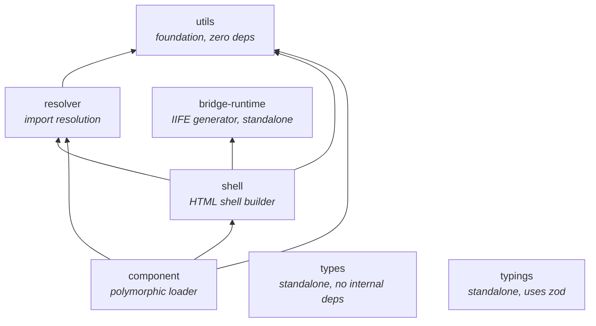
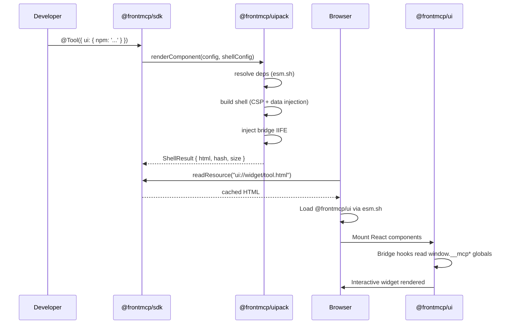

# @frontmcp/uipack

HTML shell builder, pluggable import resolver, and NPM component loader for MCP UI development. React-free core.

[](https://www.npmjs.com/package/@frontmcp/uipack)
[](../../LICENSE)

## Install

```bash
npm install @frontmcp/uipack
```

No React required. The only runtime dependency is `zod`.

## Quick Start

### Build an HTML Shell

```ts
import { buildShell } from '@frontmcp/uipack/shell';

const result = buildShell('<div id="root"></div>', {
  toolName: 'get_weather',
  input: { city: 'London' },
  output: { temp: 18 },
  includeBridge: true,
  csp: { connectDomains: ['https://api.weather.com'] },
});

// result.html  -> full HTML document with CSP, data injection, bridge IIFE
// result.hash  -> fast 32-bit content hash
// result.size  -> byte length
```

### Render an NPM Component

```ts
import { renderComponent } from '@frontmcp/uipack/component';

const result = await renderComponent(
  { source: { npm: 'my-weather-widget', exportName: 'WeatherCard' } },
  { toolName: 'get_weather', output: { temp: 18 }, includeBridge: true },
);
```

### Resolve Imports to CDN URLs

```ts
import { createEsmShResolver, createImportMap } from '@frontmcp/uipack/resolver';

const resolver = createEsmShResolver({ providerOrder: ['cloudflare', 'jsdelivr'] });
const result = resolver.resolve('chart.js');
// -> { value: 'https://cdnjs.cloudflare.com/ajax/libs/Chart.js/4.5.1/chart.umd.min.js', type: 'url' }
```

### Generate Bridge IIFE

```ts
import { generateBridgeIIFE, UNIVERSAL_BRIDGE_SCRIPT } from '@frontmcp/uipack/bridge-runtime';

// Use pre-generated universal script
const script = `<script>${UNIVERSAL_BRIDGE_SCRIPT}</script>`;

// Or generate with custom options
const iife = generateBridgeIIFE({ debug: true, minify: false });
```

### Fetch TypeScript Definitions

```ts
import { createTypeFetcher } from '@frontmcp/uipack/typings';

const fetcher = createTypeFetcher({
  allowedPackages: ['react', 'zod', '@frontmcp/*'],
  maxDepth: 3,
});

const result = await fetcher.fetchBatch({
  imports: ["import { z } from 'zod'"],
});
// result.results[0].files -> TypeFile[] with virtual node_modules/ paths
```

## Features

- **Shell builder** — Full HTML documents with CSP, data injection, and bridge runtime
- **Import resolver** — Pluggable CDN resolution (esm.sh, Cloudflare, jsDelivr, unpkg)
- **Component loader** — 4 source modes: npm, file, URL, inline function
- **Bridge IIFE** — Platform-aware vanilla JS bridge (OpenAI, ExtApps, Claude, Gemini, Generic)
- **Type fetching** — Download `.d.ts` from esm.sh with recursive dependency resolution
- **XSS utilities** — `escapeHtml`, `safeJsonForScript`, `escapeScriptClose`, and more
- **Custom shells** — Load shell templates from npm, URL, or inline HTML
- **Standalone types** — SDK-independent type definitions for widget configuration

## Entry Points

| Path                              | Purpose                              |
| --------------------------------- | ------------------------------------ |
| `@frontmcp/uipack`                | Main barrel (re-exports all modules) |
| `@frontmcp/uipack/resolver`       | Pluggable import resolution          |
| `@frontmcp/uipack/shell`          | HTML shell builder                   |
| `@frontmcp/uipack/component`      | Polymorphic component loader         |
| `@frontmcp/uipack/bridge-runtime` | Platform bridge IIFE generator       |
| `@frontmcp/uipack/typings`        | TypeScript .d.ts fetching engine     |
| `@frontmcp/uipack/types`          | Standalone type definitions          |
| `@frontmcp/uipack/utils`          | XSS-safe escaping utilities          |

## Module Exports

### Resolver

| Export                                         | Type     | Purpose                                                           |
| ---------------------------------------------- | -------- | ----------------------------------------------------------------- |
| `createEsmShResolver(opts?)`                   | function | Default resolver using esm.sh with CDN registry fallback          |
| `DEFAULT_CDN_REGISTRY`                         | constant | Pre-configured entries for react, react-dom, chart.js, d3, lodash |
| `parseImports(source)`                         | function | Parse source code for named, default, namespace, dynamic imports  |
| `rewriteImports(source, resolver, overrides?)` | function | Rewrite bare specifiers to CDN URLs                               |
| `createImportMap(overrides?)`                  | function | Generate browser-standard import map                              |
| `mergeImportMaps(...maps)`                     | function | Deep-merge multiple import maps                                   |
| `generateImportMapScriptTag(map)`              | function | `<script type="importmap">` generation                            |
| `lookupPackage(name)`                          | function | Query the CDN registry for a package                              |
| `getPackageCDNUrl(name, provider?)`            | function | Resolve package to best CDN URL                                   |
| `extractExternalPackages(code)`                | function | Extract external package names from source                        |

### Shell

| Export                                                | Type     | Purpose                                                               |
| ----------------------------------------------------- | -------- | --------------------------------------------------------------------- |
| `buildShell(content, config)`                         | function | Main entry point -> `ShellResult`                                     |
| `buildCSPMetaTag(config?)`                            | function | Generate `<meta>` CSP tag                                             |
| `buildCSPDirectives(config?)`                         | function | Merge custom domains with defaults                                    |
| `buildDataInjectionScript(toolName, input?, output?)` | function | `<script>` setting `window.__mcp*` globals                            |
| `createTemplateHelpers(toolName)`                     | function | `escapeHtml`, `formatDate`, `formatCurrency`, `uniqueId`, `jsonEmbed` |
| `resolveShellTemplate(opts)`                          | function | Resolve custom shell from npm/URL/inline                              |
| `applyShellTemplate(template, values)`                | function | Apply values to resolved template                                     |
| `validateShellTemplate(template)`                     | function | Validate a custom shell template                                      |
| `DEFAULT_CDN_DOMAINS`                                 | constant | jsDelivr, Cloudflare, Google Fonts                                    |

### Component

| Export                                                              | Type     | Purpose                                            |
| ------------------------------------------------------------------- | -------- | -------------------------------------------------- |
| `renderComponent(config, shell)`                                    | function | Top-level compositor -> `ShellResult`              |
| `resolveUISource(source, opts)`                                     | function | Resolve any source to `ResolvedComponent`          |
| `generateMountScript(resolved, data)`                               | function | ES module mount script for React/module components |
| `isNpmSource`, `isFileSource`, `isImportSource`, `isFunctionSource` | guards   | Type narrowing helpers                             |

### Bridge Runtime

| Export                             | Type     | Purpose                                                                |
| ---------------------------------- | -------- | ---------------------------------------------------------------------- |
| `generateBridgeIIFE(opts?)`        | function | Generate the bridge IIFE string                                        |
| `generatePlatformBundle(platform)` | function | Platform-specific bundles (`chatgpt`, `claude`, `gemini`, `universal`) |
| `UNIVERSAL_BRIDGE_SCRIPT`          | constant | Pre-generated script with all adapters                                 |
| `BRIDGE_SCRIPT_TAGS`               | constant | `{ universal, chatgpt, claude, gemini }` pre-wrapped `<script>` tags   |

### Typings

| Export                        | Type     | Purpose                                                       |
| ----------------------------- | -------- | ------------------------------------------------------------- |
| `createTypeFetcher(opts?)`    | function | Factory creating a `TypeFetcher` instance                     |
| `TypeFetcher`                 | class    | Main fetcher with caching and recursive dependency resolution |
| `MemoryTypeCache`             | class    | LRU cache with TTL support                                    |
| `globalTypeCache`             | constant | Module-level singleton cache (500 entries, 1h TTL)            |
| `parseDtsImports(content)`    | function | Parse `.d.ts` files for imports/references                    |
| `combineDtsContents(results)` | function | Combine multiple `.d.ts` files into one                       |

### Utils

| Export                         | Type     | Purpose                                                                      |
| ------------------------------ | -------- | ---------------------------------------------------------------------------- |
| `escapeHtml(str)`              | function | Escape `&`, `<`, `>`, `"`, `'`, U+2028/2029                                  |
| `escapeHtmlAttr(str)`          | function | Lighter escape for attributes                                                |
| `escapeJsString(str)`          | function | Escape for JS string literals                                                |
| `escapeScriptClose(str)`       | function | Replace `</` with `<\/` to prevent `</script>` breakout                      |
| `safeJsonForScript(value)`     | function | JSON serialize safe for `<script>` embedding (handles BigInt, circular refs) |
| `safeStringify(value, space?)` | function | `JSON.stringify` with circular reference detection                           |

## Shell HTML Structure

Annotated output of `buildShell` with `withShell: true` and `includeBridge: true`:

```html
<!DOCTYPE html>
<html lang="en">
  <head>
    <meta charset="UTF-8" />
    <meta name="viewport" content="width=device-width, initial-scale=1.0" />
    <title>get_weather</title>

    <!-- CSP: default CDN domains + custom connectDomains/resourceDomains -->
    <meta
      http-equiv="Content-Security-Policy"
      content="default-src 'self'; script-src 'self' 'unsafe-inline' https://cdn.jsdelivr.net ..."
    />

    <!-- Data injection: tool context as window globals -->
    <script>
      window.__mcpToolName = 'get_weather';
      window.__mcpToolInput = { city: 'London' };
      window.__mcpToolOutput = { temp: 18 };
      window.__mcpStructuredContent = null;
    </script>

    <!-- Bridge IIFE: auto-detects platform, exposes window.FrontMcpBridge -->
    <script>
      (function () {
        /* ... adapters, FrontMcpBridge class ... */
      })();
    </script>
  </head>
  <body>
    <!-- Content from resolver + component -->
    <script type="importmap">
      { "imports": { "react": "https://esm.sh/react@19" } }
    </script>
    <div id="root"></div>
    <script type="module">
      import { WeatherCard } from 'https://esm.sh/my-weather-widget';
      /* mount logic */
    </script>
  </body>
</html>
```

## Component Source Modes

| Mode       | Config Shape                                      | Description                        |
| ---------- | ------------------------------------------------- | ---------------------------------- |
| **npm**    | `{ npm: 'my-chart', exportName?, version? }`      | Resolved via CDN registry / esm.sh |
| **file**   | `{ file: './widget.html', inline? }`              | Local file path                    |
| **import** | `{ import: 'https://cdn.example.com/widget.js' }` | Direct URL passthrough             |
| **inline** | `(input, output) => '<div>...</div>'`             | Function returning HTML string     |

## Bridge API

The bridge IIFE exposes `window.FrontMcpBridge` with the following API:

| Method                      | Description                          |
| --------------------------- | ------------------------------------ |
| `callTool(name, args)`      | Invoke an MCP tool from the widget   |
| `getToolOutput()`           | Read injected tool output data       |
| `getToolInput()`            | Read injected tool input data        |
| `sendMessage(content)`      | Send message to host                 |
| `openLink(url)`             | Open a URL via platform adapter      |
| `requestDisplayMode(mode)`  | Switch inline / fullscreen / pip     |
| `setWidgetState(state)`     | Persist widget state to localStorage |
| `onContextChange(callback)` | Subscribe to host context changes    |
| `onToolResult(callback)`    | Subscribe to tool result events      |
| `hasCapability(cap)`        | Check adapter capabilities           |
| `getTheme()`                | Get current theme from host          |
| `getDisplayMode()`          | Get current display mode             |
| `getHostContext()`          | Get host context metadata            |

## Contributing

### Architecture



### Module Dependency Graph



### How @frontmcp/uipack works with @frontmcp/ui

`@frontmcp/uipack` runs **server-side** (Node.js) and produces complete HTML documents. `@frontmcp/ui` runs **browser-side** and provides React components and hooks that mount inside those documents.

**Bridge contract:** uipack generates a vanilla JS IIFE that creates `window.FrontMcpBridge`. The `@frontmcp/ui` bridge module wraps this same API in a React-friendly class and hooks (`useCallTool`, etc.). The ui package re-exports bridge IIFE generators from uipack via `@frontmcp/ui/bridge/runtime`.

**Dependency direction:** `@frontmcp/ui` optionally depends on `@frontmcp/uipack` (optional dependency). They can be used independently — uipack alone for vanilla JS widgets, or together for React-based widgets.

**End-to-end data flow:**



### Development

```bash
# Build
nx build uipack

# Test
nx test uipack

# Lint
nx lint uipack
```

### Testing

- 95%+ coverage required across statements, branches, functions, lines
- **XSS tests** are critical — test all escaping functions with malicious input
- **CSP tests** — verify generated Content-Security-Policy headers are correct
- Test all 4 component source modes (npm, file, import, inline)
- Test bridge IIFE generation for each platform

## Requirements

- Node.js >= 22.0.0

## Related Packages

- [`@frontmcp/ui`](../ui) — React components, hooks, and renderers that consume uipack output
- [`@frontmcp/sdk`](../sdk) — Core FrontMCP SDK with `ToolUIRegistry`
- [`@frontmcp/testing`](../testing) — UI test assertions

## License

Apache-2.0 — see [LICENSE](../../LICENSE).
